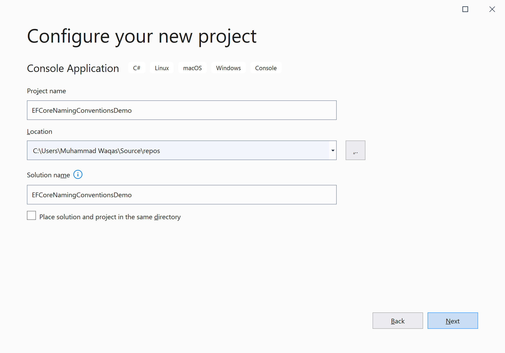
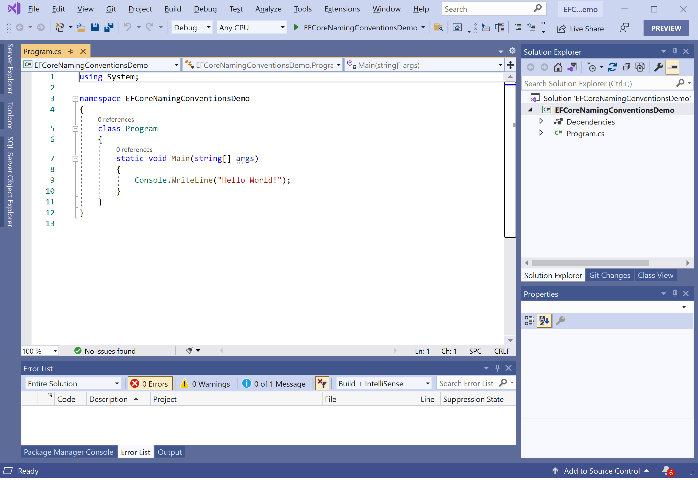
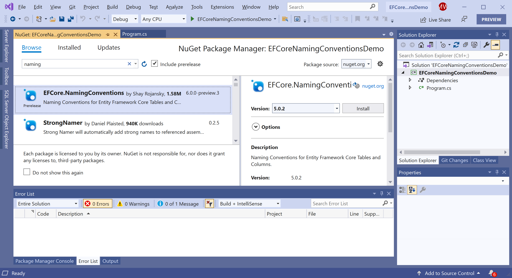
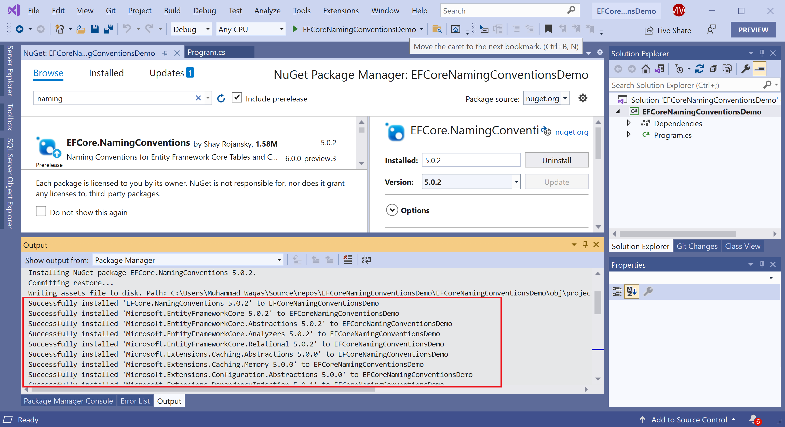

# Getting Started

## Naming Convention

Entity Framework Core generates the database schema from the model when you use migration or call the `context.Database.EnsureCreated();`. 

 - The name of generated objects has to be inferred from the name of the classes and properties. 
 - The default names should be ok for lots of people, but sometimes you need to use a specific naming convention. 
 - For example, some developer wants the table name to be upper case or column names to be prefixed by the table name, etc.

**EFCore.NamingConventions** is a NuGet library for **Microsoft.EntityFrameworkCore** that provides naming conventions for Entity Framework Core tables and columns.

## Supported Naming Conventions

 - UseSnakeCaseNamingConvention: FullName becomes `full_name`
 - UseLowerCaseNamingConvention: FullName becomes `fullname`
 - UseCamelCaseNamingConvention: FullName becomes `fullName`
 - UseUpperCaseNamingConvention: FullName becomes `FULLNAME`

## Installation

You can easily install it from the **Package Manager Console** window by running the following command.

```csharp
PM> Install-Package EFCore.NamingConventions
```

## Environment Setup

To start using the **EFCore.NamingConventions** in your application, you will need to install the [Dabble.EntityFrameworkCore.Temporal.Query](https://www.nuget.org/packages/Dabble.EntityFrameworkCore.Temporal.Query) NuGet package.

Let's open the Visual Studio and create a new project.


Select the **Create a new project** option.


Choose **C#** as language, **Windows** as a platform, and **Console** as the project type. In the template pane, select **Console Application** and click the **Next** button.



Enter the project name, you can change the location and solution name, but we will leave it and click on the **Next** button.  


On the **Additional Information** dialog, select the target framework and then click on the **Create** button.  



You can see a new console application project is created. Now to install an **EFCore.NamingConventions**, right-click on the project in **Solution Explorer**, and select **Manage NuGet Packages...**



Select the **Browse** tab and search for **EFCore.NamingConventions** and install the latest version by pressing the **Install** button. 



Once **EFCore.NamingConventions** has been successfully installed. Let's add the database provider that you want to target. We will use SQL Server, and the provider package is [Microsoft.EntityFrameworkCore.SqlServer](https://www.nuget.org/packages/Microsoft.EntityFrameworkCore.SqlServer). We can easily install that NuGet package by executing the following command in **Package Manager Console**. 

```csharp
PM> Install-Package Microsoft.EntityFrameworkCore.SqlServer
```

You are now ready to start your application.
