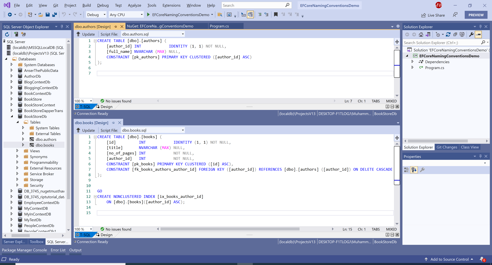

# Use Naming Conventions

**EFCore.NamingConventions** provides the following naming conventions for Entity Framework Core tables and columns.

 - UseSnakeCaseNamingConvention: FullName becomes `full_name`
 - UseLowerCaseNamingConvention: FullName becomes `fullname`
 - UseCamelCaseNamingConvention: FullName becomes `fullName`
 - UseUpperCaseNamingConvention: FullName becomes `FULLNAME`

By default, EF Core maps to tables and columns named exactly after your .NET classes and properties. For example, mapping a typical Customer class to PostgreSQL will result in SQL such as the following:

In the `OnConfiguring` method, you can use any of the above-mentioned naming conventions by calling the respective method. The following uses the snake case naming conventions by calling the `UseSnakeCaseNamingConvention` extension method. 

```csharp
public class BookStore : DbContext
{
    protected override void OnConfiguring(DbContextOptionsBuilder optionsBuilder)
    {
        optionsBuilder
            .UseSqlServer(@"Data Source=(localdb)\ProjectsV13;Initial Catalog=BookStoreDb;")
            .UseSnakeCaseNamingConvention();
    }

    public DbSet<Author> Authors { get; set; }
    public DbSet<Book> Books { get; set; }
}
```

Let's run your application again and you will see that this time all the tables and columns are in snake case naming convention.



### Notes

 - If you have an existing database, adding this naming convention will cause a migration to produced, renaming everything. Be very cautious when doing this because the process currently involves dropping and recreating primary keys.
 - This library will work with any database provider.
 - This is a community-maintained plugin: it isn't an official part of Entity Framework Core and isn't supported by Microsoft in any way.
