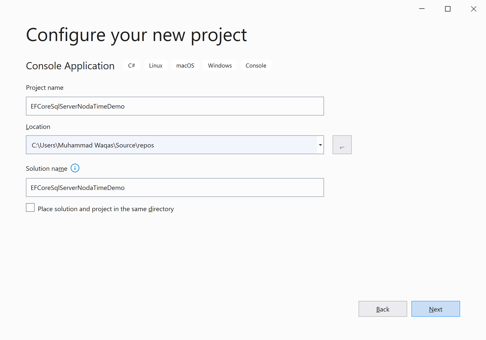
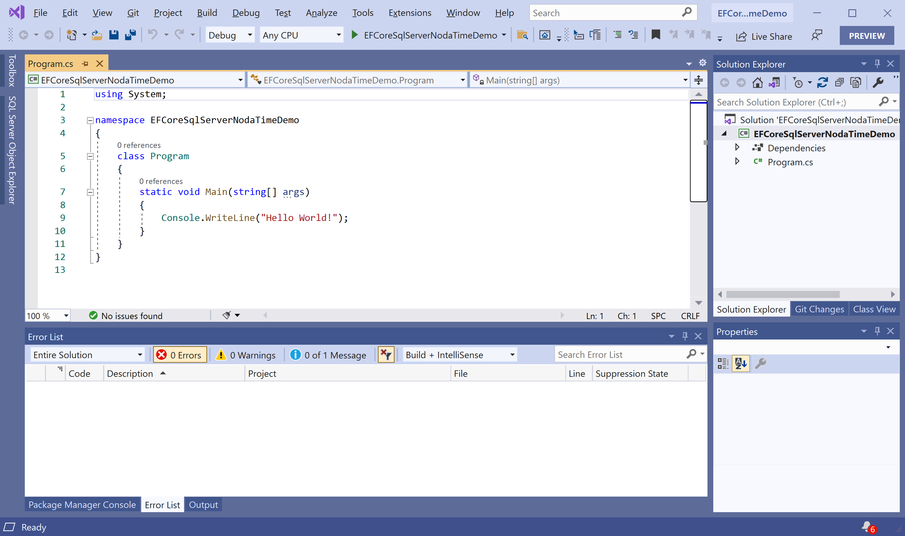
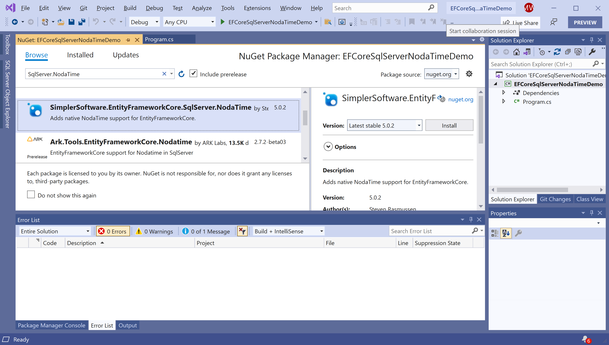
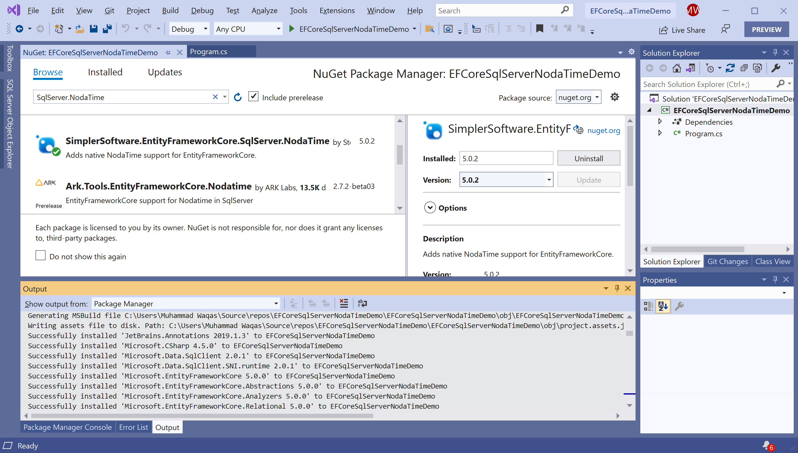

# Getting Started

## What is NodaTime?

NodaTime is an alternative date and time API for .NET. It helps you to think about your data more clearly, and express operations on that data more precisely.

**SimplerSoftware.EntityFrameworkCore.SqlServer.NodaTime** is a NuGet library that adds native support to EF Core for SQL Server for the **NodaTime** types.

It supports the following types.

 - Instant
 - OffsetDateTime
 - LocalDateTime
 - LocalDate
 - LocalTime
 - Duration 

## Installation

You can easily install it from the **Package Manager Console** window by running the following command.

```csharp
PM> Install-Package SimplerSoftware.EntityFrameworkCore.SqlServer.NodaTime
```

## Environment Setup

To start using the **SimplerSoftware.EntityFrameworkCore.SqlServer.NodaTime** in your application, you will need to install the [SimplerSoftware.EntityFrameworkCore.SqlServer.NodaTime](https://www.nuget.org/packages/SimplerSoftware.EntityFrameworkCore.SqlServer.NodaTime) NuGet package.

Let's open the Visual Studio and create a new project.


Select the **Create a new project** option.


Choose **C#** as language, **Windows** as a platform, and **Console** as the project type. In the template pane, select **Console Application** and click the **Next** button.



Enter the project name, you can change the location and solution name, but we will leave it and click on the **Next** button.  


On the **Additional Information** dialog, select the target framework and then click on the **Create** button.  



You can see a new web application project is created. Now to install a **SimplerSoftware.EntityFrameworkCore.SqlServer.NodaTime**, right-click on the project in **Solution Explorer**, and select **Manage NuGet Packages...**



Select the **Browse** tab and search for **SimplerSoftware.EntityFrameworkCore.SqlServer.NodaTime** and install the latest version by pressing the **Install** button. 



Once **SimplerSoftware.EntityFrameworkCore.SqlServer.NodaTime** has been successfully installed. Let's add the database provider that you want to target. We will use SQL Server, and the provider package is [Microsoft.EntityFrameworkCore.SqlServer](https://www.nuget.org/packages/Microsoft.EntityFrameworkCore.SqlServer). We can easily install that NuGet package by executing the following command in **Package Manager Console**. 

```csharp
PM> Install-Package Microsoft.EntityFrameworkCore.SqlServer
```

You are now ready to start your application.
