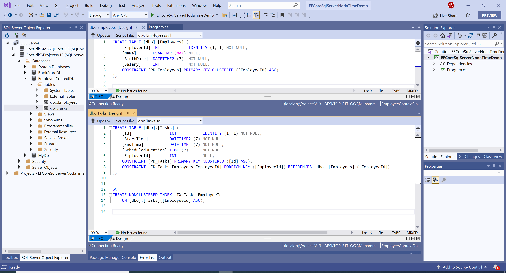

# Use NodaTime

When querying, standard operators are supported as well as a range of additional mappings from NodaTime properties/function to their SQL Server equivalents.

To use noda time in your application, first, we need to update our context class by calling the `UseNodaTime()` method as part of your SqlServer configuration during the `UseSqlServer` method call as shown below.

```csharp
protected override void OnConfiguring(DbContextOptionsBuilder optionsBuilder)
{
    optionsBuilder.UseSqlServer(@"Data Source=(localdb)\ProjectsV13;Initial Catalog=EmployeeContextDb;",
            x => x.UseNodaTime());
}
```

Let's add a new model class called `Task` as shown below.

```csharp
public class Task
{
    public int Id { get; set; }
    public Instant StartTime { get; set; }
    public Instant EndTime { get; set; }
    public Duration ScheduledDuration { get; set; }
}
```

Now define the navigation property `Tasks` of type `ICollection<Task>` and also change the type of `BirthDate` from `DateTime` to `Instant`.

```csharp
public class Employee
{
    public int EmployeeId { get; set; }
    public string Name { get; set; }
    public Instant BirthDate { get; set; }
    public int Salary { get; set; }
    public ICollection<Task> Tasks { get; set; }
}
```

Let's update the context class by defining a `DbSet` property for the `Task` entity.

```csharp
public class EmployeeContext : DbContext
{
    protected override void OnConfiguring(DbContextOptionsBuilder optionsBuilder)
    {
        optionsBuilder.UseSqlServer(@"Data Source=(localdb)\ProjectsV13;Initial Catalog=EmployeeContextDb;",
                x => x.UseNodaTime());
    }
    public DbSet<Task> Tasks { get; set; }
    public DbSet<Employee> Employees { get; set; }
}
```

Now we also need to update the `Initialize` method, because we have updated the `Author` entity.

```csharp
public static void Initialize()
{
    using (EmployeeContext context = new EmployeeContext())
    {
        context.Database.EnsureDeleted();
        context.Database.EnsureCreated();

        var employees = new List<Employee>
        {
            new Employee { Name="Carson Alexander", BirthDate = Instant.FromUtc(1986, 12, 21, 1, 0), Salary = 10000 },
            new Employee { Name="Meredith Alonso", BirthDate = Instant.FromUtc(1975, 10, 1, 1, 0), Salary = 30000 },
            new Employee { Name="Arturo Anand", BirthDate = Instant.FromUtc(1960, 8, 29, 1, 0), Salary = 43000 },
            new Employee { Name="Gytis Barzdukas", BirthDate = Instant.FromUtc(1970, 3, 19, 1, 0), Salary = 40500 },
            new Employee { Name="Yan Li", BirthDate = Instant.FromUtc(1973, 4, 2, 1, 0), Salary = 32000 },
        };

        employees.ForEach(a => context.Employees.Add(a));
        context.SaveChanges();
    }
}
```

Now execute your application again and you will see the updated database tables which now support the noda time.


