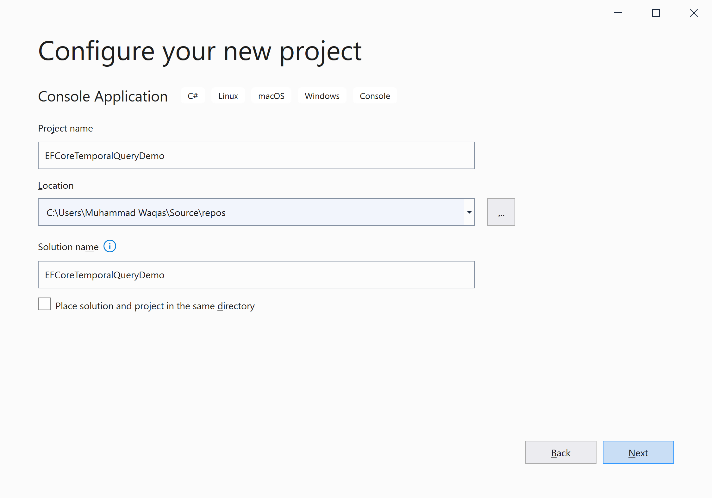
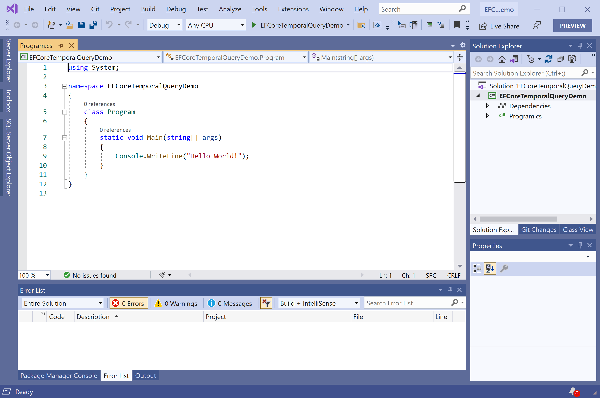
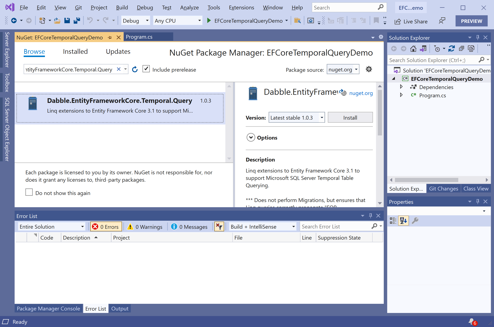
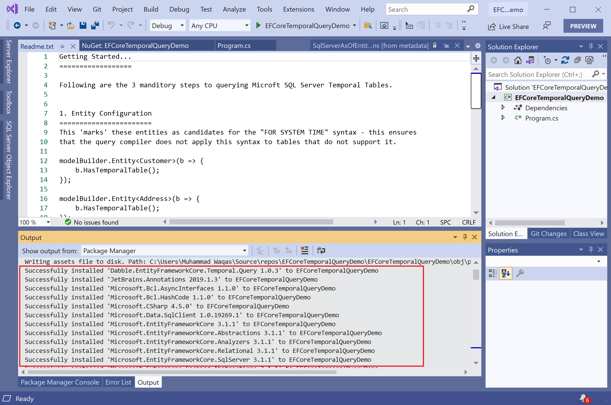

# Getting Started

## Temporal tables

SQL Server 2016 introduced support for temporal tables, which is also known as system-versioned temporal tables as a database feature that provides built-in support for providing information about data stored in the table at any point in time rather than only the correct data at the current moment in time.

Temporal is a database feature that was introduced in ANSI SQL 2011.

### `system-versioned` Temporal Table

A system-versioned temporal table is a type of user table designed to keep a full history of data changes to allow easy point-in-time analysis. 

This type of temporal table is referred to as a system-versioned temporal table because the period of validity for each row is managed by the system (i.e. database engine).

**Dabble.EntityFrameworkCore.Temporal.Query** is a NuGet library for **Microsoft.EntityFrameworkCore** that allows you to easily use Microsoft SQL Server Temporal Table querying.

## Installation

You can easily install it from the **Package Manager Console** window by running the following command.

```csharp
PM> Install-Package Dabble.EntityFrameworkCore.Temporal.Query
```

## Environment Setup

To start using the **Dabble.EntityFrameworkCore.Temporal.Query** in your application, you will need to install the [Dabble.EntityFrameworkCore.Temporal.Query](https://www.nuget.org/packages/Dabble.EntityFrameworkCore.Temporal.Query) NuGet package.

Let's open the Visual Studio and create a new project.


Select the **Create a new project** option.


Choose **C#** as language, **Windows** as a platform, and **Console** as the project type. In the template pane, select **Console Application** and click the **Next** button.



Enter the project name, you can change the location and solution name, but we will leave it and click on the **Next** button.  


On the **Additional Information** dialog, select the target framework and then click on the **Create** button.  



You can see a new console application project is created. Now to install a **Dabble.EntityFrameworkCore.Temporal.Query**, right-click on the project in **Solution Explorer**, and select **Manage NuGet Packages...**



Select the **Browse** tab and search for **Dabble.EntityFrameworkCore.Temporal.Query** and install the latest version by pressing the **Install** button. 



Once **Dabble.EntityFrameworkCore.Temporal.Query** has been successfully installed, you will see that [Microsoft.EntityFrameworkCore.SqlServer](https://www.nuget.org/packages/Microsoft.EntityFrameworkCore.SqlServer) is also installed. You are now ready to start your application.
