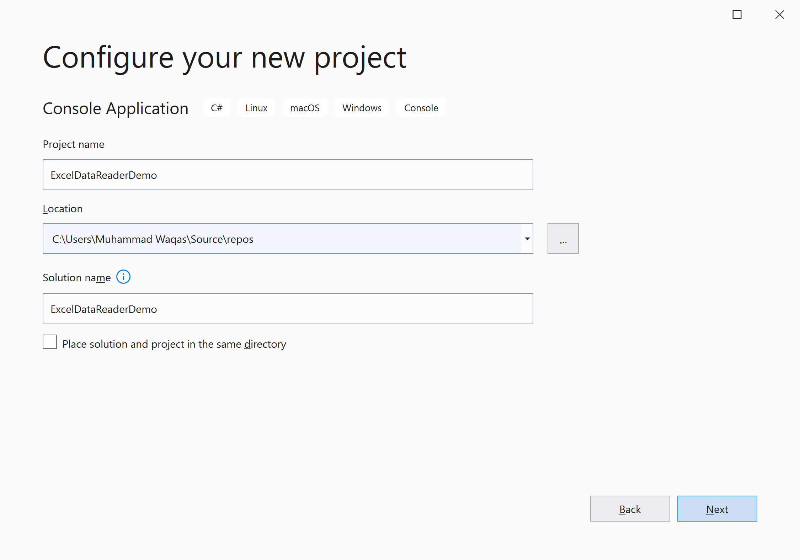
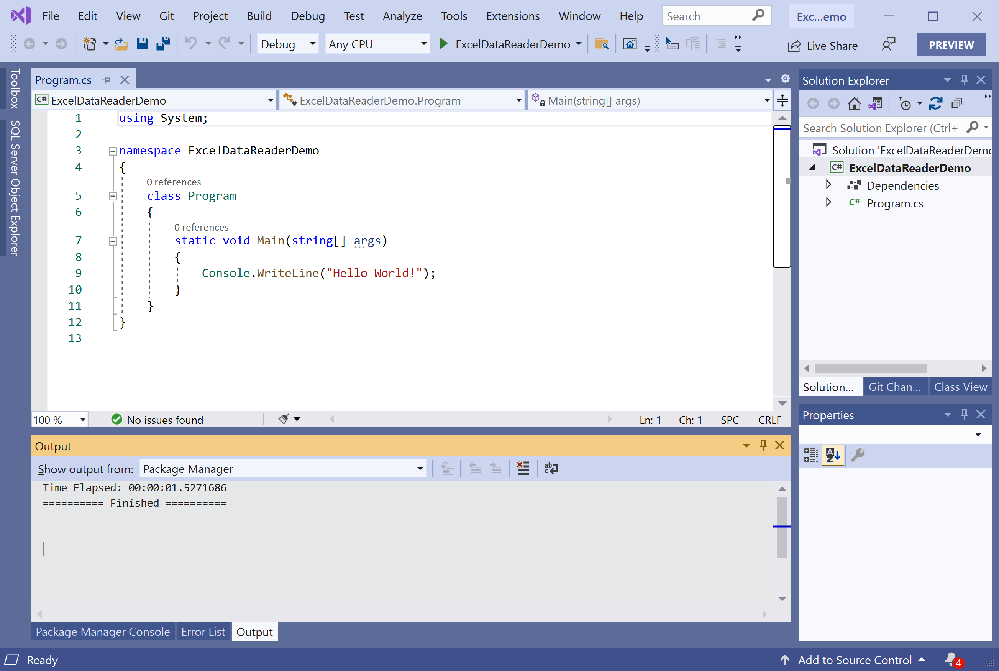
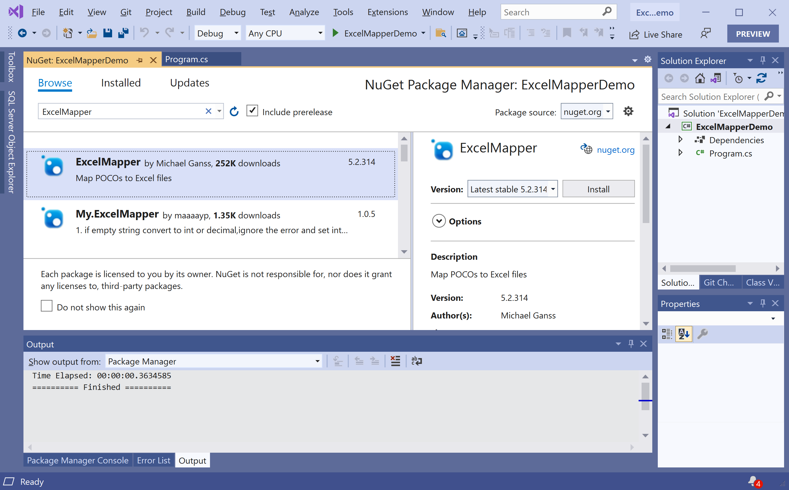

# Getting Started

**EntityFramework.Cache** is a NuGet library that provides a second-level cache for Entity Framework 6.1 and newer.

 - Entity Framework does not currently support caching of query results.
 - A sample EF Caching provider is available for Entity Framework version 5 and earlier but due to changes to the provider model this sample provider does not work with Entity Framework 6 and newer.

This library is filling the gap by enabling caching of query results for Entity Framework 6.1 and newer applications.

## Installation

You can easily install it from the **Package Manager Console** window by running the following command.

```csharp
PM> Install-Package EntityFramework.Cache
```

## Environment Setup

To start using the **EntityFramework.Cache** in your application, you will need to install the [EntityFramework.Cache](https://www.nuget.org/packages/EntityFramework.Cache) NuGet package.

Let's open the Visual Studio and create a new project.


Select the **Create a new project** option.


Choose **C#** as language, **Windows** as a platform, and **Console** as the project type. In the template pane, select **Console App (.NET Framework)** and click the **Next** button.



Enter the project name, you can change the location and solution name, but we will leave it and click on the **Next** button.  


You can see a new web application project is created. Now to install an **EntityFramework.Cache**, right-click on the project in **Solution Explorer**, and select **Manage NuGet Packages...**



Select the **Browse** tab and search for **EntityFramework.Cache** and install the latest version by pressing the **Install** button. 



Once **EntityFramework.Cache** has been successfully installed. You are now ready to start your application.
