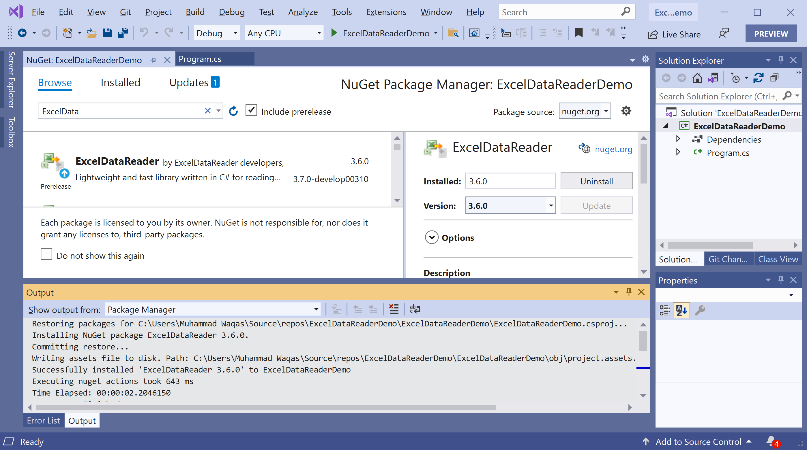

# Getting Started

## What is Excel?

Microsoft Excel is a very useful tool in the business world, and powering every industry and is used to provides some important and high-level information to the decision-makers. As a developer, sometimes you will need to deal with Excel spreadsheets, either to retrieve information or write information. 

## What is ExcelDataReader?

**ExcelDataReader** is a NuGet library that lightweight, fast helps you to read Excel files. It works cross-platform and is extremely efficient, flexible, and very easy to use and has supported on;

 - Windows with .Net Framework 2 
 - Windows Mobile with Compact Framework
 - Linux, OS X, BSD with Mono 2+

## Installation

You can easily install it from the **Package Manager Console** window by running the following command.

```csharp
PM> Install-Package ExcelDataReader
```
 
## Environment Setup

To start using the **ExcelDataReader** in your application, you will need to install the [ExcelDataReader](https://www.nuget.org/packages/ExcelDataReader) NuGet package.

Let's open the Visual Studio and create a new project.


Select the **Create a new project** option.


Choose **C#** as language, **Windows** as a platform, and **Console** as the project type. In the template pane, select **Console Application** and click the **Next** button.


Enter the project name, you can change the location and solution name, but we will leave it and click on the **Next** button.  


On the **Additional Information** dialog, select the target framework and then click on the **Create** button.  


You can see a new console application project is created. Now, to install an **ExcelDataReader**, right-click on the project in **Solution Explorer**, and select **Manage NuGet Packages...**


Select the **Browse** tab and search for **ExcelDataReader** and install the latest version by pressing the **Install** button. 



Once **ExcelDataReader** has been successfully installed. You are now ready to start your application.
