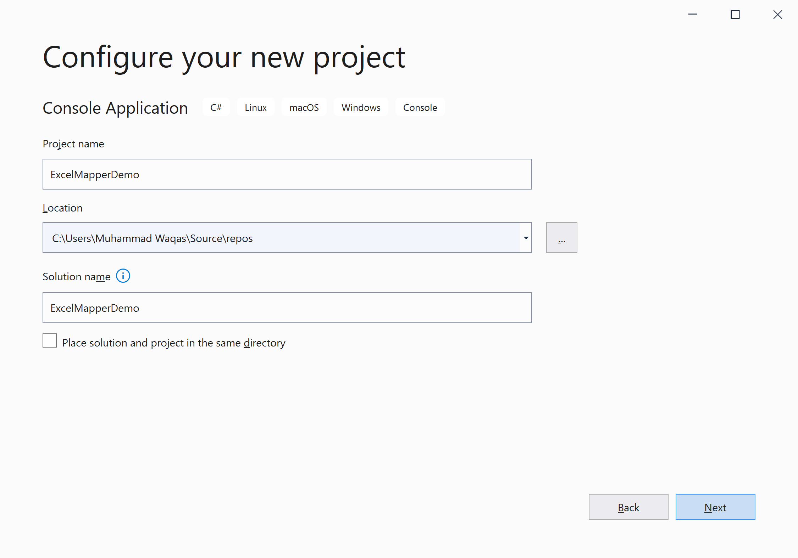
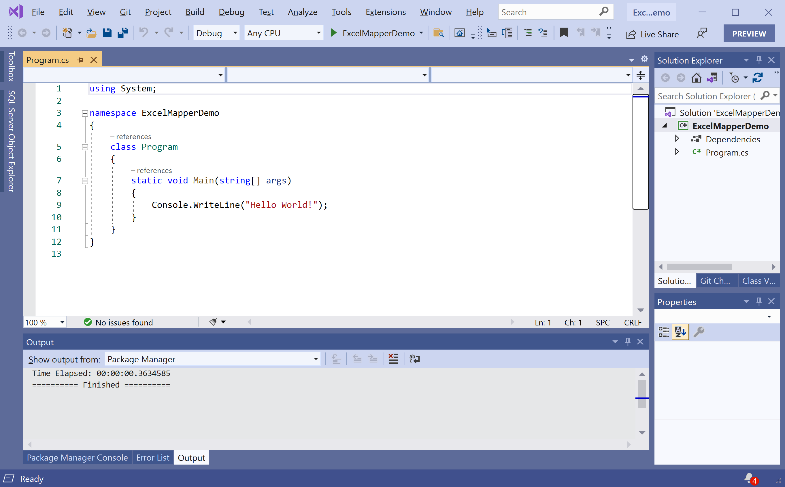
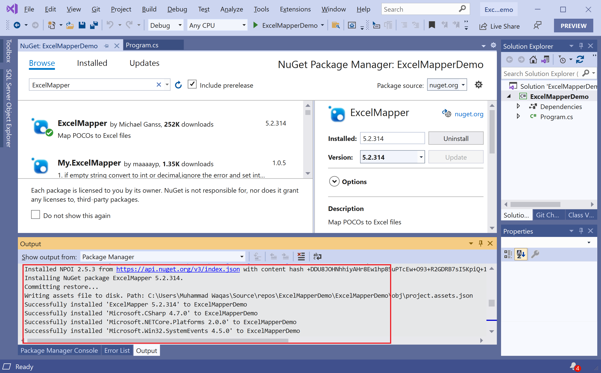

# Getting Started

## What is Excel?

Microsoft Excel is a very useful tool in the business world, and powering every industry and is used to provides some important and high-level information to the decision-makers. As a developer, sometimes you will need to deal with Excel spreadsheets, either to retrieve information or write information. 

## What is ExcelMapper

**ExcelMapper** is a NuGet library that helps you to read and write Excel files and allows you to map POCO (Plain old C# objects) to an excel file. 

 - It works cross-platform and is extremely efficient, flexible, and very easy to use. 
 - It also supports Excel concepts like formulas, formatting, and sheets.

### Features

 - Allow you to read and efficiently write Excel files.
 - You can map Excel files using header rows such as column names or it also allows you to use column indexes.
 - It supports nested (parent/child) objects
 - It also allows preserving formatting when saving backfiles
 - It tracks the objects by using the mapper
 - You can also map columns to properties using attributes or method calls.
 - It allows you to use custom data formats for numeric and DateTime columns
 - You can also map formulas or formula results depending on property type
 - It also supports mapping to JSON
 - You can also use dynamic objects to read or write data to/from an excel file.

## Installation

You can easily install it from the **Package Manager Console** window by running the following command.

```csharp
PM> Install-Package ExcelMapper
```
 
## Environment Setup

To start using the **ExcelMapper** in your application, you will need to install the [ExcelMapper](https://www.nuget.org/packages/ExcelMapper) NuGet package.

Let's open the Visual Studio and create a new project.


Select the **Create a new project** option.


Choose **C#** as language, **Windows** as a platform, and **Console** as the project type. In the template pane, select **Console Application** and click the **Next** button.



Enter the project name, you can change the location and solution name, but we will leave it and click on the **Next** button.  


On the **Additional Information** dialog, select the target framework and then click on the **Create** button.  



You can see a new console application project is created. Now, to install an **ExcelMapper**, right-click on the project in **Solution Explorer**, and select **Manage NuGet Packages...**


Select the **Browse** tab and search for **ExcelMapper** and install the latest version by pressing the **Install** button. 



Once **ExcelMapper** has been successfully installed. You are now ready to start your application.
