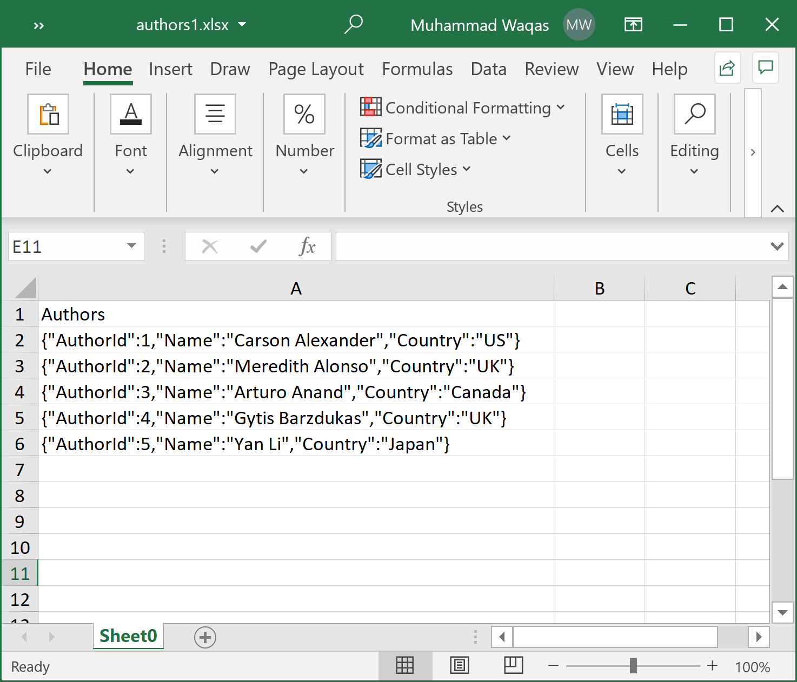

# JSON Format

**ExcelMapper** allows you to easily serialize to and from JSON formatted cells. You only need to specify either the `Json` attribute or call the `AsJson()` method.

Let's consider the following excel which contains the data in JSON format.

 

The following example reads all the data in json format and loads it in the `Author` class objects.

```csharp
public static void Example1()
{
    var excelMapper = new ExcelMapper(@"D:\authors1.xlsx");

    excelMapper.AddMapping<AuthorJson>("Authors", a => a.Author).AsJson();

    var authors = excelMapper.Fetch<AuthorJson>().ToList();

    foreach (var item in authors)
    {
        Console.WriteLine("Id: {0}, Name: {1}, Country: {2}", item.Author.AuthorId, item.Author.Name, item.Author.Country);
    }
}
```
 
Let's execute the above code and you will see the following output.

```csharp
Id: 1, Name: Carson Alexander, Country: US
Id: 2, Name: Meredith Alonso, Country: UK
Id: 3, Name: Arturo Anand, Country: Canada
Id: 4, Name: Gytis Barzdukas, Country: UK
Id: 5, Name: Yan Li, Country: Japan
```