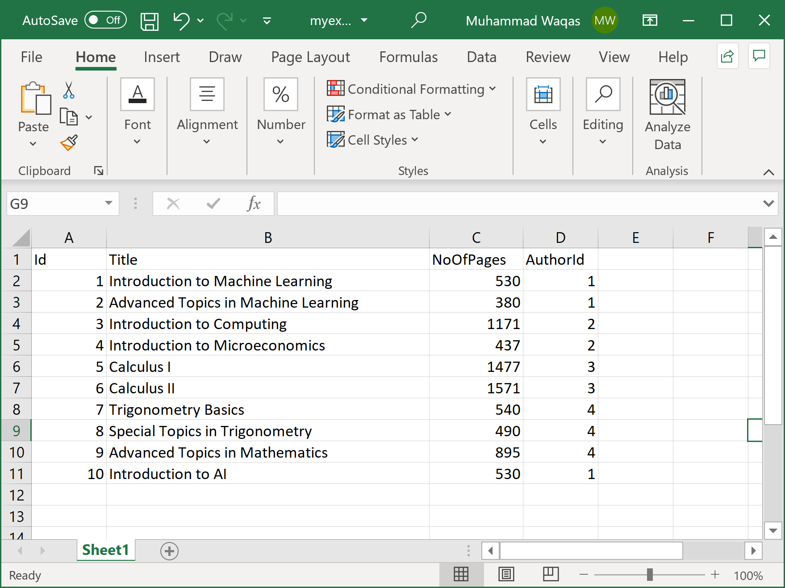

# Map Column Name With Different Property Name

When you are reading and writing excel files or communicating with databases or other table formats, sometimes, you will see that your property name is different from the column name.

So as an example let's consider the following excel file which contains books related data.



Now you can see that we have the following class defined to load the above data.

```csharp
private class Book
{
    public int BookId { get; set; }
    public string Title { get; set; }
    public int NoOfPages { get; set; }
    public int AuthorId { get; set; }
}
```

Now the problem is that the `BookId`, `NoOfPages`, and `AuthorId` properties are not matching with columns defined in the excel file and you also don't want to change the property names to match the column names in the excel file. 

To solve this issue, you can use the `Column` attributes and specified the column name as shown below.

```csharp
private class Book
{
    [Column("Id")]
    public int BookId { get; set; }
    public string Title { get; set; }
    [Column("Pages")]
    public int NoOfPages { get; set; }
    [Column("AuthId")]
    public int AuthorId { get; set; }
}
```

In the above `Book` class, the `BookId` property is mapped to the `Id` column, the `NoOfPages` property is mapped to the `Pages` column and the `AuthorId` property is mapped to the `AuthId` column in the excel file.

The following example reads all the data and loads it to the list of `Book` objects.

```csharp
public static void Example1()
{
    var excelMapper = new ExcelMapper(@"D:\myexcelfile.xlsx");
    var books = excelMapper.Fetch<Book>();

    foreach (var book in books)
    {
        Console.WriteLine("Id: {0}, Title: {1}, Pages: {2}, AuthorId: {3}", book.BookId, book.Title, book.NoOfPages, book.AuthorId);
    }
}
```

When you execute the above example, you will see the following output.

```csharp
Id: 1, Title: Introduction to Machine Learning, Pages: 530, AuthorId: 1
Id: 2, Title: Advanced Topics in Machine Learning, Pages: 380, AuthorId: 1
Id: 3, Title: Introduction to Computing, Pages: 1171, AuthorId: 2
Id: 4, Title: Introduction to Microeconomics, Pages: 437, AuthorId: 2
Id: 5, Title: Calculus I, Pages: 1477, AuthorId: 3
Id: 6, Title: Calculus II, Pages: 1571, AuthorId: 3
Id: 7, Title: Trigonometry Basics, Pages: 540, AuthorId: 4
Id: 8, Title: Special Topics in Trigonometry, Pages: 490, AuthorId: 4
Id: 9, Title: Advanced Topics in Mathematics, Pages: 895, AuthorId: 4
Id: 10, Title: Introduction to AI, Pages: 530, AuthorId: 1
```