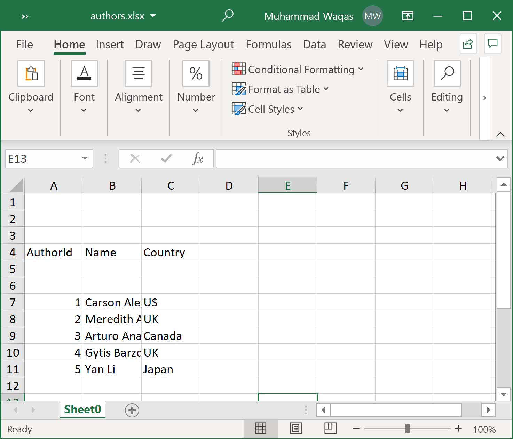

# Map Header Row

When working with excel files, sometimes, you see that the header row in the excel file is not the first row. **ExcelMapper** can easily handle these kinds of files by specifying the row number of the header row using the property `HeaderRowNumber` and its default value is 0. 

Let's consider the following example in which the header row is not the first row.

 

As you can see that the header row is specified on the 4th row so we need to set the `HeaderRowNumber = 3` as shown below.

```csharp
public static void Example1()
{
    var excelMapper = new ExcelMapper(@"D:\authors.xlsx")
    {
        HeaderRowNumber = 3,
    };

    var authors = excelMapper.Fetch<Author>();

    foreach (var author in authors)
    {
        Console.WriteLine("Id: {0}, Name: {1}, Country: {2}", author.AuthorId, author.Name, author.Country);
    }
}
public class Author
{
    public int AuthorId { get; set; }
    public string Name { get; set; }
    public string Country { get; set; }
}
```

In the above example, it will read the header row from the 4th row and the data onward.

Sometimes, you will also see an excel file where the data row is directly after the header row or you want to read only some specific rows only. **ExcelMapper** also provides the range of rows that are considered rows that may contain data that can be specified using the properties `MinRowNumber` and `MaxRowNumber` (default is `int.MaxValue`).

Let's consider the following example in which the header row is not the first row.

 

To read the data row correctly, we need to set `MinRowNumber = 6` as shown in the following example.

```csharp
public static void Example2()
{
    var excelMapper = new ExcelMapper(@"D:\authors.xlsx")
    {
        HeaderRowNumber = 3,
        MinRowNumber = 6
    };

    var authors = excelMapper.Fetch<Author>();

    foreach (var author in authors)
    {
        Console.WriteLine("Id: {0}, Name: {1}, Country: {2}", author.AuthorId, author.Name, author.Country);
    }
}
```

Let's execute the above code and you will see the following output.

```csharp
Id: 1, Name: Carson Alexander, Country: US
Id: 2, Name: Meredith Alonso, Country: UK
Id: 3, Name: Arturo Anand, Country: Canada
Id: 4, Name: Gytis Barzdukas, Country: UK
Id: 5, Name: Yan Li, Country: Japan
```