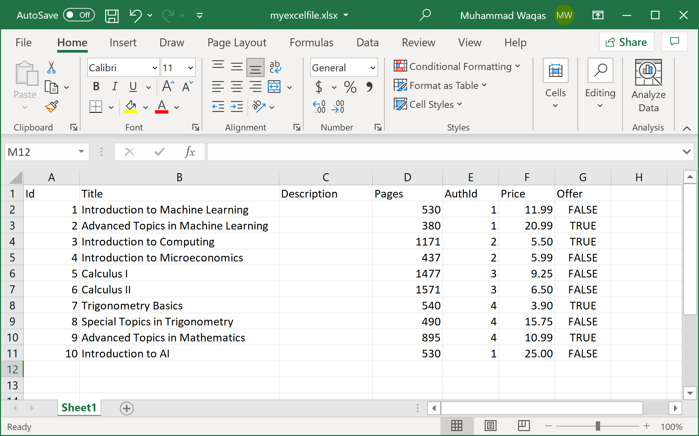

# Mapping Using Method

So far, we have used data annotation attributes for mapping, but **ExcelMapper** also provides methods that you can use to define different kinds of mappings instead of using the attributes. 

Let's consider the same excel file which we have used in the previous article, but this time we will define all the mappings using the method call.



Here is the class where we will store the imported information.

```csharp
private class Book
{
    public int BookId { get; set; }
    public string Title { get; set; }
    public int NoOfPages { get; set; }
    public double Price { get; set; }
    public bool IsOffer { get; set; }
}
```

But this time we will use the `ExcelMapper.AddMapping` method as shown below.

```csharp
public static void Example1()
{
    var excelMapper = new ExcelMapper(@"D:\myexcelfile.xlsx");

    excelMapper.AddMapping<Book>("Id", b => b.BookId);
    excelMapper.AddMapping<Book>("Pages", b => b.NoOfPages);
    excelMapper.AddMapping<Book>("Offer", b => b.IsOffer);

    var books = excelMapper.Fetch<Book>();

    foreach (var book in books)
    {
        Console.WriteLine("Id: {0}, Title: {1}, Pages: {2}, Price: {3}", book.BookId, book.Title, book.NoOfPages, book.Price);
    }
}
```

In the `AddMapping` method, you can also use the column index as shown below.

```csharp
public static void Example2()
{
    var excelMapper = new ExcelMapper(@"D:\myexcelfile.xlsx");

    excelMapper.AddMapping<Book>(1, b => b.BookId);
    excelMapper.AddMapping<Book>(2, b => b.Title);
    excelMapper.AddMapping<Book>(4, b => b.NoOfPages);
    excelMapper.AddMapping<Book>(6, b => b.Price);
    excelMapper.AddMapping<Book>(7, b => b.IsOffer);

    var books = excelMapper.Fetch<Book>();

    foreach (var book in books)
    {
        Console.WriteLine("Id: {0}, Title: {1}, Pages: {2}, Price: {3}", book.BookId, book.Title, book.NoOfPages, book.Price);
    }
}
```

When you execute the above example, you will see the following output.

```csharp
Id: 1, Title: Introduction to Machine Learning, Pages: 530, Price: 11.99
Id: 2, Title: Advanced Topics in Machine Learning, Pages: 380, Price: 20.99
Id: 3, Title: Introduction to Computing, Pages: 1171, Price: 5.5
Id: 4, Title: Introduction to Microeconomics, Pages: 437, Price: 5.99
Id: 5, Title: Calculus I, Pages: 1477, Price: 9.25
Id: 6, Title: Calculus II, Pages: 1571, Price: 6.5
Id: 7, Title: Trigonometry Basics, Pages: 540, Price: 3.9
Id: 8, Title: Special Topics in Trigonometry, Pages: 490, Price: 15.75
Id: 9, Title: Advanced Topics in Mathematics, Pages: 895, Price: 10.99
Id: 10, Title: Introduction to AI, Pages: 530, Price: 25
```
