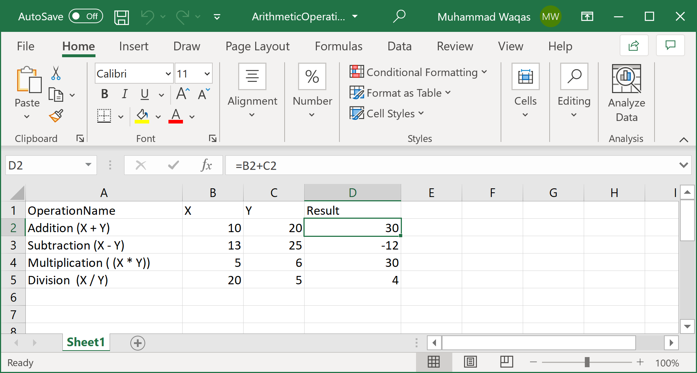

# Read Formulas

Most of the time you will see that some formulas are used inside an excel file, the values returned as result are displayed in specified cells. 

Let's consider the following simple which contains different arithmetic operations and in the `Result` column the formulas are used

 

The following example reads all the data from the excel file including the columns containing formulas.

```csharp
public static void Example1()
{
    var excelMapper = new ExcelMapper(@"D:\ArithmeticOperations.xlsx");
    var arithmeticOperations = excelMapper.Fetch<ArithmeticOperation>();

    foreach (var ao in arithmeticOperations)
    {
        Console.WriteLine("Operation: {0}, {1} : {2} = {3}", ao.OperationName, ao.X, ao.Y, ao.Result);
    }
}

class ArithmeticOperation
{
    public string OperationName { get; set; }
    public int X { get; set; }
    public int Y { get; set; }
    public int Result { get; set; }
}
```

Let's execute the above code and you will see the following output.

```csharp
Operation: Addition (X + Y), 10 : 20 = 30
Operation: Subtraction (X - Y), 13 : 25 = -12
Operation: Multiplication ( (X * Y)), 5 : 6 = 30
Operation: Division  (X / Y), 20 : 5 = 4
```

By default, the formula columns are mapped according to the type of property they are mapped to.

 - For string properties, the formula itself is mapped (e.g. "=B2+C2"). 
 - for other property types the formula result is mapped. 

If you need the formula result in a string property, you can use the `FormulaResult` attribute.

```csharp
class ArithmeticOperation
{
    public string OperationName { get; set; }
    public int X { get; set; }
    public int Y { get; set; }
    [FormulaResult]
    public string Result { get; set; }
}
```

You can also use the `AddMapping` method and call the `AsFormulaResult` as shown below.

```csharp
public static void Example2()
{
    var excelMapper = new ExcelMapper(@"D:\ArithmeticOperations.xlsx");
    excelMapper.AddMapping<ArithmeticOperation>("Result", a => a.Result).AsFormulaResult();

    var arithmeticOperations = excelMapper.Fetch<ArithmeticOperation>();

    foreach (var ao in arithmeticOperations)
    {
        Console.WriteLine("Operation: {0}, {1} : {2} = {3}", ao.OperationName, ao.X, ao.Y, ao.Result);
    }
}
```
