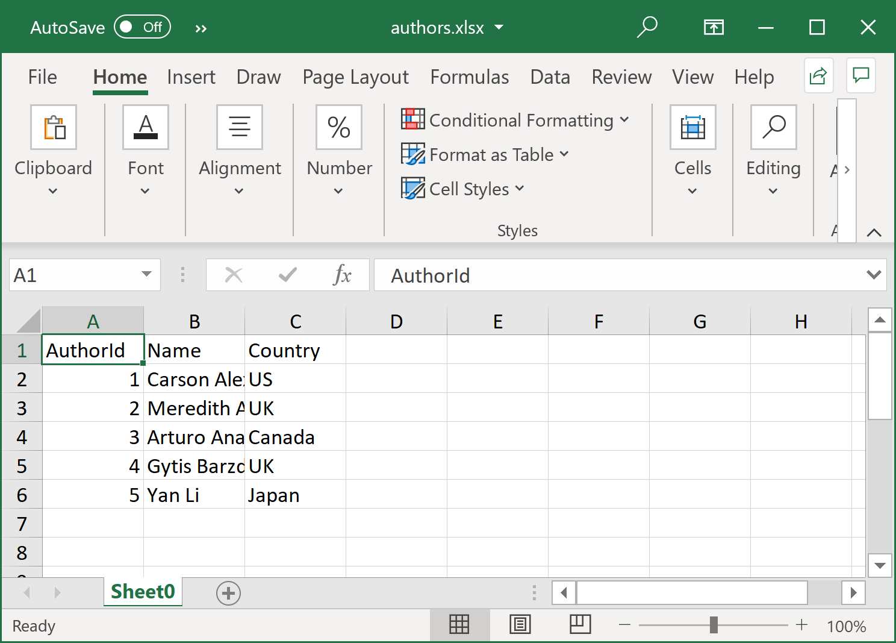
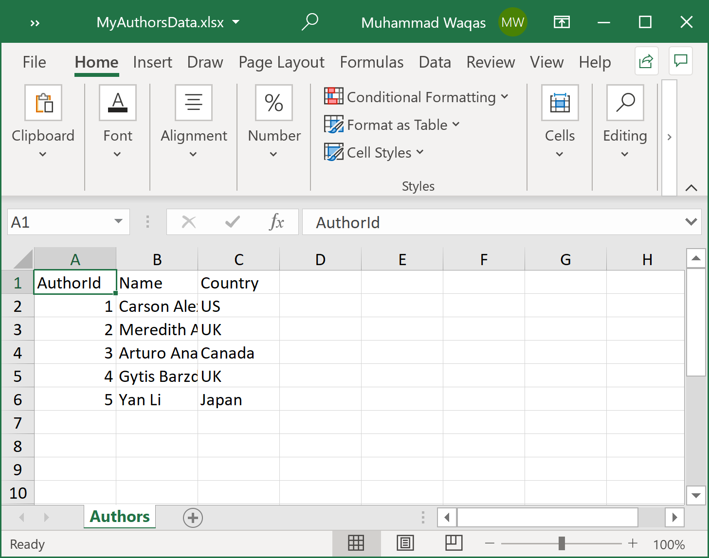

# Write Data to Excel File

As a developer, reading data from an excel file is not the only way to communicate with an excel file, you will also need to write data to an excel file. **ExcelMapper** allows you to write data to the excel file very easily. First, we need to create a list of class objects that we want to write to an excel file. To do so, let's create a new class `Author`.

```csharp
public class Author
{
    public int AuthorId { get; set; }
    public string Name { get; set; }
    public string Country { get; set; }
}
```

The following example first creates a list of authors and then writes all the authors' data to the excel file.

```csharp
public static void Example1()
{
    var authors = new List<Author>
    {
        new Author { AuthorId = 1, Name="Carson Alexander", Country = "US" },
        new Author { AuthorId = 2, Name="Meredith Alonso", Country = "UK" },
        new Author { AuthorId = 3, Name="Arturo Anand", Country = "Canada" },
        new Author { AuthorId = 4, Name="Gytis Barzdukas", Country = "UK"},
        new Author { AuthorId = 5, Name="Yan Li", Country = "Japan" },
    };

    var excelMapper = new ExcelMapper();
    excelMapper.Save(@"D:\authors.xlsx", authors);
}
```

When you execute the above example, you will see that the excel file is created that contains the following data.



As you can see that by default, the data is written to the **Sheet0**, if you want to give a specific name to a sheet then you can pass the name as 3rd argument to the `Save` method as shown below.

```csharp
public static void Example2()
{
    var authors = new List<Author>
    {
        new Author { AuthorId = 1, Name="Carson Alexander", Country = "US" },
        new Author { AuthorId = 2, Name="Meredith Alonso", Country = "UK" },
        new Author { AuthorId = 3, Name="Arturo Anand", Country = "Canada" },
        new Author { AuthorId = 4, Name="Gytis Barzdukas", Country = "UK"},
        new Author { AuthorId = 5, Name="Yan Li", Country = "Japan" },
    };

    var excelMapper = new ExcelMapper();
    excelMapper.Save(@"D:\MyAuthorsData.xlsx", authors, "Authors");
}
```

When you execute the above example, you will see that the excel file is created and all the data is written in the **Authors** sheet.



