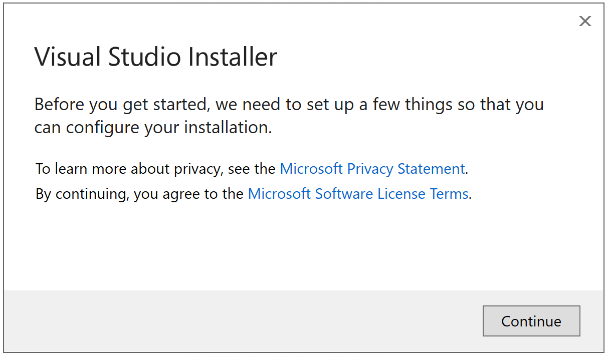
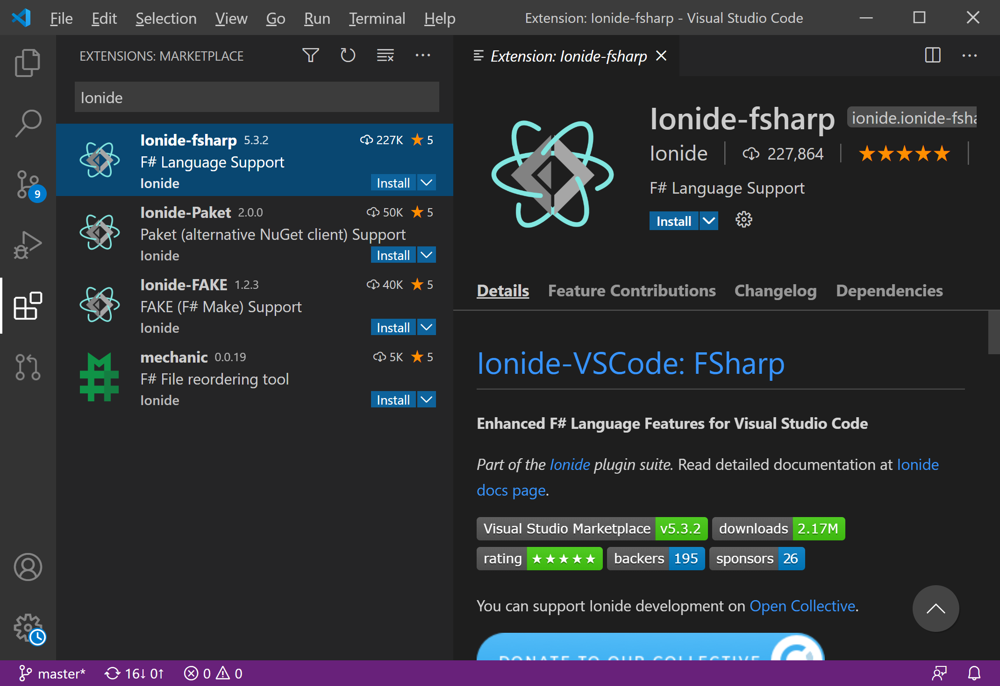

---
PermaID: 100001
Name: Environment Setup
---

# Environment Setup

To create Windows applications with the F# programming language, you will first need to install a Visual Studio Integrated Development Environment (IDE). 

 - Microsoft Visual Studio is an integrated development environment (IDE) from Microsoft where you can develop different types of applications on the .NET platform. 
 - It also allows the developer to debug and run their applications.

## Download & Installation

### Install F# with Visual Studio

To download Visual Studio, go to the Visual Studio download page [https://visualstudio.microsoft.com/downloads/](https://visualstudio.microsoft.com/downloads/).

You can select one of the following editions.

 - Visual Studio 2019 Community (Free download)
 - Visual Studio 2019 Professional (Free trial)
 - Visual Studio 2019 Enterprise (Free trial)

In this tutorial, we will use the Visual Studio 2019 Community Edition. It is a streamlined version of Visual Studio, specially created for people learning programming. It has a simplified user interface and omits advanced features of the professional edition to avoid confusion. 

So click on the **Free download** button, and once the *.exe file is downloaded, right-click and select the Run as administrator on the downloaded file to begin the installation.

Click on continue to go ahead with the installation. 

On the Workloads page, select the **ASP.NET and web development** workload, which includes F# and .NET Core support for ASP.NET Core projects.

Select the required Workload, let's say we want to install the **.NET Desktop development** & **ASP.NET and web development**. Now, click on the Install button to begin the installation of Visual Studio 2019.

The installer will now download and install each component from the internet. It will take some time depending on your internet speed. Once the installation is completed, you will see the Installation succeeded message.

### Install F# with Visual Studio Code

You can download the Visual Studio Code installer for Windows from the [Visual Studio Code's official website](https://code.visualstudio.com/Download).

Alternatively, you can also download a Zip archive from the [Visual Studio Code's download page](https://code.visualstudio.com/Download), extract it, and run Code from there.

Once you install the .NET Core SDK and Visual Studio Code. Select the Extensions icon and search for **"Ionide"**.

The only plugin required for F# support in Visual Studio Code is [Ionide-fsharp](https://marketplace.visualstudio.com/items?itemName=Ionide.Ionide-fsharp). 

 - You can also install [Ionide-FAKE](https://marketplace.visualstudio.com/items?itemName=Ionide.Ionide-FAKE) to get [FAKE](https://fake.build/) support and [Ionide-Paket](https://marketplace.visualstudio.com/items?itemName=Ionide.Ionide-Paket) to get [Paket](https://fsprojects.github.io/Paket/) support. 
 - FAKE and Paket are additional F# community tools for building projects and managing dependencies, respectively.
