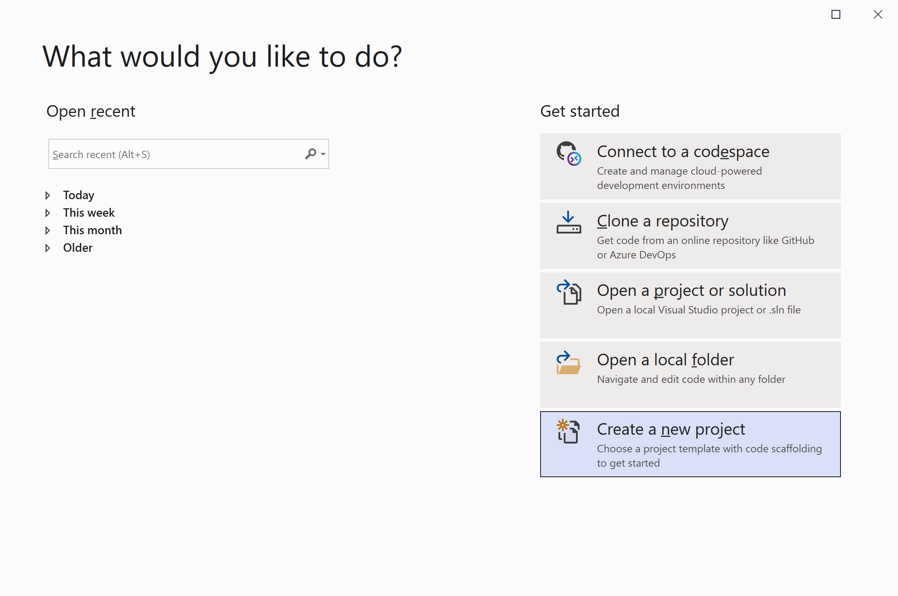
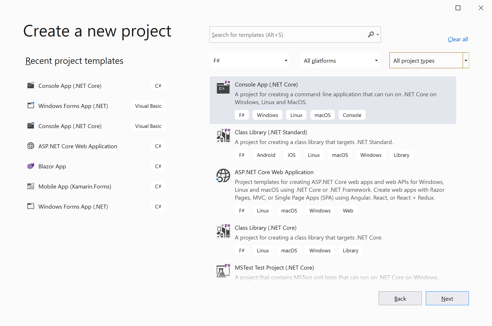
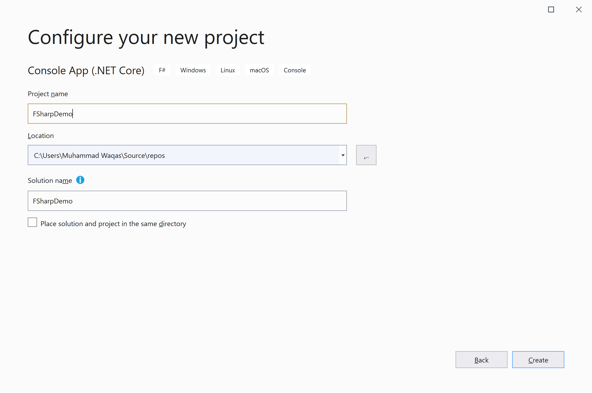
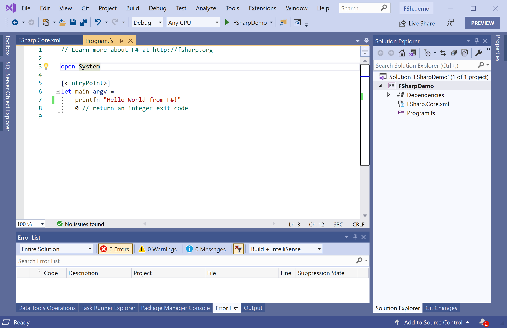

# Getting Started

F# and the Visual F# tooling are supported in the Visual Studio integrated development environment (IDE).

## Create a Console Application

Let's create a new Console Application project by launching the Visual Studio.



Select the **Create a new project** option.

Choose **F#** as language and in the template pane, select **Console App (.NET Core)** and click **Next** button.



Enter the project name, you can change the location and solution name, but we will leave it as is and click on the **Create** button.  



You can see a new console application project is created. 



Now let's add the following simple code which will print a message on the console window.

```csharp
// Learn more about F# at http://fsharp.org

open System

[<EntryPoint>]
let main argv =
    printfn "Welcome to F# Tutorial."
    0 // return an integer exit code

```

Let's run the application by clicking on the **Debug > Start Without Debugging** menu option and you will see the following output.

```csharp
Welcome to F# Tutorial.
```