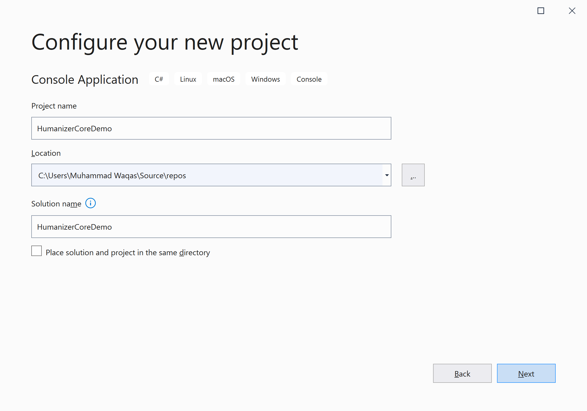
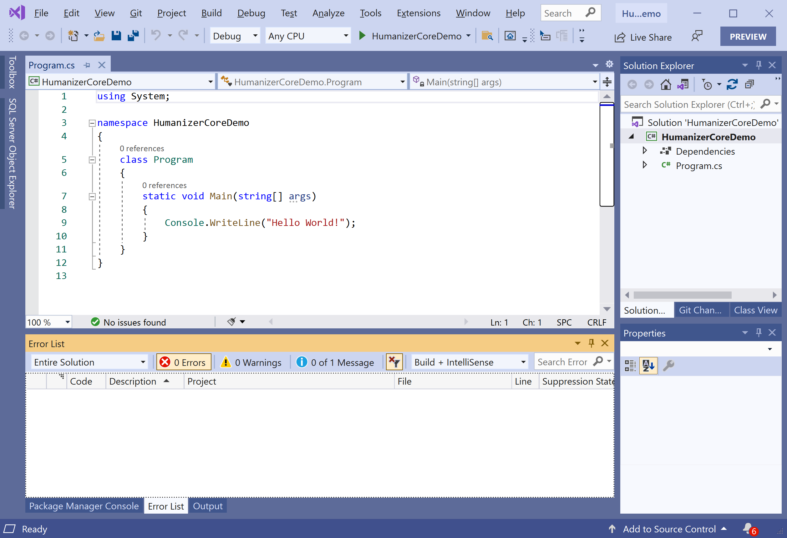
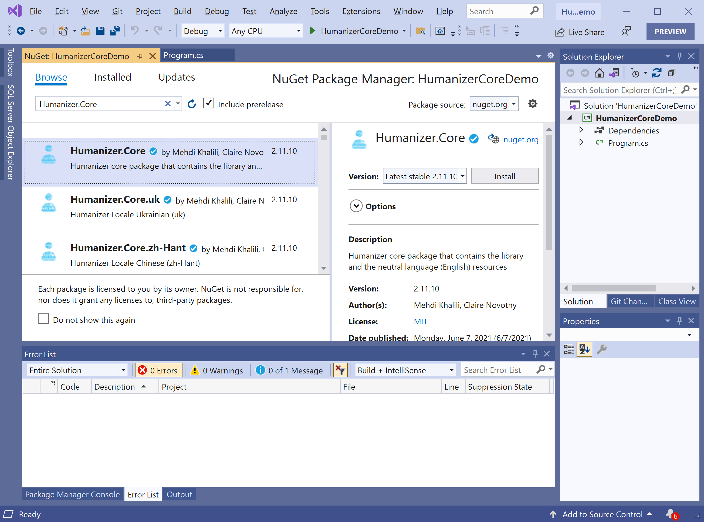
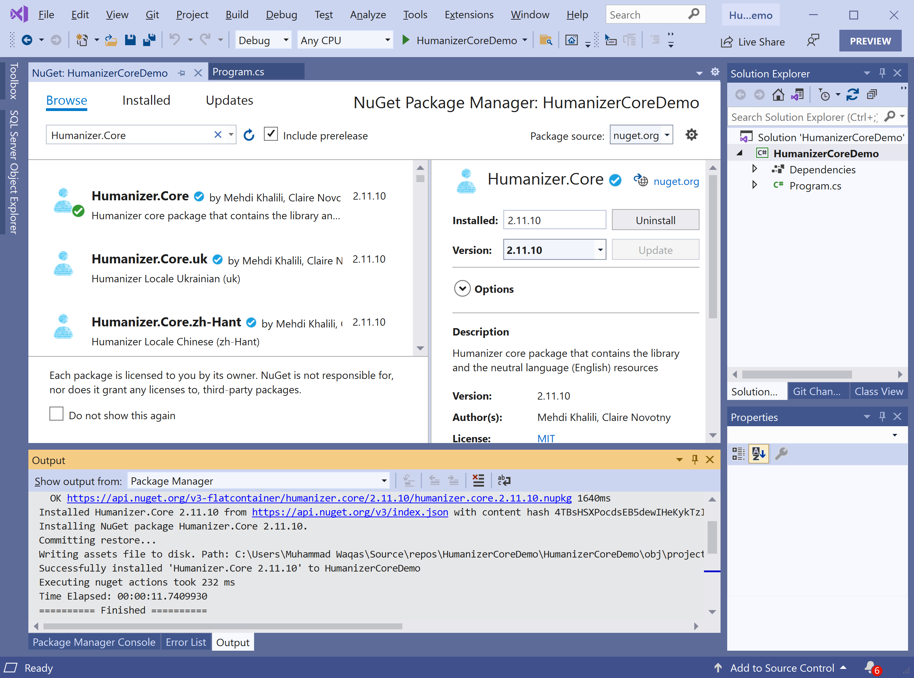

# Getting Started

**Humanizer.Core** is a NuGet library that allows you to manipulate and display strings, enums, dates, times, timespans, numbers, and quantities. 

 - It is a .NET Standard Class Library with support for .NET Standard 1.0+ (.Net 4.5+, UWP, Xamarin, and .NET Core).
 - Humanizer symbols are source indexed with [SourceLink](https://github.com/dotnet/sourcelink) that allows you to step through Humanizer code while debugging your code.

## Features 

 - Convert function names and variable names to meaningful strings.
 - Collapse the string
 - Convert enum into a meaningful string
 - Handling DateTime and TimeSpan
 - Processing file size

## Installation

You can easily install it from the **Package Manager Console** window by running the following command.

```csharp
PM> Install-Package Humanizer.Core
```

## Environment Setup

To start using the **Humanizer.Core** in your application, you will need to install the [Humanizer.Core](https://www.nuget.org/packages/Humanizer.Core) NuGet package.

Let's open the Visual Studio and create a new project.


Select the **Create a new project** option.


Choose **C#** as language, **Windows** as a platform, and **Console** as the project type. In the template pane, select **Console Application** and click the **Next** button.



Enter the project name, you can change the location and solution name, but we will leave it and click on the **Next** button.  


On the **Additional Information** dialog, select the target framework and then click on the **Create** button.  



You can see a new console application project is created. Now, to install a **Humanizer.Core**, right-click on the project in **Solution Explorer**, and select **Manage NuGet Packages...**



Select the **Browse** tab and search for **Humanizer.Core** and install the latest version by pressing the **Install** button. 



Once **Humanizer.Core** has been successfully installed. You are now ready to start your application.
