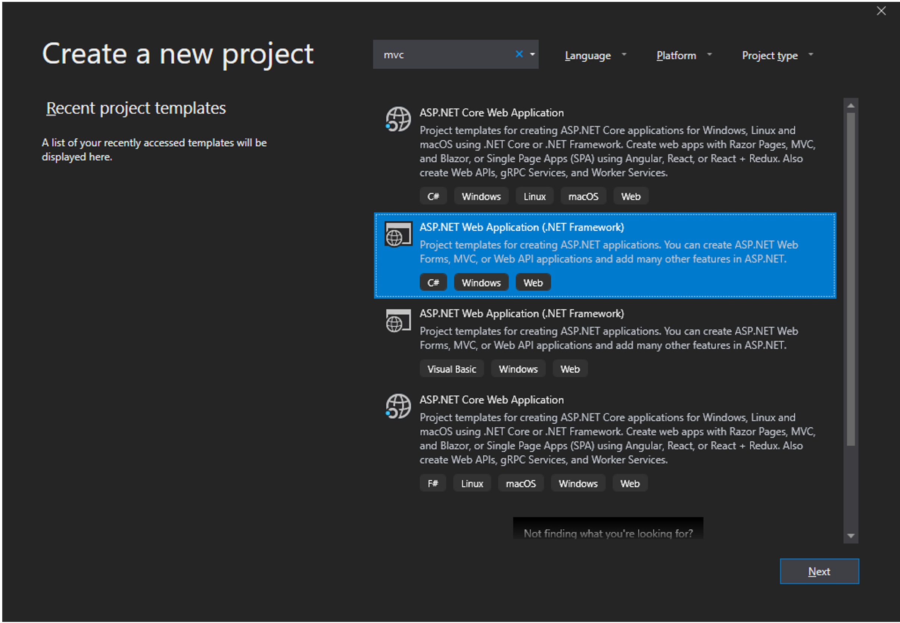
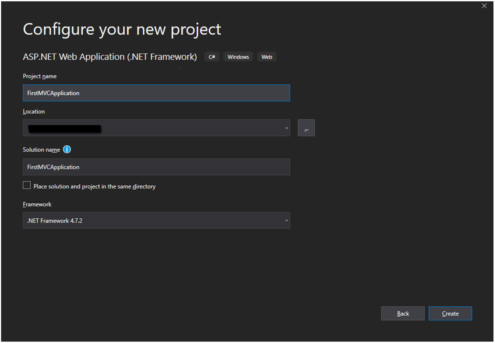
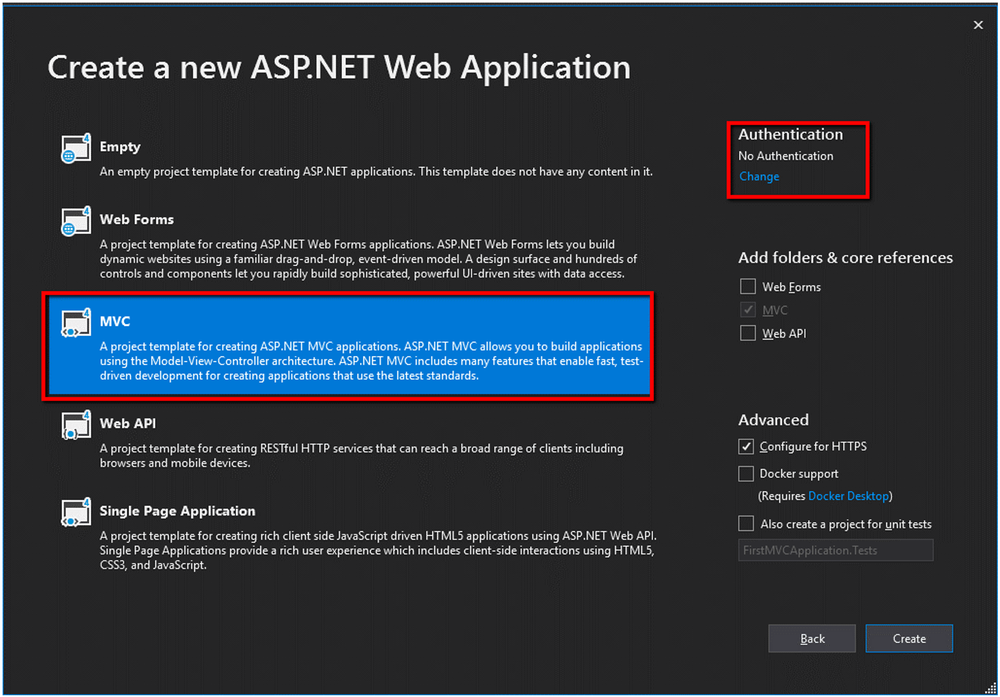

# Create MVC Application

In this chapter, we are going to talk about how you can create a new MVC web application. We will be doing it using Visual Studio. This way, we will understand how an MVC application is built and what are some of its components.

 - We would need to set up the development environment. 
 - As an IDE, we are going to use Visual Studio 2019 (Community Edition) for creating our MVC application. 
 - As for the framework, it will be based on .NET 4.7.2. The proper version of Visual Studio can be found at https://visualstudio.microsoft.com/downloads/.

The next thing to do is create the Visual Studio 2019 project for our MVC application. With VS 2019 opened, go to File -> New -> Project and choose the ASP.NET Web Application (.NET Framework), shown below and click on Next.

In the next screen, which is shown on the picture below:

 - Define the name of your first MVC application by inputting **FirstMVCApplication** in the **Project Name** field.
 - Define the location of your MVC project in the **Location** field.
 - Define the name of your solution in the **Solution name** field.
 - Define the .NET version framework in the **Framework** dropdown.

And click on the **Create** button.

After that, we see the screen below, where we set up the application type by choosing MVC and the authentication type, which we will set at **No Authentication**. Everything else will be left as default.

Clicking on the **Create** button will confirm the creating of our first MVC application.

Next, we will learn about the folder structure of an MVC web application.
