---
PermaID: 100005
Name: Entity Framework Extensions
---

# Entity Framework Extensions

The methods we used for adding, updating, and deleting items to and from the database are part of the Entity Framework and are very easy to get started and work with. But, the problem with Entity Framework, in general, is that it can be quite slow when dealing with big data sets. So, when doing CRUD operations with Entity Framework with thousands of items, you can and will experience performance issues.

To be able to solve the performance issues that Entity Framework can have, we can take advantage of some additional packages that offer support for Entity Framework and significantly improve CRUD operations when dealing with massive data sets.

We will take a look at the Entity Framework Extensions package and the methods it includes in the following chapters.

## Delete from Query

To be able to use the Entity Framework Extensions methods, we need first to install a NuGet package in Visual Studio.

Back to Visual Studio, right-click the project and choose **Manage NuGet packages**. Under **Browse** search for the following package: `Z.EntityFramework.Extensions`. 

The NuGet package can also be downloaded and installed from https://www.nuget.org/packages/Z.EntityFramework.Extensions/.

Once you have successfully installed the package, you are ready to use the extension methods.

To demonstrate the **Delete from Query** method and its usage, we are going to create another action in the `EmployeeController`. Let's call it the `DeleteFromQuery` action. 

We are going to implement the same code as with the `Delete` action in the previous chapter. So, the logic is the same. We want to remove a single employee from the employee list, specified with an `EmployeeID = id`.

We can use the extension method `DeleteFromQuery` from the Entity Framework Extensions in the new action as follows.

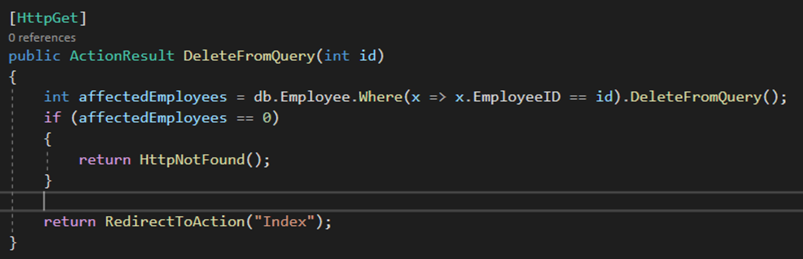

If we compare the code with the existing one for delete, we can see that there are two differences.

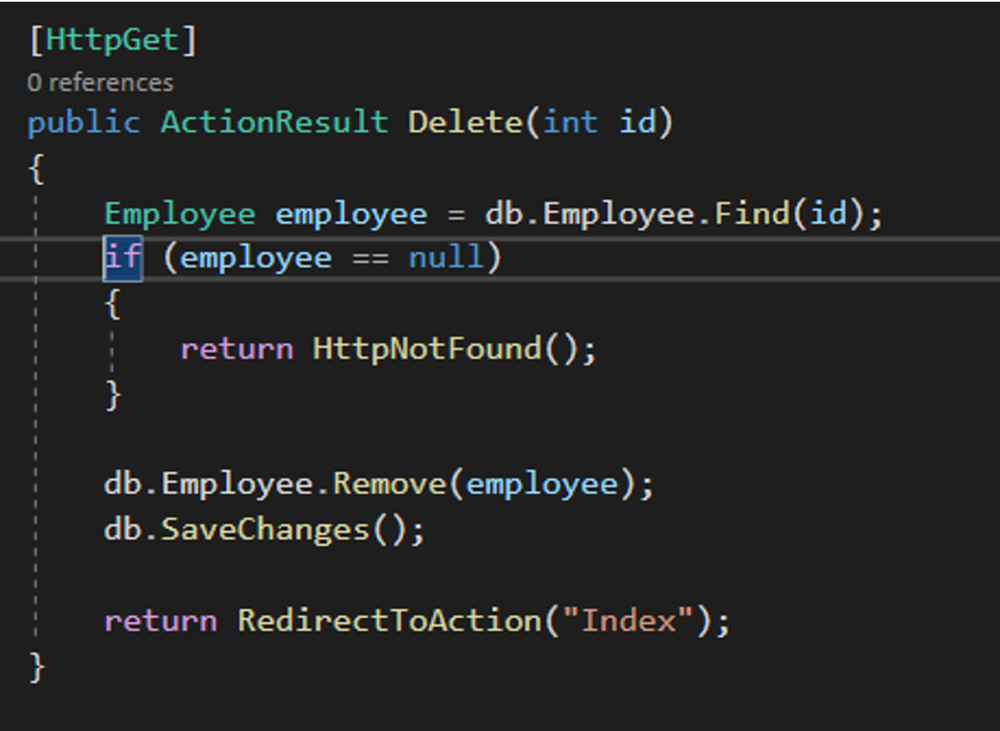

 - We no longer add the employee object into the Entity Framework `ChangeTracker`, which tracks the state of the employee entity. 
 - We no longer use the `SaveChanges()` method.

When using `SaveChanges()` to save changes to the database, we first need to set the state of the object we want to add, edit, or remove. For example, if we are deleting an object, we set the state of the object to `Deleted` by using the following code.

```csharp
db.Employee.Remove(employee);
```

Next, to delete the object from the database, we will call the `SaveChanges()` method that will create a transaction, then execute a `DELETE` statement towards the database, and finally will commit the transaction. What `DeleteFromQuery` allows us to do is to get rid of the unnecessary roundtrips of adding the state of the object to `ChangeTracker` and instead does a direct query to the database. This approach makes sense when we deal with bulk inserts or deletes, mainly because `SaveChanges()` starts to break down after a couple of hundreds of items.

We are currently working with a database that has only a couple of items in it. Let's changed that and put both methods `SaveChanges()` and `DeleteFromQuery()` to a test. To fill the database with the necessary data, we will create a helper called `DataHelper`, and in it, we will define a method called `SeedData`. To do so, back in Visual Studio, right-click the project **FirstMVCApplication** and choose **Add > New Folder**. Name the folder **Helpers**. In the folder, add a static class called `DataHelper`.

The `SeedData` method in the `DataHelper` looks as follows.

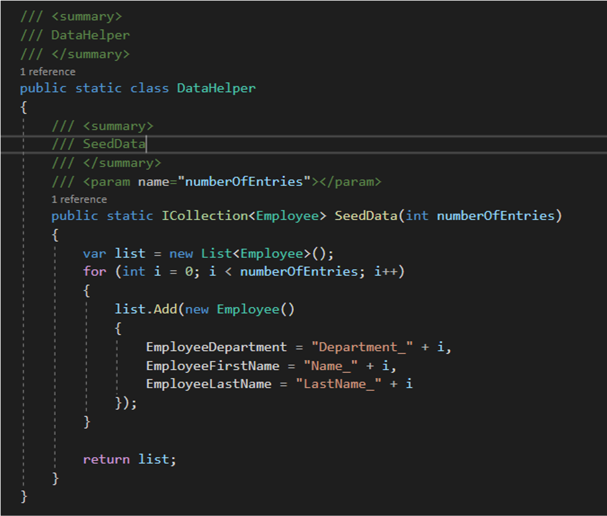

The method returns a list of employees, where the number of employees returned is equal to the `numberOfEntries` parameter.

To test the `DeleteFromQuery` extension method, we will add two new actions that are removing all employees from the database.

The first action will use `SaveChanges()` and the second will use `DeleteFromQuery()`. We will also measure the time needed for both actions to do the deletion on the same number of users.

Back in Visual Studio, add the following action links at the beginning of the `Index.cshtml` view under the **Employee** folder.


The first action link will call the `DeleteMultiple` action, which is defined in the `EmployeeController`.

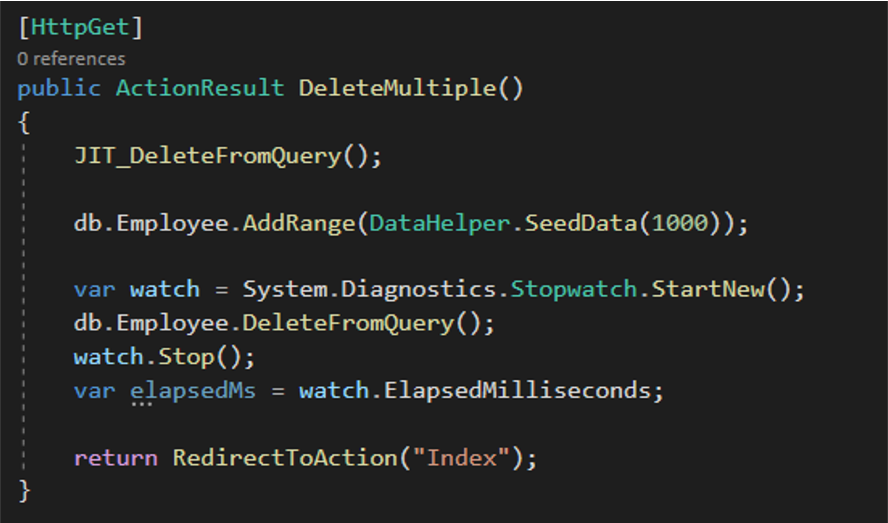

The second action link will call the DeleteMultipleSaveChanges action, which is also defined in the Employee controller.

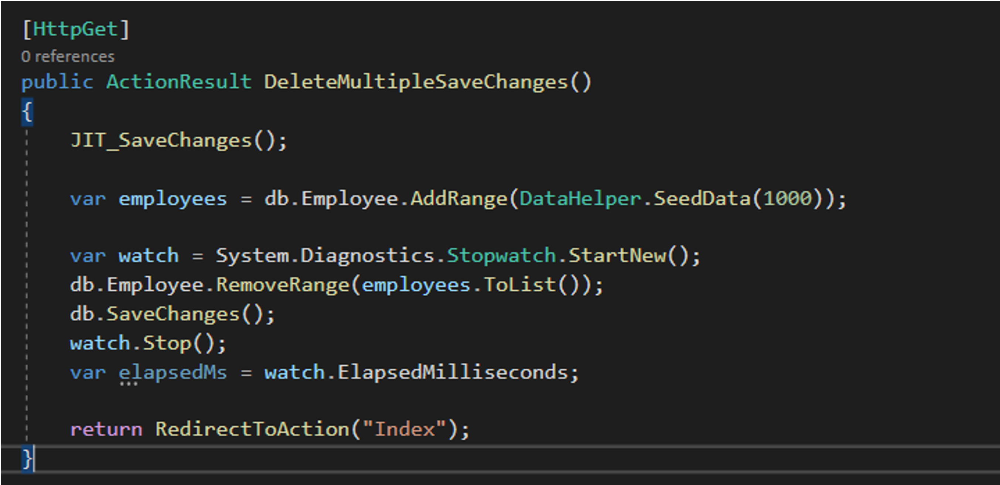

We watch the execution of the two actions by using `System.Diagnostics.Stopwatch`. We start the stopwatch at the beginning of each action and stop it when the delete operation is over.

If we run both actions on the same dataset, we can see that the `DeleteFromQuery` performs significantly better than the `SaveChanges()`.

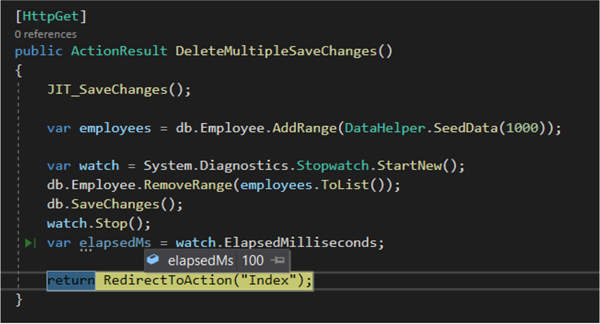

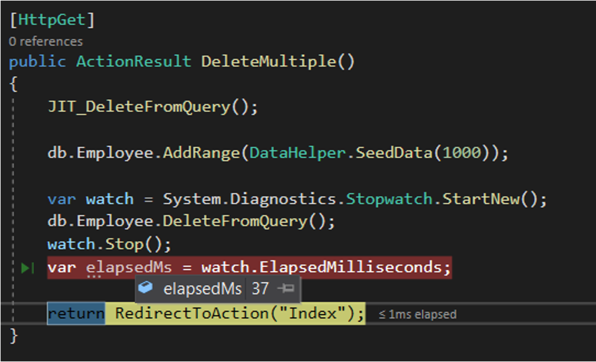

The `DeleteMultiple` method that uses the `DeleteFromQuery` extension method to remove all employees runs in 100ms, where's the `DeleteMultipleSaveChanges` method that uses `SaveChanges()` runs in 37ms.

You might ask what are the methods `JIT_DeleteFromQuery()` and `JIT_SaveChanges()` do? 

The first time the extension method `DeleteFromQuery()` is called, there is a just in time compilation happening, which can take up to hundreds of ms. To make sure that we compare both methods properly, we call each of these two methods in advance to make sure that the JIT compilation is already done for both of them. The JIT methods look like this.

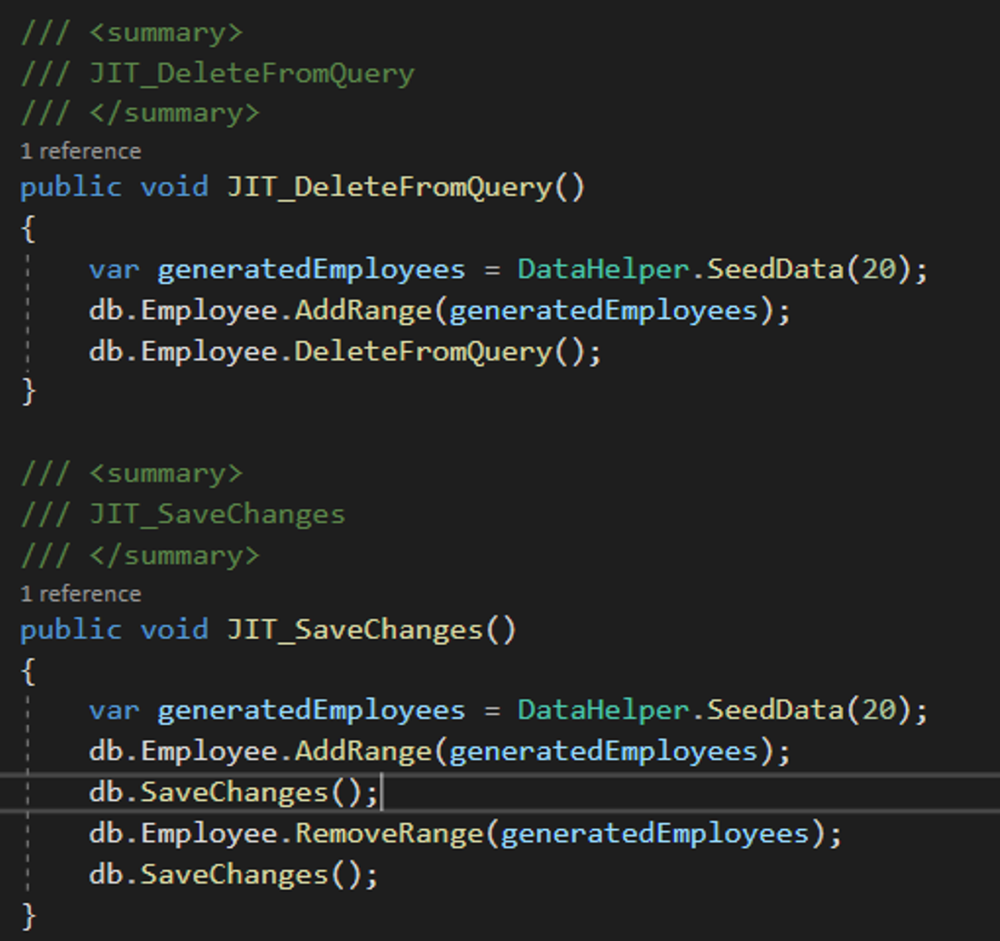

## BulkSaveChanges

`BulkSaveChanges` is another extension method that we can use to get better performance when dealing with more massive data sets. `BulkSaveChanges` offers better performance when saving hundreds of entities in the database. 

The difference between `SaveChanges` and `BulkSaveChanges` is that `SaveChanges` makes a roundtrip to the database for each entry we save, where the `BulkSaveChanges` makes a roundtrip for every 25 entries we save. Under the hood, both methods use the same SQL in the same order, but the number of SQL commands executed is smaller in the case of using `BulkSaveChanges`.

To test the `BulkSaveChanges` extension method, we will add another action link in the `Index.cshtml` view under the **Employee** folder. The action link is as follows.

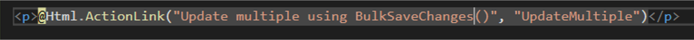

The `UpdateMultiple()` method is another action method defined in the `EmployeeController` and given in the image below.

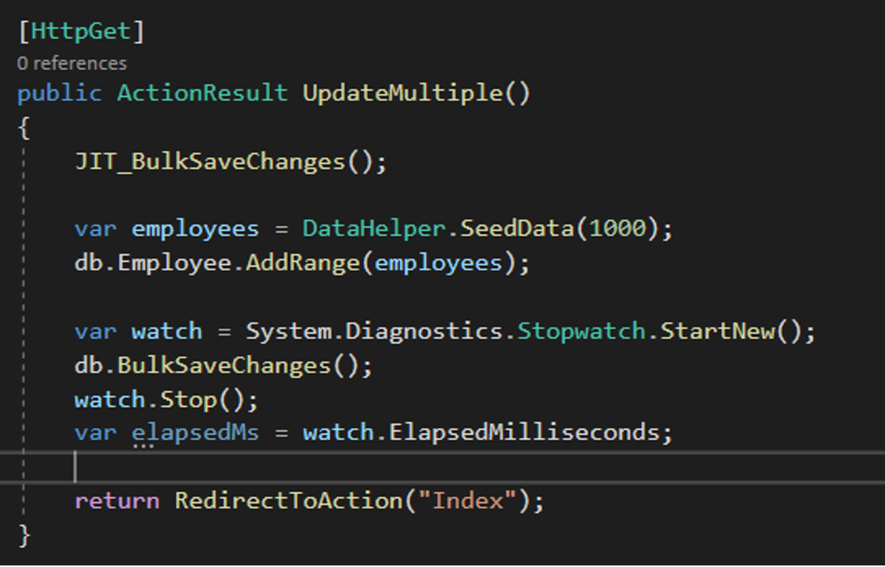

Again, we define a different JIT method in this case `JIT_ BulkSaveChanges()` to make sure that the JIT compilation is executed before we start measuring the execution of the `BulkSaveChanges` extension method. The JIT method is as follows.

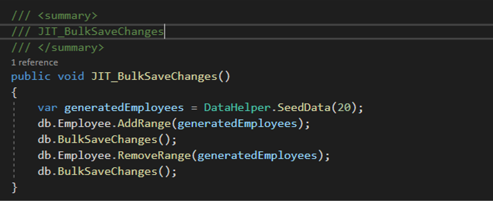

In the next image, we can see the results from the `BulkSaveChanges()` method when called on a data set of 1000 entries. One thousand entries are inserted in the database using the `BulkSaveChanges()` method in 490ms.

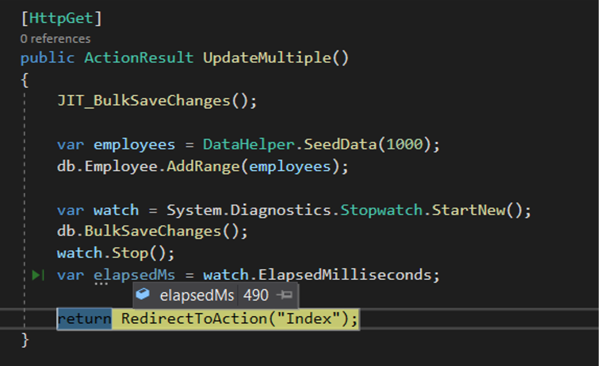

There is another extension method called `BatchSaveChanges()`, which is also used when updating entries. The usage of this method is the same as with the `BulkSaveChanges()`. The difference between these two methods is that `BulkSaveChanges()` is more scalable and offers different options that can make the method faster in different scenarios and, as a result, works better with larger data sets consisted of thousands of records.
