---
PermaID: 100004
Name: Entity Framework
---

# Entity Framework

Entity Framework is an object-relational mapper (ORM). As such, it simplifies mappings between your .NET objects and the tables and columns in your relational database. It creates database connections, executes queries towards the database, keeps track of changes that might happen in your application (an object has been added, changed, etc.), persists those changes, and, when instructed, executes those changes towards the database. In other words, it increases your productivity and reduces the amount of time necessary to implement all these features by writing your custom code. 

There are also other ORMs out there, but Entity Framework is Microsoft's recommended tool for working with data in an ASP.NET application. It is widely used and well known for the following features.

 - Rich mapping capabilities and has to support one-to-one, one-to-many, and many-to-many relationships.
 - Support for inheritance, complex types as well as stored procedures.
 - A possibility of using only code, the so-called “Code-First” approach (including setting up the database and interacting with tables and columns only through code).
 - It offers a visual designer for creating entity models.
 - It offers excellent integration with ASP.NET Framework.
 - Support for eager, lazy, and explicit loading.

## Get Started with Entity Framework

### Creating a Model

The model plays a significant part in the Entity Framework. It contains configurations, mapping properties, relationships, and defines which objects map to which tables. 

There are two ways to create the EF model.

#### Using EF Code First approach

This approach is usually preferred when there is no database present, or the database is empty. In this case, all objects, their properties, and existing relationships between them are defined through .NET classes. At runtime, the Entity Framework creates the model from these classes, and it also creates the database. 

Developers who do not have experience with databases or have an already existing database, but want to communicate with it only through code, also find this approach to be more suitable to them.

#### Using the Entity Framework visual designer

The Entity Framework visual designer is a tool that helps you create a model by drawing boxes that represent your tables or objects and lines to build relationships between them. You can use two different approaches to create the model with Entity Framework visual designer, Database First, and Model First.

You use the Database First approach when you have an existing database, and you want to connect to it in your application. In this case, the EF visual designer creates a model from your existing database and displays it graphically with boxes and lines.

The other approach, Model First, is when you do not have a database, but you prefer to create the model using a visual designer. In this case, you start from scratch, by drawing boxes that will represent your tables and lines that will represent the relationships between them.

The model created using the EF visual design is in EDMX format, and it is an XML file that contains information about all mappings and their properties.

### Installing EF in your solution

Once you know which approach you will take in creating your own EF model, you can start building it by installing Entity Framework in your solution. For that, you will need to install two things, Entity Framework Tools for Visual Studio and Entity Framework Runtime.

#### Entity Framework Tools for Visual Studio

Almost all versions of Visual Studio have these tools already pre-installed. If you are working with an older version of Visual Studio, you will have to install them manually. The Entity Framework Tools allow you to use the visual designer for creating object models, so if you want to use Entity Framework with the Database and Model-first approach, then these tools must be installed in your Visual Studio environment.

#### EF Runtime

To use Entity Framework in your code, you need to install the Entity Framework Runtime. The easiest way of doing this is to install it through the NuGet package manager. 

Let's see how the installation process goes by installing Entity Framework in our application FirstMVCApplication.

Open the solution **FirstMVCApplication** in Visual Studio. In Solution Explorer, right-click the solution and choose “Manage NuGet Packages for Solution” (as shown in the image below).

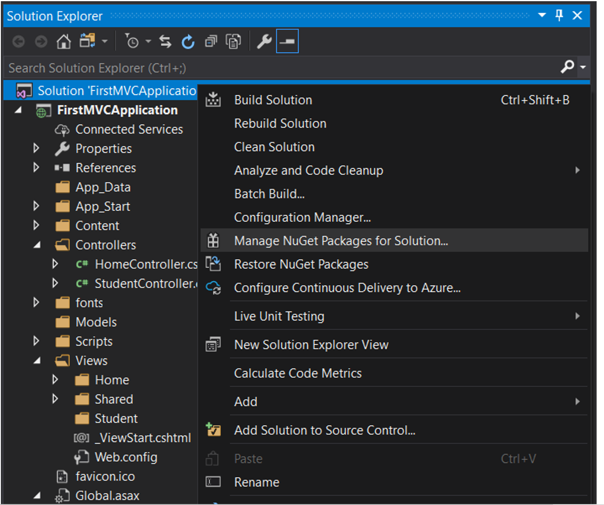

When the NuGet store appears, click on **Browse** at the left top corner and type ***Entity Framework*** in the search box. Then, choose the project where you want the Entity Framework to be installed, select the latest stable version available, and click on the **Install** button.

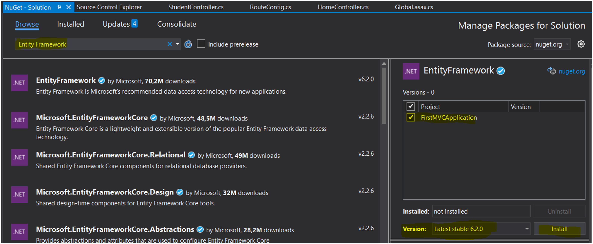

When Visual Studio asks you to confirm the Entity Framework installation in your solution, click **OK**, then accept the terms and conditions and continue with the installation.

You can monitor the installation in the output window in Visual Studio. Once it is finished, you will get a message in the output window that the Entity Framework was successfully installed. There will also be a green icon in the NuGet store, right after the name of the Entity Framework package.

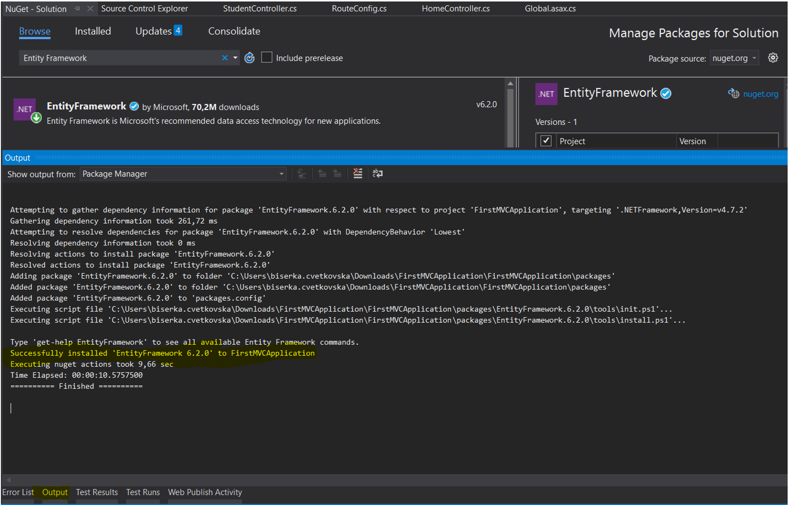

You can also install Entity Framework through the NuGet Package Manager console by using the following command.

```csharp
Install-Package EntityFramework
```

If you do not specify a version with the `–Version` attribute, the latest stable version will be used. In case you want to install a specific version, you can use the –Version attribute and specify the version needed.

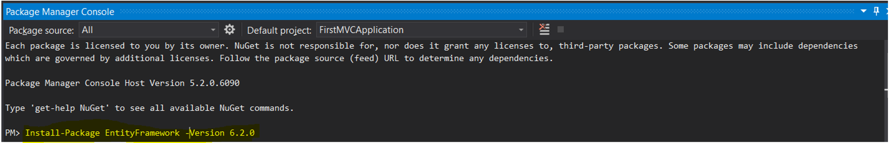

If you cannot find the **NuGet Package Manager console**, make sure to open it from the menu **Tools > NuGet Package Manager > Package Manager Console**.

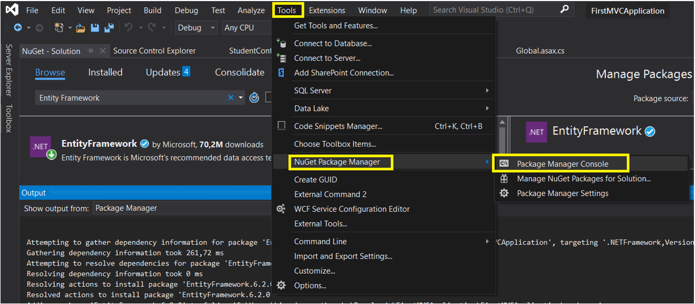

Now that we have Entity Framework installed in our solution, let's see how it works.

### Working with data in MVC

We will continue using the same project (FirstMVCApplication) and we will implement a simple registration functionality that will allow us to create our first EF model. We will use the EF Code First approach since we believe that it is easier to understand the whole idea behind the EF, plus you can also see all steps required to use EF in your application. The goal of the feature is to allow employees to register for different corporate events.

To do so, we need to create the following three entity classes: Employee, Event, and Registration. Besides, we will define the relationships between them. Since employees can register for multiple company events the relationship between the three entities will be defined as displayed in the image below.


 - Employees <> Registration is a One To Many (1 <> m) relationship.
 - Event <> Registration is a One To Many (1 <> m) relationship.

In other words, an employee can register for multiple company events, and an event can have multiple employees registered for it. The entity Registration holds information about a specific registration done by a particular user for a specific event.

Now that we have an idea about how our model must look like, we will go back to our application and create the three entity classes.

### Creating a model with EF Code First Approach

To create a model with EF, we must navigate to the map Models and create a new class, which we will name Employee. The class Employee presents the employee; therefore, we will need to create the following properties to define the employee.

 - **First name:** First name of the employee
 - **Last name:** Last name of the employee
 - **Department:** The department that the employee is a part of

Additionally, we will create these two properties as well.

 - **ID:** The primary key of the `Employee` table uniquely identifies the employee.
 - **Registrations:** A list of registrations related to the employee.

Our class will look like this.

```csharp
public class Employee
{
    public int ID { get; set; }
    public string LastName { get; set; }
    public string FirstName { get; set; }
    public string Department { get; set; }

    public virtual ICollection<Registration> Registrations { get; set; }
}
```

The most interesting part about this class is the property Registrations. In the EF world, this property is called a navigation property. Navigation properties hold other EF entities that are related to this entity. In this case, the property Registrations will hold all registrations that are related to an employee. Usually, navigation properties are defined as virtual, so that they can take advantage of certain EF functionalities such as lazy loading. In an m<>m relationship, the navigation property is defined as a list where items can be added, edited, or deleted. In our class, we use the type ICollection.

We define the two classes Event and Registration in the same way we did with Employee.

The class Event will have the following properties.

 - **Title:** The title of the event.
 - **Description:** Short description of the event.
 - **AvailableSeats:** How many seats are available for this event.
 - **DateTime:** Date and time of the event.

The same as with the `Employee`, we will create two more additional properties.

 - **ID:** The primary key of the Event table.
 - **Registrations:** A list of registrations related to the event. 

```csharp
public class Event
{
    public int EventID { get; set; }
    public string Title { get; set; }
    public string Description { get; set; }
    public int AvailableSeats { get; set; }
    public DateTime DateTime { get; set; }
    public virtual ICollection<Registration> Registrations { get; set; }
}
```

The class `Registration` will have the following properties.

 - **EmployeeID:** A foreign key to the table Employee
 - **EventID:** A foreign key to the table Employee
 - **Employee:** A navigation property for the table Employee
 - **Event:** A navigation property for the table Event

```csharp
public class Registration
{
    public int EmployeeID { get; set; }
    public int EventID { get; set; }   
    public virtual Employee Employee { get; set; }
    public virtual Event Event { get; set; }
}
```

Since the entity `Registration` is associated with only one employee and one event, we define the navigation properties as single entities and not of type list, as was the case with `Employee` and `Event`.

#### Creating a database context

The class that coordinates everything for a given EF model is the database context class. This class allows querying and saving the data, as well as adding, editing, and deleting items.

Back to our project, we will create a database context class for our project. First, we will create a new folder on the project's root level and name it **DAL**. DAL stands for **Data Access Layer**. We will create the database context class under this folder by right-clicking the folder **DAL** and adding a new class. Name the class `CompanyContext`. 

The database context class must derive from the `System.Data.Entity.DbContext` class and contains all entities that need to be included in the EF model.

In our project, the database context class will look as follows.

```csharp
public class CompanyContext : DbContext
{
 	public CompanyContext() : base("CompanyContext")
    {
    }
    
    public DbSet<Employee> Employees { get; set; }
    public DbSet<Registration> Registrations { get; set; }
    public DbSet<Event> Events { get; set; }
    
    protected override void OnModelCreating(DbModelBuilder modelBuilder)
    {
         modelBuilder.Conventions.Remove<PluralizingTableNameConvention>();
    }
}
```

This code creates a DbSet property for each entity. In Entity Framework terminology, an entity set typically corresponds to a database table, and an entity corresponds to a row in the table.

#### Connecting everything together

To create the database from the EF model we defined earlier, we need to specify where we want to create the database. 

We will add the following connection string in the application's `web.config`.

```csharp
<connectionStrings>
  <add name="EmployeeContext" connectionString="Data Source=(LocalDb)\MSSQLLocalDB;Initial Catalog=CompanyEvents;Integrated Security=SSPI;" providerName="System.Data.SqlClient"/>
</connectionStrings>
```

So, we will use our LocalDb server to create the database with the name CompanyEvents. We will connect to the database using Windows or Integrated authentication.

Next, we need to initialize a database context in our application. Open the Home controller and initialize a new database context, as shown in the image below.

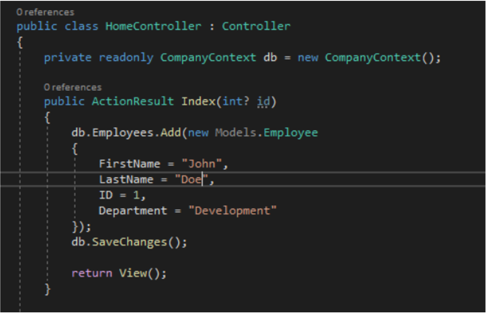

When the Index action of the Home controller is called, the code for adding new employees is executed, and the DbContext will create the database.

#### Creating a model with EF Database First Approach

By using MVC, EF, and ASP.NET, we can create a web application with which we can access the database. In this part of the tutorial, we will utilize the EF Database First Approach. The EF Database First Approach, like the name suggests, starts with the database. In it, we have a table, or multiple tables, that have data. Our goal would be to transfer the structure of that table/those tables into our MVC web application and create models.

In our FirstMVCApplication, we will create three tables:

 - Registration
 - Event
 - Employee

For that purpose, we would need to create a simple database, where we would then create these three tables. The tables are fairly simple and do not have a lot of columns.

As a first step, we will just define the structure of the tables without any constraints (primary key, foreign key…).

The first table we are going to create is Employee. It is going to have the following columns:

 - EmployeeID
 - EmployeeLastName
 - EmployeeFirstName
 - EmployeeDepartment

The code that we will use for creating the table is shown below.

```csharp
CREATE TABLE Employee
(
	EmployeeID INT IDENTITY(1,1) NOT NULL,
	EmployeeLastName NVARCHAR(100) NOT NULL,
	EmployeeFirstName NVARCHAR(100) NOT NULL,
	EmployeeDepartment NVARCHAR(200) NOT NULL
)
```

The second table we are going to create is Event. It is going to have the following columns:

 - EventID
 - EventTitle
 - EventDescription
 - EventAvailableSeats
 - EventDateTime

The code that we will use for creating the table is shown below.

```csharp
CREATE TABLE Event
(
	EventID INT IDENTITY(1,1) NOT NULL,
	EventTitle NVARCHAR(200) NOT NULL,
	EventDescription NVARCHAR(1000) NOT NULL,
	EventAvailableSeats INT NOT NULL,
	EventDateTime DATETIME NOT NULL
)
```

The last table we will create is table Registration. It is going to have the following columns:

 - RegistrationID
 - EmployeeID
 - EventID

The code that we will use for creating the table is shown below.

```csharp
CREATE TABLE Registration
(
	RegistrationID INT IDENTITY(1,1) NOT NULL,
	EmployeeID INT NOT NULL,
	EventID INT NOT NULL
)
```

Next, we will create constraints for these three tables. We will start with the primary keys.

A primary key of a table can be one or multiple columns. 

The important thing when choosing the primary key is that we are sure that whatever column/s we choose uniquely defines each entry in that table.

For example, for the table Employee, we will choose the column EmployeeID. Following is the code for creating a primary key on the before-mentioned column.

```csharp
ALTER TABLE [dbo].[Employee] ADD PRIMARY KEY CLUSTERED 
(
	[EmployeeID] ASC
)
```

We will do the same for the other two tables. For the table Event, we will choose the column `EventID` as a primary key, while the column `RegistrationID` will be chosen as the primary key for the table Registration.

```csharp
ALTER TABLE [dbo].[Event] ADD PRIMARY KEY CLUSTERED 
(
	[EventID] ASC
)

ALTER TABLE [dbo].[Registration] ADD PRIMARY KEY CLUSTERED 
(
	[RegistrationID] ASC
)
```

As per the cardinality matrix that we showed previously, we now need to create foreign keys for our tables. Foreign keys are needed only in table Registration. The code given below creates a relationship between tables Registration/Employee and Registration/Event.

```csharp
ALTER TABLE [dbo].[Registration]  WITH CHECK ADD  CONSTRAINT [FK_Registration_Employee] FOREIGN KEY([EmployeeID])
REFERENCES [dbo].[Employee] ([EmployeeID])
GO

ALTER TABLE [dbo].[Registration] CHECK CONSTRAINT [FK_Registration_Employee]
GO

ALTER TABLE [dbo].[Registration]  WITH CHECK ADD  CONSTRAINT [FK_Registration_Event] FOREIGN KEY([EventID])
REFERENCES [dbo].[Event] ([EventID])
GO

ALTER TABLE [dbo].[Registration] CHECK CONSTRAINT [FK_Registration_Event]
GO
```

Now that we've created the tables in our database, it is time to create the appropriate models for those tables.

For that, we need to add an EF data model to our MVC project. We will use the ADO.NET Entity Data Model. To create it, right-click on our project (FirstMVCApplication), then select **Add > New Item**. A pop-up window will show up, like the one in the picture below.


In the pop-up window:

 - Type in **data model** in the search box
 - Select ADO.NET Entity Data Model
 - Write **Model1** in the Name field
 - Click on **Add** to go to the next step

 
The next step will open the Entity Data Model Wizard, shown in the picture below.

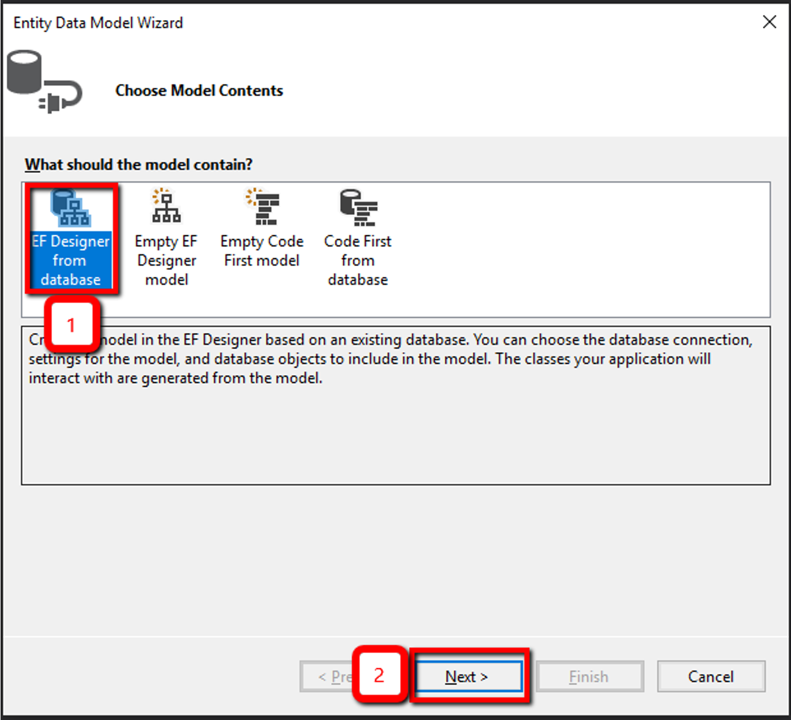

Select EF Designer from a database and click on the **Next** button.

The next step is setting up the data connection.

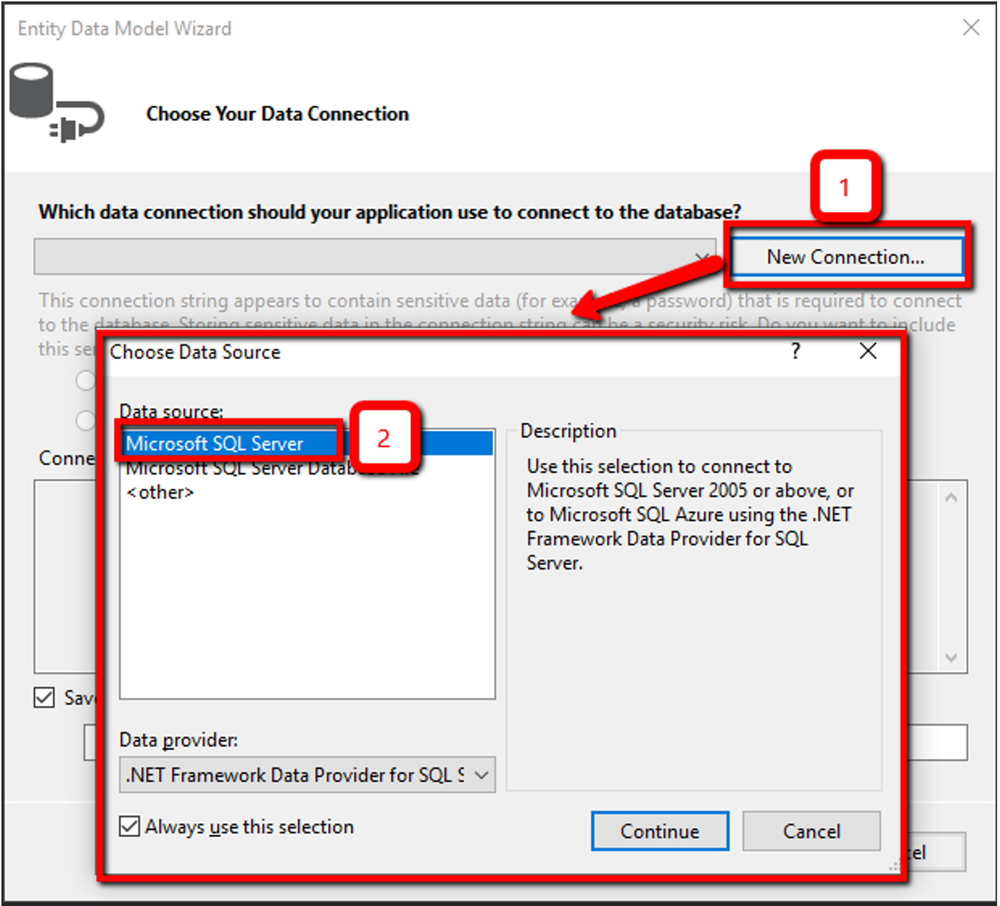

Click on **New Connection**, which will open the **Choose Data Source** window, select **Microsoft SQL Server**, and click on the **Continue** button.

It will open the **Connection Properties** window, which is shown below.

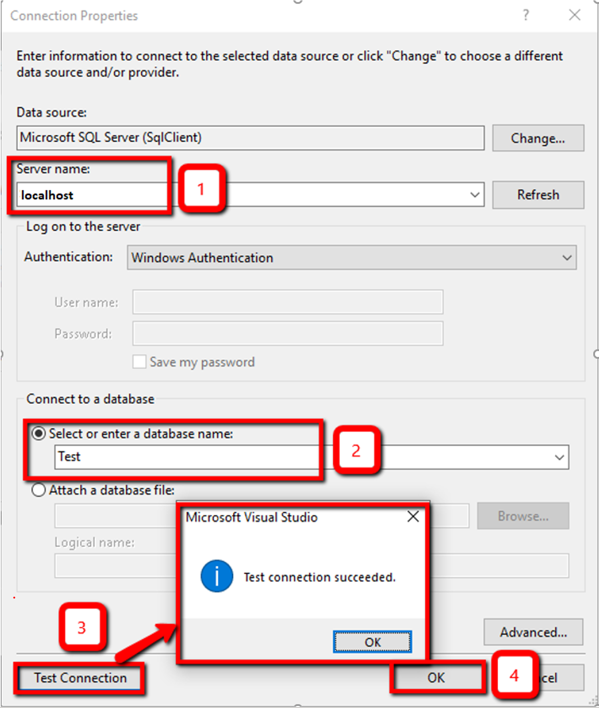

 - In the field **Server name**, type in localhost as the name of your SQL Server
 - In the **Select or enter a database name** drop-down menu, select the appropriate database you created before
 - Click on **Test Connection** to check if your application can connect to the database
 - Click on **OK** to finish setting up the connection.
 
We can see that Visual Studio by itself created the connection string and saved it in the `Web.config` file of our MVC app.

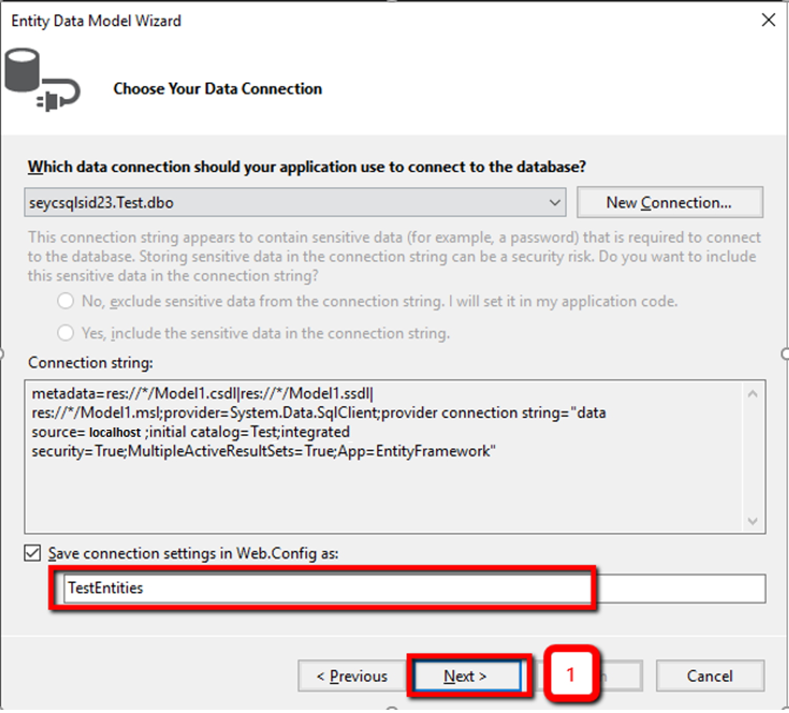

Here is the `Web.config` file shown.
 
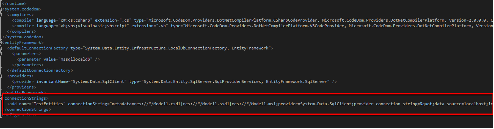

Click on the **Next** to go to the next step.
 
In the picture below, tick the box before **Tables** to select the tables from the database for which we want to create models. Since we want to create models for all tables, we need to select them all. Then, click on the **Finish** button.

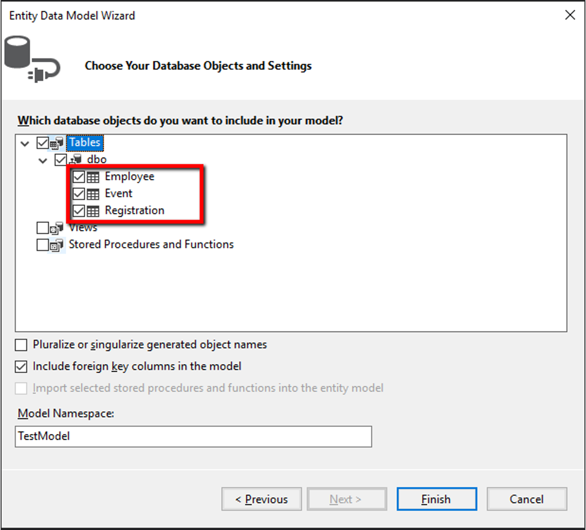

It will open up the EDMX diagram (shown below), which represents the models and the relationship between them.
 
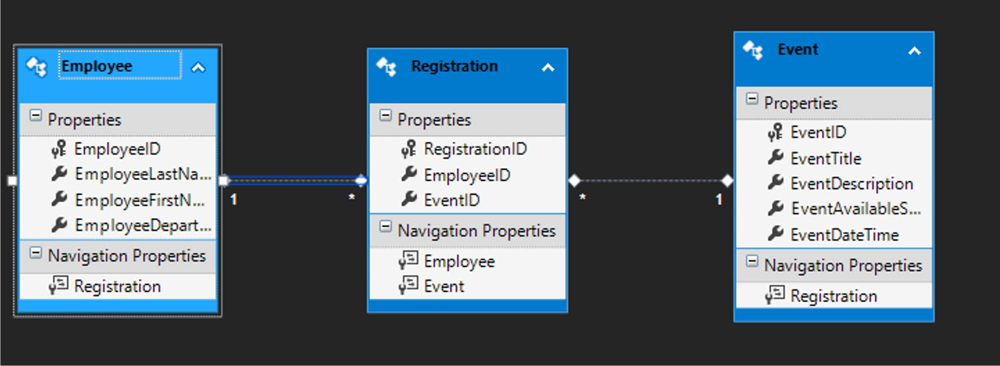

If we compare the cardinality matrix we defined before, with the EDMX diagram which was generated, we can conclude that they are completely the same:

 - `Employee` has a One-to-many relationship with `Registration`.
 - `Event` has a One-to-many relationship with `Registration`.

Below is the code that is generated from the database. If we compare it with the code we wrote before. We will see that it is completely the same.

The only difference is the `RegistrationID` field we defined as a separate field in the table `Registration`.

Class Employee:

```csharp
public partial class Employee
{
    public Employee()
    {
        this.Registration = new HashSet<Registration>();
    }

    public int EmployeeID { get; set; }
    public string EmployeeLastName { get; set; }
    public string EmployeeFirstName { get; set; }
    public string EmployeeDepartment { get; set; }

    public virtual ICollection<Registration> Registration { get; set; }
}
```

Class Event:

```csharp
public partial class Event
{
    public Event()
    {
        this.Registration = new HashSet<Registration>();
    }

    public int EventID { get; set; }
    public string EventTitle { get; set; }
    public string EventDescription { get; set; }
    public int EventAvailableSeats { get; set; }
    public System.DateTime EventDateTime { get; set; }

    public virtual ICollection<Registration> Registration { get; set; }
}
```

Class Registration:

```csharp
public partial class Registration
{
    public int RegistrationID { get; set; }
    public int EmployeeID { get; set; }
    public int EventID { get; set; }

    public virtual Employee Employee { get; set; }
    public virtual Event Event { get; set; }
}
```

The wizard has also created a context class for us. If you remember from the previous tutorial, when we worked with the Code First Approach, the context class coordinates Entity Framework. The context class that is created automatically in the Database First approach is given in the image below.

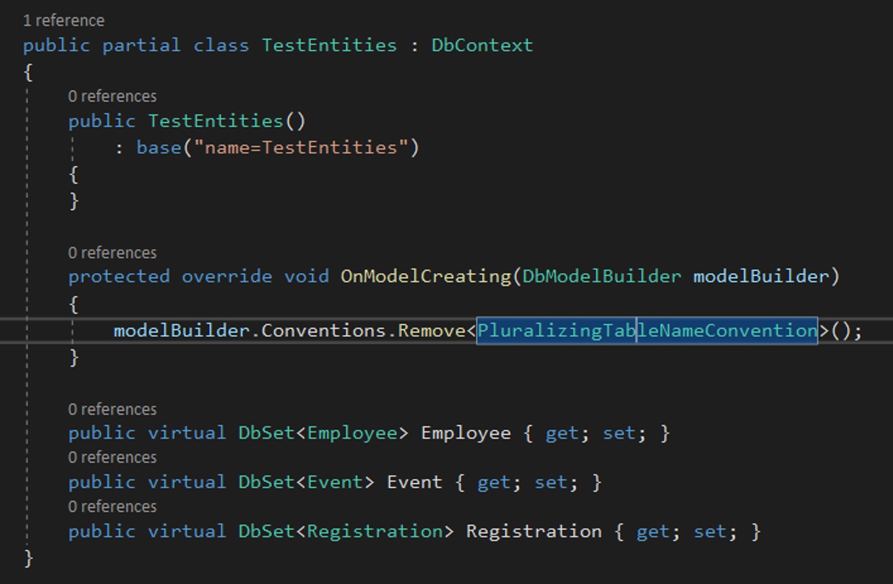

The context class contains the following properties/features.

 - The name of the connection string that will be specified in the `web.config` is passed into the constructor.
 - The connection string contains information such as database name, database server, and how the application will authenticate towards the database server. 
 - Our database server is **localhost**, the name of the database is **Test**, and we are using **Integrated Security**, which means that the application will use the current windows credentials to authenticate with the database server. 
 - When configuring the application with Database First approach, the EDMX wizard will create a new connection string entry with the same name passed to the constructor of the context class.

```csharp
<connectionStrings>
  <add name="TestEntities" connectionString="metadata=res://*/Model1.csdl|res://*/Model1.ssdl|res://*/Model1.msl;provider=System.Data.SqlClient;provider connection string=&quot;data source=localhost;initial catalog=Test;integrated security=True;MultipleActiveResultSets=True;App=EntityFramework&quot;" providerName="System.Data.EntityClient" />
</connectionStrings> 
```

 - The **DbSet** properties are created for each entity set. An entity set in Entity Framework corresponds to a table in the database. Therefore, we have three **DbSet** properties for our three tables: **Event**, **Employee**, and **Registration**.
 - The statement `modelBuilder.Conventions.Remove` will prevent table names from being pluralized. This means that the tables created in the database will not be in plural, e.g. **Events**, **Registrations**, **Employees**, but **Event**, **Registration**, **Employee**.

The next few chapters will concentrate on adding, displaying, updating, and removing data from the database using the context class and Entity Framework.

### Operations

#### Displaying data with Entity Framework (Read)

To be able to display data related to the `Employee` table, we will have to create a new controller. The controller will hold our business logic.

Back in the project, create a new controller class and name it `EmployeeController`. Our controller class will inherit the MVC Controller class. For the time being, we will need a single action `Index`. The action index will display the obtained employee data from the database. To access the database through our context class, we will create a private property named `db`, as shown in the image below.

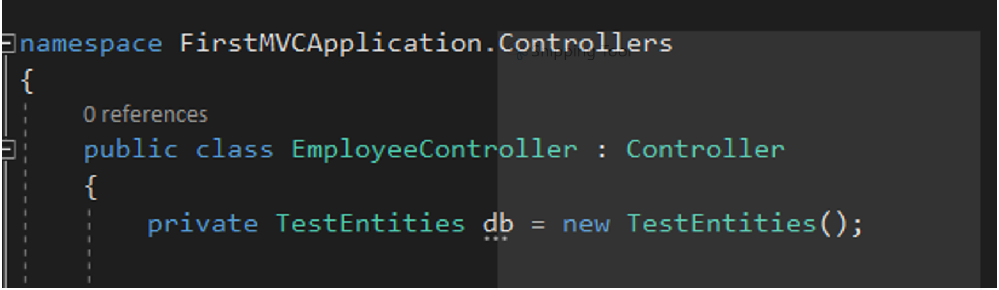

In the action `Index`, we will use the `Employee` as follows.

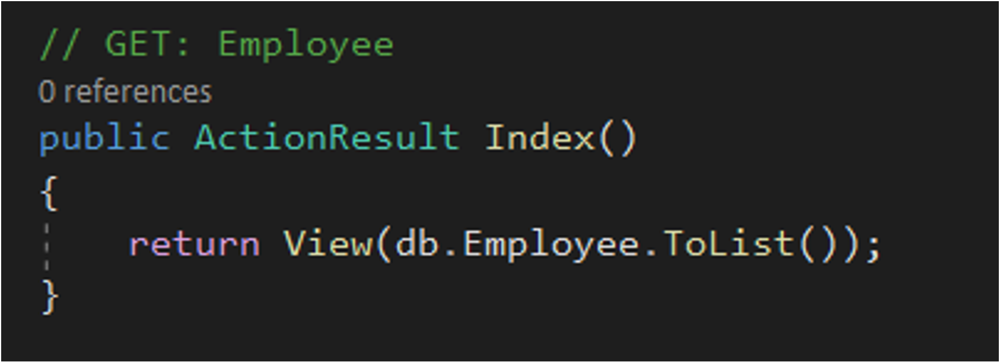

The statement `db.Employee.ToList()` will return a list of all employees present in the database.

The next thing we need to do is to create a view and connect the action with the view. Back in the project, right-click the folder **Views** and create a new folder **Employee**. Under the folder **Employee** create a view `Index`. This view will correspond to the action `Index` in the `EmployeeController`.

The view will display all the employees from the table. 

Using the `@model` directive, we can specify the type of data that will be passed to the view. If we take a look at the action `Index`, we can see that we are passing a list of employees. Therefore, at the beginning of the view, we will use the `@model` directive in the following way.

```csharp
@model IEnumerable<FirstMVCApplication.Employee>
```

The next step is to iterate through the list of employees and display information about each employee. 

The code given below creates a table and fills each row of the table with employee data. What's interesting is that we are using two HTML helpers here, `@Html.DisplayFor` and `@Html.DisplayNameFor`. 

HTML helpers are MVC classes that help render HTML. You can, of course, use HTML tags such as span or label to display the information you need, but the advantage of using MVC HTML helpers is that they can easily bind with the **Model** data.

For example, if we look at the code below and how these helpers are used, we can see that `@Html.DisplayNameFor` will generate HTML text for each employee property's name, where `@Html.DisplayFor` will generate HTML text for each employee property's value. Every time the model gets updated, the values of the properties will get updated too.

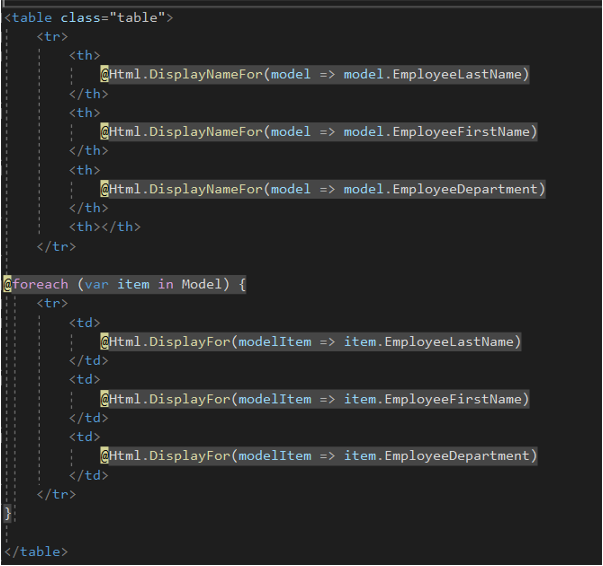

If we run the application, we will, unfortunately, see an empty table. That's because our database is currently empty. To be able to test the code, we can manually add employees directly to the database.

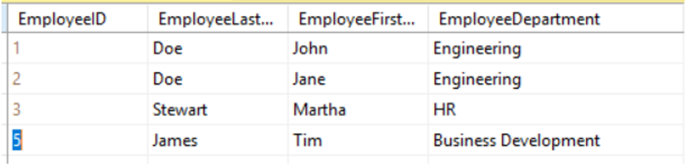

Let's rerun the application. Our test data is now displayed.


The last thing that we will change is the name of each employee column:

 - EmployeeLastName > Last Name
 - EmployeeFirstName > First Name
 - EmployeeDepartment > Department

As said earlier, the `@Html.DisplayNameFor` generates the name of each Employee property, respectively. If we want to change each column's display name, we have to look at the current `Employee` class.

The class Employee is defined as follows.

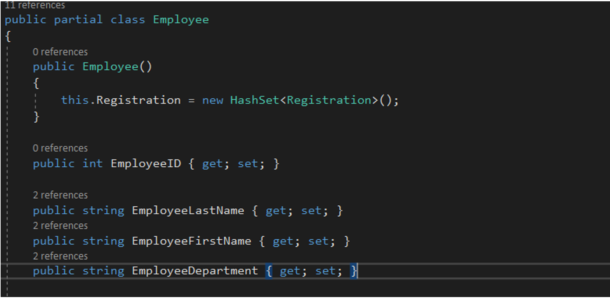

If we want to set more user-friendly names for the `Employee` properties, we can use data annotations to define them.

**Data annotations** are attribute classes that you can use to decorate classes or properties to enforce pre-defined rules. In this case, we can use the attribute `Display` and define a display name for each property.

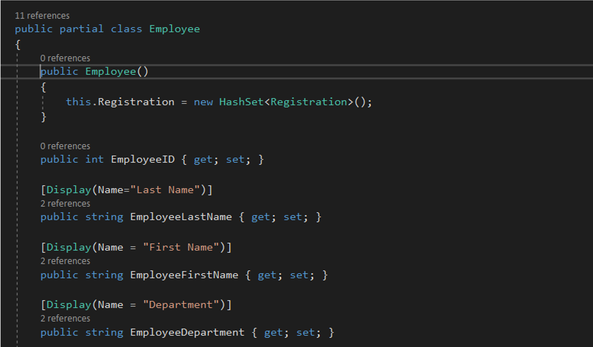

If we rerun the application, we should be able to see the change.

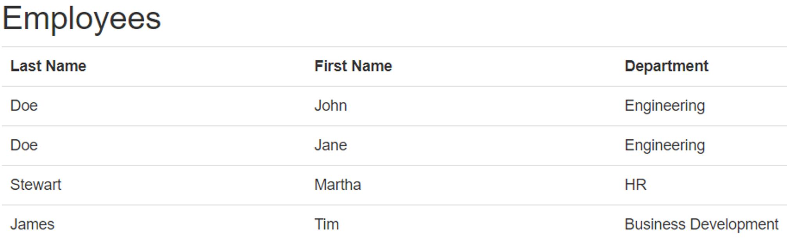


#### Adding data with Entity Framework (Create)

In the previous chapter, we focused on explaining how to display data with our MVC application and EF. For testing purposes and to show that our approach works, we added some test records in the database. Those records were cleared down before continuing.

In this part, we will focus on explaining how to add data using SQL, as well as using code.

Adding records in the database is one of the fundamental actions we can perform using Entity Framework. 

##### Adding data using database insert scripts

Of course, we can add data to the database by merely preparing `INSERT` statements, which we will then execute directly on the database.

Following is an example of how we can do that.

```csharp
INSERT INTO [dbo].[Employee]
      ([EmployeeLastName]
      ,[EmployeeFirstName]
      ,[EmployeeDepartment])
   VALUES
      ('Doe'
      ,'John'
      ,'Engineering')

INSERT INTO [dbo].[Employee]
      ([EmployeeLastName]
      ,[EmployeeFirstName]
      ,[EmployeeDepartment])
   VALUES
      ('Doe'
      ,'Jane'
      ,'Engineering')
```

After executing these statements on the database, we can just run the application, and the data will appear.

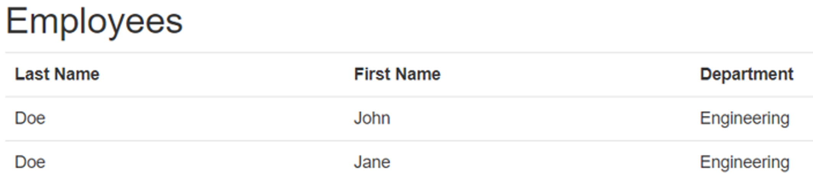

##### Adding data using Entity Framework 
	
For us to be able to add data to our database using EF, we must write the code to do so.

The first thing we need to do is create a View, with which we will create a form that will allow us to add a new employee to the database.  

The view will consist of three fields, namely the attributes of the model `Employee`:

 - First name of the employee
 - Last name of the employee
 - Department that the employee works in

We need to right-click on the folder **Employee**, located in Views. Then go to **Add**, and then click on **View**.

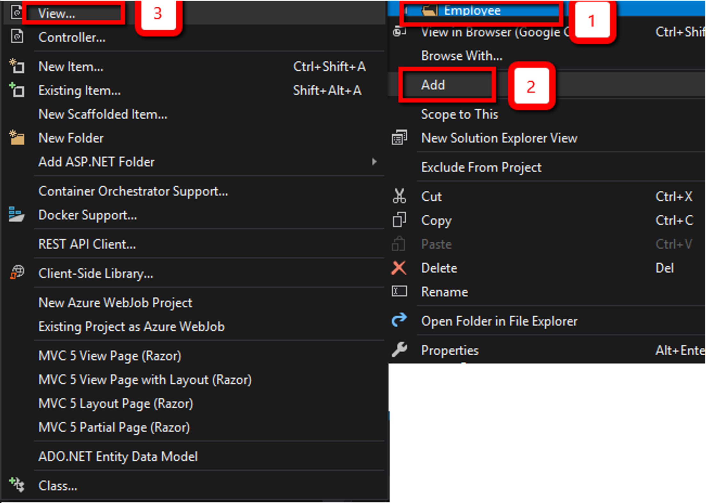

That will open up a new Add View pop-up window, which would need to be filled out like shown below:

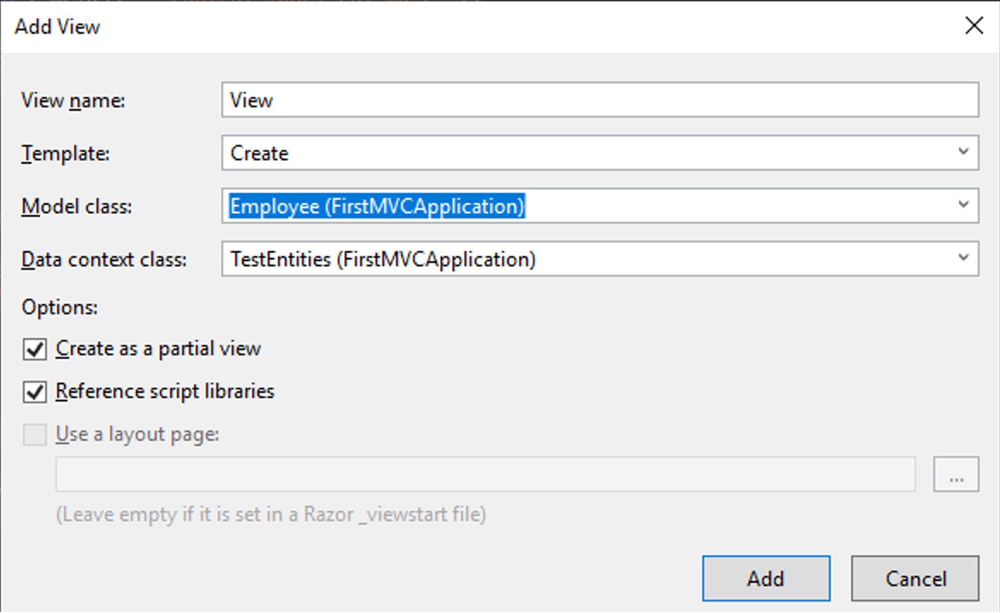

Because we chose the template **Create**, Visual Studio will create the code for the View, based on the model class we defined. The code will look similar to the one below:

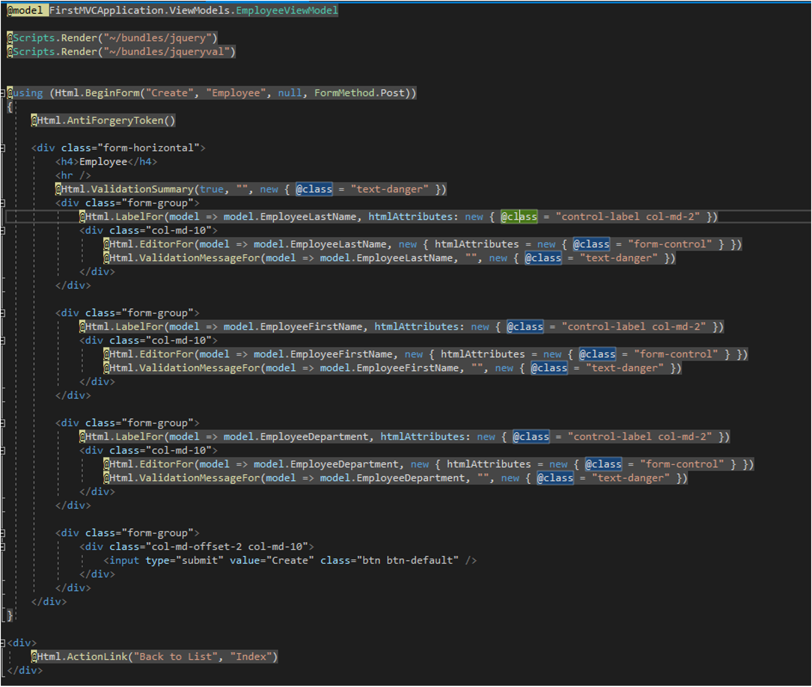

After the View is created, we have to go back to the `EmployeeController` and update the method for creating an employee. That would allow the application to pass the data through to the database and write it in the proper table.

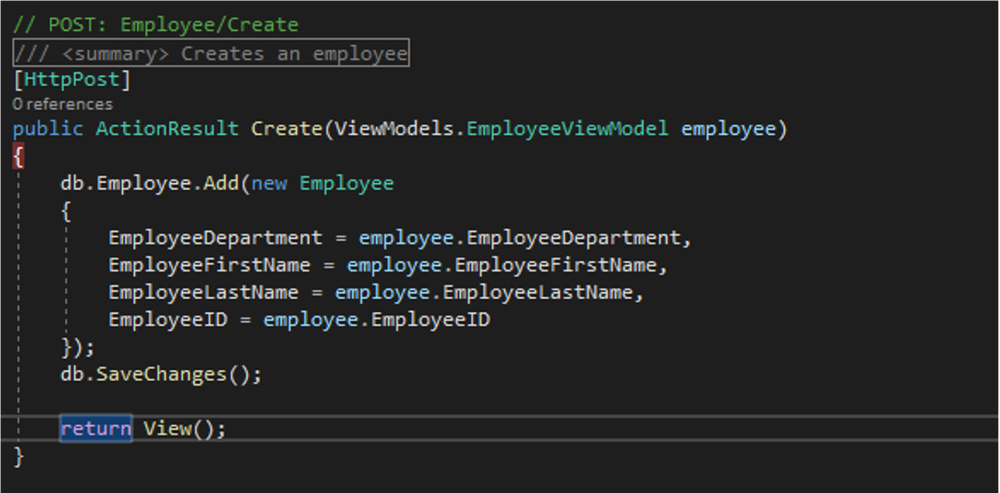

Now we can test the code we wrote by adding a new employee in the database. When we run the solution, the page for creating an employee should look like the one below.

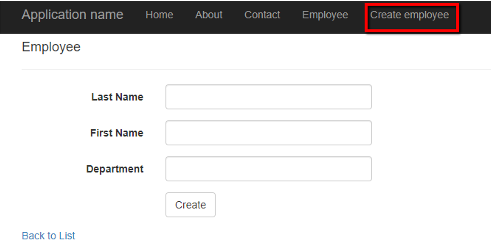

To test the form we created, we need to input data in text boxes, and then click on the **Create** button.


If we click **Back to List**, the application would then lead us to the display data section, where we would be able to see the full list of employees currently in the database.


#### Updating data with Entity Framework (Update)

To be able to update an existing entry in the database, we can add an **Edit** link to the existing employees' list.

To do so, we can use the Html helper `ActionLink`. The HTML helper **ActionLink** will generate an HTML link element but will also allow us to send an id of the clicked item to the controller, so we can quickly obtain the id of the item that needs to be changed in the database.

If we switch to Visual Studio and open the **Home > Index** view, we can configure the HTML helper as shown in the image below.

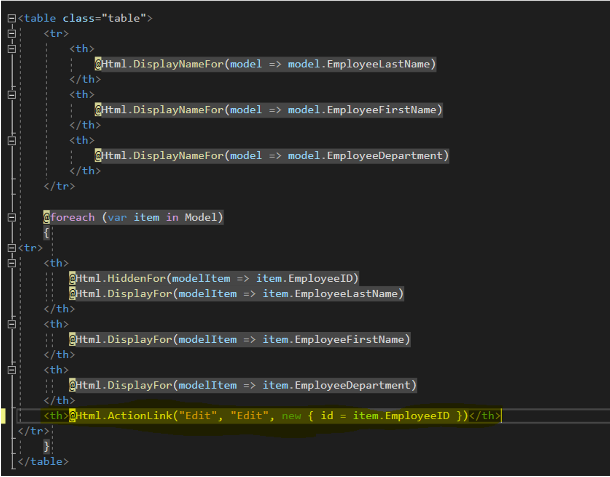

Since we can identify each employee by each employee's ID in the database, we set up the HTML helper to pass the `EmployeeID` to the controller.

The first string in the `ActionLink` helper is the title of the link generated, and the second string is the name of the action that will be called once the user clicks the link. 

The result of adding the action link to the `Index` view is displayed below.

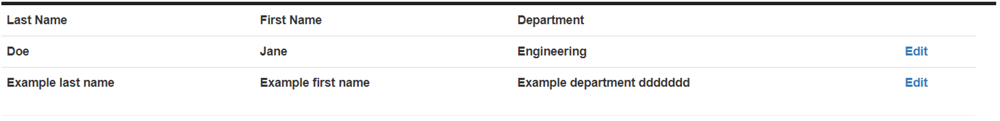

The **Edit** link is currently not working because we still haven't created an Edit action. We can do that now in the EmployeeController. The definition of the `Edit` action is as follows.

 - The method is decorated with an `HttpGet` attribute because `Html.ActionLink` renders an anchor tag that can only trigger a `GET` request to the server.
 - The parameter of the `Edit` action is the employee id that we expect to get on the server-side.
 - Before doing anything with the id, we first check whether the obtained id is null. In case the id is null, we send an error back that the request made to the `EmployeeController` is a bad request. 
 - In case the id is not null, we then try to obtain the employee that corresponds to that id.
 - We do not need to create a new View for this action since we can reuse the already existing **Create** view. 
 - We used the same view in the previous chapter, where we talked about adding items to the database. The difference between this implementation and the previous one is in the employee object that is being sent to the View. When adding items in the database, we are sending an empty object, where in this case, we are sending the employee object corresponding to the employee with `EmployeeID` equal to id.

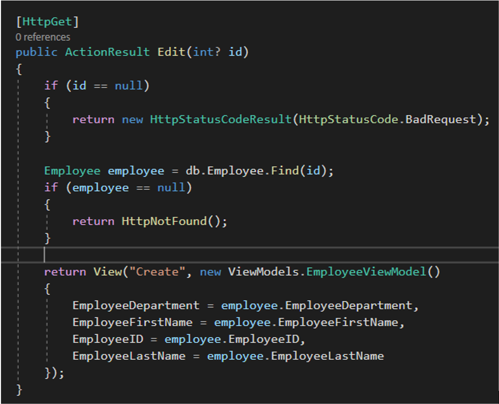

If we now start the application, we will click on the **Edit** link and edit the chosen employee.

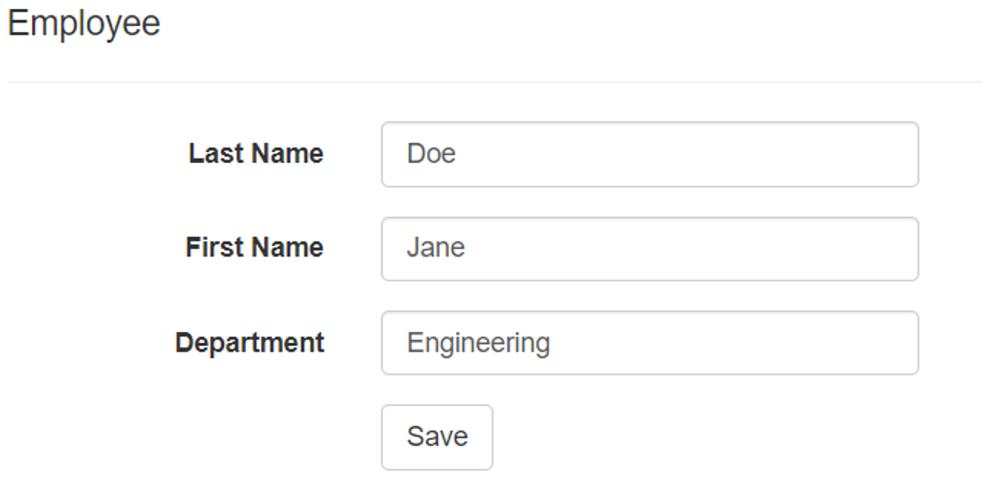

We can edit the employee's first, last name, and/or department, and after clicking on the **Save** button, the new data will be saved in the database.

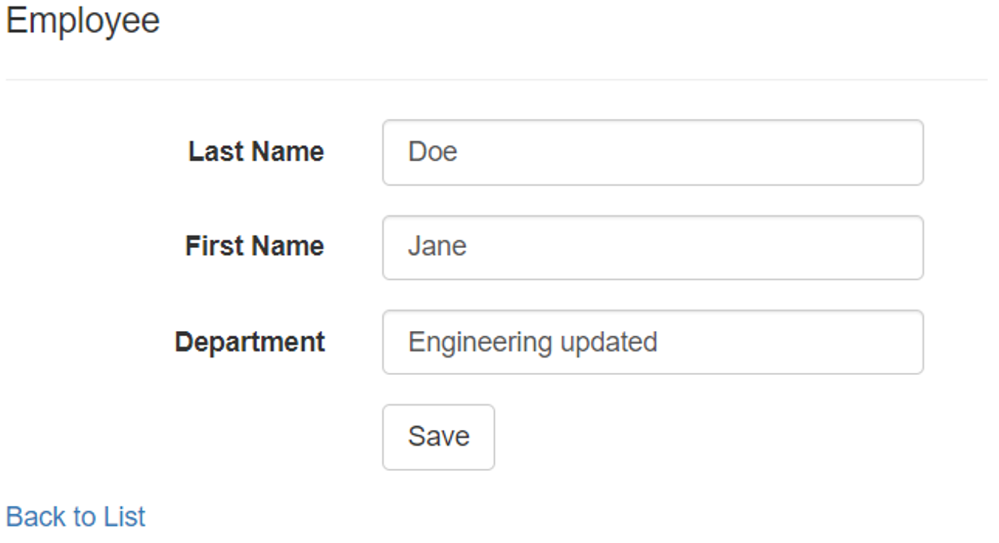

After clicking the **Save** button, we are navigated to the employee list, where we can see the edit action results.

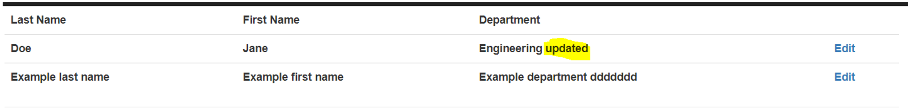

#### Deleting data with Entity Framework (Delete)

To implement the delete action, we will add the `Delete` action link right after the edit action link. We will do that in the **Index** view as with the **Edit** link.

The changed code is shown in the image below. 

As with the **Edit** link, we use the `Html.ActionLink` helper to create an anchor tag with the title **Delete** that will call the `Delete` action from the `EmployeeController` and will send the employee id that will identify the employee that we want to delete.

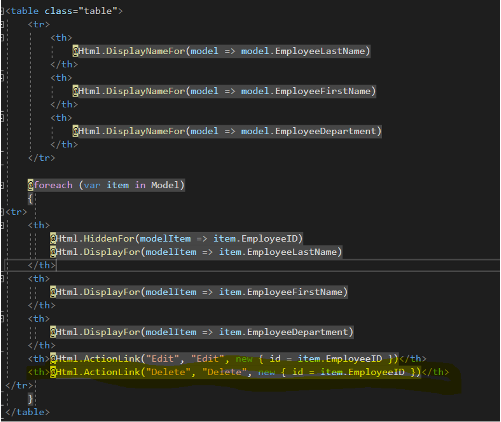

If we run the application, we can see that the user interface is already updated and that we can see the “Delete” link on the employee list. The **Delete** link does nothing since we still haven't created the `Delete` action in the `EmployeeController`.

Back in Visual Studio, let's create another action called `Delete` as follows.

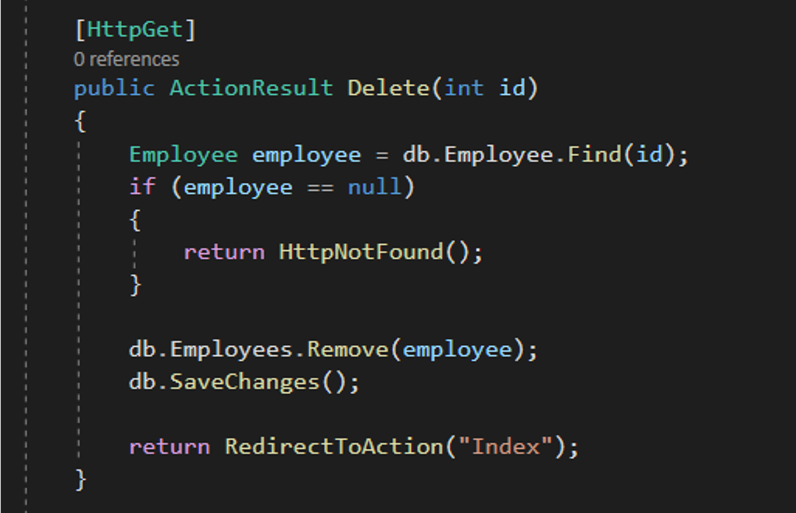

Again, the method is decorated with an `HttpGet` attribute because it is called from a simple anchor tag. In the same way, as with the `Edit` action, we send the id of the employee that we want to delete. If there isn't an employee in the database with that id, we throw an error if not found. In case an employee with that id exists in the database, we use the `db.Employees` set and call the Remove method on that set to remove the employee. We then save the db context changes and redirect the user to the Index view, which displays the employee list.

If we run the application and navigate to the employee list and then click on the **Delete** link for a particular employee, the employee will be removed from the database and, therefore, not displayed on the employee list anymore.

The current employee list before deleting looks as follows.

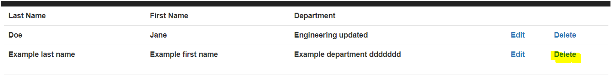

After deleting the second employee by clicking on the **Delete** link, the employee list will look as follows.

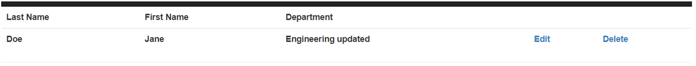
