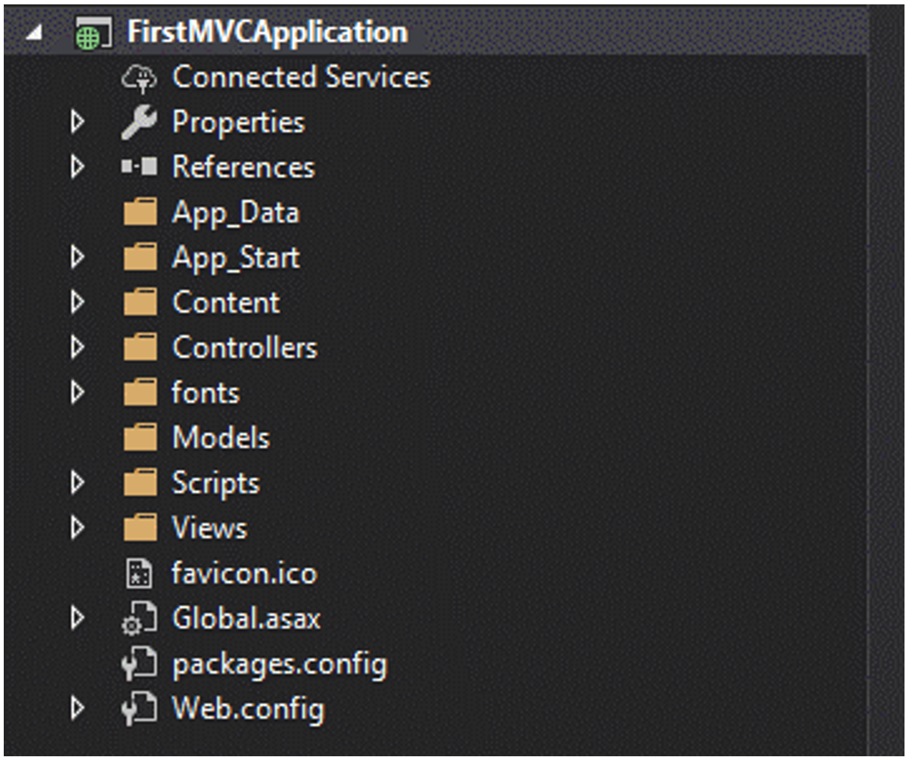
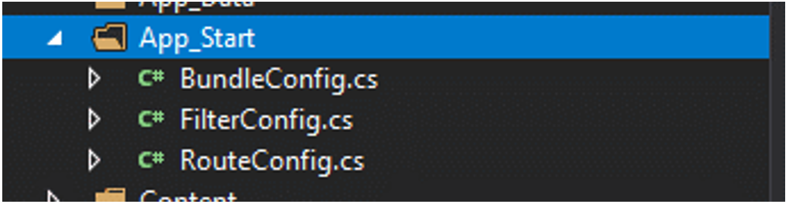
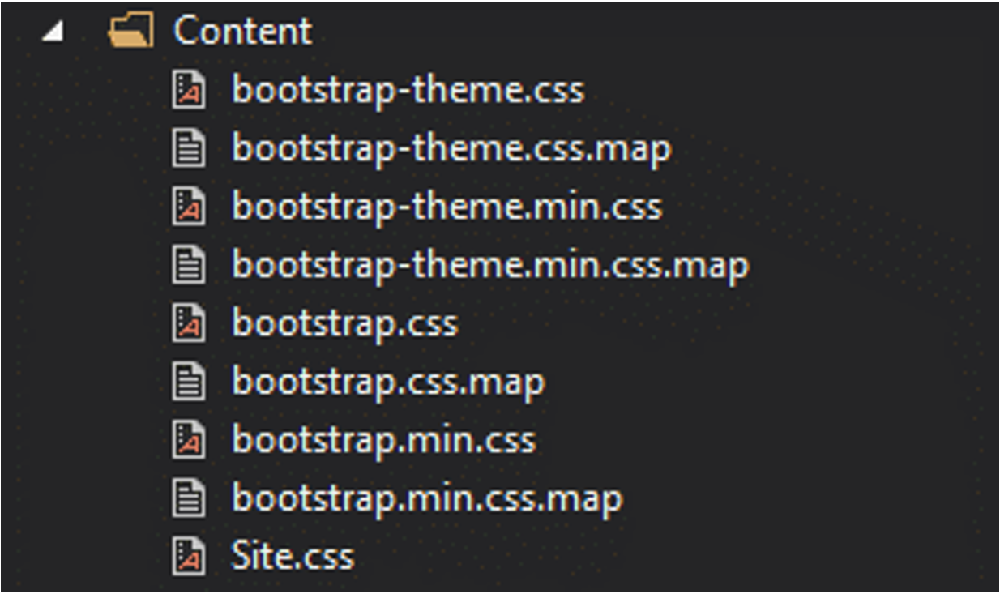
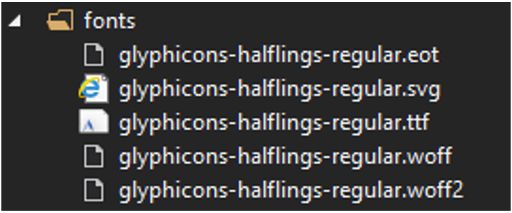
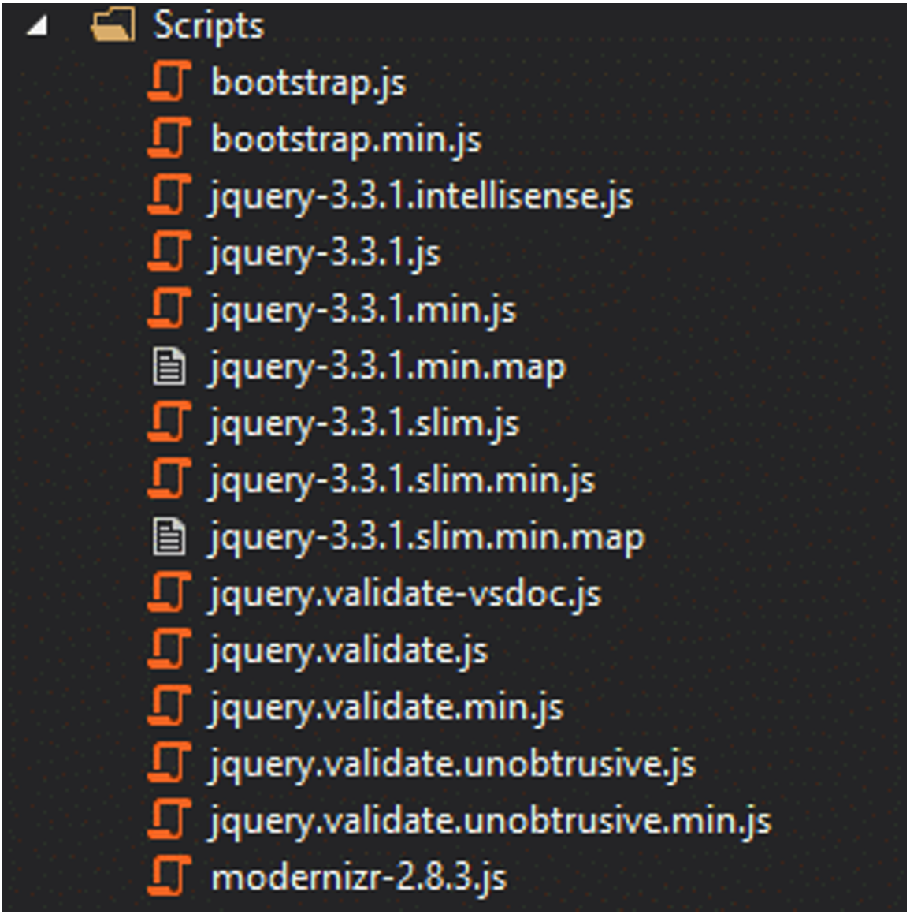
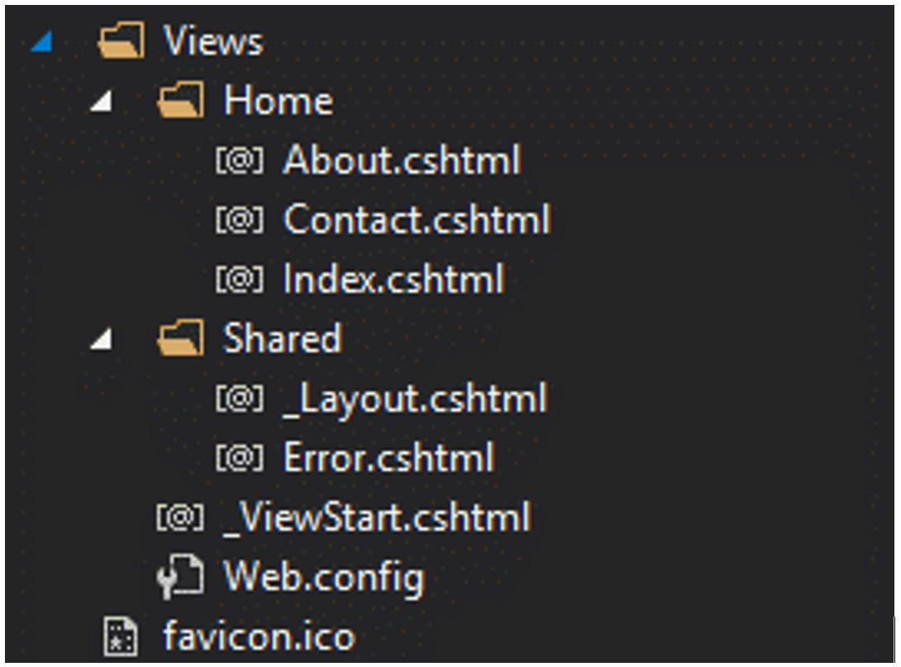

# MVC Web Application Folder Structure

In the following picture, we have the complete folder structure of an MVC web application. We will go through every folder and describe its contents to get a bit more familiarized with the structure of an MVC web app.

## App_Data

The **App_Data** folder contains the data files of an MVC web application, such as .mdf database files, XML files, LocalDB, or any other data file type.  In our case, this folder is empty since we still haven't defined any data sources that the application will use.

## App_Start

The **App_Start** folder contains so-called class files, which are executed when the MVC web application runs. In our case, the application has three class files:

 - **BundleConfig.cs:** this class file creates and registers CSS (cascading style sheets) and JS (JavaScript) bundles. By default, every MVC web app has several bundles, like jQuery, jQueryUI, jQuery validation, Modernizr...
 - **FilterConfig.cs:** this file is used to register global MVC filters. Some common filters are error filters and action filters.
 - **RouteConfig.cs:** this file is used to register various route patterns for our MVC web application. By default, one route is registered in every MVC application, and it is named Default Route.

Other files that possibly be present in this folder, depending on the MVC application are `AuthConfig.cs`, `WebApiConfig.cs`, etc.

## Content

The Content folder consists of an MVC web application's static files, like the CSS files, icons, and images. By default, every MVC web app includes the bootstrap.css files (both full and minified) and the Site.css.

## Controllers

The **Controller** folder contains class files for all of the controllers defined in the MVC web applications. Like we learned before, Controllers handle user's requests and return an appropriate response. Our MVC app has only one **Controller** defined, and that is the **HomeController**.

## Fonts

The **Fonts** folder contains custom fonts that our MVC web application might use.

## Models

The **Models** folder is where model class files are stored. Usually, a model class includes public application properties. Those public properties are used by the MVC web application to hold and manipulate application data.

In our case, the Model folder is empty, since we haven’t' defined any Models for our MVC web application.

## Scripts

The Scripts folder contains JavaScript files for the MVC application to use. Bootstrap, jQuery, and Modernizr scripts are included by default in every MVC web application.

## Views

The **Views** folder holds the HTML files of the MVC web application. Normally, a view file has the extension `.cshtml` and is where we write HTML and C# or VB.NET, depending on how the MVC project is set up.

The **Views** folder has a different folder for each controller. In our case, all of the .cshtml files that are going to be rendered by the **HomeController** will be in the **Views -> Home** folder. If our MVC application had another controller defined (e.g., `ArticleController`), then the `.cshtml` files for this controller would have been located in **Views -> Article**.

The Shared folder contains the views that are shared between multiple controllers.

Besides, each MVC project has the following files, which are used for configuration of the application:

 - **Global.asax:** This file allows us to write code that, which runs as a response to events on an application level. Events like this are:  application_start, application_error, session_start, session_end, etc.
 - **Packages.config:** This file acts as a history file to track all of the packages that have been installed in the MVC application. NuGet manages this, which is a part of Visual Studio. Through it, we can install different packages we might need during development. 
 - **Web.config:** This file contains configurations on an application level.
