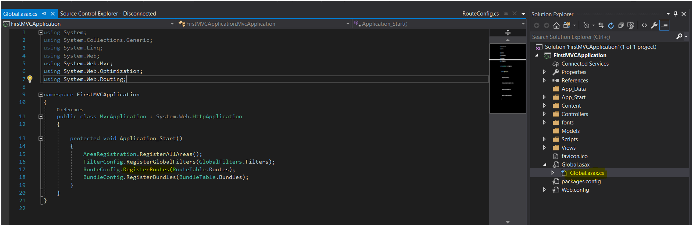
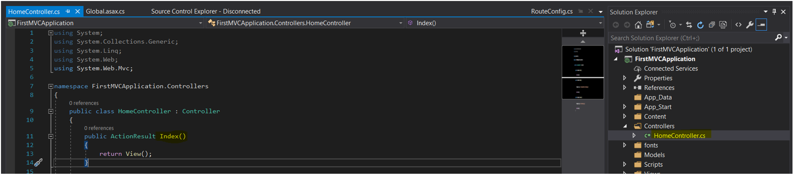
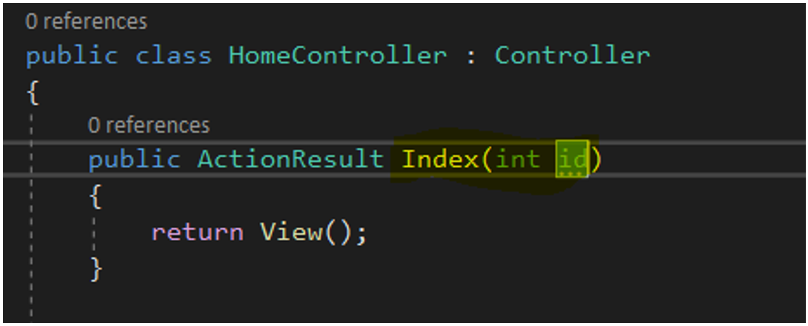
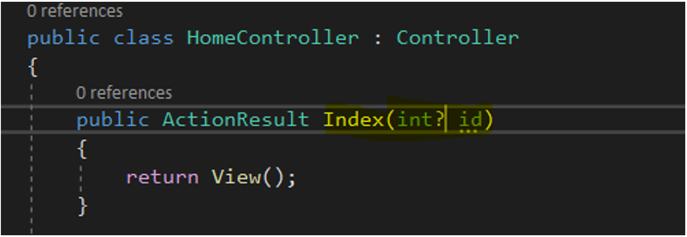
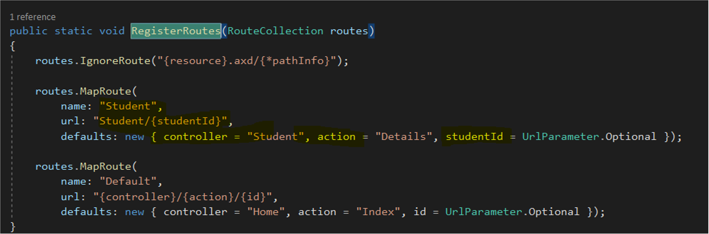
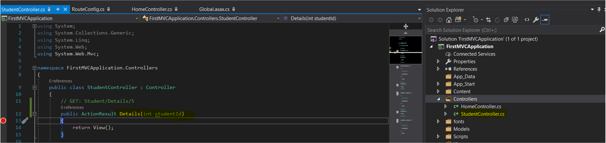
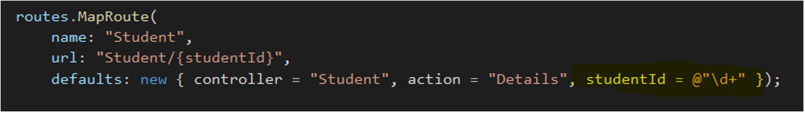

---
PermaID: 100003
Name: Routing in MVC Application
---

# Routing in MVC Application

Routing defines the process of handling an incoming request to the server. When a user interacts with the application by visiting or clicking different links, the user triggers requests on the server, which are then properly redirected and processed.

In a traditional ASP.NET Forms application, we usually deal with URLs similar to the following https://somewebsite.com/home.aspx. This means that every time a user types or clicks on the above-mentioned URL, the server will display a file called `home.aspx`, which consists of markup and code to render a response to the browser. So, in a traditional web application, every URL is mapped to a physical file on the server. 

This is not the case for MVC applications. In an MVC application, we do not have physical files to handle incoming requests. Instead, we create routes. Each route defines a URL pattern and a handler to execute when the incoming request matches the pattern.

There is a default route defined in the project we created earlier, so let's look at that route first and see what it means.

## Default Routes

Open the project **FirstMVCApplication** and navigate to the `Global.asax.cs` file. As mentioned earlier, the `Global.asax` file, allows us to write custom code in system-level events. Such a system event is **Application_Start** which executes when the application is starting. If we take a look at the handler for this event, we can see a method called `RegisterRoutes`. What this method does is that it defines and registers the route table that contains all available routes for the current application.

If we go to the definition of the method `RegisterRoutes`, we can see that there is a default route already defined.

The name parameter specifies the name of the route, the URL parameter specifies the URL pattern, and the defaults set the default values for the controller, action, and id, in case they are not supplied. 

Since the name parameter is self-explanatory, let's concentrate on the URL. This parameter defines the URL pattern to be matched. The parameter consists of segments, where each segment is separated with `/`. Each segment consists of placeholders defined with {}. We currently have three placeholders, and each placeholder contains information about a controller, action, and id, respectively.

To be able to get into more details regarding the URL patterns, let's go back to the URL of our application: https://somewebsite.com/. The route defined earlier, says that everything that will come after this URL will be considered a controller. Furthermore, everything after the controller will be considered as `action`, and finally everything after that an id. For example, if the user requests the following URL: https://somewebsite.com/home/index, the application will execute the `Index` action in the **Home** controller.

To better understand MVC's routing mechanism, we can take a look at the table below and see how MVC handles different URLs.

| URL                          | Description                                                             |
| :----------------------------| :-----------------------------------------------------------------------|
| https://somewebsite.com/     | Since no controller, action, or ID is provided the default values for controller and action will be used.  |
| https://somewebsite.com/home | The name of the controller that will be used is Home, the name of the action will be index (from the defaults since it is not provided). |
| https://somewebsite.com/home/index | The name of the controller that will be used is Home, and the action is Index. |
| https://somewebsite.com/home/index/1 | The name of the controller that will be used is Home, the action Index and the parameter id will be 1. |

Defining a route is not enough. There has to be a properly defined action method and a controller in your project, so the incoming request can be properly processed.

The URLs in the table will be properly handled by the MVC application if a Home controller exists and an action Index present in the project. Let's see if that holds for our **FirstMVCApplication** project.

Notice that the Index method exposed through the Home controller does not accept a parameter id. 

If we expect to have incoming requests with a parameter id, we need to change this method as follows.

Note that, the `Index` action expects an integer value. This means that making a request which contains something other than an integer value will cause an error. An error will also be caused by making a request that does not contain a value for the id parameter at all.

So, if you want to make the parameter `id` optional, you can define the method as follows.

## Custom Routes

In most cases, the default route defined in the starter project will be enough. Of course, there can also be some cases when you would need to create custom routes to handle specific requests. New routes are always added in the route table the MapRoute method. 

Let's create a new route. We will create the route in the `RegisterRoutes` method.

The order of the routes you add to the routing table is very important. If the Default route is defined first, then it will always get called. Therefore we define the custom route before the Default route.

The name of the route will be Student and will handle URLs that look like this: https://somewebsite.com/student/studentId, where studentId can be any of any type (string, integer, etc.). 

URLs that will match the above-defined URL pattern are the following.

https://somewebsite.com/student/ana
https://somewebsite.com/student/1
https://somewebsite.com/student/ana123
https://somewebsite.com/student/{123-456-789} 

The action method **Details** in the `StudentController` that will handle these requests are defined as follows.

Unfortunately, this method will only work for URLs that have integer values for the parameter studentId (the 2nd URL in the URLs given above). In every other case, it will fail with an error "The parameters dictionary contains a null entry for a parameter 'studentId' of non-nullable type 'System.Int32'". It would be nice to exclude URLs that do not contain a proper integer value for the parameter `studentId`.

To restrict the URLs that match a specific route, you can use something called route constraints.
 
## Route Constraints

To explain how you can restrict incoming requests that match a particular route, we will change the definition of our previous route. Let's say that we only want to process URLs that have a studentId parameter of type integer. To do so, you can use a regular expression in the route definition to specify a route constraint.

Requests that have a different type of value for the parameter studentId, will be processed by another route, if available or if there are no matching routes, a "The resource could not be found" error will be returned.
