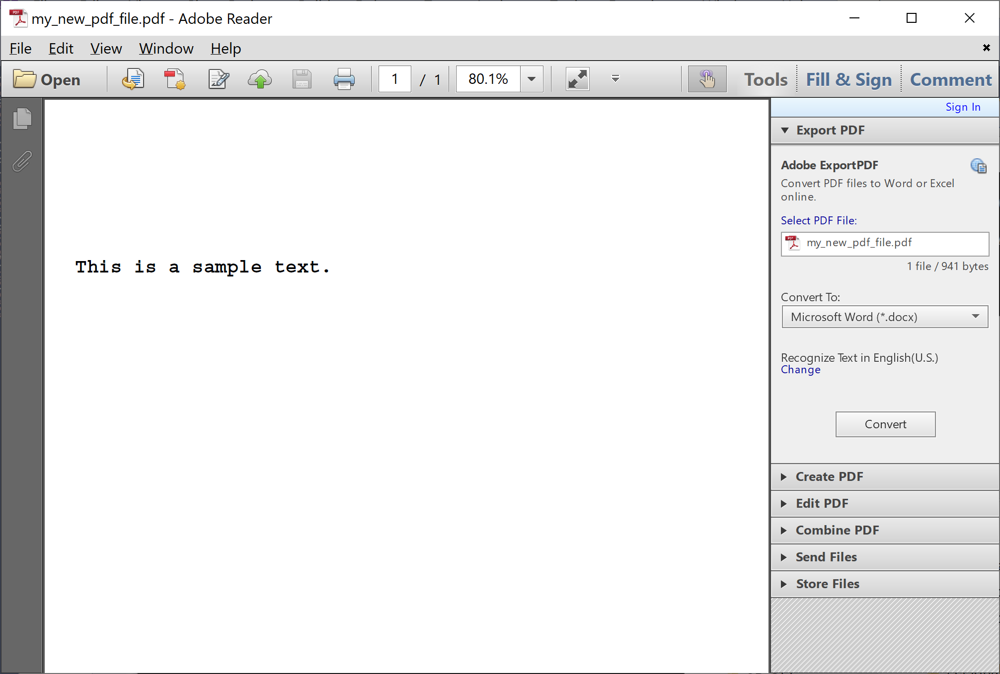

# Create PDF File

When you are working with PDF files, you will not be only reading data from a PDF file, but sometimes, you will also need to write data to the PDF file. **PdfPig** simplifies and allows you to write data to the PDF file very easily. 

The following example first creates and writes some text to that PDF file using the `PdfDocumentBuilder` class.

```csharp
public static void Example1()
{
    PdfDocumentBuilder builder = new PdfDocumentBuilder();

    PdfPageBuilder page = builder.AddPage(PageSize.A4);

    PdfDocumentBuilder.AddedFont font = builder.AddStandard14Font(Standard14Font.CourierBold);

    page.AddText("This is a sample text.", 16, new PdfPoint(25, 700), font);

    byte[] documentBytes = builder.Build();

    File.WriteAllBytes(@"D:\my_new_pdf_file.pdf", documentBytes);
}
```

As you can see that page is added by calling the `AddPage` method. It also allows you to set the page size, font, and font size.

 - You must register the font with the `PdfDocumentBuilder` before writing on a page. 
 - Currently, it only supports Standard 14 fonts and TrueType fonts (`.ttf`).

When you execute the above example, you will see that the PDF file is created that contains the following data.



The output is a 1 page PDF document with the text "This is a sample text." in **CourierBold**.

