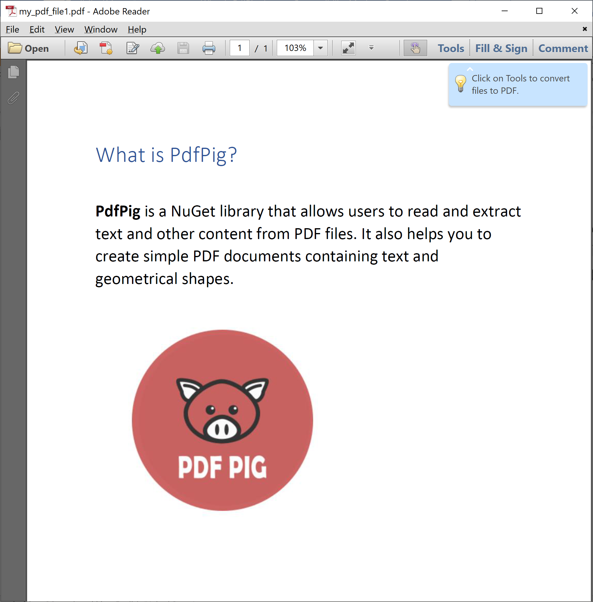

# Extract Content

The PDF is a document format that is focused on presentation. PDFs tend to lose semantic meaning for their content including ordering of text, separation of text sections, etc.

**PdfPig** provides access to the letters, words, and images on each page in a PDF.

Let's consider the following simple PDF that contains the following text data and an image.



The following example shows how to open a PDF document and read the letters, words, and images.

```csharp
public static void Example1()
{
    using (PdfDocument document = PdfDocument.Open(@"D:\my_pdf_file1.pdf"))
    {
        foreach (Page page in document.GetPages())
        {
            IReadOnlyList<Letter> letters = page.Letters;
            string example = string.Join(string.Empty, letters.Select(x => x.Value));

            IEnumerable<Word> words = page.GetWords();

            IEnumerable<IPdfImage> images = page.GetImages();

            Console.WriteLine("Total Letters: {0}", letters.Count);
            Console.WriteLine("Total Words: {0}", words.Count());
            Console.WriteLine("Total Images: {0}", images.Count());
        }
    }
}
```

When you execute the above example, you will see the following data.

```csharp
Total Letters: 211
Total Words: 36
Total Images: 1
```
