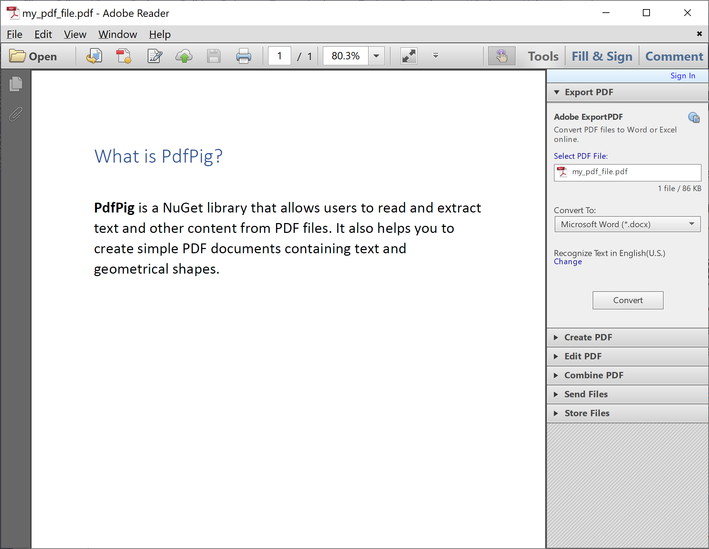

# Read PDF File

In the .NET environment, there are various ways of reading a PDF file, but **PdfPig** makes it easier to read data from the PDF file as you need.

Let's consider the following simple PDF file called **my_pdf_file.pdf** which contains the following text data.



**PdfPig** provides a `PdfDocument` class that helps you to read all the data from PDF files directly.

The following example reads all the text from the PDF file.

```csharp
public static void Example1()
{
    using (PdfDocument document = PdfDocument.Open(@"D:\my_pdf_file.pdf"))
    {
        Page page = document.GetPage(1);

        string text = page.Text;

        Console.WriteLine(text);
    }
}
```

Let's execute the above example and you will see the following output.

```csharp
What is PdfPig?  PdfPig is a NuGet library that allows users to read and extract text and other content from PDF files. It also helps you to create simple PDF documents containing text and geometrical shapes.
``` 

**PdfPig** also allows you to open and read the encrypted document bypassing `ParsingOptions` with the `Password` property defined when calling the `Open` method.

```csharp
public static void Example2()
{
    using (PdfDocument document = PdfDocument.Open(@"D:\my_pdf_file.pdf", new ParsingOptions { Password = "12345678" }))
    {
        Page page = document.GetPage(1);

        string text = page.Text;

        Console.WriteLine(text);
    }
}
```
