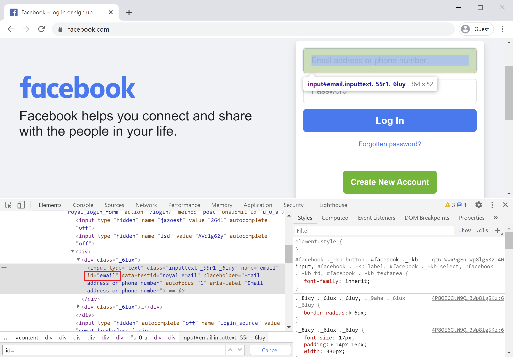
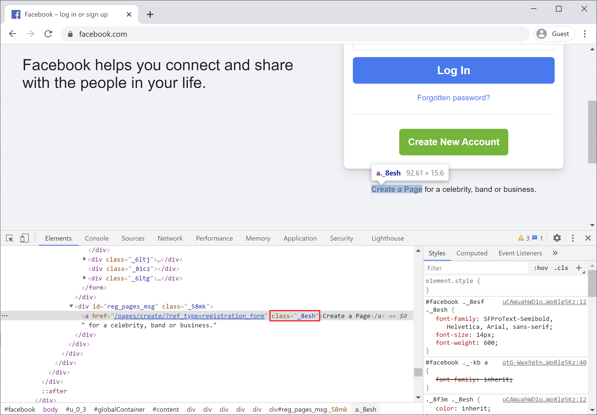

# Choosing Best Locators

Locators in Selenium enables testers to select an HTML DOM element to act on. If you are familiar with all of the different locators, you also need to understand which ones are the best, because you shouldn't use all of them. 

Sometimes you may want to use one, but there are best practices for using these location strategies;

 - Make sure that your code is as stable as possible 
 - Whenever there are changes in your application, you don't have to update your locators because that's one of the biggest problems in selenium web driver or any UI automation.
 - you will spend a lot of time identifying locators and making sure that they are unique enough so that when your application changes you don't have to update those locators.
 - You get a locator for every single element that you want to interact with.

## Locators you should use

### Id

So the most important locator is `id`, it is the best locator to use whenever you want to deal with an element because an `id` will always be unique.



That's why if you look for `id="email"` on the entire page, you will see that it is only a single match and it will always refer to this element. Use `id` whenever possible.

Some developers don't put `id` on their HTML elements, so as an automation engineer you ask the developers to add an `id` to their HTML elements. 

### Class

If you still don't have an `id` in your desired element you might want to use another locator `class` although it is not as good as an `id`.

Let's take a look.



Here you can see class works and class identifies a single element. However, there are cases where a class may not be unique so make sure you check your application to see if the class identifies only a single element.

### Name 

You could also use a name if it is supplied for an element, but it is not very common. 


You can see that it also contains an `id`, but you can use the name as well and make sure the name is unique to your application.

## Locators you should not use

### Absolute XPath
One of the worst things is using absolute XPath, which you can easily get by right-clicking on the element and select **Copy > Copy full XPath**


It will copy the xpath to clip-board and when you paste it, you will see something like this:

```csharp
/html/body/div[1]/div[2]/div[1]/div/div/div/div[2]/div/div[1]/form/div[1]/div[1]/input
```

Now, this XPath is the worse because it is absolute, if anything here changes because as you can see just tag names to directly get to the address then you are going to be messed and you are no longer locating the correct element.

There is no excuse for ever doing that and as soon as we learn XPath in the next article you are going to understand how you can use this kind of XPath.

 - Make sure it is unique enough so that it's not absolute but relative.
 - And at least it is stable enough so that adding new elements will not throw off your XPath.

### Tag 

You probably already understand that you should not use tag names to identify elements because you will get multiples elements if you want to try to use tag directly.

