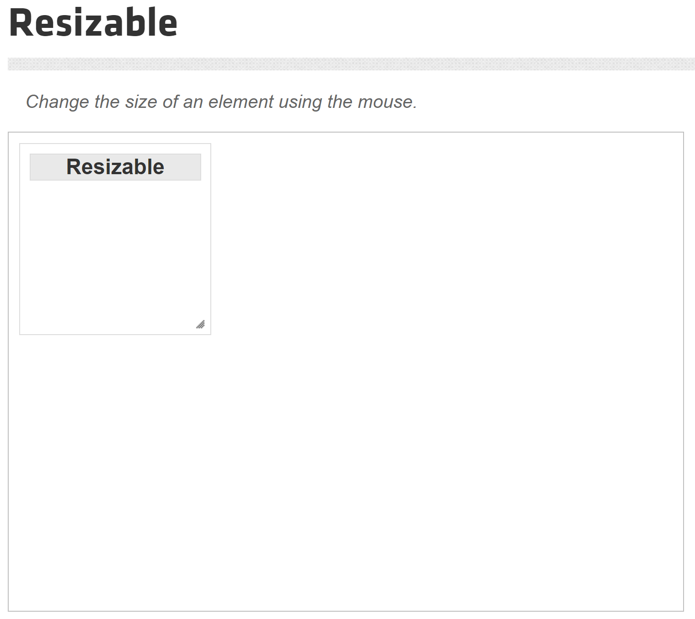
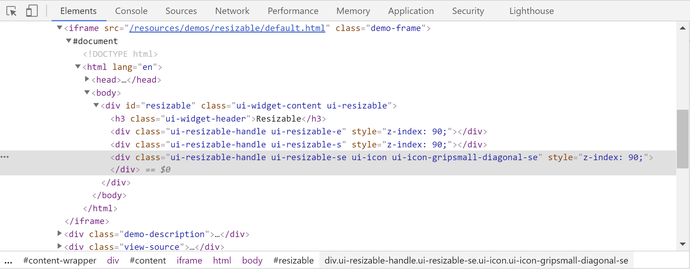
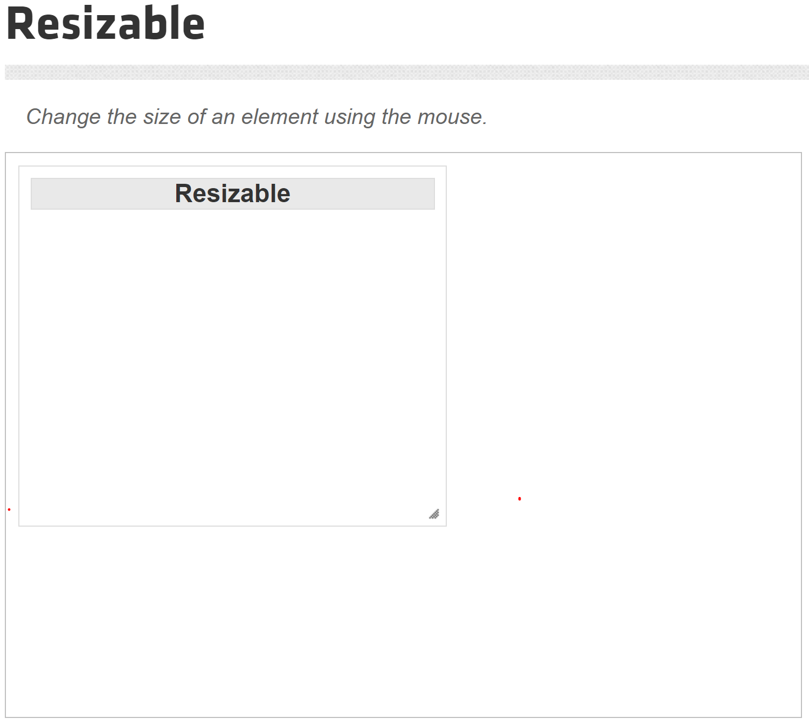

# Resizing an Element

In some web applications, you will see a resizing functionality where you can resize an element by either increasing or decreasing its width and height. To demonstrate the resizing functionality, we will be using the example mentioned [here](https://jqueryui.com/resizable/). 



It is a simple jQuery UI that allows you to click and hold the mouse left button on the handle at the right-bottom of the element to resize by moving in a horizontal and vertical direction.

To automate resizing functionality, you can combine the `ClickAndHold()` and `MoveByOffset()` methods of Actions class to achieve that.

```csharp
public Actions ClickAndHold(IWebElement onElement);
public Actions MoveByOffset(int offsetX, int offsetY);
```

The `ClickAndHold()` method needs the current web element as a parameter. 

 - **onElement:** The element on which to click and hold.

The `MoveByOffset()` method needs the horizontal and vertical offsets as parameters.

 - **offsetX:** The horizontal offset to which to move the mouse.
 - **offsetY:** The vertical offset to which to move the mouse.

Let's open the page source and locate the resizable element.



You can see only the class attribute, so we will identify this element using XPath. The following example will resize the web element by moving 150px in the horizontal direction and 100px in the vertical direction.

```csharp
IWebDriver driver = new ChromeDriver();
driver.Manage().Window.Maximize();

Actions action = new Actions(driver);
var wait = new WebDriverWait(driver, TimeSpan.FromSeconds(30));
driver.Navigate().GoToUrl("https://jqueryui.com/resizable/");
wait.Until(ExpectedConditions.FrameToBeAvailableAndSwitchToIt(By.ClassName("demo-frame")));

var element = driver.FindElement(By.XPath("//*[@class='ui-resizable-handle ui-resizable-se ui-icon ui-icon-gripsmall-diagonal-se']"));
action.ClickAndHold(element).MoveByOffset(150, 100).Perform();            
```

So it will perform the resizing operation and the element has been resized.

