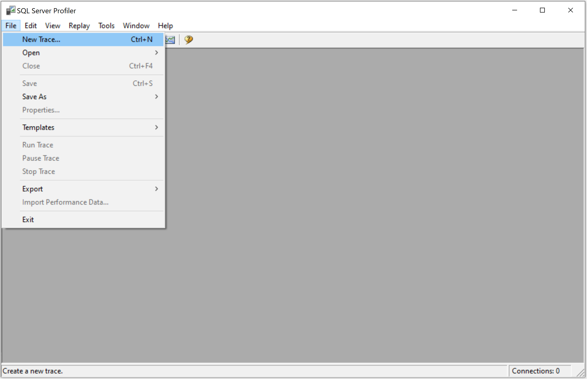
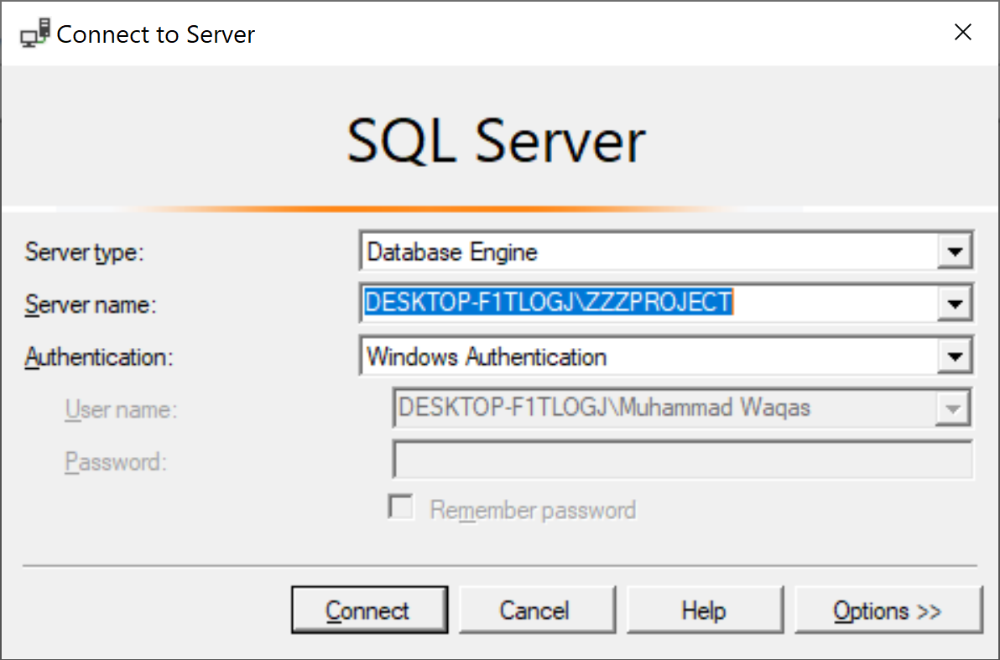
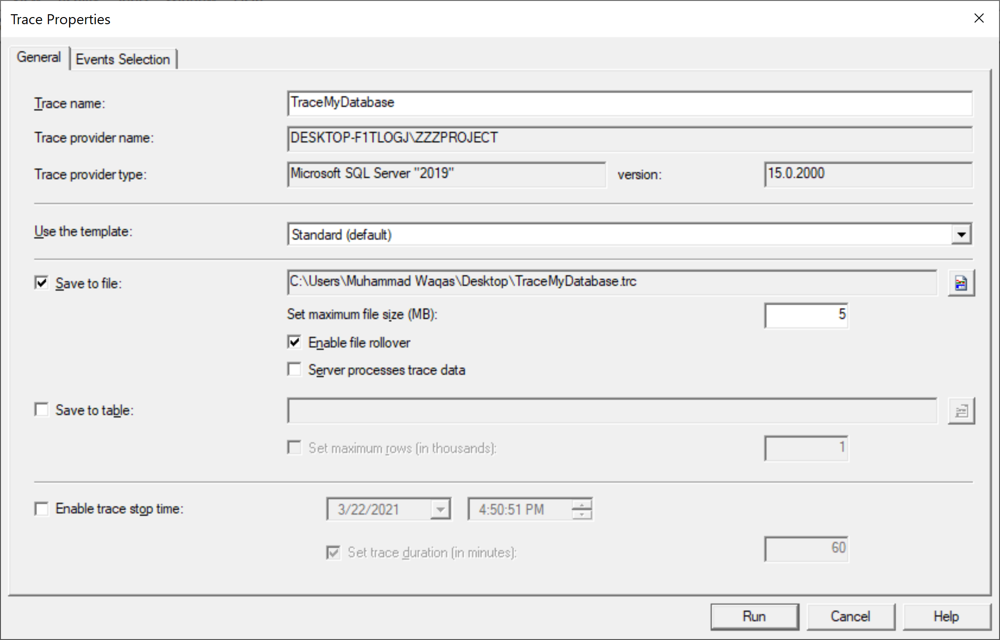
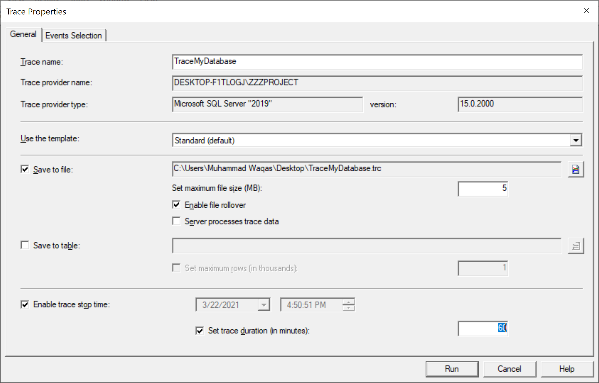

# Create a Trace

Tracing events in SQL Server is key to understanding and optimizing database workloads. To create a trace, go to the **File > New Trace** menu.

 New Trace">

It will open the **Connect to Server** dialog.

Click on the **Connect** button to connect to an SQL Server instance and then open the **Trace Properties** dialog.

In the **Trace name** field, type a name for the trace, and in the **Use the template** list, select a trace template on which to base the trace.

To save the trace results, we have two options.

### Save to File

You can choose the **Save to file** option to capture the trace to a file. 

 - You can specify a value for **Set maximum file size (MB)**, and the default value is 5 megabytes (MB).
 - Select **Enable file rollover** to automatically create new files when the maximum file size is reached. 
 - You can also optionally select **Server processes trace data**, which causes the service running the trace to process trace data instead of the client application. 
 - When the server processes trace data, no events are skipped even under stress conditions, but server performance may be affected.

### Save to Table

You can choose **Save to table** option to capture the trace to a database table. You can also **Set maximum rows** and specify a value.

When you do not save the trace results to a file or table, you can view the trace while SQL Server Profiler is open. 

 - You will lose the trace results after you stop the trace and close SQL Server Profiler. 
 - To avoid losing the trace results in this way, click Save on the File menu to save the results before you close SQL Server Profiler.

You can also select the **Enable trace stop time** check box and specify a stop date and time.

Click RUN to start the trace,the SQL Profiler window will open, and the trace is now running.

As you can see, tracing started. Let's open a query editor and execute a simple query.

When you execute this simple query, go to the SQL Server Profiler, and you will see the query logs.

