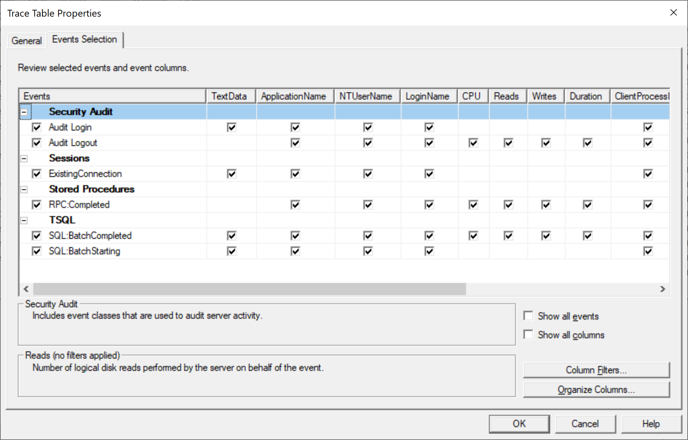
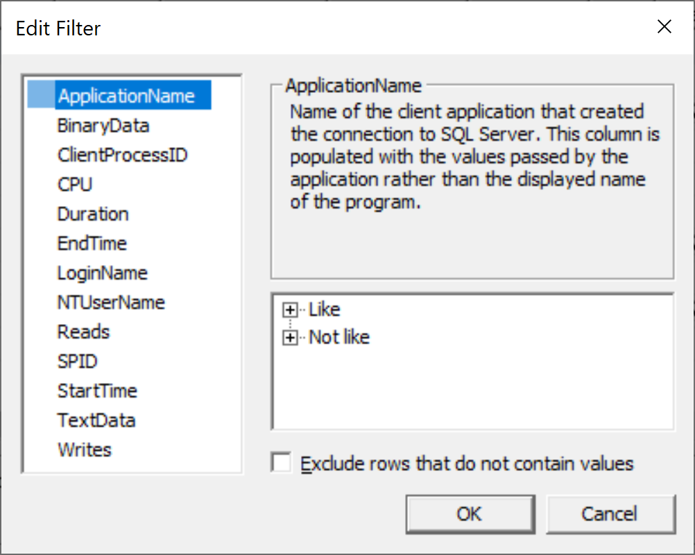
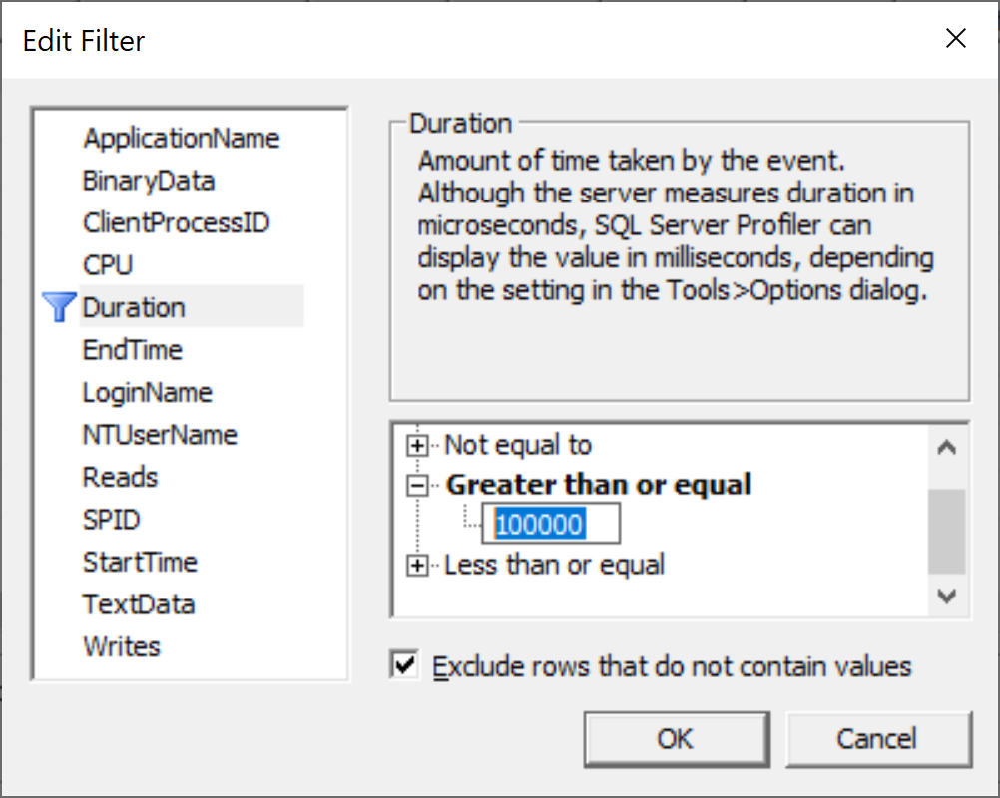
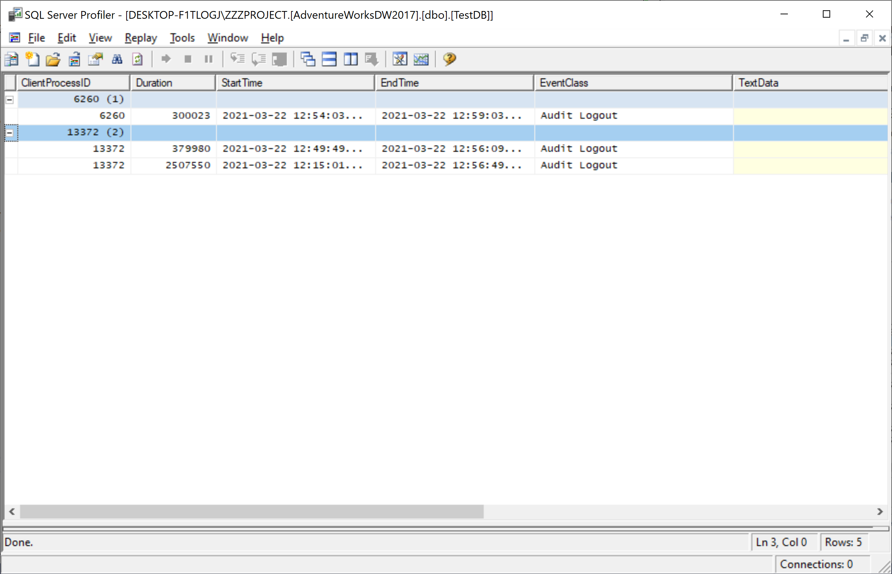

# Filter Events

You can define filters on data columns for SQL Server Profiler trace events so that information is captured only for those events that you are interested in. 

 - Filters limit the events collected in a trace and minimizes the overhead that is incurred during tracing. 
 - If a filter is not set, all events of the selected event classes are returned in the trace output. 
 - It is not mandatory to set a filter for a trace. 

You add filters to trace definitions by using the **Events Selection** tab of the **Trace Properties** dialog.

 - The **Events Selection** tab contains a grid control. 
 - The grid control is a table that contains each of the traceable event classes. 
 - The table contains one row for each event class. The event classes may differ slightly, depending on the type and version of the server to which you are connected. 
 - The event classes are identified in the **Events** column of the grid and are grouped by event category. 
 - The remaining columns list the data columns that can be returned for each event class.

Click on the **Column Filters** button, and you will see **Edit Filter**.

The **Edit Filter** dialog contains a list of comparison operators that you can use to filter events in a trace.

To apply a filter, click the **Duration** column heading, expand **Greater than or Less than**, and then enter a `100000` value in the field that appears beneath the comparison operator. 

You can also check the **Exclude rows that do not contain values** checkbox and then click the **OK** button.

Now you will see only those rows which have **Duration** greater than 100000 ms.
