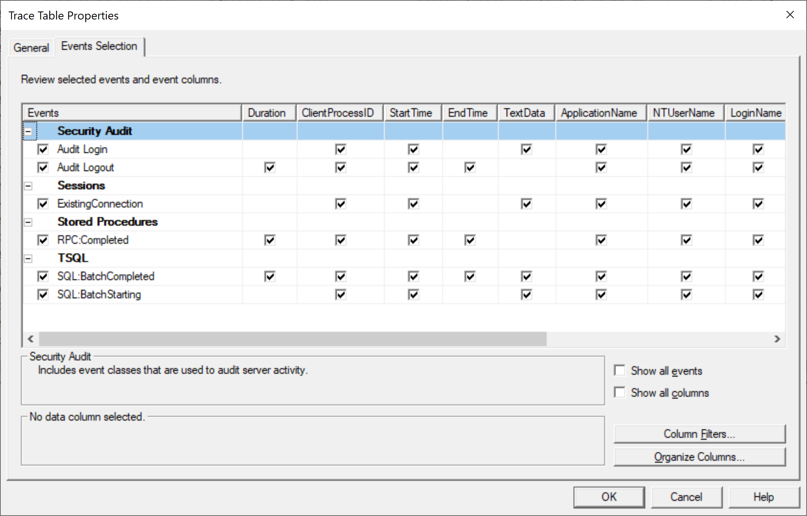
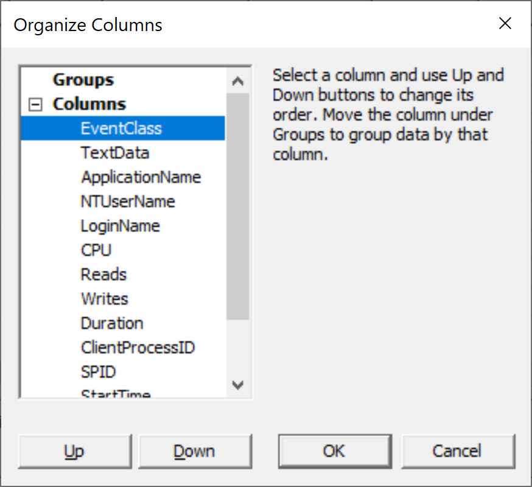
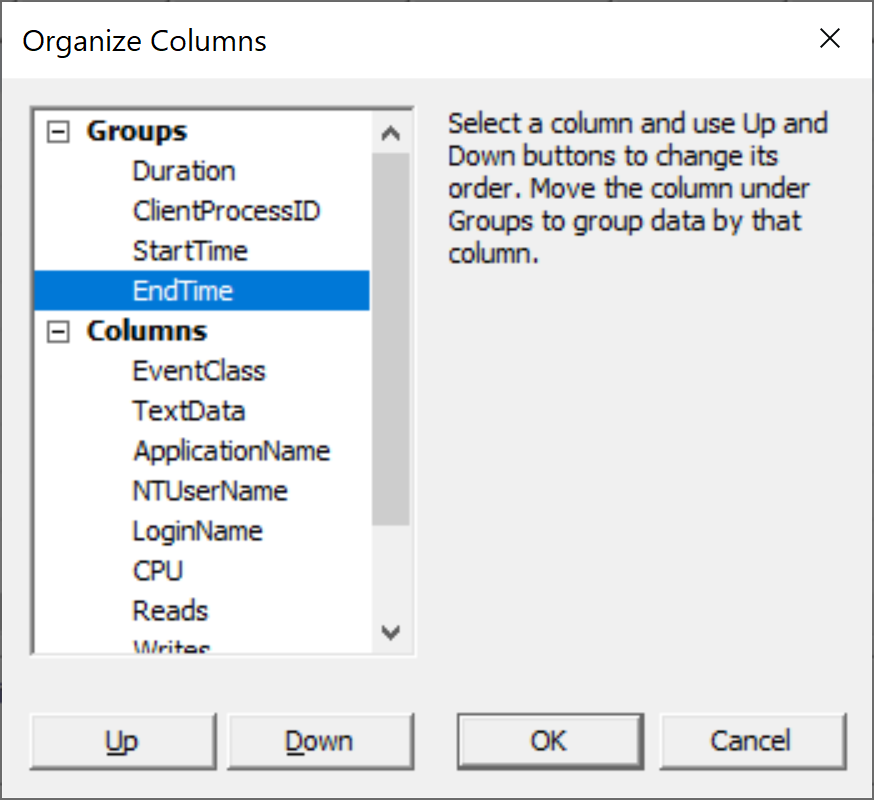
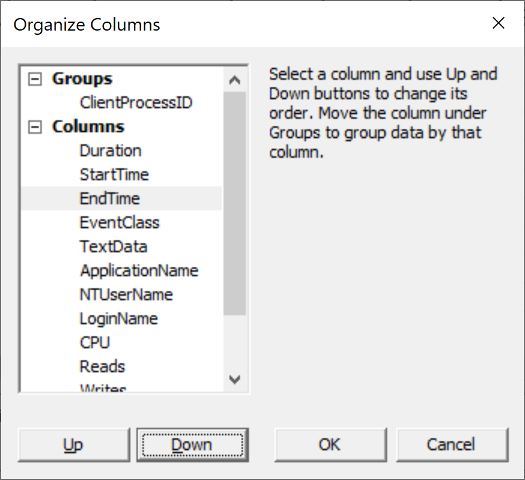
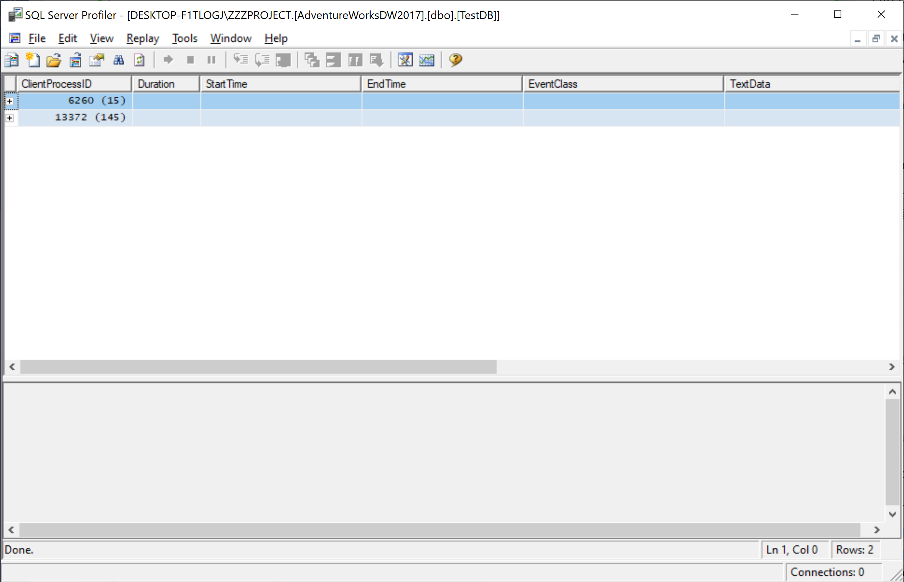
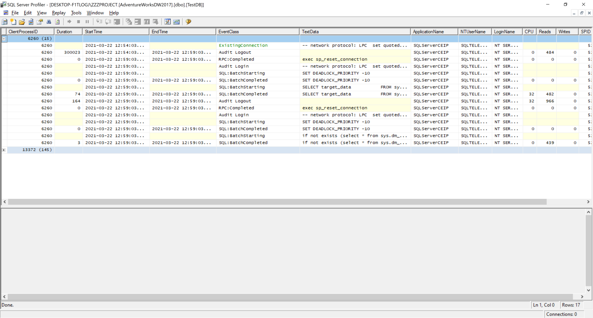
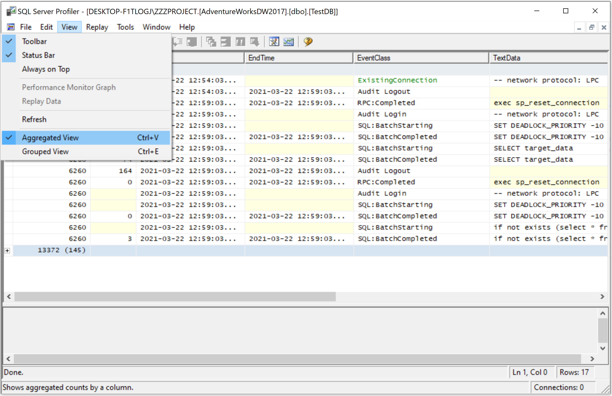

# Organize Columns

You can group data columns in a trace by selecting Organize Columns in the trace table or Trace File Properties dialog box, or when you define a trace. Grouping the data columns enables you to better analyze SQL Server Profiler trace output.

Organize Columns enables you to either group the trace events, or group and aggregate them by the data columns you select.

 - You can choose multiple data columns for grouping to only group trace events. 
 - When you choose multiple data columns for grouping, the trace window displays events grouped by the values in the data columns you selected for grouping. 

## To Group Data Columns

Open an existing trace file or table and then go to the **File** menu and select **Properties**.

On the **Events Selection** tab, click **Organize Columns** button.

In the **Organize Columns** dialog, select the columns you want to display in a group, and click **Up** to move them under Groups.

After you have moved all the columns you want to move under **Groups**, you can use the **Up** and **Down** buttons to rearrange their order.

When you move the data column names into the **Groups** list means that the displayed trace is first organized by the values in the top-most data column appearing in the **Groups** list, then by the second data column in the **Groups** list, and so on.

Click **OK** in the **Organize Columns** dialog, and then click **OK** in the **Trace Table Properties** dialog.

You can see that the data columns are reorganized in the displayed trace. 

 - The data column that you moved to the top-most position in the **Groups** list is located first in the trace display when you are reading the grid from left to right.
 - The rows in the trace are organized in ascending order by the values contained in the data columns that you included in the Groups list. 
 - The columns chosen for grouping remain fixed in the display, but you can scroll right or left to view the other columns.

## To Group and Aggregate Data Columns

Open an existing trace file or table and then go to the **File** menu and select **Properties**.

On the **Events Selection** tab, click **Organize Columns** button.

In the **Organize Columns** dialog, select one column by which you want to group and aggregate the displayed trace events. 

 - Click **Up** to move the column name under **Groups**. 
 - You can use the **Up** and **Down** buttons to rearrange the remaining columns under **Columns** if needed.

Let's move the **ClientProcessID** under the groups and rearrange all others under columns as shown below.

Click **OK** in the **Organize Columns** dialog, and then click **OK** in the **Trace Table Properties** dialog.

You can see that the data columns are reorganized in the displayed trace. All other data column events are aggregated under the data column that you moved into the **Groups** list. 

Click the plus sign (`+`) to the left of the event in the data column you chose for aggregation to expand it and view all events of that type. 

 
The column chosen for aggregation remains fixed in the display, but you can scroll right or left to view the other columns.

To revert to a normal view of the trace data, click **Aggregated View** or **Grouped View** on the **View** menu, which cancels the selection. 

If you want to revert to the aggregated view, click **Aggregated View** on the **View** menu again to reselect it.