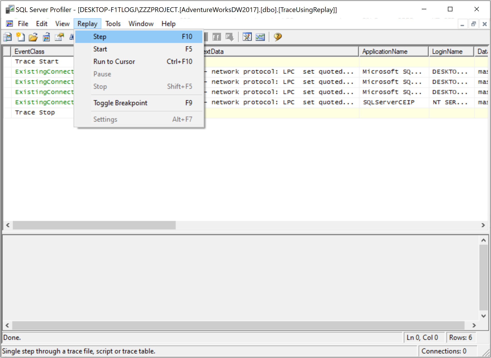
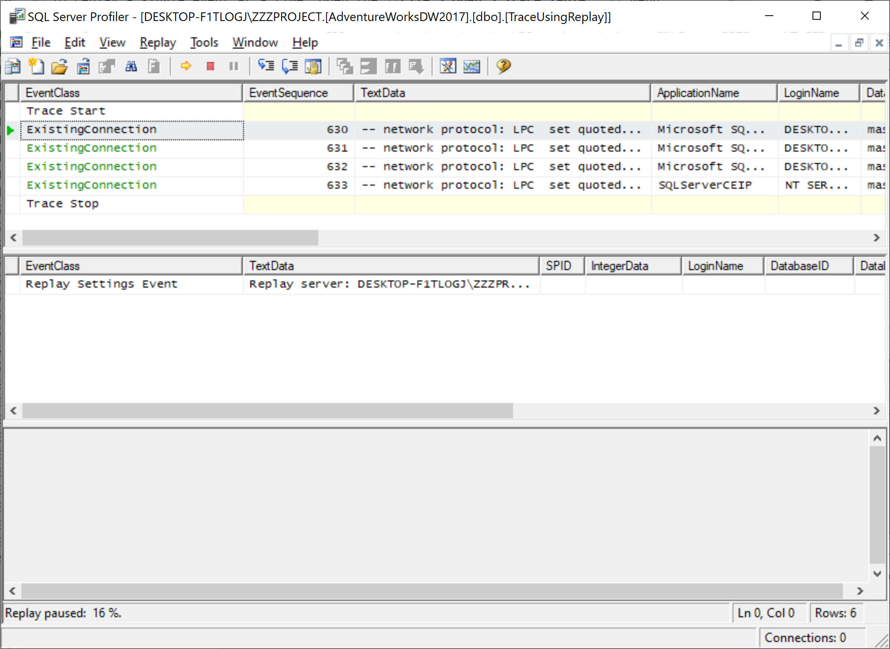
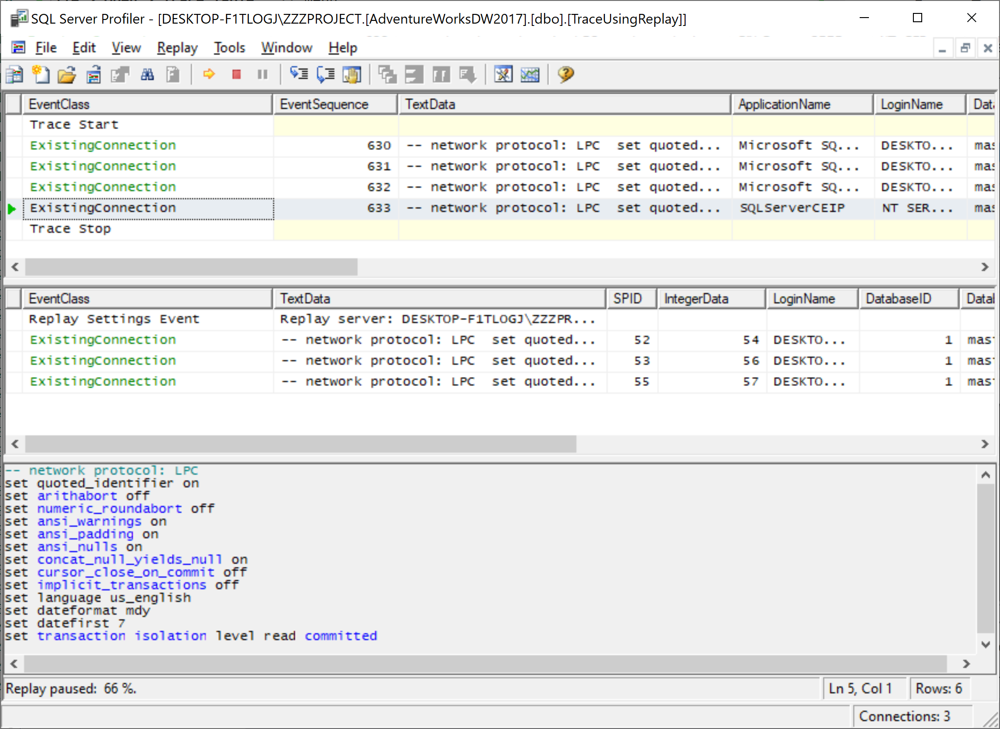

# Replay a Single Event at a Time

To replay a single event at a time, open the **File > Open > Trace Table...** menu.

 Open > Trace Table...">

It will open the **Connect to Server** dialog.

Click on the **Connect** button to connect to an instance of SQL Server.

You will see a **Destination Table** dialog. Select the destination table and click the **OK** button.

Make sure that the trace table you open contains the event classes necessary for replay.

On the **Replay** menu, select **Step**, and connect to the server instance where you want to replay the trace.

 Step">

Connect to an instance of SQL Server and then in the **Replay Configuration** dialog, specify **Replay server**.

You can select one of the following destinations in which to save the replay:

 - **Save to file**, which specifies a file in which to save the replay.
 - **Save to table**, which specifies a database table in which to save the replay.

Select **Save to file** and option and specify the file, verify the settings, and then click **OK** button. 

To replay subsequent events, on the **Replay** menu, click **Step**, or press **F10**. Repeat clicking **Step** or pressing **F10** for each event.

