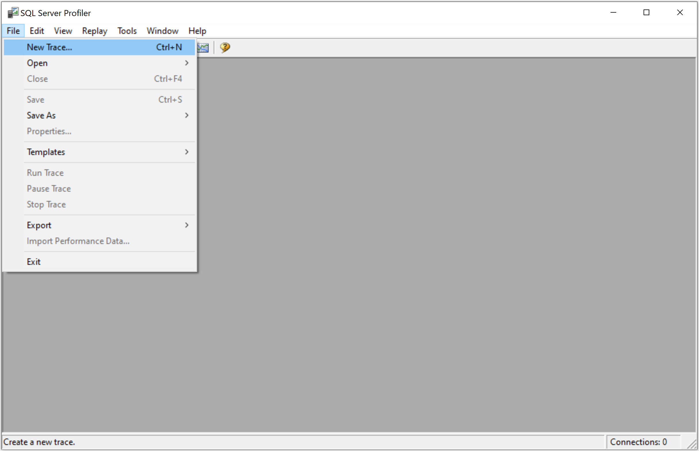
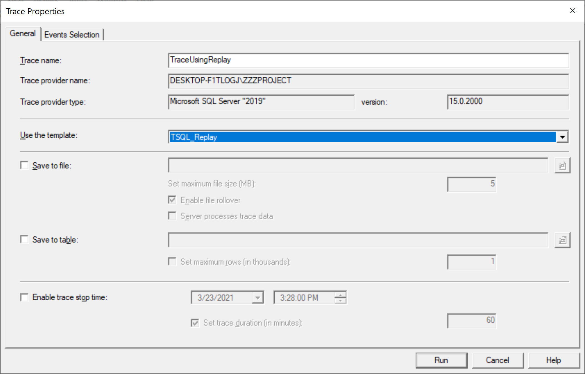
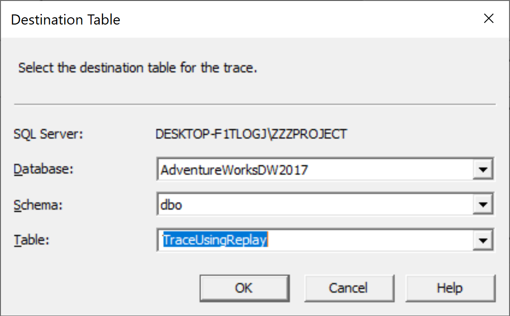
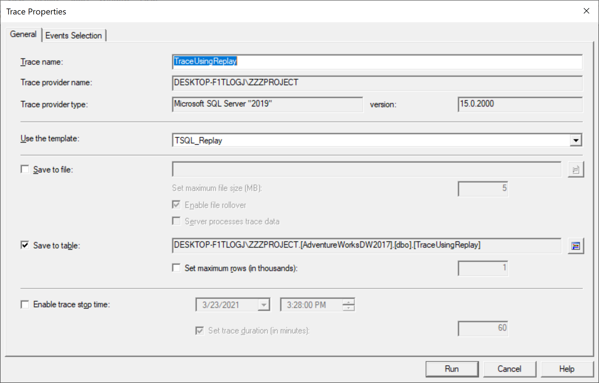
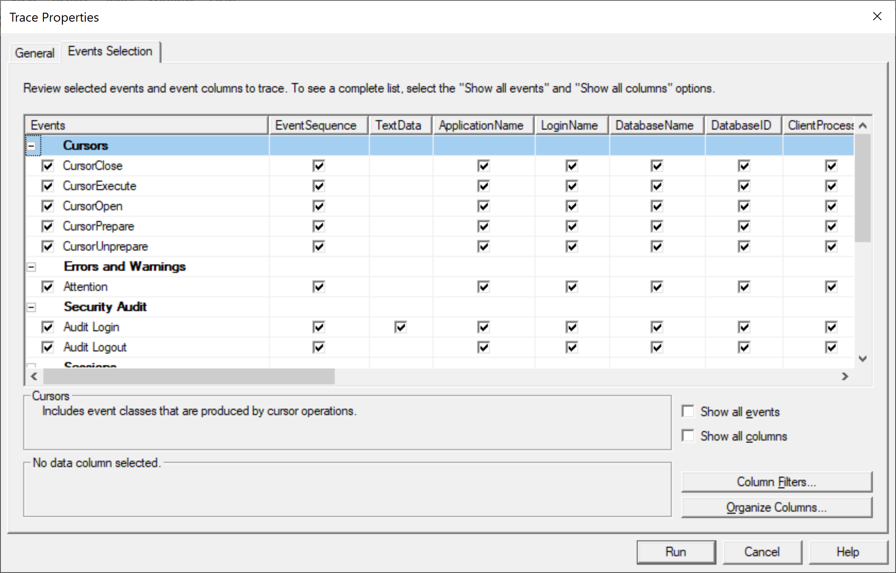
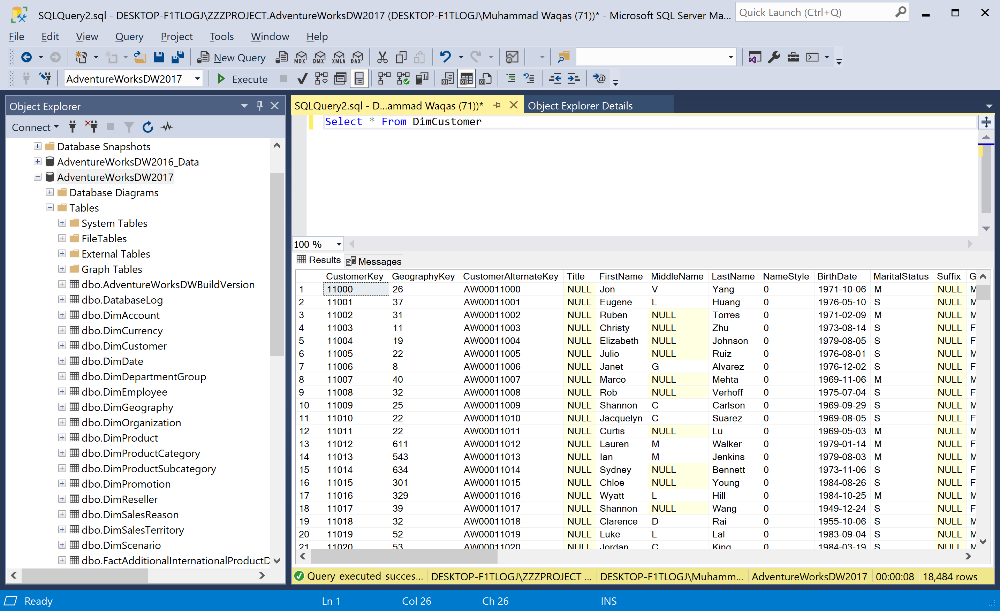
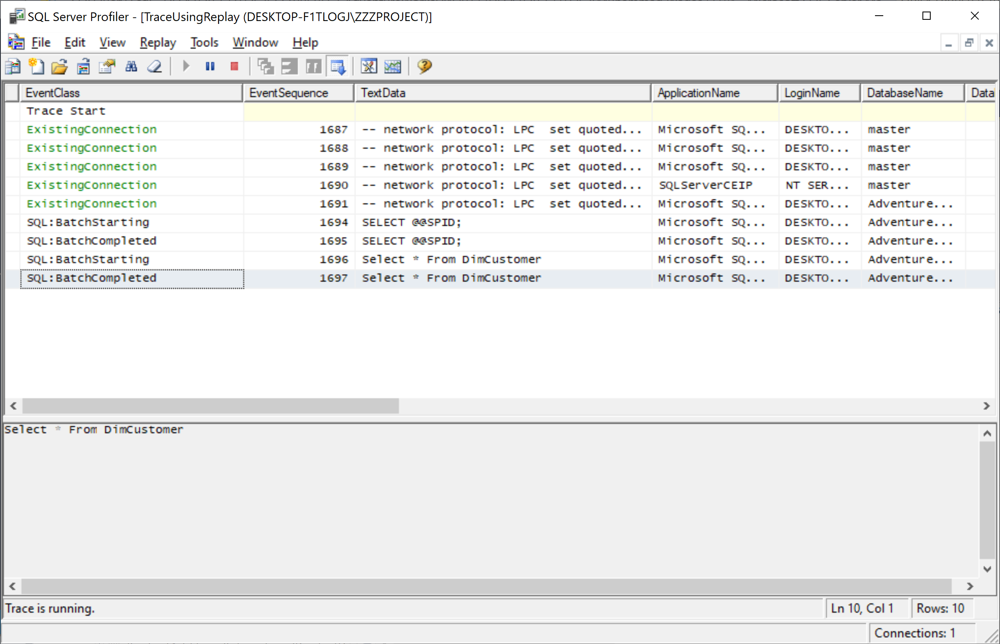
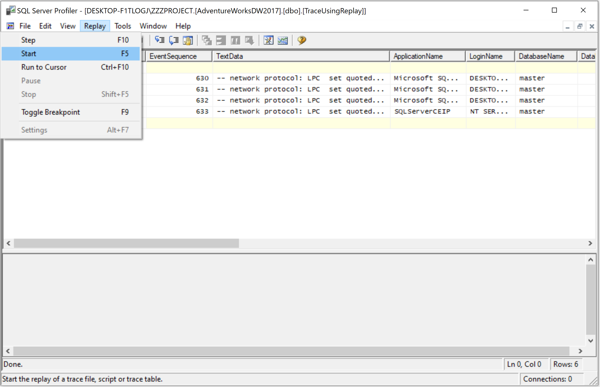
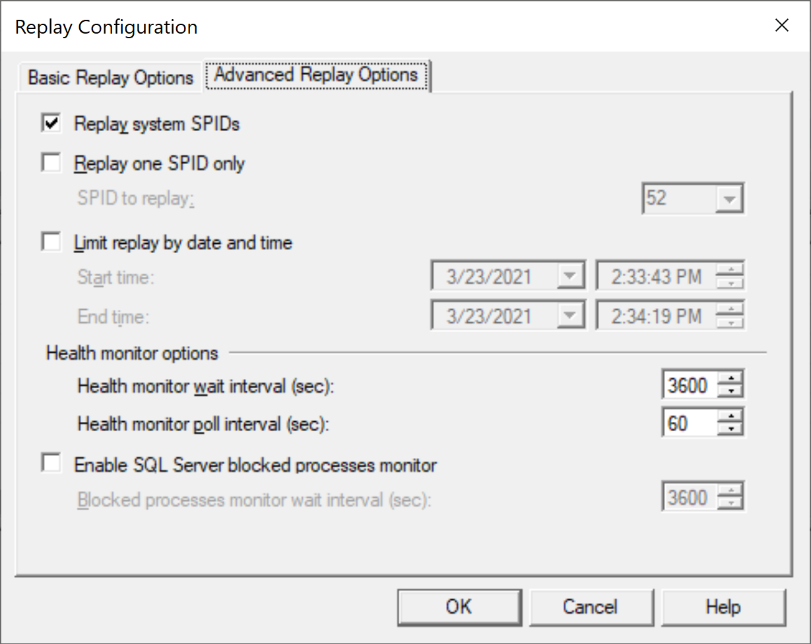
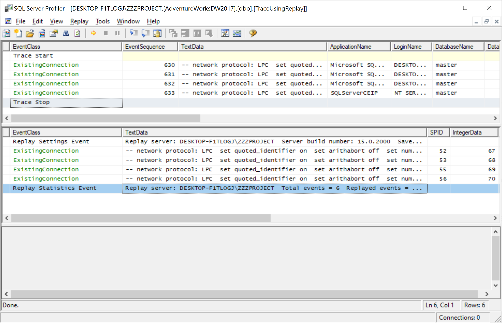

# Replay a Trace Table

Replay is the ability to open a saved trace and replay it again. SQL Server Profiler features a multithreaded playback engine that can simulate user connections and SQL Server Authentication. Replay is useful to troubleshoot an application or process problem. 

Let's open the **SQL Server Profiler** and go to the **File > New Trace...** menu.

 New Trace...">

It will open the **Connect to Server** dialog.

Click on the **Connect** button to connect to an instance of SQL Server and then it will open the **Tace Properties** dialog. 

In the **Trace name** field, type a name for the trace, and in the **Use the template** list, select a `TSQL_Replay` template, choose the **Save to table** option, and connect to the server.

Select the destination table and click the **OK** button.

Let's review the **Events Selection** tab.

You will see the required events classes for Replay. Now run the trace by clicking on the **Run** button and then open a query editor and execute a simple query.

When you execute this simple query and then go to the SQL Server Profiler, you will see the query logs.

Now close the trace and open the trace table again from the **File > Open > Trace Table...**

Select a trace table on the **Source Table** dialog and click the **OK** button.

Select the **Replay > Start** menu, and connect to the server instance where you want to replay the trace.

 Start">

It will open the **Replay Configuration** dialog. On the **Basic Replay Options** tab, specify **Replay server**.

You can select one of the following destinations in which to save the replay:

 - **Save to file**, which specifies a file in which to save the replay.
 - **Save to table**, which specifies a database table in which to save the replay.

Select **Save to file** and option and specify the file and choose the **Replay the events in the order they were traced** option.

Select the **Display replay results** to view the replay as it occurs and click the **Advanced Replay Options** tab.

Select **Replay system SPIDs** and then click the **OK** button.

You can see the replayed events.
