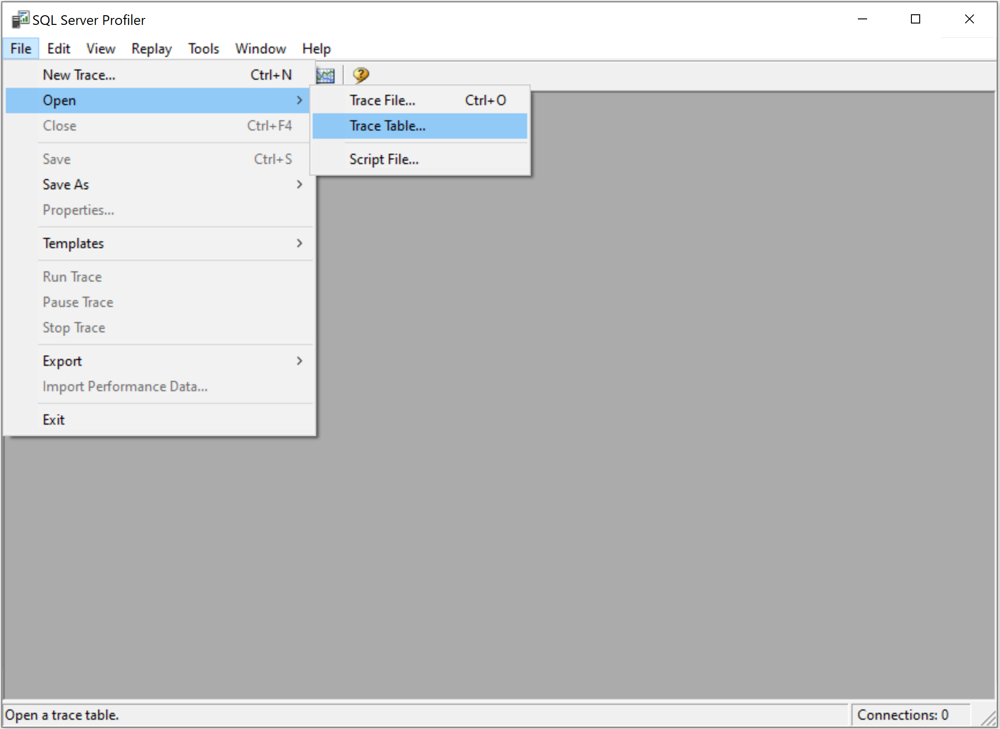
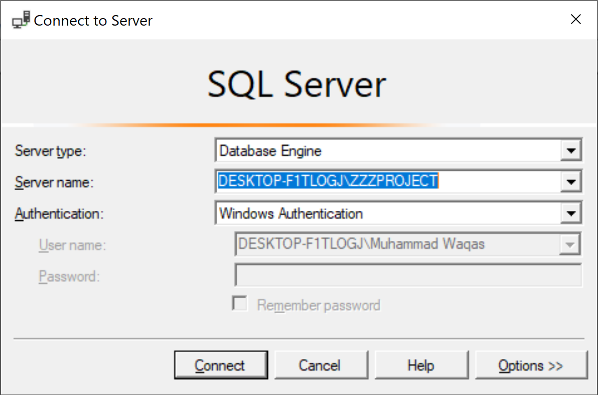
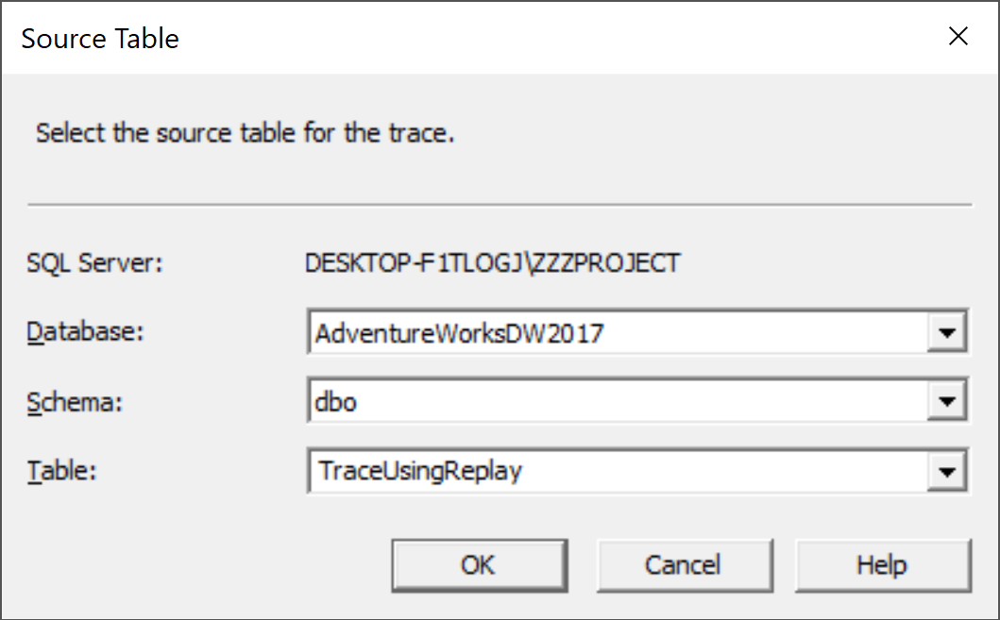
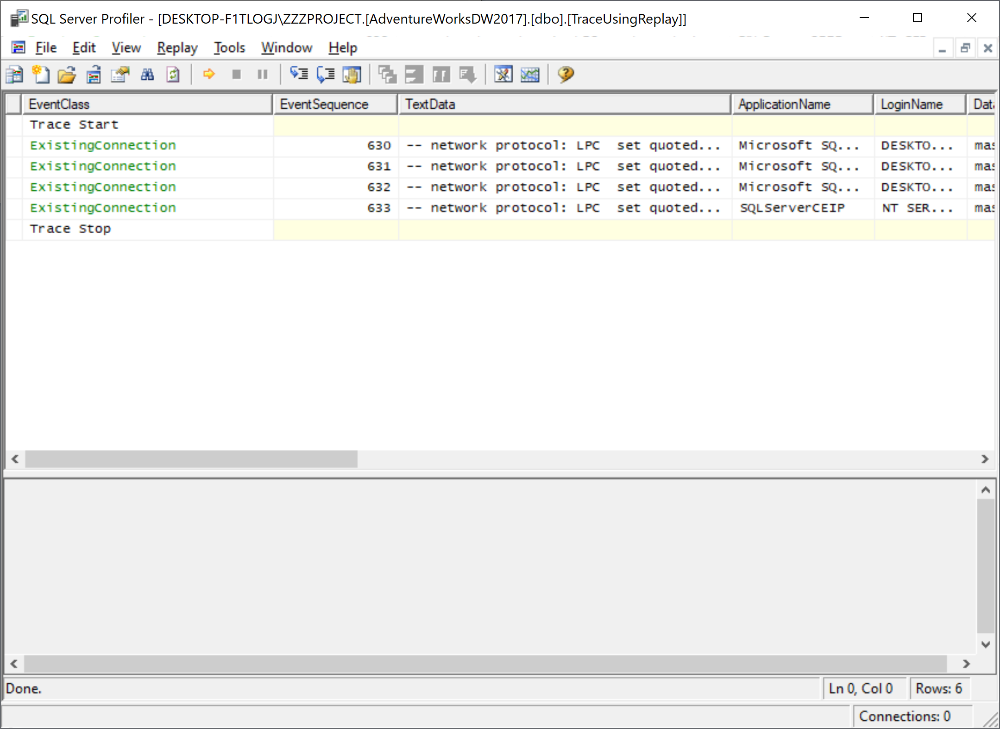
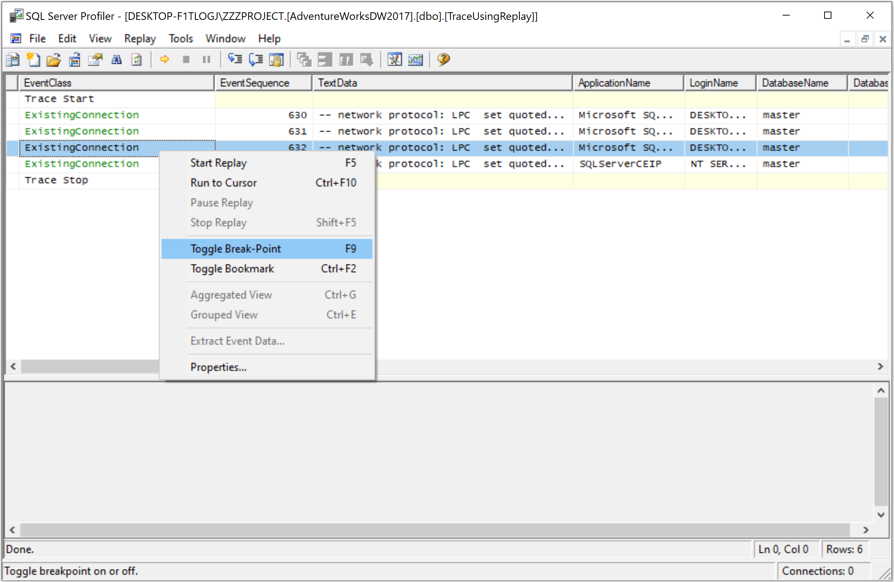
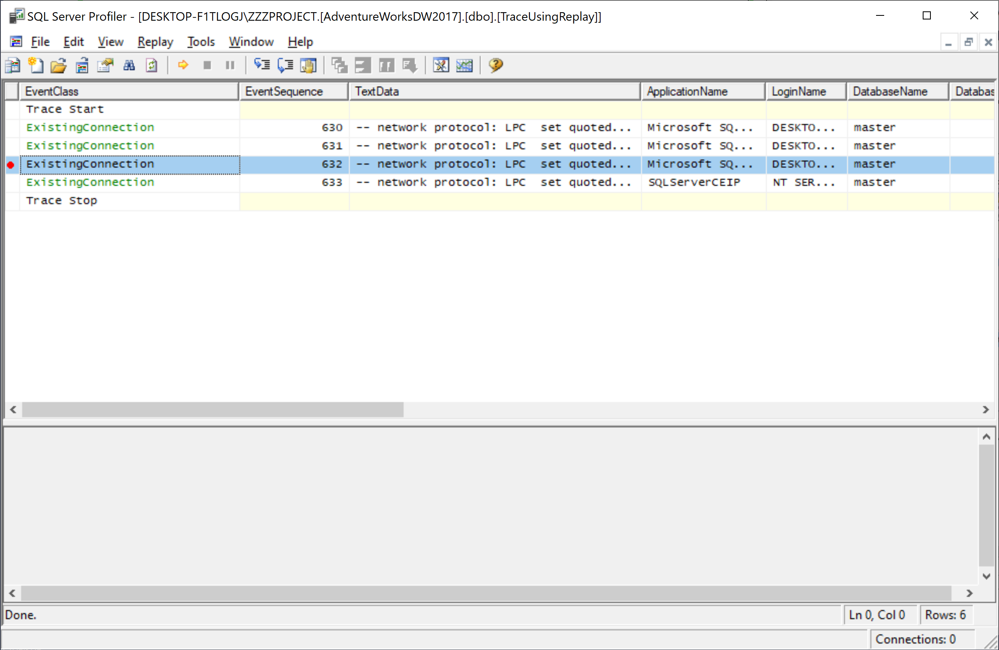
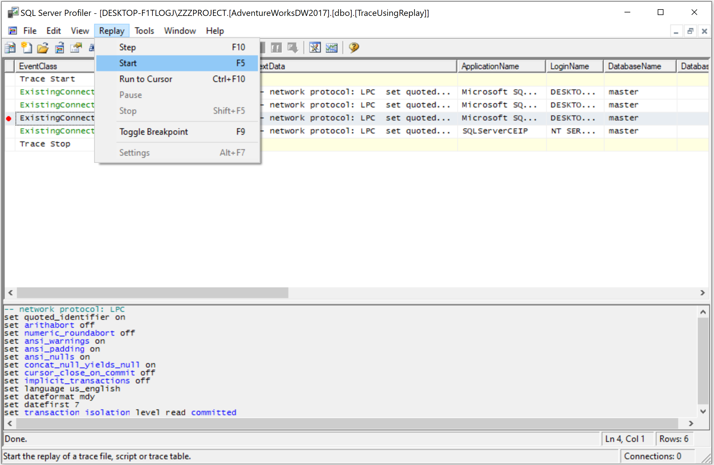
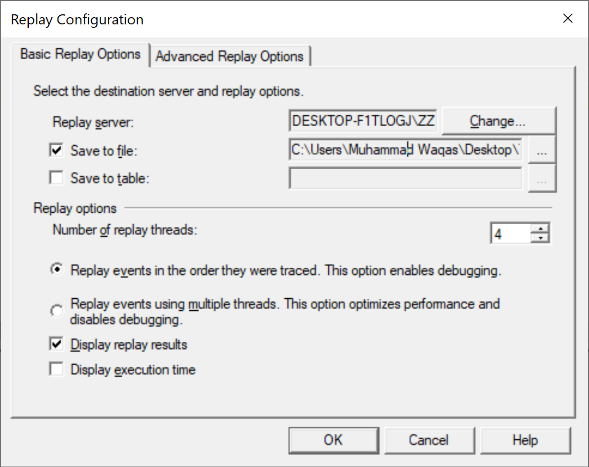
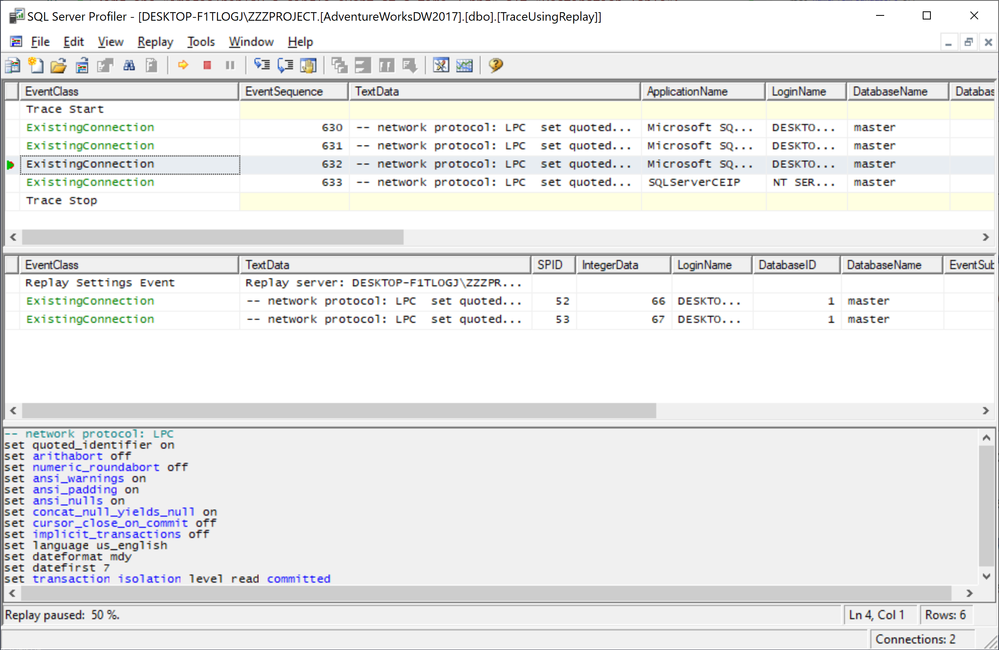

# Replay to a Breakpoint

Setting breakpoints in a trace file or table before you start to replay the trace, enables you to pause the replay of the trace at specific events. Using breakpoints while replaying a trace supports debugging because you can break the replay of long trace scripts into short segments that can be analyzed incrementally.

Let's open the **SQL Server Profiler** and go to the **File > Open > Trace Table...** menu.

 Open > Trace Table...">

It will open the **Connect to Server** dialog.

Click on the **Connect** button to connect to an instance of SQL Server.

You will see a **Destination Table** dialog. Select the destination table and click the **OK** button.

Make sure that the trace table you open contains the event classes necessary for replay.

In the trace window, click an event that you want to use as a breakpoint by using one of the following three methods to set a breakpoint.

 - Press F9
 - On the **Replay** menu, click **Toggle Breakpoint**
 - Right-click the event, and then click **Toggle Break-Point**

A red bullet appears next to the selected trace event, indicating that it is the trace breakpoint.

You can repeat this step to set several breakpoints. On the **Replay** menu, click **Start**, and connect to the server where you want to replay the trace.

 Start">

Connect to an instance of SQL Server and then in the **Replay Configuration** dialog, specify **Replay server**.

You can select one of the following destinations in which to save the replay:

 - **Save to file**, which specifies a file in which to save the replay.
 - **Save to table**, which specifies a database table in which to save the replay.

Select **Save to file** and option and specify the file, verify the settings, and then click **OK** button. 

The replay starts, pausing when the breakpoint is reached. Press **F5** to resume the replay and proceed to the next breakpoint or end of the trace if there is no other breakpoint available.
