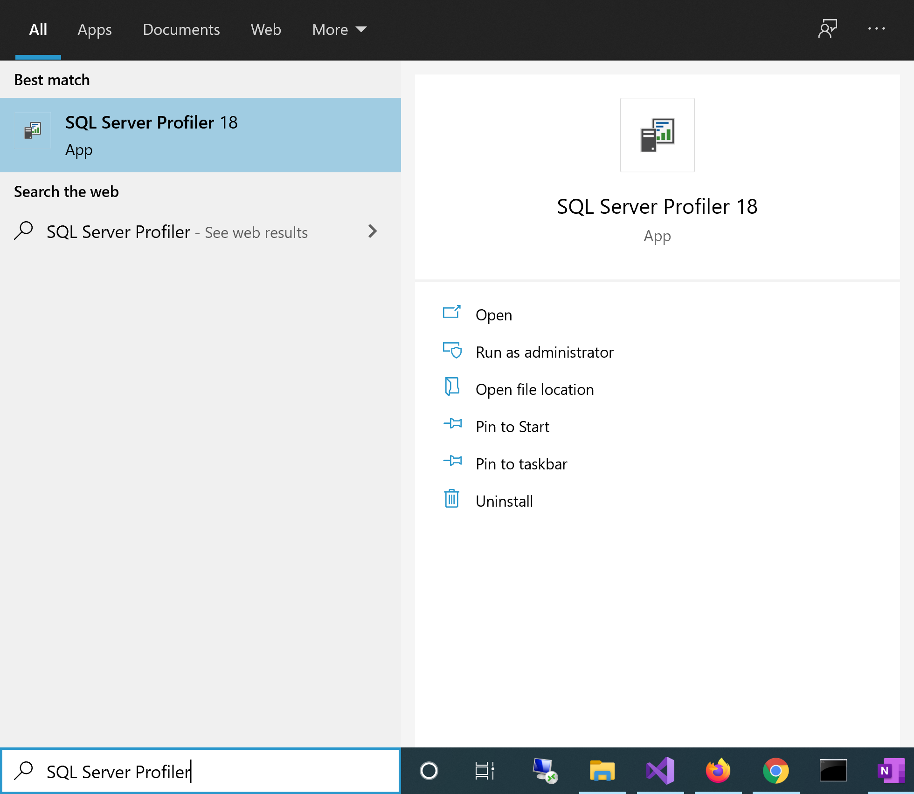
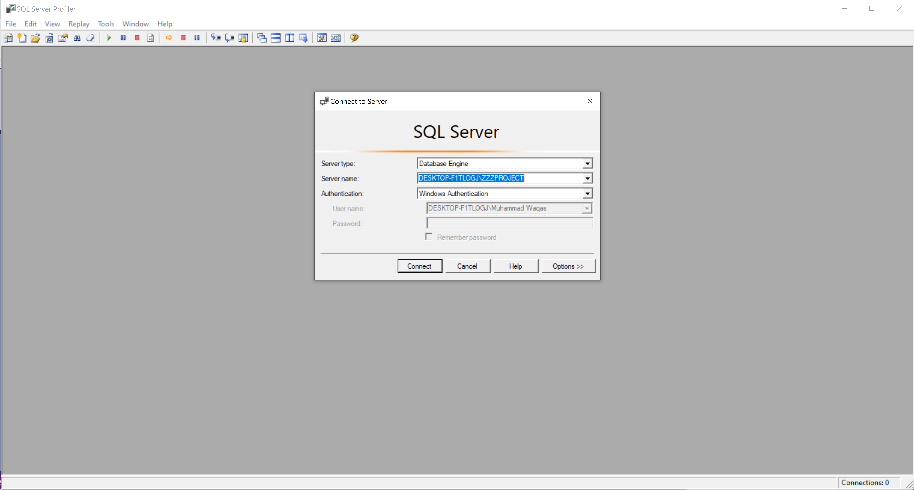
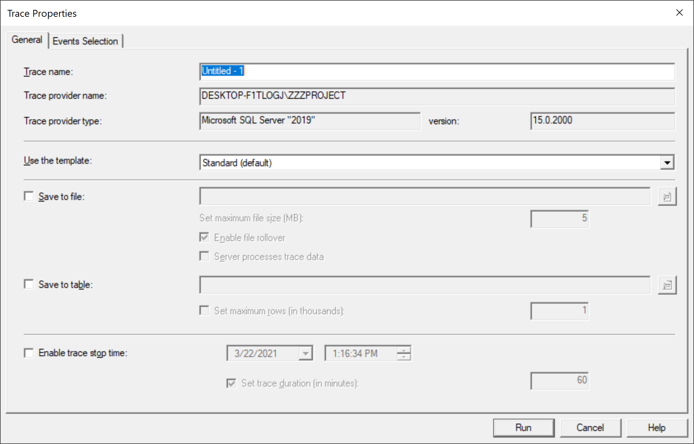
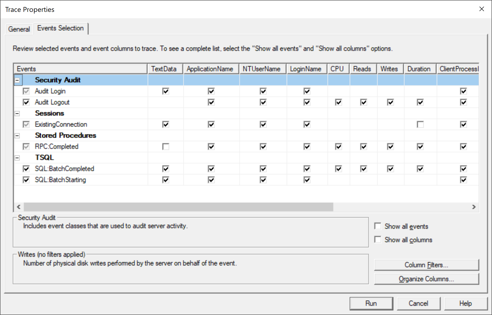
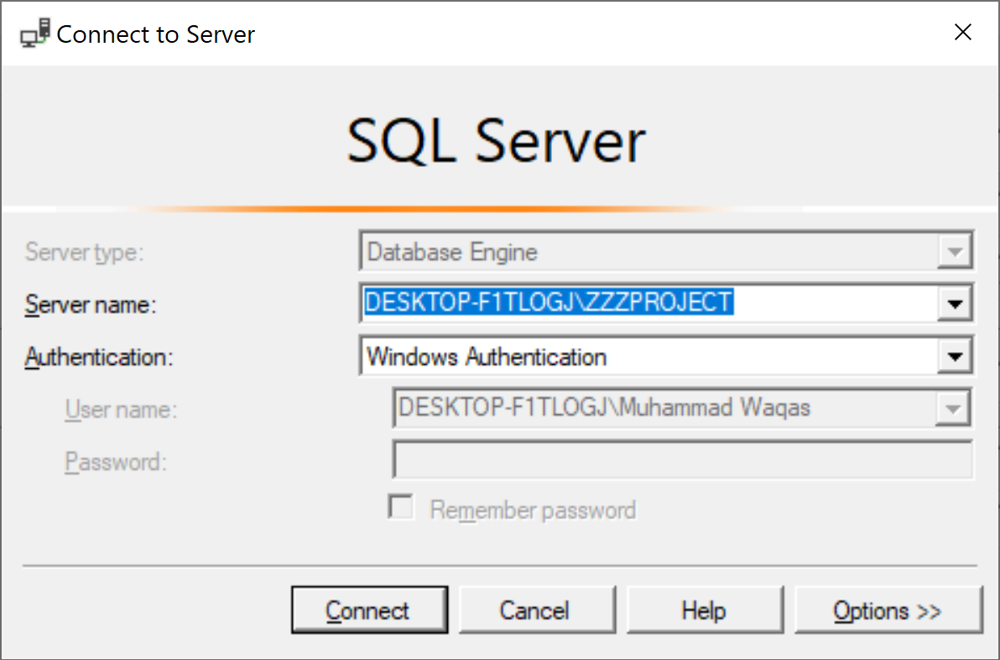
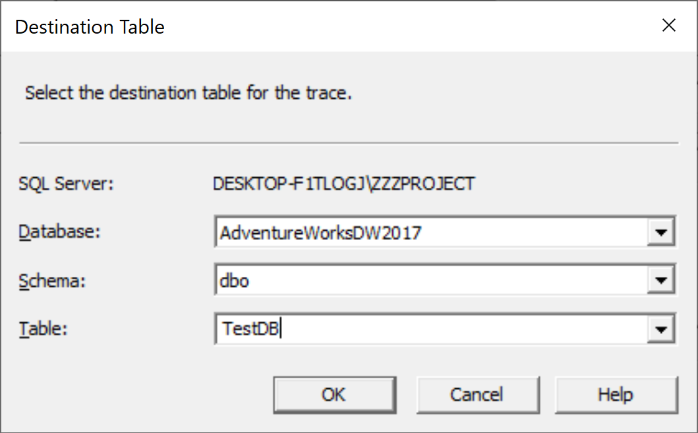
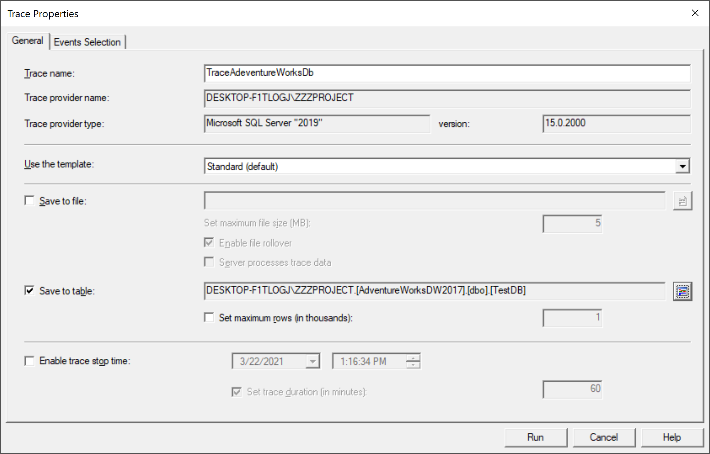
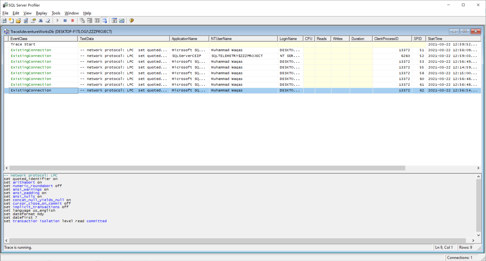

# Run SQL Server Profiler

SQL Server Profiler is a standalone tool installed with SQL Server. You can access it from Windows Explorer or SQL Server Management Studio.

You can write **SQL Server Profiler** in the **Start** menu search bar, and you will see the application there.

You can also launch the Profiler from SQL Server Management Studio by opening the SQL Server Management Studio and connecting to the server instance.

Now, select the **Tools > SQL Server Profiler**, and it will open the **Connect to Server** dialog.

You have to select whether you need to connect to an Analysis Service instance or a Database Engine. When the connection is established, you will see a **Trace Properties** dialog.

On the **General** tab, you can set the following settings.

 - Enter the trace name
 - You can select a trace template from a drop-down list based on your needs. 
   - A template is a set of tuning events that are caught by the profiler trace. 
   - There are different predefine templates such as T-SQL, Tuning, or selecting the standard (default) template or starting from scratch by selecting the Blank template.
 - You can select whether you need to save the trace results into a table or external file
 - You can also stop the trace at a specific date-time.

In the **Events Selection** tab, you can select all events you need to include in the trace, and you can't add some filters.

If you only need to trace the operations executed in a specific database, then you can add a filter on the database name property.

Now let's go to the **General** tab again, enter a name in the **Trace name** field, and select **Save to a table** checkbox. It will open the **Connect to Server** dialog. 

Click on the **Connect** button, and you will see a **Destination Table** dialog.

Select the destination table and click the **OK** button.

Now let's run the trace by clicking on the **Run** button.

