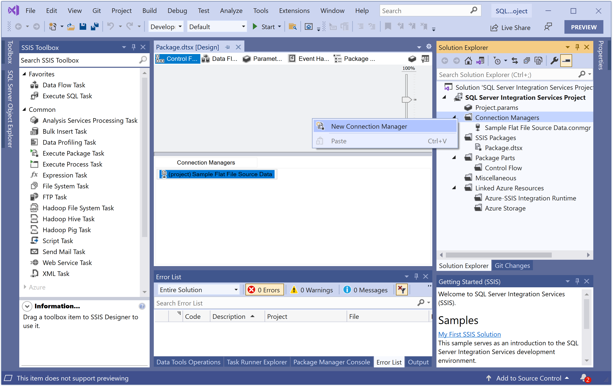
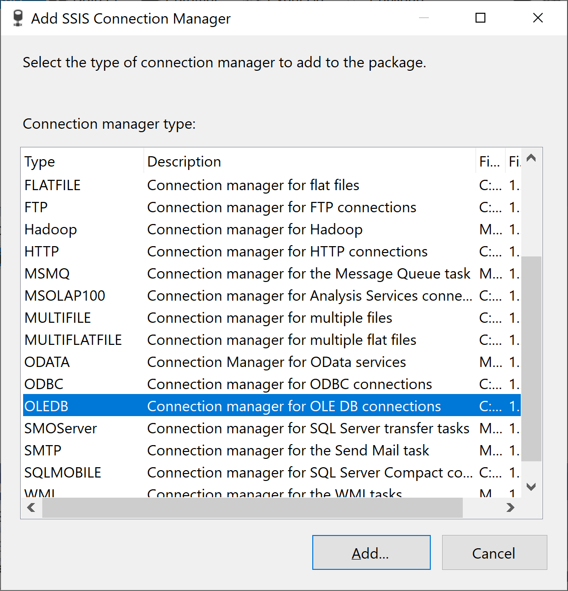
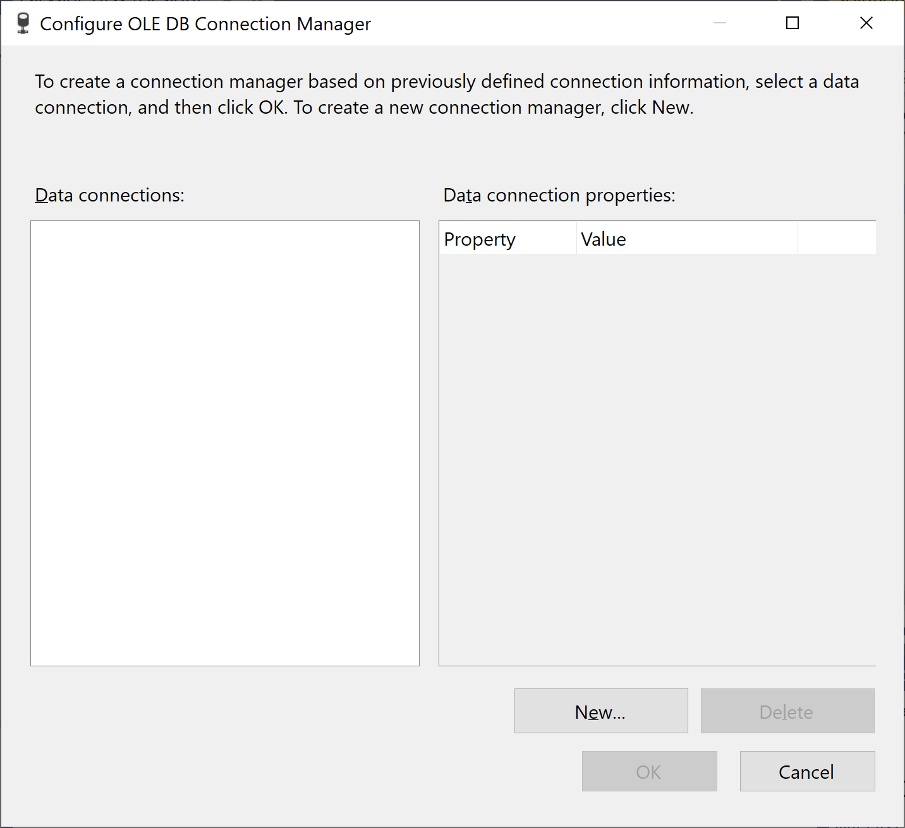
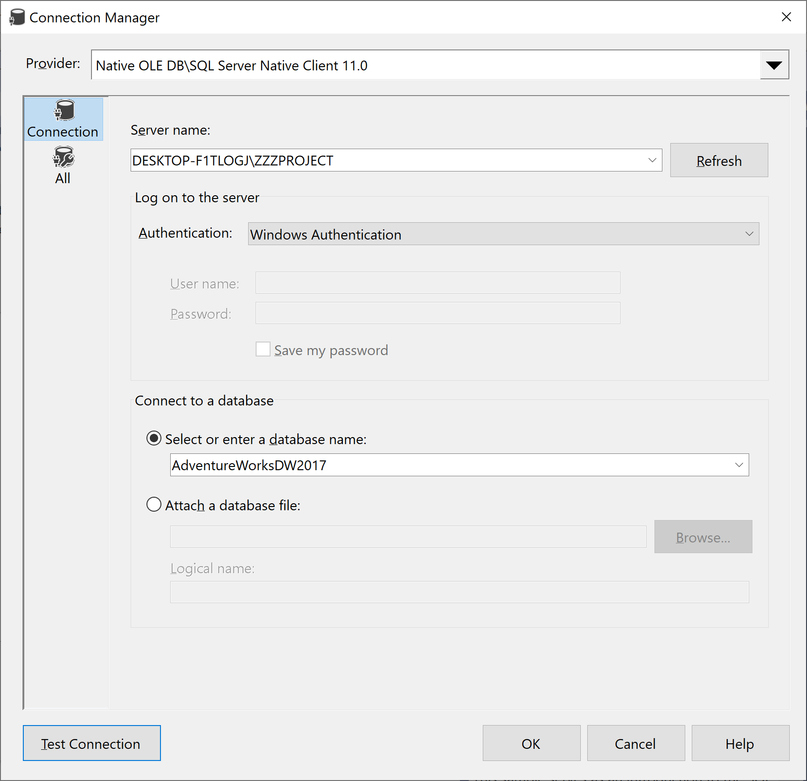
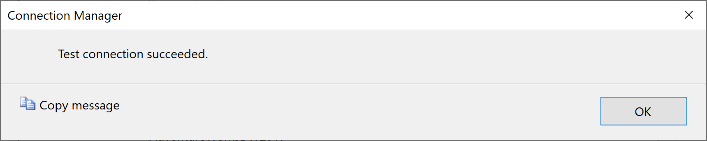
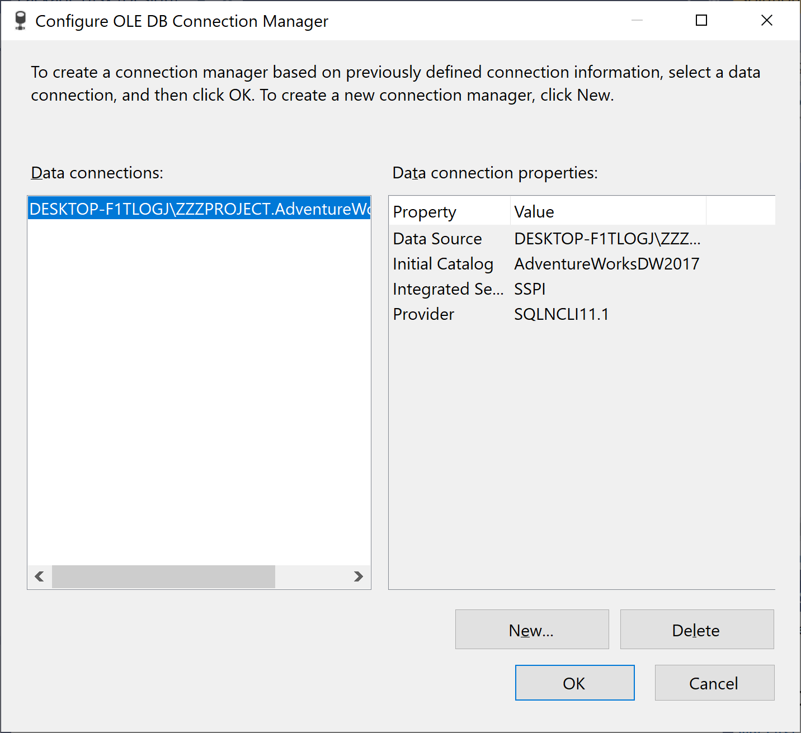

# Add and Configure an OLE DB

After you add a Flat File connection manager to connect to the data source, you add an OLE DB connection manager to connect to the data destination. An OLE DB connection manager enables a package to extract data from or load data into any OLE DB-compliant data source. Using an OLE DB connection manager, you can specify the server, the authentication method, and the default database for the connection.

In this task, you create an OLE DB connection manager that uses Windows Authentication to connect to the local instance of AdventureWorksDW2012. This OLE DB connection manager is also referenced by other components that you create later in this tutorial, such as the Lookup transformation and the OLE DB destination.

## Add and configure an OLE DB connection manager

In the **Solution Explorer** pane, right-click on **Connection Managers** and select **New Connection Manager**.

In the **Add SSIS Connection Manager** dialog, select OLEDB, then select Add.

In the **Configure OLE DB Connection Manager** dialog box, select **New**.

For **Server name**, enter `localhost` or any other server name which is created during SQL Server installation.

When you specify the server name, the connection manager connects to the default instance of SQL Server on the local computer. To use a remote instance of SQL Server, replace localhost with the name of the server to which you want to connect.

In the **Log on to the server** group, make sure that **Windows Authentication** is selected.

In the **Connect to a database** group, in the **Select or enter a database name** box, type or select **AdventureWorksDW2017**.

Select **Test Connection** to verify that the connection settings you have specified are valid.

Select **OK**.

Select **OK**.

In the **Connection Managers** pane, verify that **\*.AdventureWorksDW2012** is Added.

