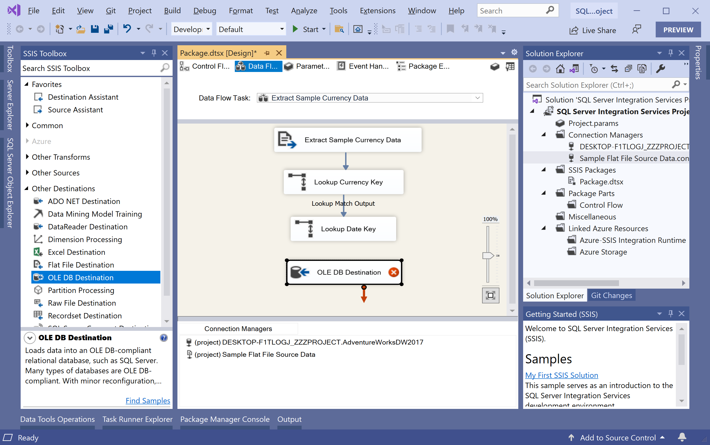
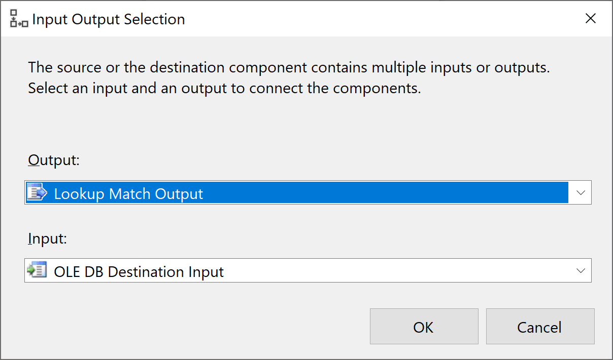
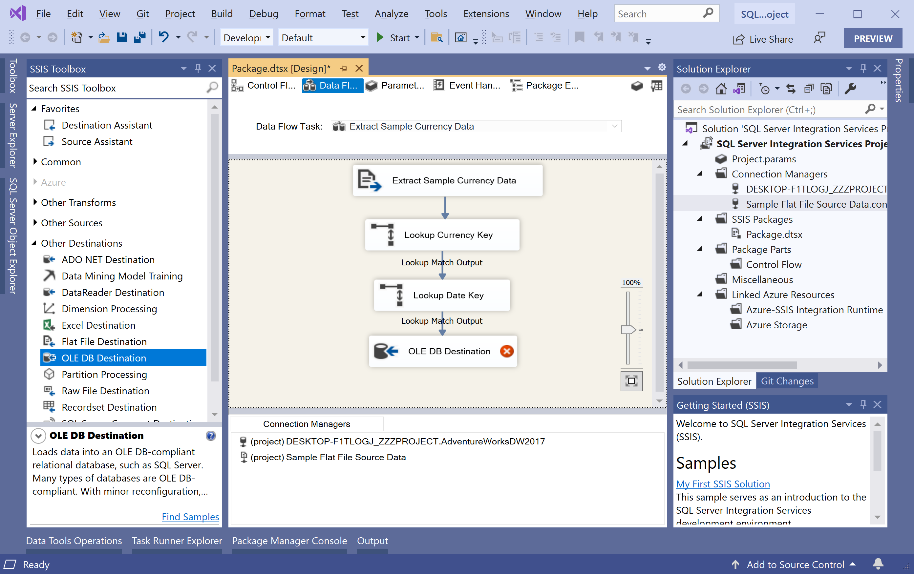
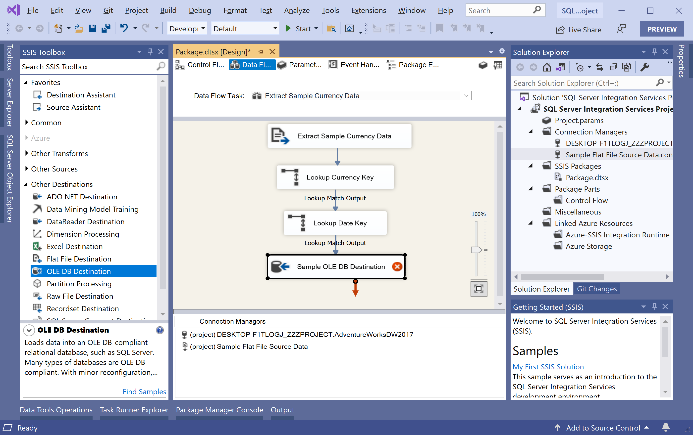
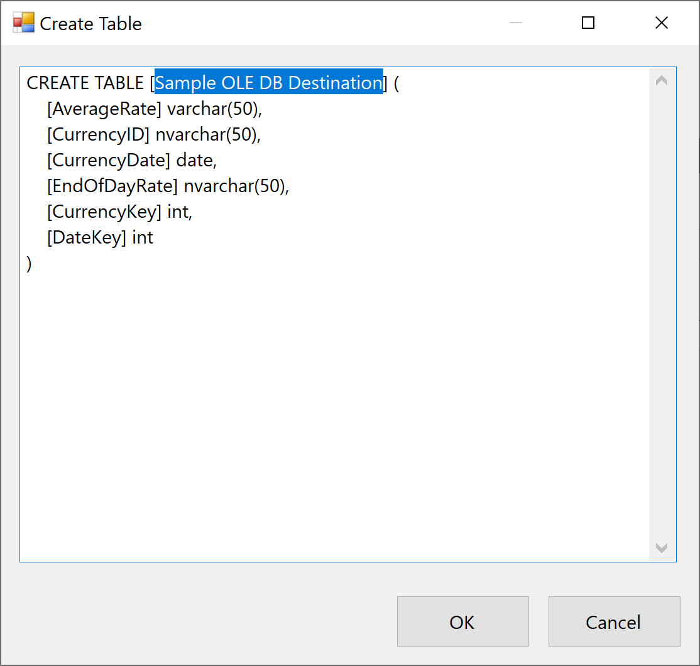
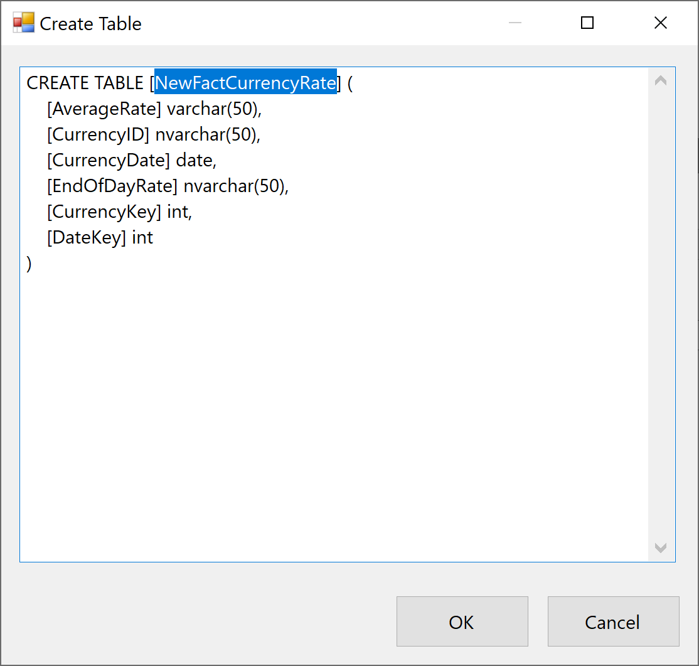
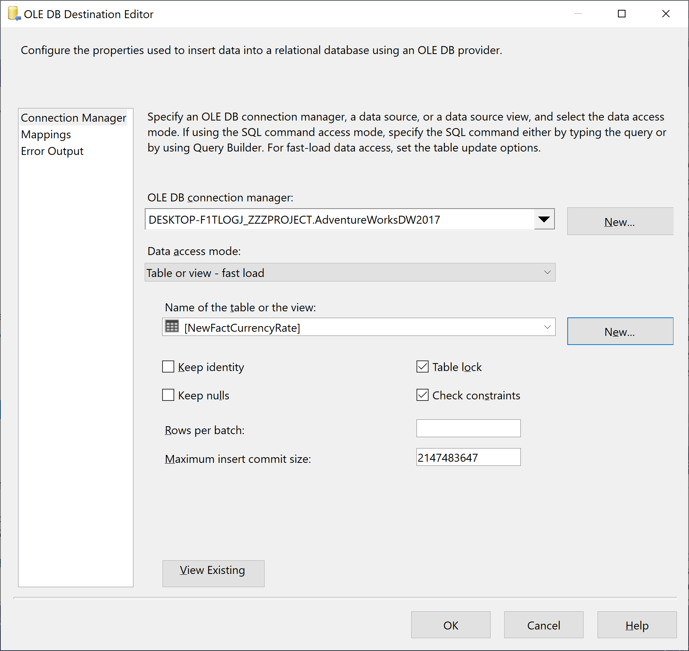
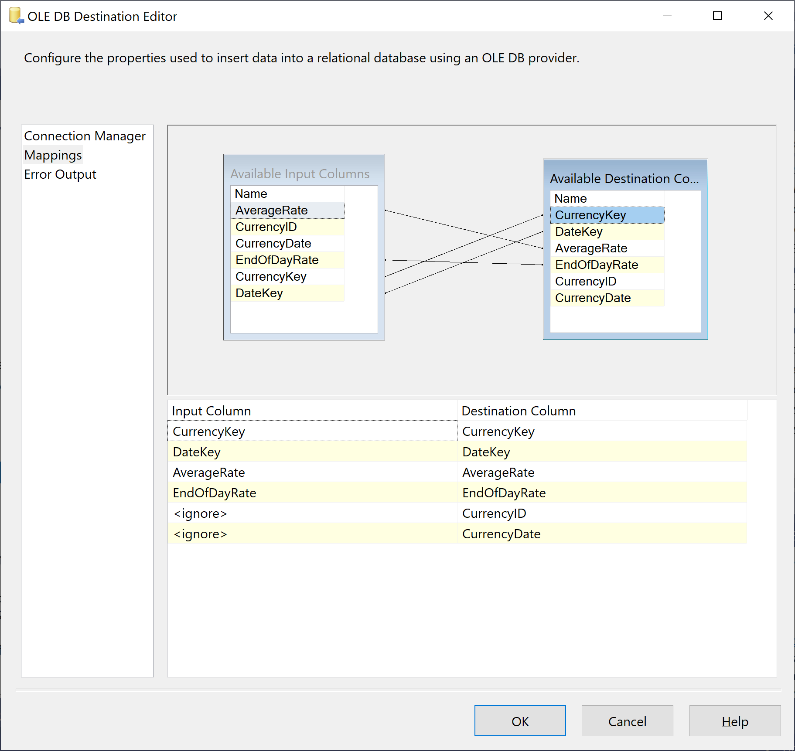
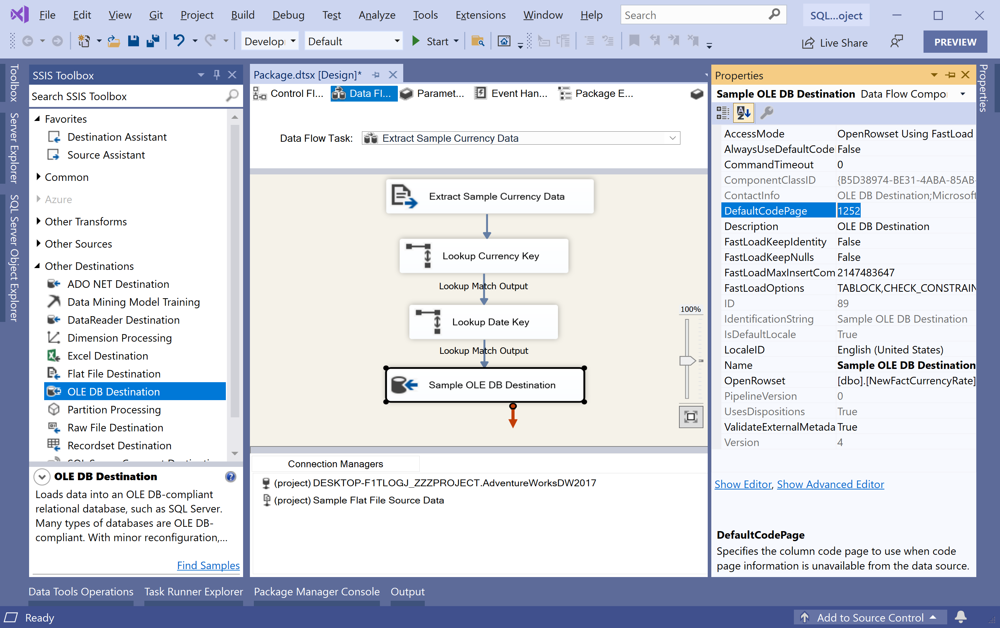

# Add and Configure the OLE DB Destination

The package created in the previous articles can now extract data from the flat file source and transform that data into a format compatible with the destination. Now we need to load the transformed data into the destination. 

 - To load the data, we need to add an OLE DB destination to the data flow. 
 - The OLE DB destination can use a database table, view, or a SQL command to load data into a variety of OLE DB-compliant databases.

To add and configure an OLE DB destination to use the OLE DB connection manager that we have previously created, expand **Other Destinations** in the **SSIS Toolbox**. 

Drag **OLE DB Destination** onto the design surface of the **Data Flow** tab and place the **OLE DB Destination** directly below the **Lookup Date Key** transformation.

Select the **Lookup Date Key** transformation and drag its blue arrow over to the new **OLE DB Destination** to connect the two components.

In the **Input Output Selection** dialog, select **Lookup Match Output** in the **Output** dropdown list, and then select **OK**.

Change the name of the newly added **OLE DB Destination** component by right-clicking on it and choose **Rename**.

Type **Sample OLE DB Destination** in the text area.

Double-click **Sample OLE DB Destination** and it will open the **OLE DB Destination Editor** dialog. 

On the **OLE DB Destination Editor** dialog, Make sure that **\*.AdventureWorksDW2017** is selected in the **OLE DB Connection manager** dropdown and in the **Name of the table or the view** dropdown, select `[dbo].[FactCurrencyRate]`.

If a table named `NewFactCurrencyRate` currently exists, delete it now and then select the **New** button to create a new table. 

Change the name of the table in the script from **Sample OLE DB Destination** to **NewFactCurrencyRate**. 

Click on the **OK** button and you will see that the **Name of the table or the view** automatically changes to **NewFactCurrencyRate**.

Now go to the **Mappings** tab.

Verify that the `AverageRate`, `CurrencyKey`, `EndOfDayRate`, and `DateKey` input columns are mapped correctly to the destination columns. If same-named columns are mapped, the mapping is correct. Click on the **OK** button.

Right-click the **Sample OLE DB Destination** destination and select **Properties**. In the **Properties** window, verify that the **LocaleID** property is **English (United States)** and the **DefaultCodePage** property is **1252**.

 
