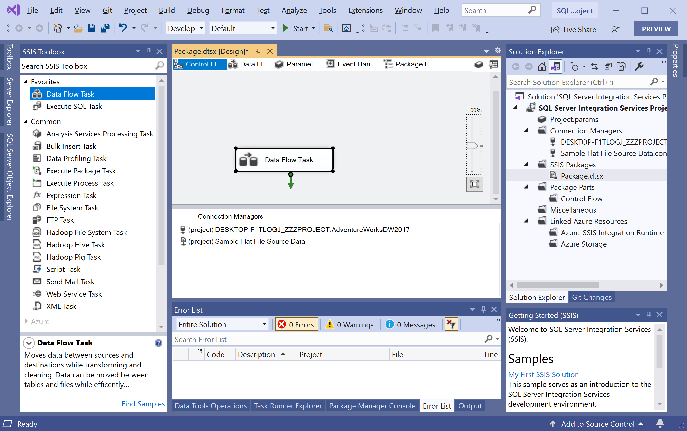
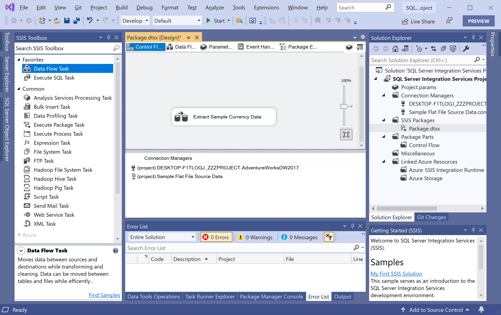
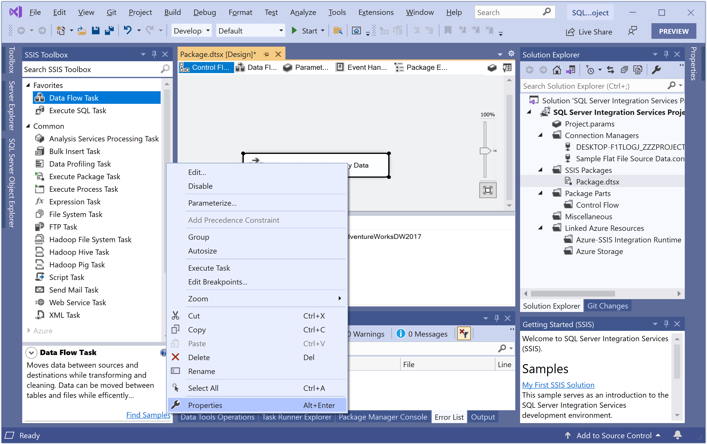

# Add Data Flow Task

So far, we have created the connection managers for the source and destination data. Now we will add a **Data Flow task** to our package. 

 - The Data Flow task defines the data flow engine that moves data between sources and destinations and provides the functionality for transforming, cleaning, and modifying data as it is moved. 
 - The Data Flow task is where most of the work of an extract, transform, and load (ETL) process occurs.

## How to Add Data Flow Task

The first is to go to the **Control Flow** tab and then in the **SSIS Toolbox** pane, expand Favorites. If the **SSIS Toolbox** is not available, select the View > Other Windows menu, and then select SSIS Toolbox to display it.

Select the **Data Flow Task**, and drag it onto the design surface of the **Control Flow** tab.

On the **Control Flow** design surface, right-click on the **Data Flow Task** and choose **Rename** and change the name to **Extract Sample Currency Data**.

Right-click the Data Flow task and choose **Properties**.

In the **Properties** window, verify that the **LocaleID** property is set to **English (United States)**.
