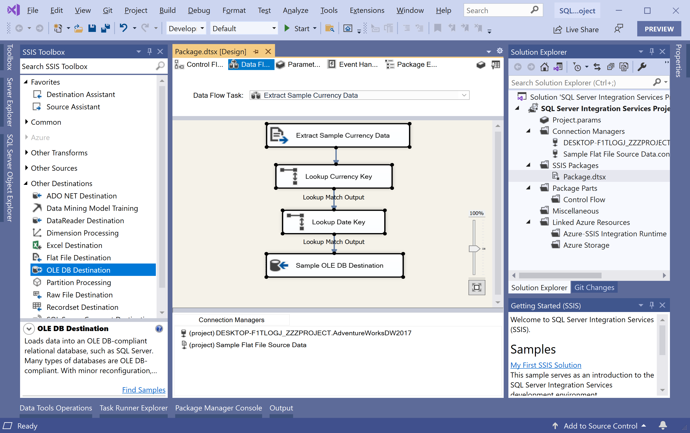
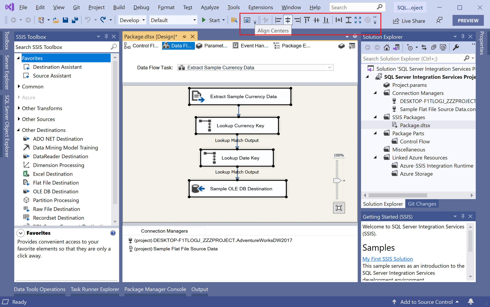
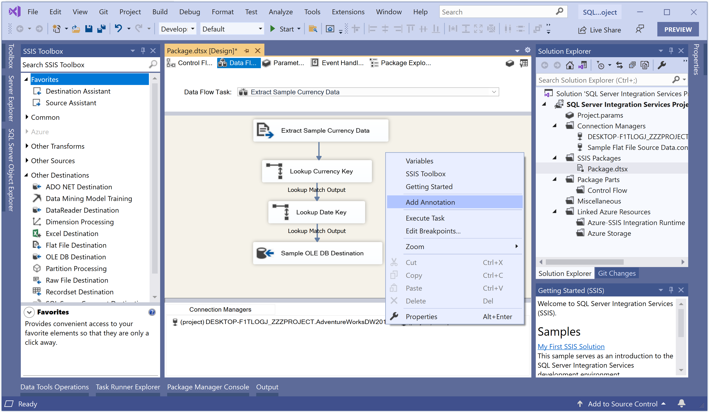
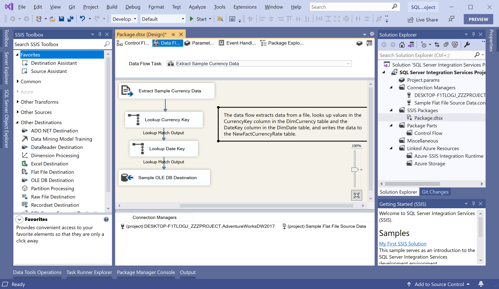
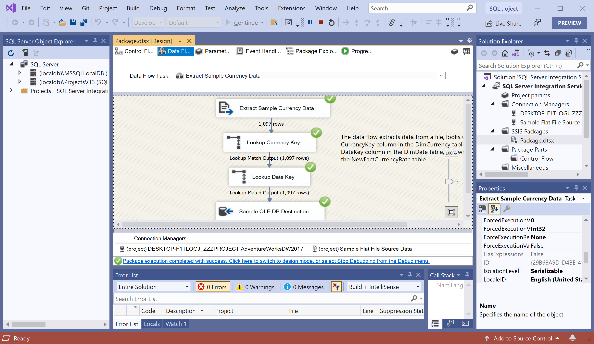
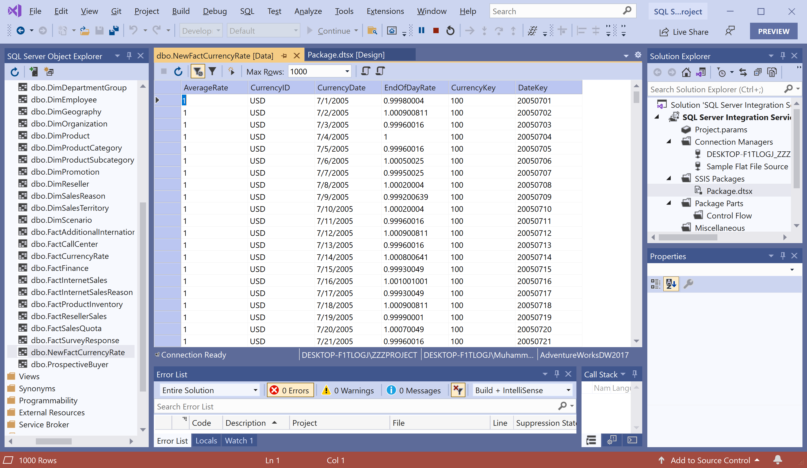

# Annotation and Formatting

SQL Server Data Tools provides tools to easily format the package layout. 

 - The formatting features include the ability to make shapes the same size, align shapes, and change the horizontal and vertical spacing between shapes.
 - Another way to improve the understanding of package functionality is to add annotations that describe package functionality.

In this article, we will use the formatting features in SQL Server Data Tools to improve the layout of the data flow and also to add an annotation.

## Format Data Flow Layout

If the package is not already open, then double-click on the `Package.dtsx` in **Solution Explorer** and then go to the **Data Flow** tab. To select all the data flow components at once, select the **Edit > Select All** menu option.

You can use various options such as **Make Same Size**, **Align Rights**, etc.

With the data flow objects selected, on the Format menu, choose **Align Centers**, and **Make Vertical Spacing Equal**.

## Add an annotation to the data flow

Right-click anywhere in the background of the data flow design surface and then select **Add Annotation**.

You will see the annotation box, and if you don't add text to the annotation box, the box disappears when you click outside it. Because of this behavior, if you want to paste text in the annotation box, then copy the text to the clipboard before selecting **Add Annotation**.

## Test Package

To test the package, go to the **Debug** menu, select **Start Debugging**.

You can see the Package executed successfully, and to verify the results, open the **NewFactCurrencyRate** table in **AdventureWorksDW2017** database. 

