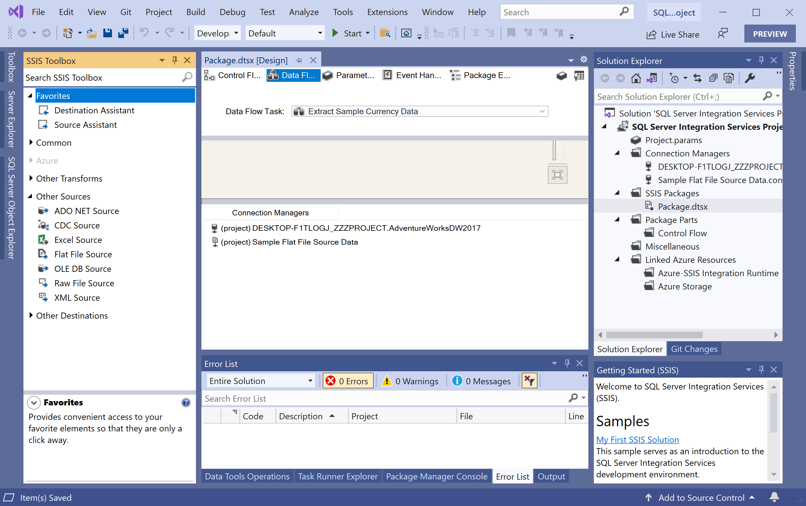
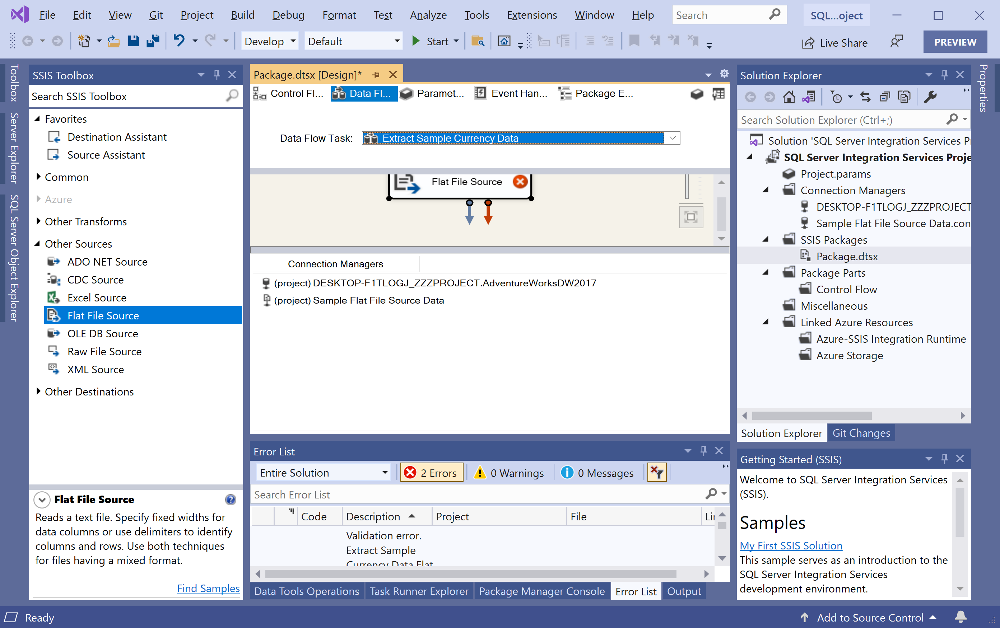
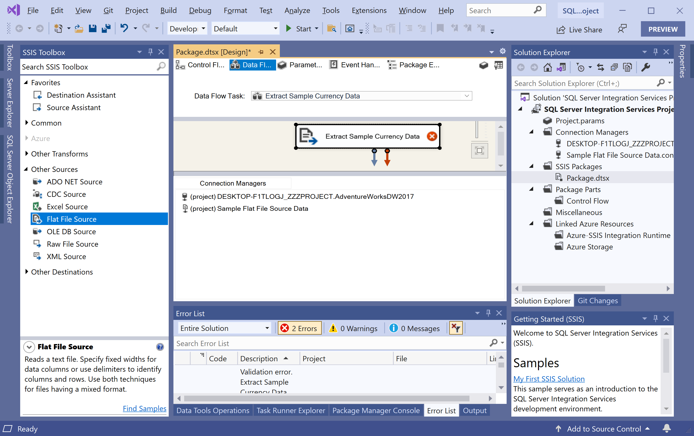
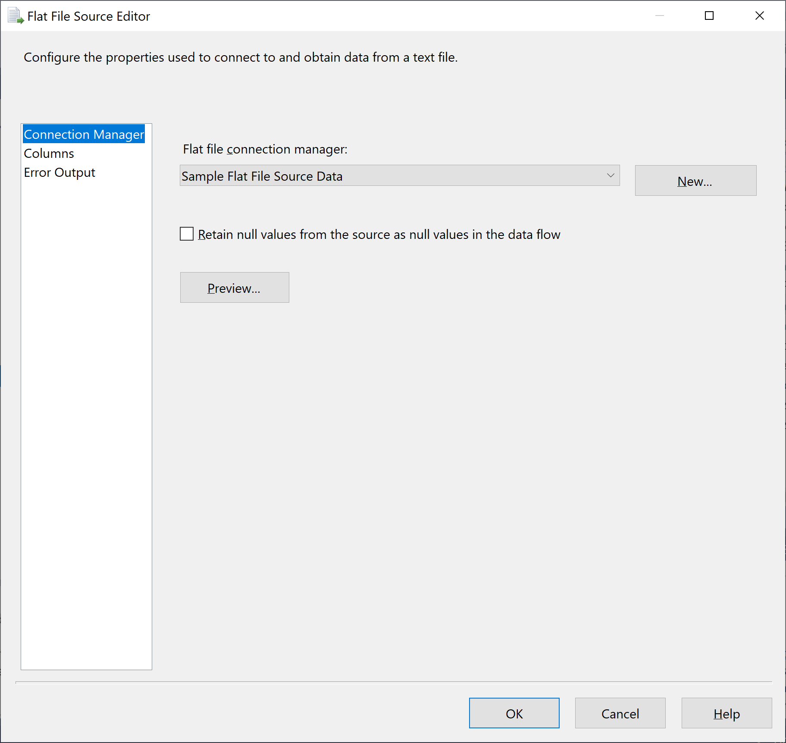
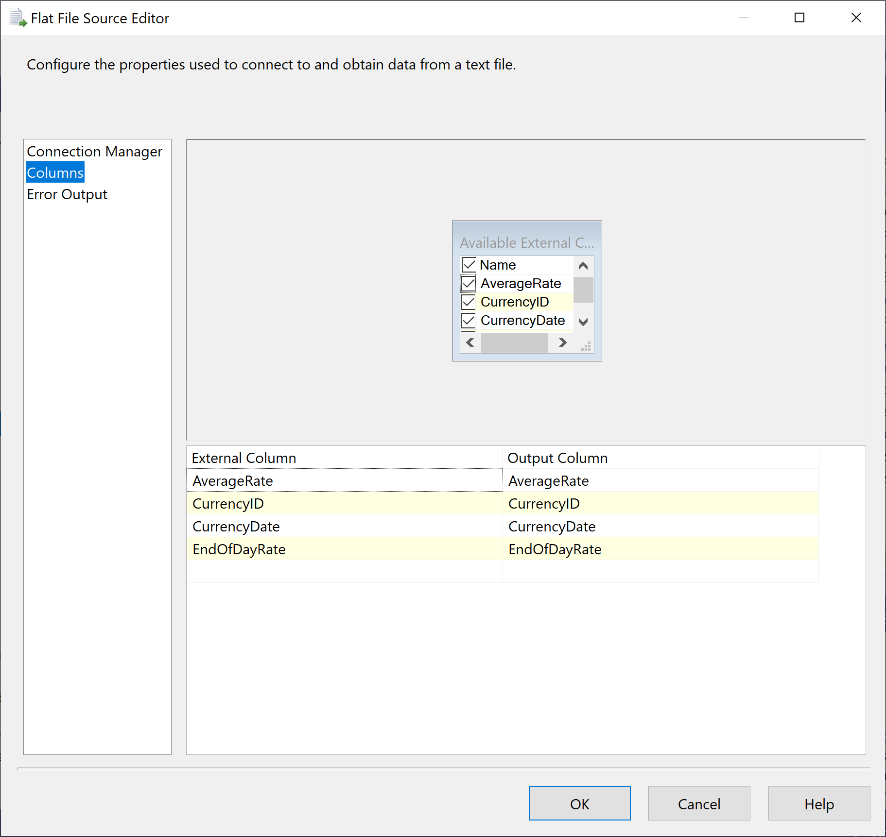
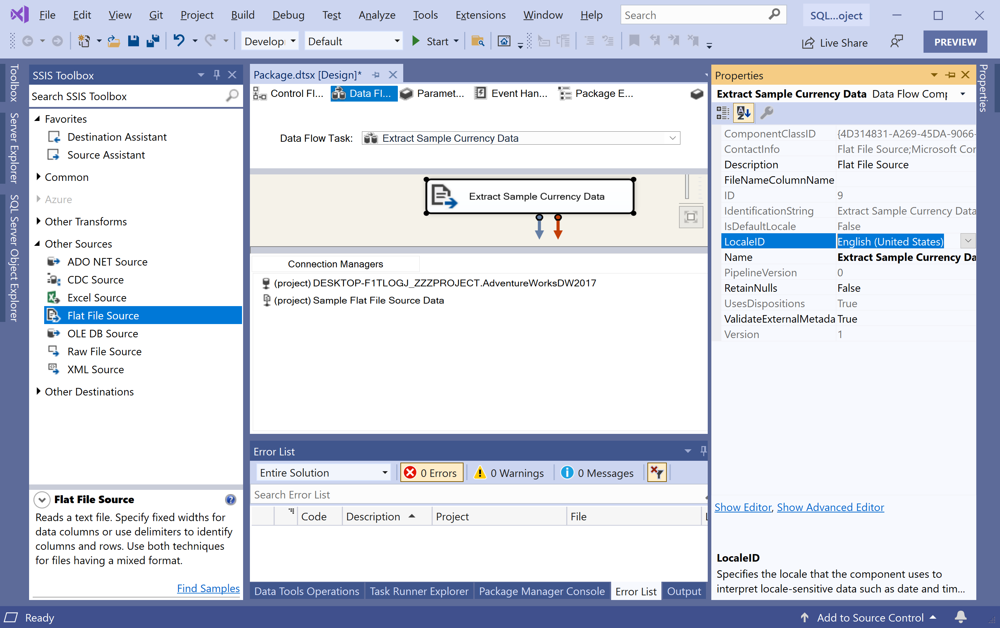

# Configure Flat File Source

A Flat File source is a data flow component that uses metadata defined by a Flat File connection manager. 

 - It specifies the format and structure of the data to be extracted from the flat file by a transform process. 
 - The Flat File source extracts data from a single flat file, using the format definitions in the Flat File connection manager.

Let's configure the Flat File source to use the **Sample Flat File Source Data** connection manager that is previously created.

To open the **Data Flow** designer, either double-click on the **Extract Sample Currency Data** data flow task, or select the **Data Flow** tab.

In the **SSIS Toolbox**, expand **Other Sources**.

Drag a Flat File Source onto the design surface of the Data Flow tab.

On the **Data Flow** design surface, right-click the newly added **Flat File Source** and choose **Rename**.

Change the name to **Extract Sample Currency Data**. Now double-click on the Flat File source to open the **Flat File Source Editor** dialog.

In the **Flat file connection manager** field, select **Sample Flat File Source Data**.

Select the **Columns** tab and verify that the names of the columns are correct.

Select **OK**.

Right-click the Flat File source and select **Properties**.

In the **Properties** window, verify that the **LocaleID** property is set to **English (United States)**.
