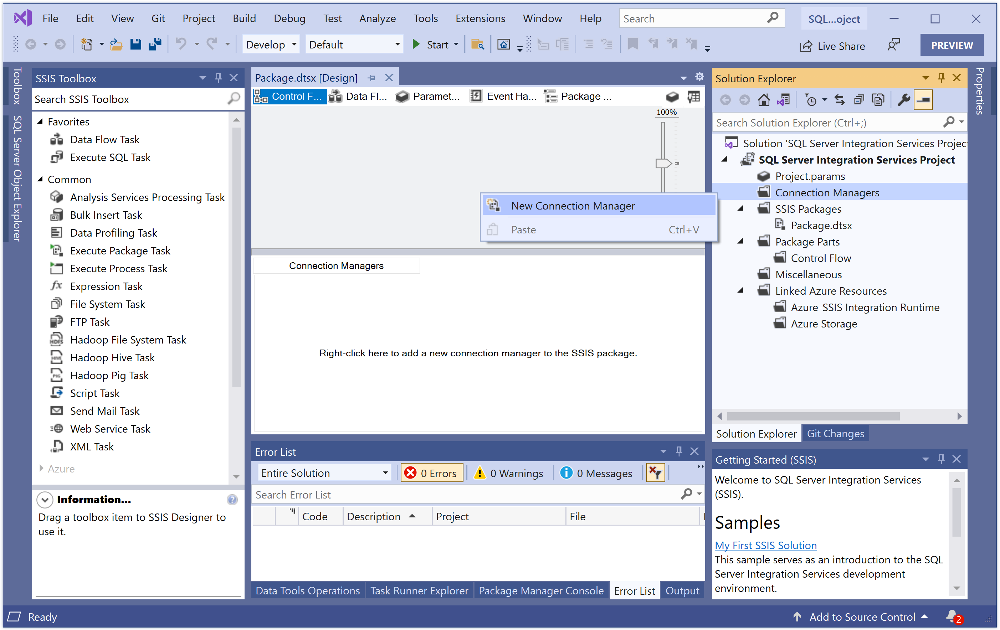
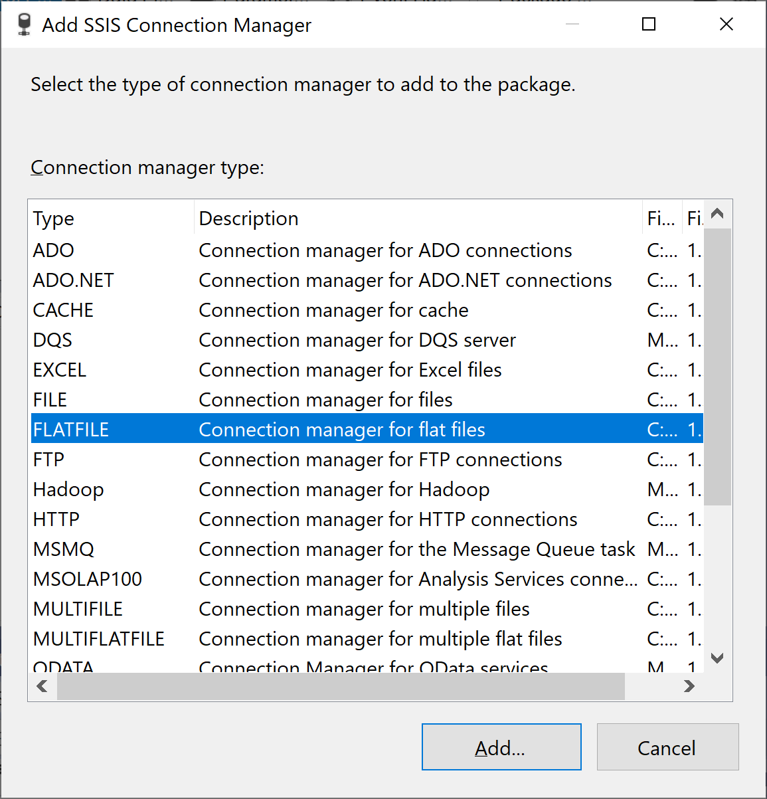
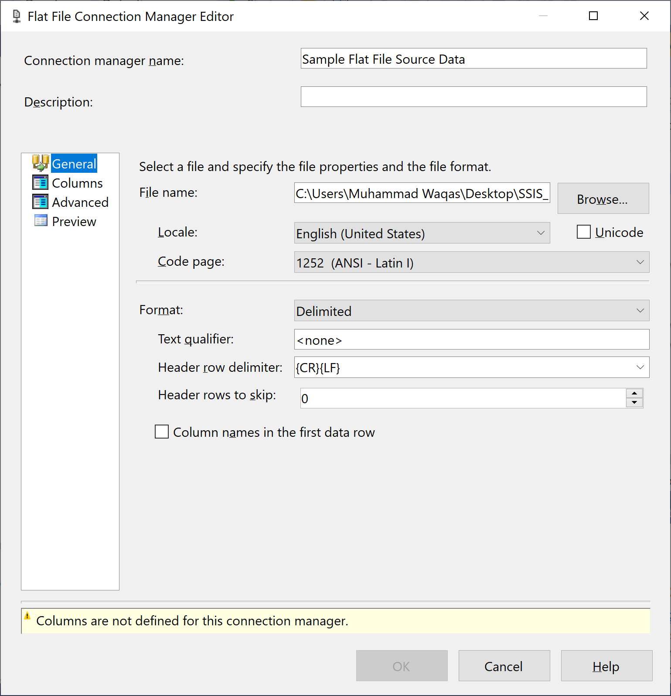
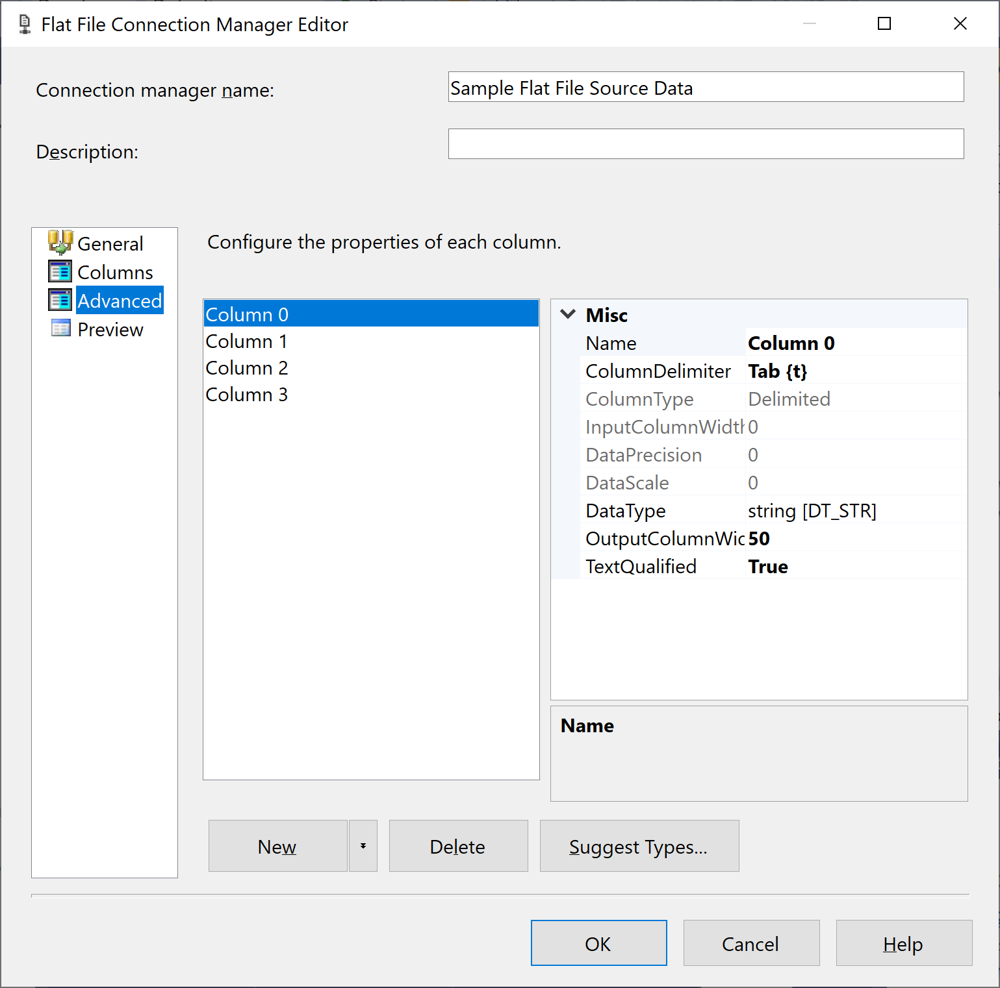
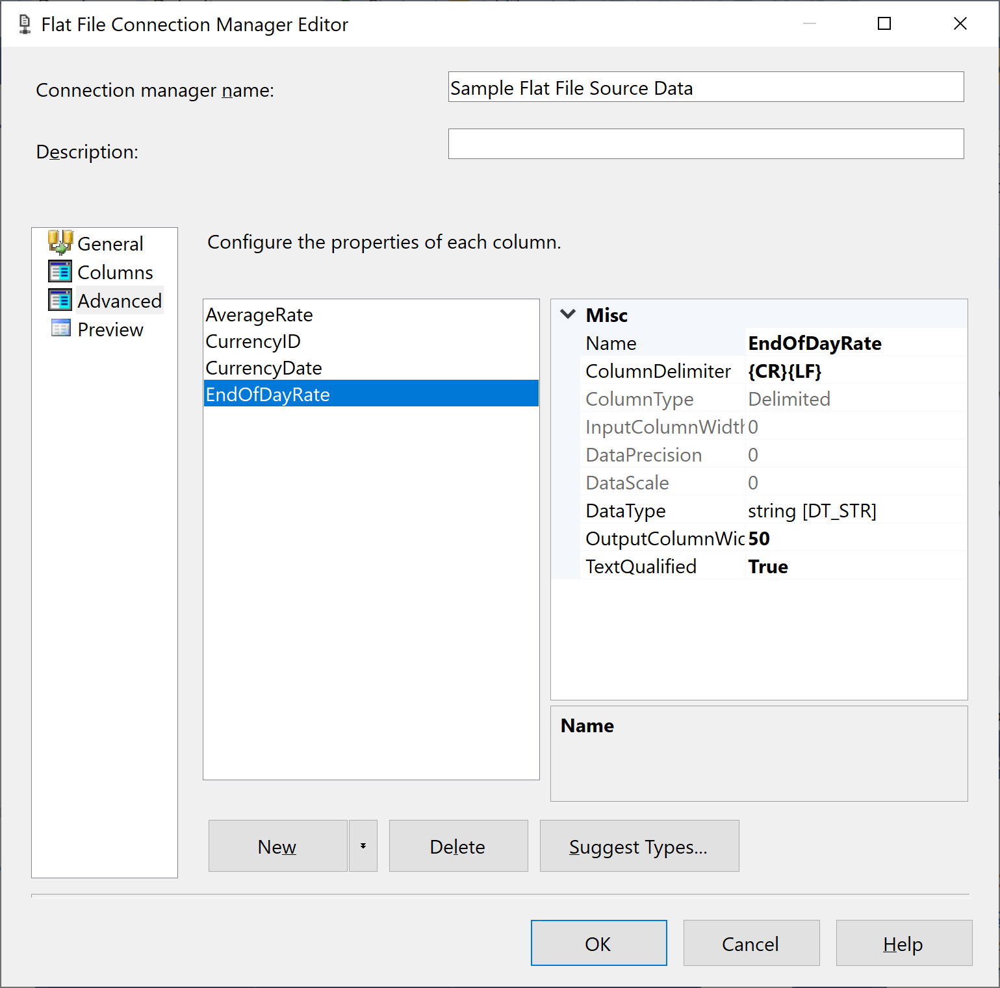
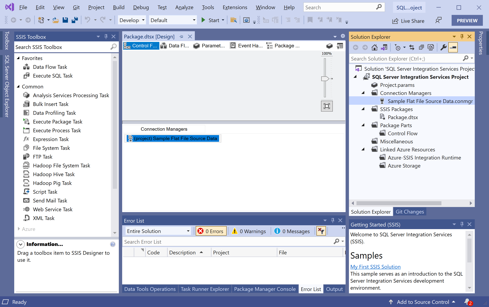

# Configure Flat File

A Flat File connection manager enables a package to extract data from a flat-file. Using the Flat File connection manager, you can specify the file name and location, the locale and code page, and the file format, including column delimiters, to apply when the package extracts data from the flat file.

## Create a Flat File 

The Flat File connection manager provides locale information about the data file. To add a Flate File, right-click on **Connection Managers**, in the **Solution Explorer pane**. 

Select **New Connection Manager** and it will open the **Add SSIS Connection Manager** dialog.

In the **Add SSIS Connection Manager** dialog, select **FLATFILE** and then click on **Add** button.

In the **Flat File Connection Manager Editor** dialog, enter "Sample Flat File Source Data" in the **Connection manager name** field and browse the `SampleCurrencyData.txt` file located on your computer. You will also need to set other fields as shown in the above screenshot.

## Rename Columns

In the **Flat File Connection Manager Editor** dialog, select the **Advanced** tab.

Let's make the following changes to the column names as shown below.

## Remap Column Data Types

By default, all four of the columns are initially set to a `string` data type `[DT_STR]` with an `OutputColumnWidth` of 50.

 - In the list, select the `CurrencyID` column and in the property pane, change the **DataType** of column `CurrencyID` from `string [DT_STR]` to `Unicode string [DT_WSTR]`.
 - In the property pane, change the data type of column `CurrencyDate` to `database date [DT_DBDATE]`.

Select **OK** button and you will see a Flat File is added under **Connection Manager**.

