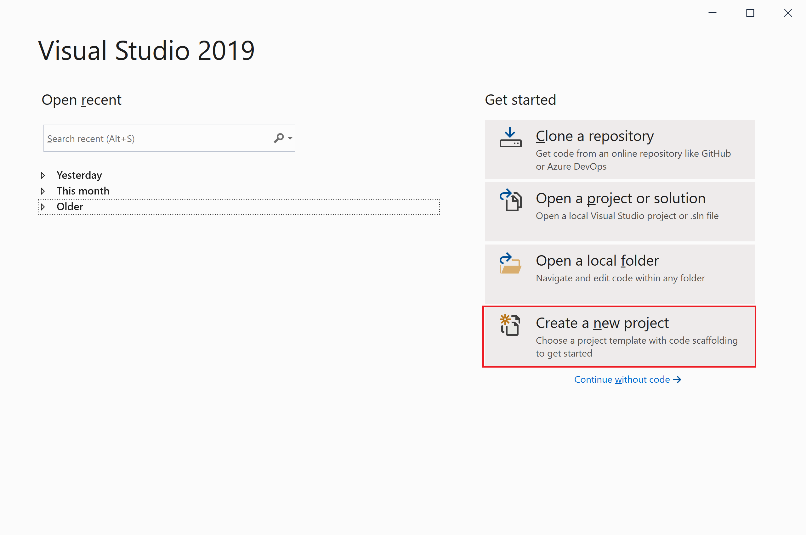
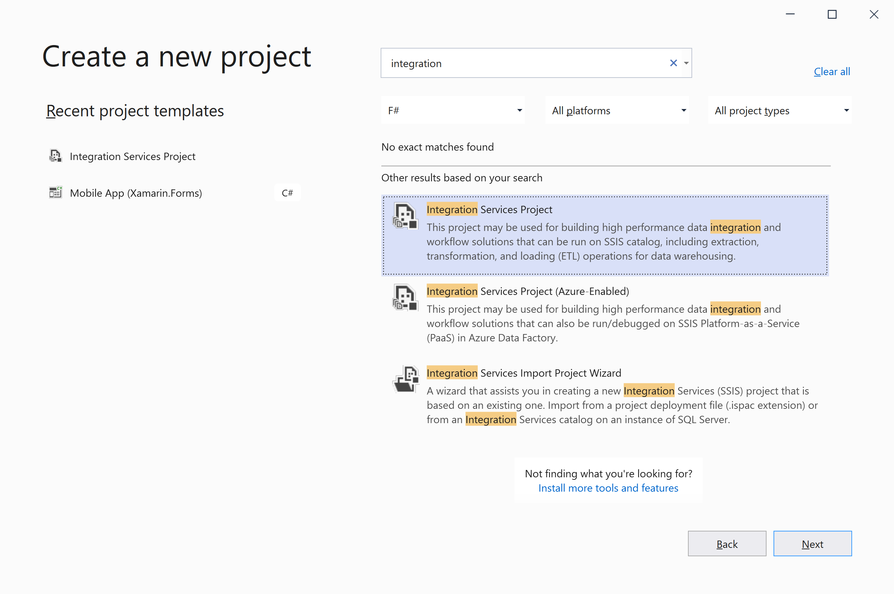
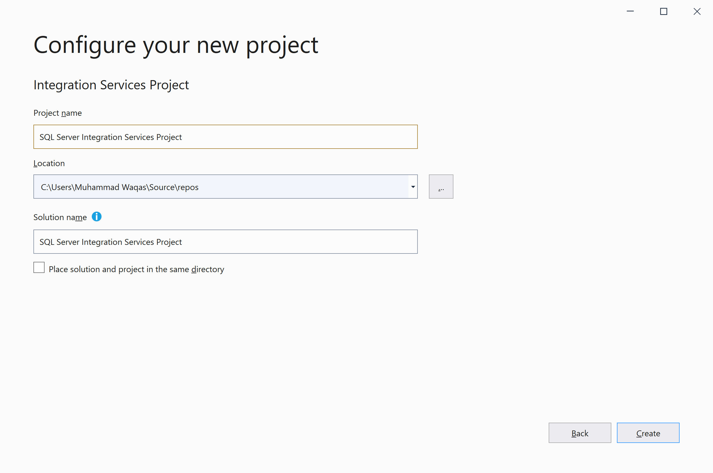
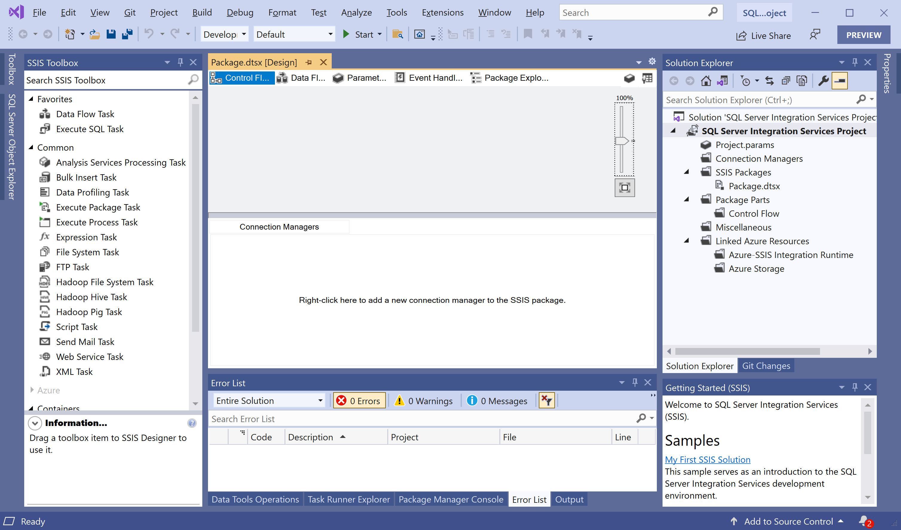
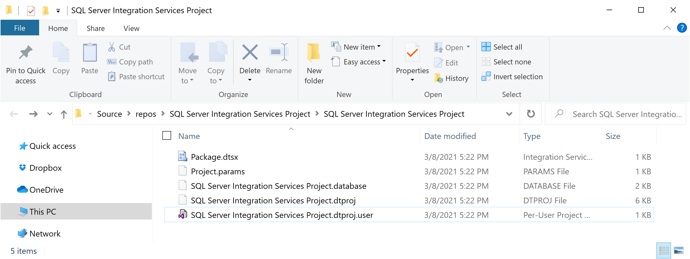

# Create Integration Services Project

To create a package in Integration Services, first, we will need to an **Integration Services project**. We are ready to create Integration Services projects by opening a Visual Studio.

Choose the **Create a new project** option.

Type "integration" to find **Integration Services Project**, select it, and click on the **Next** button.

Type a name for your project and click on the **Create** button.

It will create a project and open the interface where we can design and develop SSIS 2019 packages.

## Folders in Integration Services Project

The following table describes the folders that appear in an Integration Services project.

| Folder              | Description                                                 |
| :-------------------| :-----------------------------------------------------------|
| Connection Managers | Contains Project Connection Managers. For more information, see Integration Services (SSIS) Connections. |
| SSIS Packages       | Contains packages. For more information, see Integration Services (SSIS) Packages. |
| Package Parts       | Contains Package Parts that can be reused or imported. For more information, see Reuse Control Flow across Packages by Using Control Flow Package Parts. |
| Miscellaneous       | Contains files other than package files. |

## Files in Integration Services projects

When you add a new or an existing Integration Services project to a solution, SQL Server Data Tools (SSDT) creates project files that have the extensions `.dtproj`, `.dtproj.user`, `.database`, `Project.params`.

 - **\*.dtproj:** Contains information about project configurations and items such as packages.
 - **\*.dtproj.user:** Contains information about your preferences for working with the project.
 - **\*.database:** Contains information that SQL Server Data Tools (SSDT) requires to open the Integration Services project.
 - **Project.params:** Contains information about the Project parameters.
