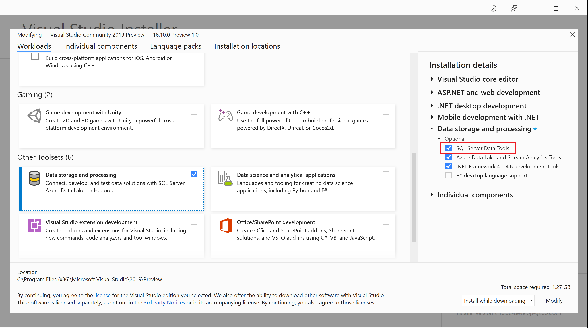
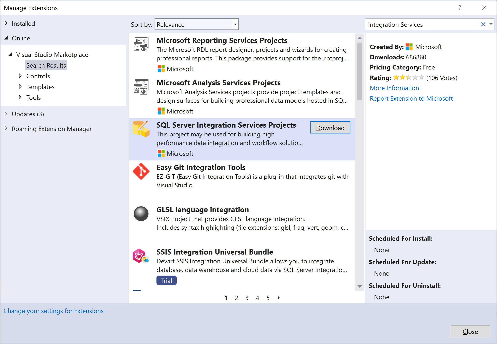
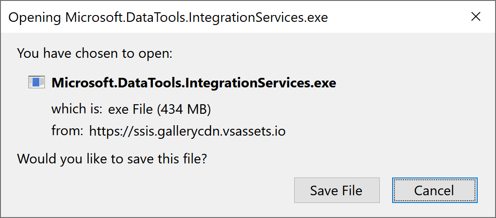
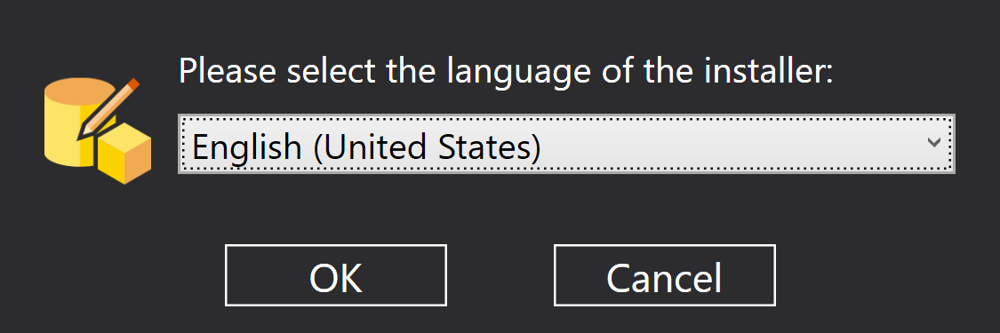
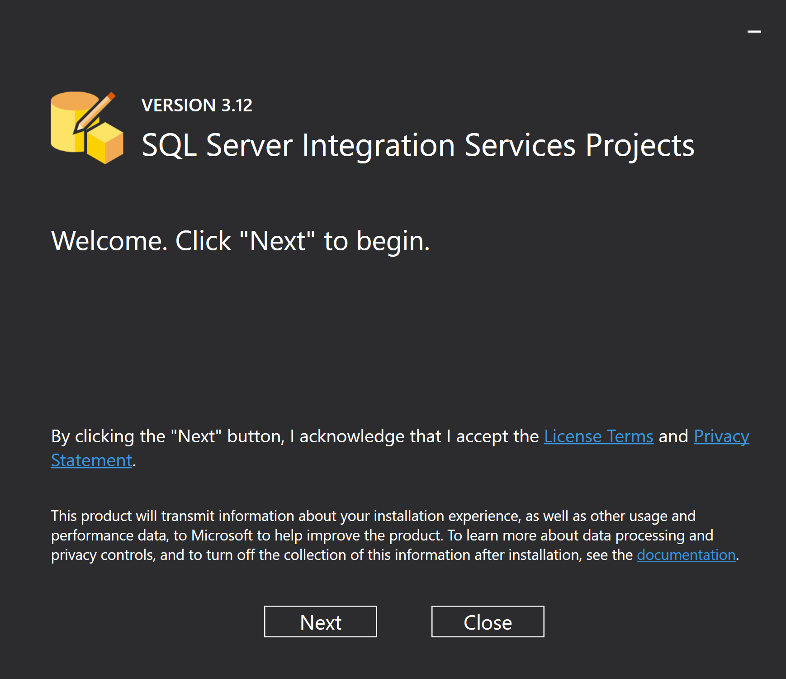
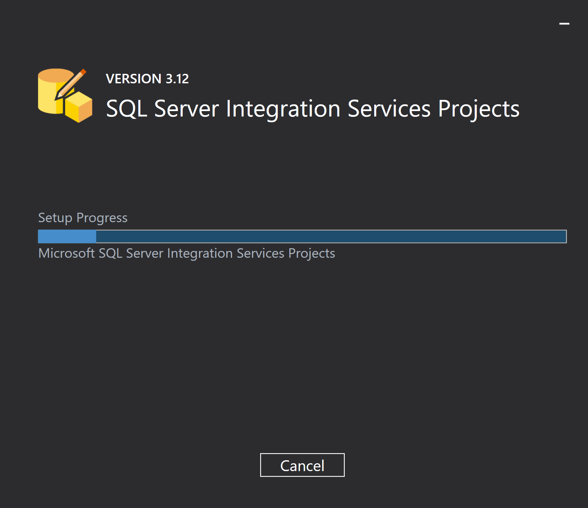

# Environment Setup

SQL Server provides a single setup program to install any or all of its components, including Integration Services. Use Setup to install Integration Services with or without other SQL Server components on a single computer.

## Download SQL Server Data Tools (SSDT) for Visual Studio

SQL Server Data Tools (SSDT) is a modern development tool for building SQL Server relational databases, databases in Azure SQL, Analysis Services (AS) data models, Integration Services (IS) packages, and Reporting Services (RS) reports. 

With SSDT, you can design and deploy any SQL Server content type with the same ease as you would develop an application in Visual Studio.

## SSDT for Visual Studio 2019

The core SSDT functionality to create database projects has remained integral to Visual Studio. With Visual Studio 2019, the required functionality to enable Integration Services projects has moved into the respective Visual Studio (VSIX) extensions only.

If Visual Studio 2019 is already installed, you can edit the list of workloads to include SSDT. If you don’t have Visual Studio 2019 installed, then you can download and install [Visual Studio 2019 Community](https://visualstudio.microsoft.com/downloads/).

To modify the installed Visual Studio workloads to include SSDT, use the Visual Studio Installer. In the installer, select the edition of Visual Studio that you want to add SSDT to, and then choose **Modify**.

Select **SQL Server Data Tools** under **Data storage and processing** in the workloads list and select the **Modify** button to start the installation.

Once the installation is completed, launch the Visual Studio.

For Analysis Services, Integration Services, or Reporting Services projects, you can install the appropriate extensions from within Visual Studio with **Extensions > Manage Extensions** or the Marketplace.

Click on the **Download** button, and it will prompt the following popup.

Click on the **Save** button, and once the file is downloaded, double click on the file.

Select your preferred language, and click on **Ok**

Click the **Next** button to start the process.

Once the setup is completed successfully, it will show you the message.

## SQL Server

If you don't already have Microsoft SQL Server, download a free Evaluation Edition, or the free Developer Edition, from [SQL Server downloads](https://www.microsoft.com/en-us/sql-server/sql-server-downloads?rtc=1). SSIS is not included with the Express edition of SQL Server.

## Database

The `AdventureWorksDW2017` sample database. To download the `AdventureWorksDW2017` database, download `AdventureWorksDW2019.bak` from [AdventureWorks sample databases](https://github.com/Microsoft/sql-server-samples/releases/tag/adventureworks) and restore the backup.

## Sample Files

Download the sample data files (`Creating a Simple ETL Package.zip`) from [https://www.microsoft.com/en-us/download/details.aspx?id=56827](https://www.microsoft.com/en-us/download/details.aspx?id=56827) and extract it, you will see various files in **Creating a Simple ETL Package\Sample Data** folder.