# Error Flow Redirection

To handle errors that may occur in the transformation process, Microsoft Integration Services lets you decide on a per-component and per-column basis how to handle data that Integration Services can't transform. You can choose to ignore a failure in certain columns, redirect the entire failed row, or fail the component. 

 - By default, components in Integration Services are configured to fail when errors occur. 
 - The failed component in turn causes the package to fail and processing then stops.

To demonstrate the configuration and handling of transformation errors, you need a sample flat file that, when processed, causes a component to fail.

## Create a Corrupted Sample Flat File

In any text editor, open the `Currency_VEB.txt` file.

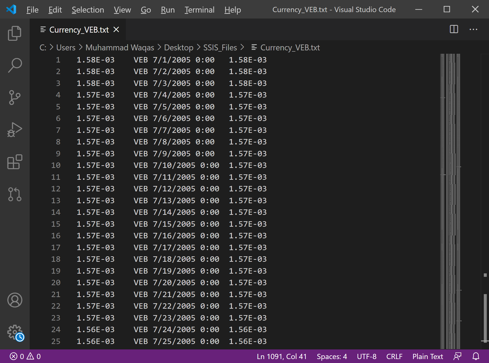

Find all instances of `VEB` and replace them with `BAD` using the text editor's find and replace feature.

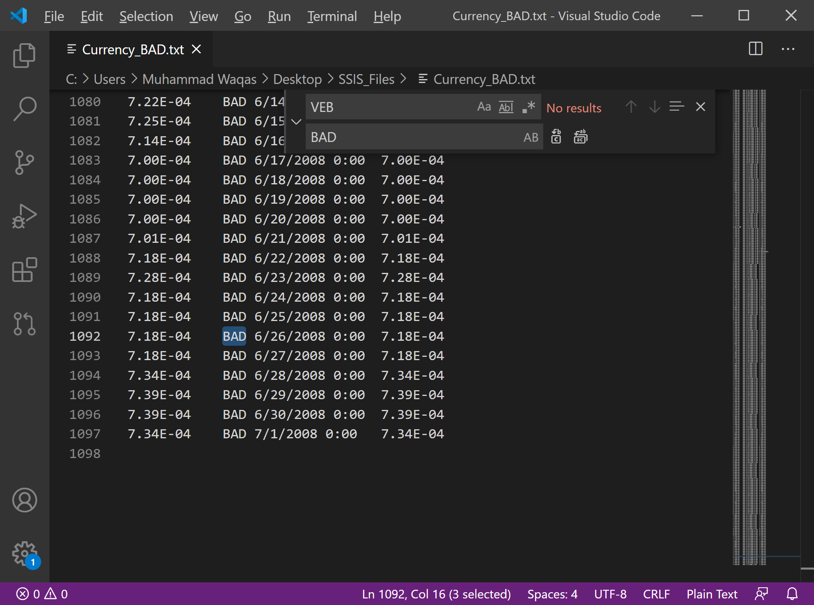

Save the modified file as `Currency_BAD.txt` in the same folder as the other sample data files.

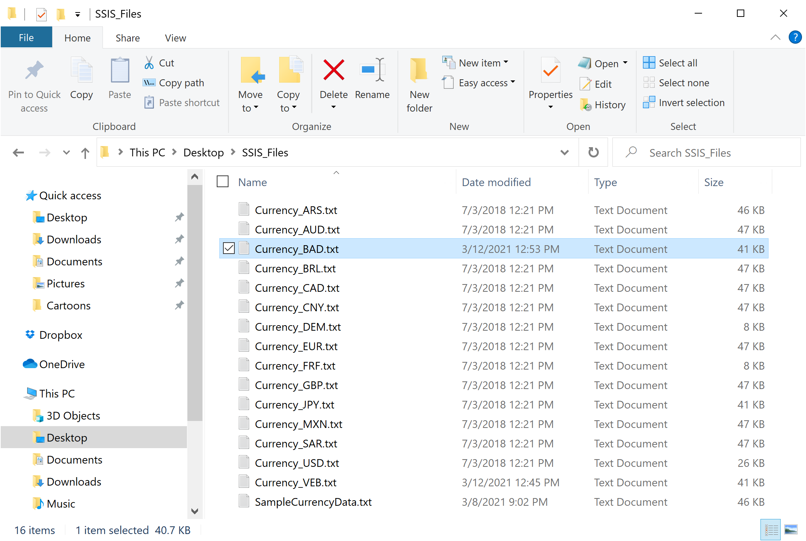

Close your text editor.

## Add Error Flow Redirection

The **Lookup Currency Key** transformation cannot generate a match when the transformation tries to process the corrupted sample flat file, which produces an error. Because the transformation uses the default settings for error output, any error causes the transformation to fail. 

 - When the transformation fails, the rest of the package also fails.
 - Rather than permitting the transformation to fail, you can configure the component to redirect the failed row to another processing path by using the error output. 
 - Using a separate error processing path provides more options. For instance, you can clean the data and then reprocess the failed row, or you can save the failed row along with its error information for later verification and reprocessing.

## Configure an Error Output

In the **SSIS Toolbox**, expand **Common**, and select the **Script Component**.

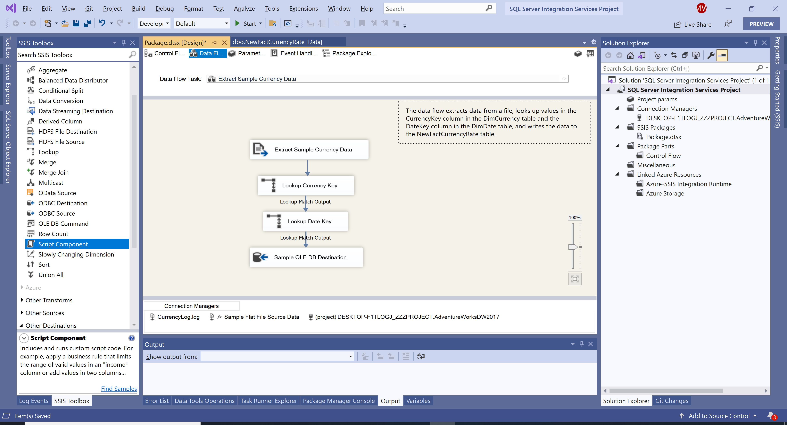

Drag the **Script Component** onto the design surface of the **Data Flow** tab to the right of the **Lookup Currency Key** transformation, and it will open the **Select Script Component Type** dialog.

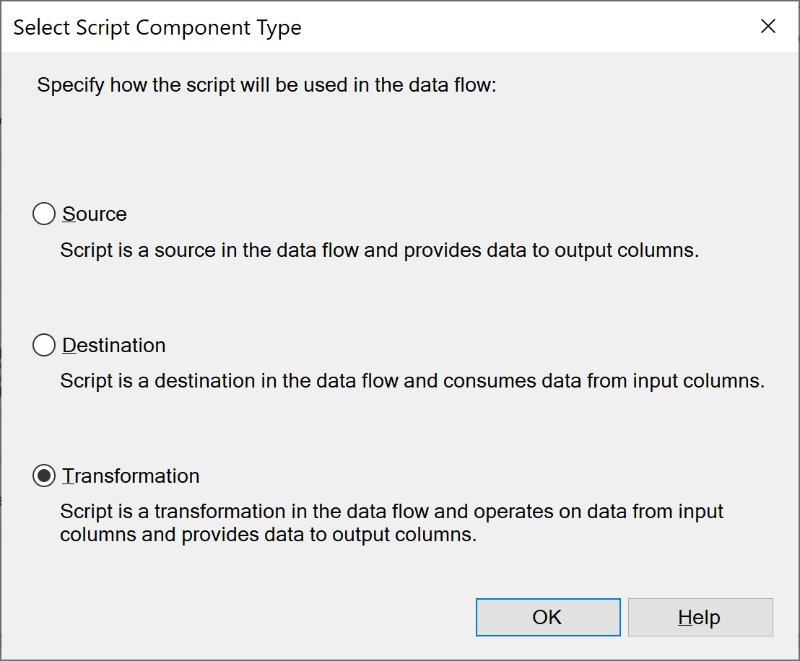

In the **Select Script Component Type** dialog box, select **Transformation**, and click **OK**.

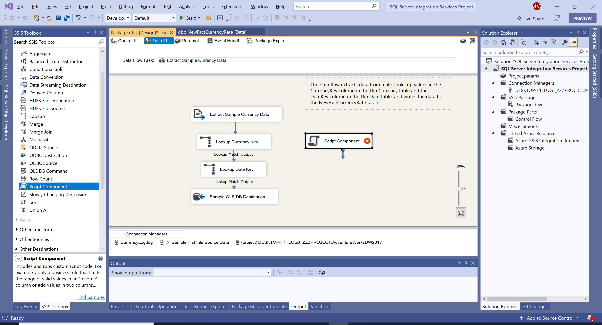

To connect the two components, select the **Lookup Currency Key** transformation and then drag its red arrow onto the new **Script** transformation, and it will open the **Configure Error Output** dialog.

 - The red arrow represents the error output of the **Lookup Currency Key** transformation. 
 - By using the red arrow to connect the transformation to the **Script** component, you redirect any processing errors to the **Script** component, which processes the errors and sends them to the destination.

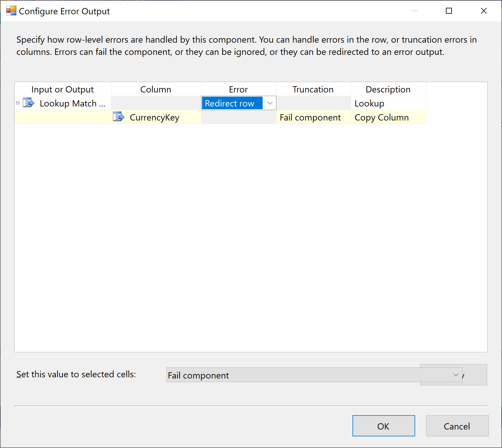

In the **Configure Error Output** dialog, select **Redirect row** in the **Error** column, and then select OK.

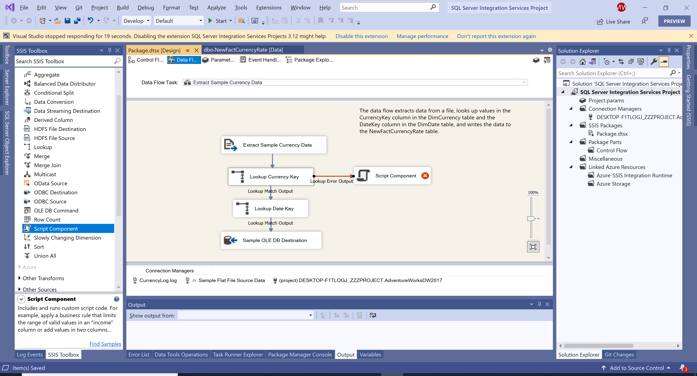

On the **Data Flow** design surface, change the name of **Script Component** to **Get Error Description**.

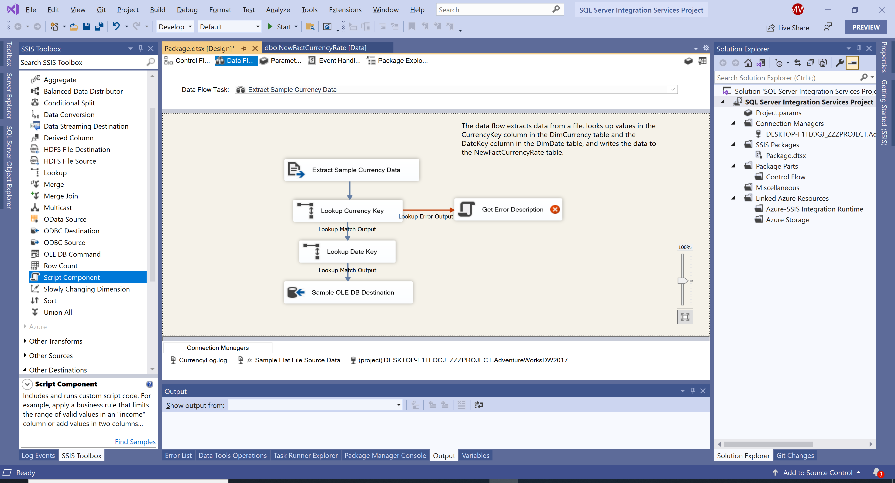

Double-click the **Get Error Description** transformation, and it will open the **Script Transformation Editor** dialog.

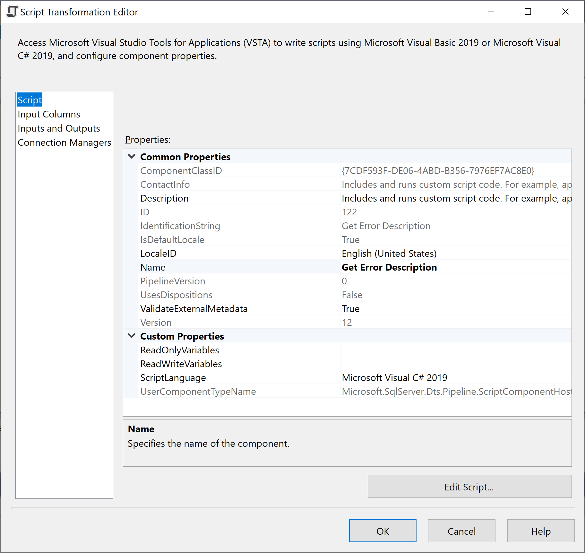

In the **Script Transformation Editor** dialog, verify that the **LocaleID** property is set to **English (United States)** On the **Script** page.

Go to the **Input Columns** page, select the **ErrorCode** column.

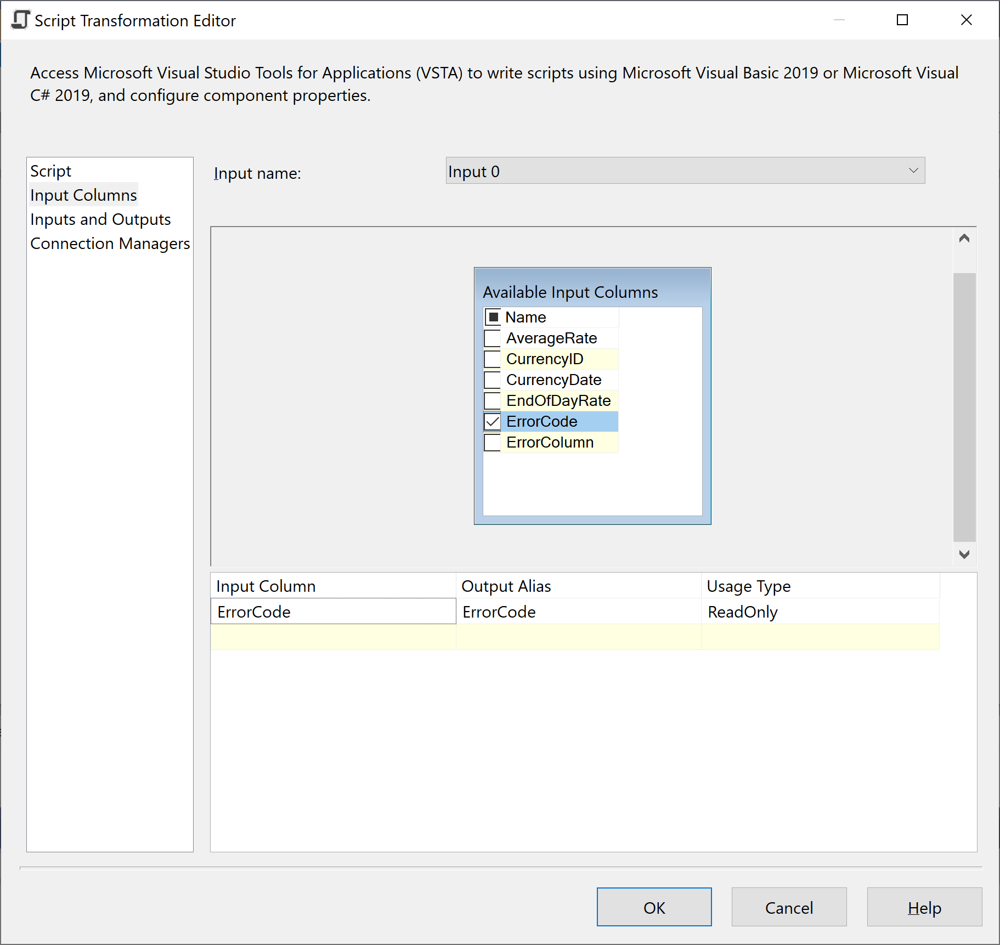

On the **Inputs and Outputs** page, expand Output 0, and then select **Output Columns**.

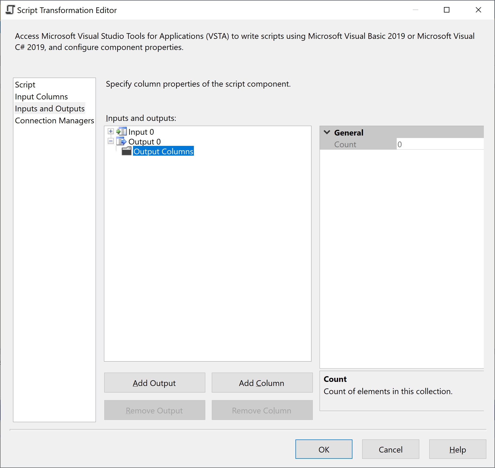

Select **Add Column** button.

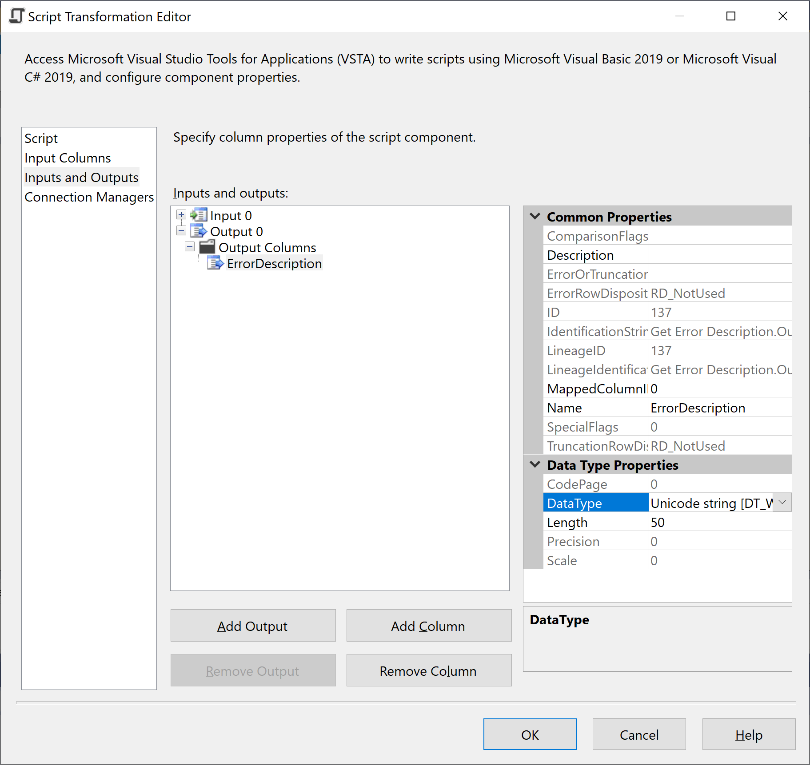

In the **Name** property, enter **ErrorDescription** and set the **DataType** property to **Unicode string [DT_WSTR]**.

Go to the **Script** page again and click on the **Edit Script** button to open **Microsoft Visual Studio Tools for Applications (VSTA)**. 

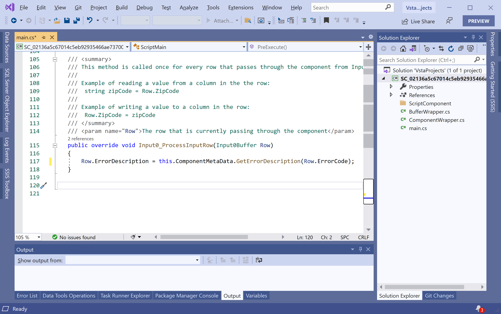

In the `Input0_ProcessInputRow` method, enter or paste the following code.

```csharp
public override void Input0_ProcessInputRow(Input0Buffer Row)
{
    Row.ErrorDescription = this.ComponentMetaData.GetErrorDescription(Row.ErrorCode);
}
```

On the **Build** menu, select **Build Solution** to build the script, save your changes, and close **VSTA**.

Click **OK** to close the **Script Transformation Editor** dialog.
