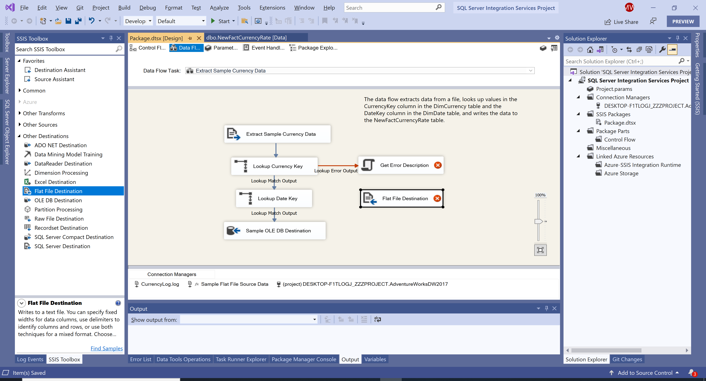
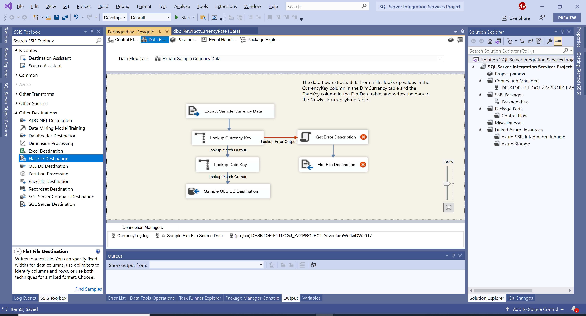
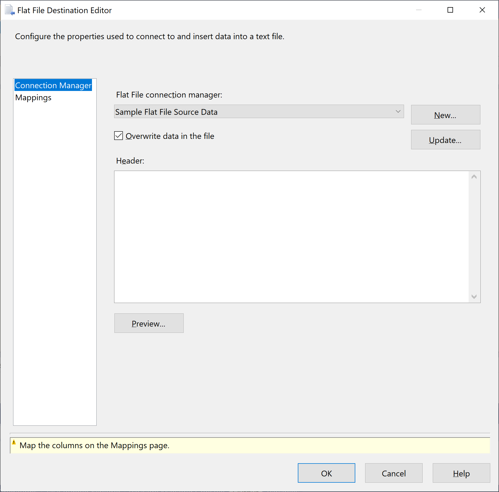
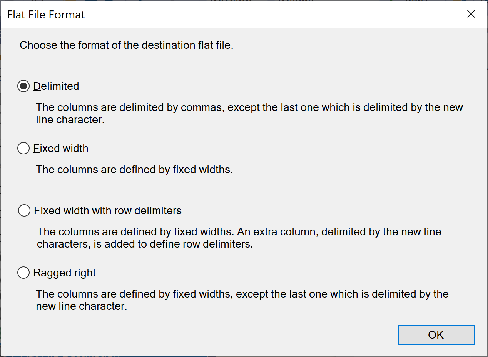
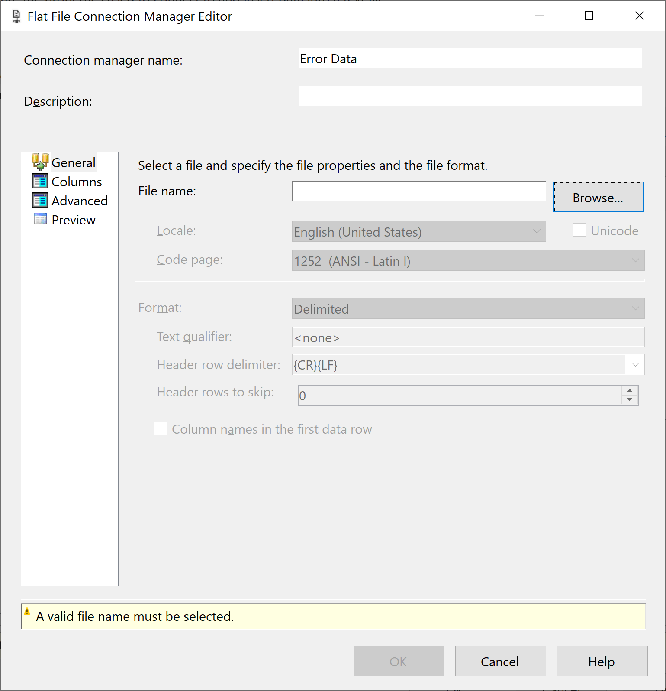
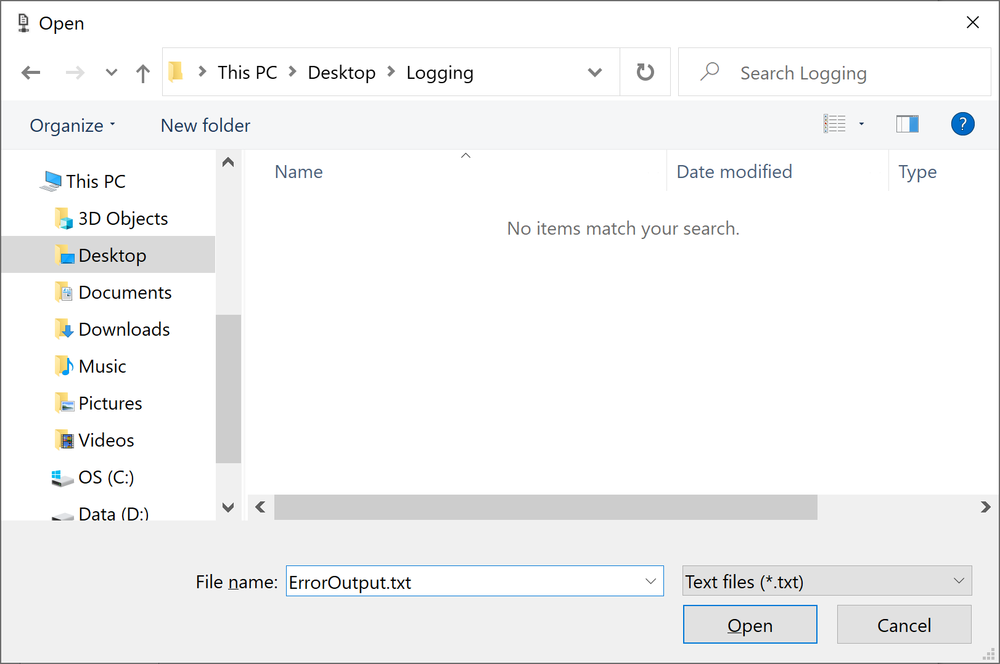
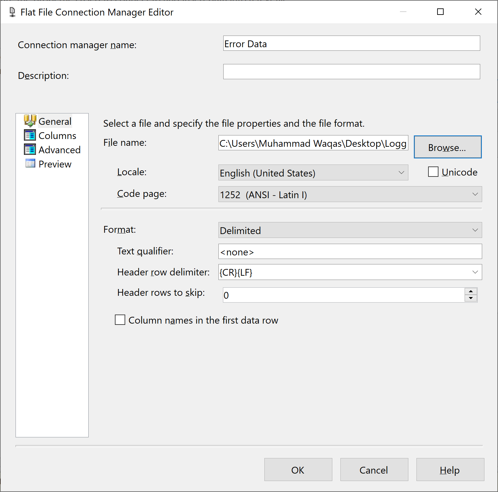
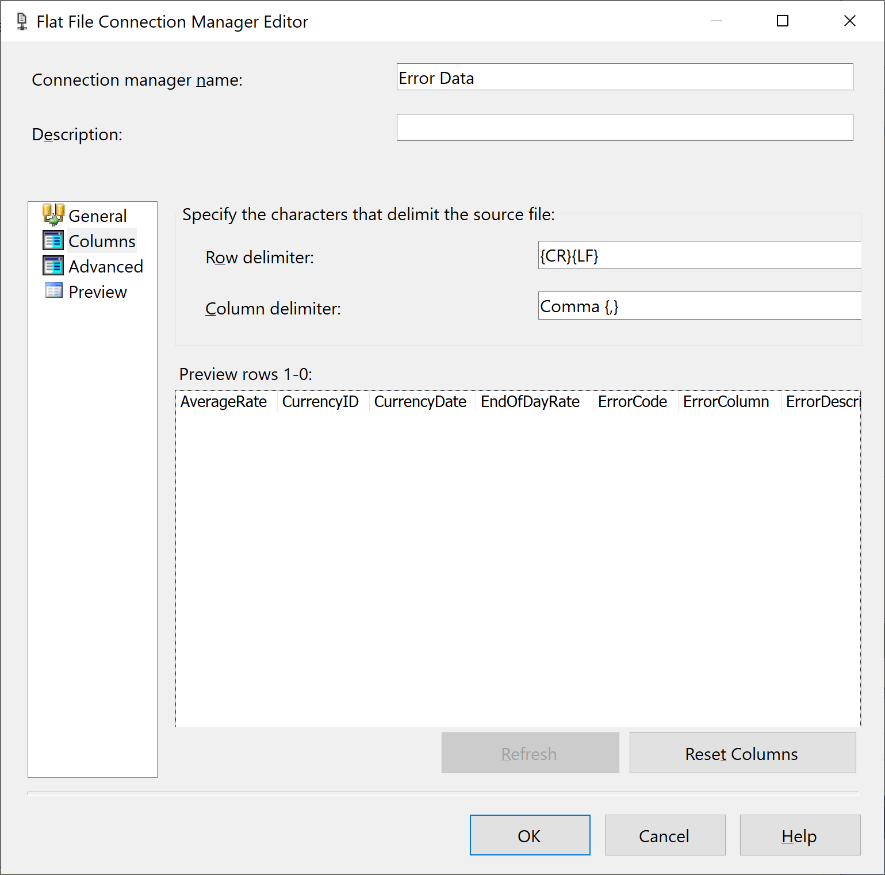
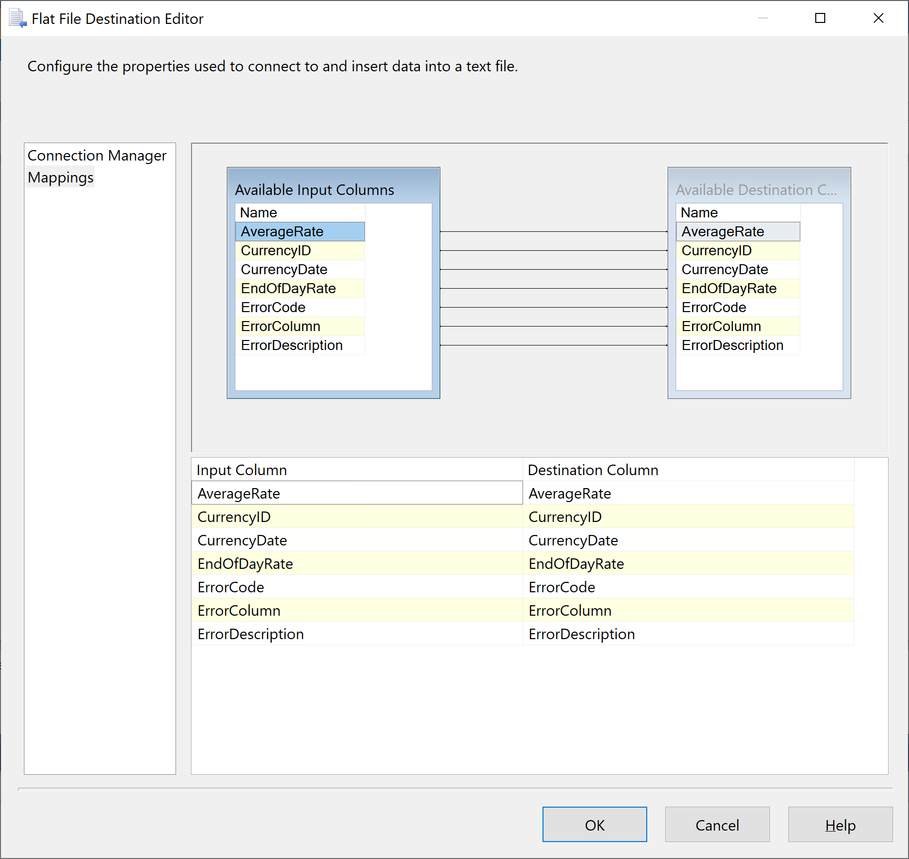

# Flat File Destination

The error output of the **Lookup Currency Key** transformation redirects any data rows that failed the lookup to the Script transformation operation. To provide more information about the errors that occurred, the Script transformation runs a script that gets each error's description.

## Add and Configure a Flat File Destination

To add all the information about the failed rows to a text file for later processing and to save the failed rows, we will add and configure a Flat File connection manager for the text file that contains the error data and a Flat File destination.

Open the **Data Flow** tab, expand **Other Destinations** in the **SSIS Toolbox**.

Drag **Flat File Destination** and place the **Flat File Destination** directly underneath the **Get Error Description** transformation.

Select the **Get Error Description** transformation, and then drag the blue arrow onto the new **Flat File Destination**.

On the **Data Flow** design surface, rename the **Flat File Destination** to **Failed Rows**. Right-click on the **Failed Rows** transformation and select **Edit...** option.

In the **Flat File Destination Editor**, click on the **New** button and it will open the **Flat File Format** dialog.

In the **Flat File Format** dialog, make sure that the **Delimited** option is selected, and then click **OK** button, it will open the **Flat File Connection Manager Editor** dialog.

In the **Flat File Connection Manager Editor**, enter **Error Data** in the **Connection manager name** field and then select **Browse** to locate the folder in which to store the file.

In the **Open File** dialog, enter **ErrorOutput.txt** in **File name** field, and then select **Open**.

In the **Flat File Connection Manager Editor** dialog, verify that **Locale** is **English (United States)** and **Code page** is **1252 (ANSI-Latin I)**.

Go to the **Columns** page, you can see three new columns: `ErrorCode`, `ErrorColumn`, and `ErrorDescription`. 

 - These columns are the error output of the **Lookup Currency Key** transformation and the script in the **Get Error Description** transformation. 
 - You can use these columns to troubleshoot the cause of the failed row.

Click on the **OK** button and in the **Flat File Destination Editor**, clear the **Overwrite data in the file** check box.

Clearing this check box persists the errors over multiple package executions by appending each new run's error output.

Go to the **Mappings** page to verify that all the columns are correct. Optionally, you can rename the columns in the destination.

Click on the **OK** button.
