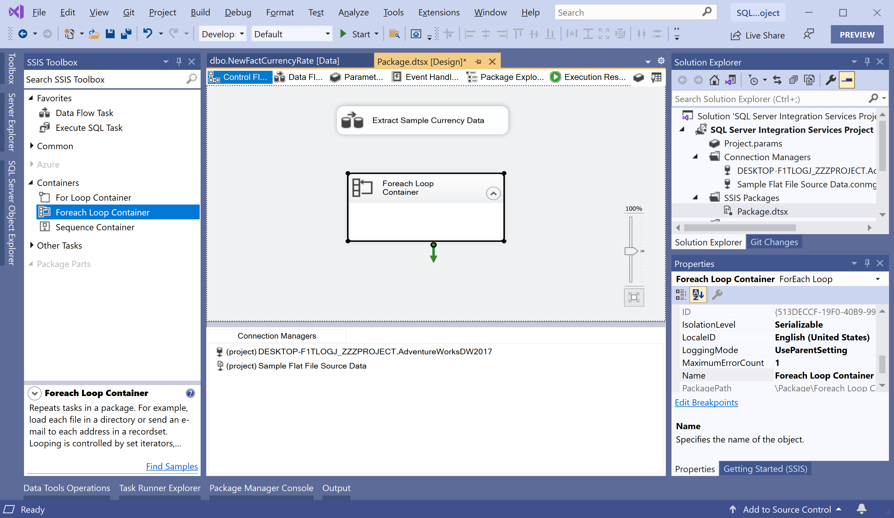
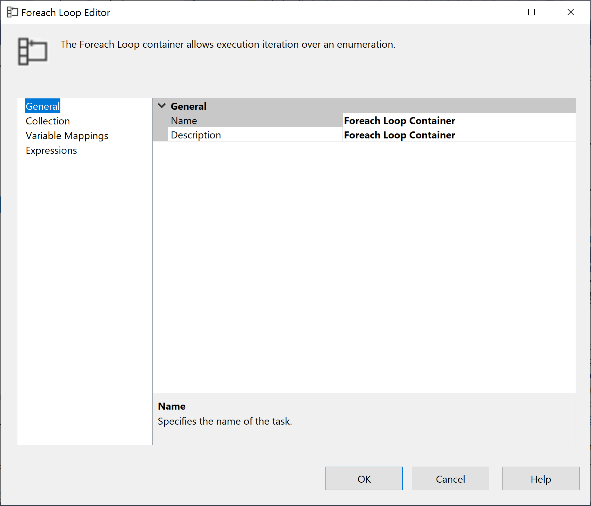
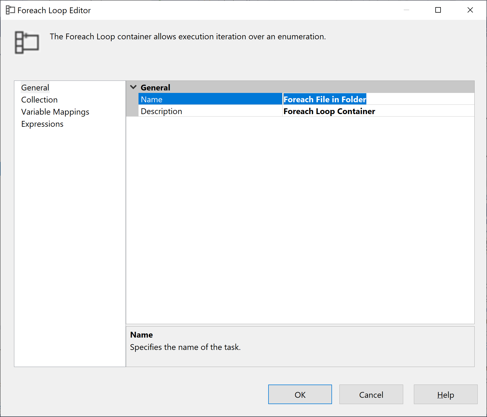
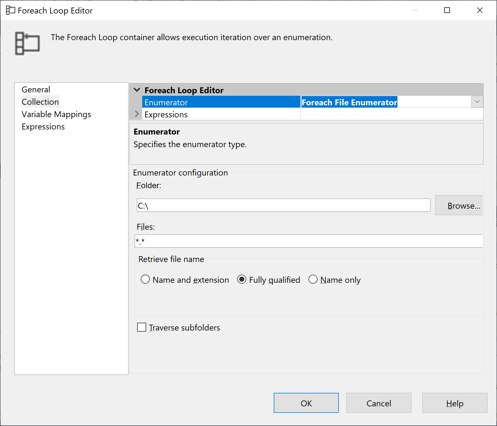
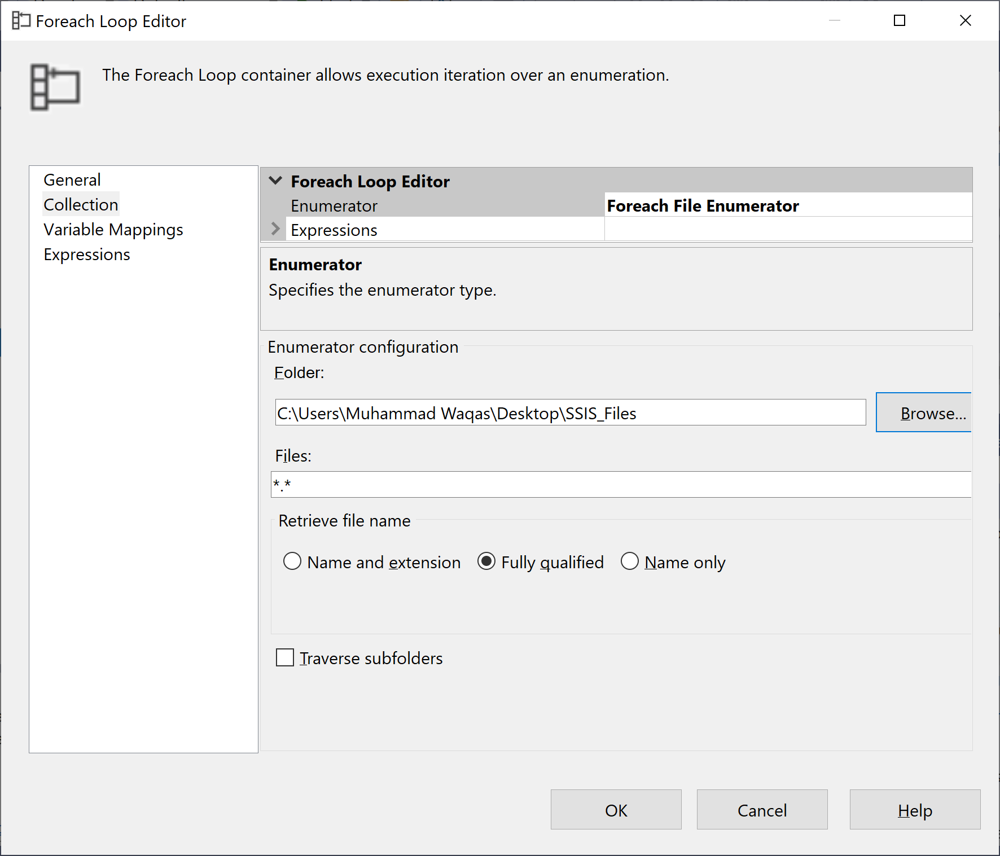
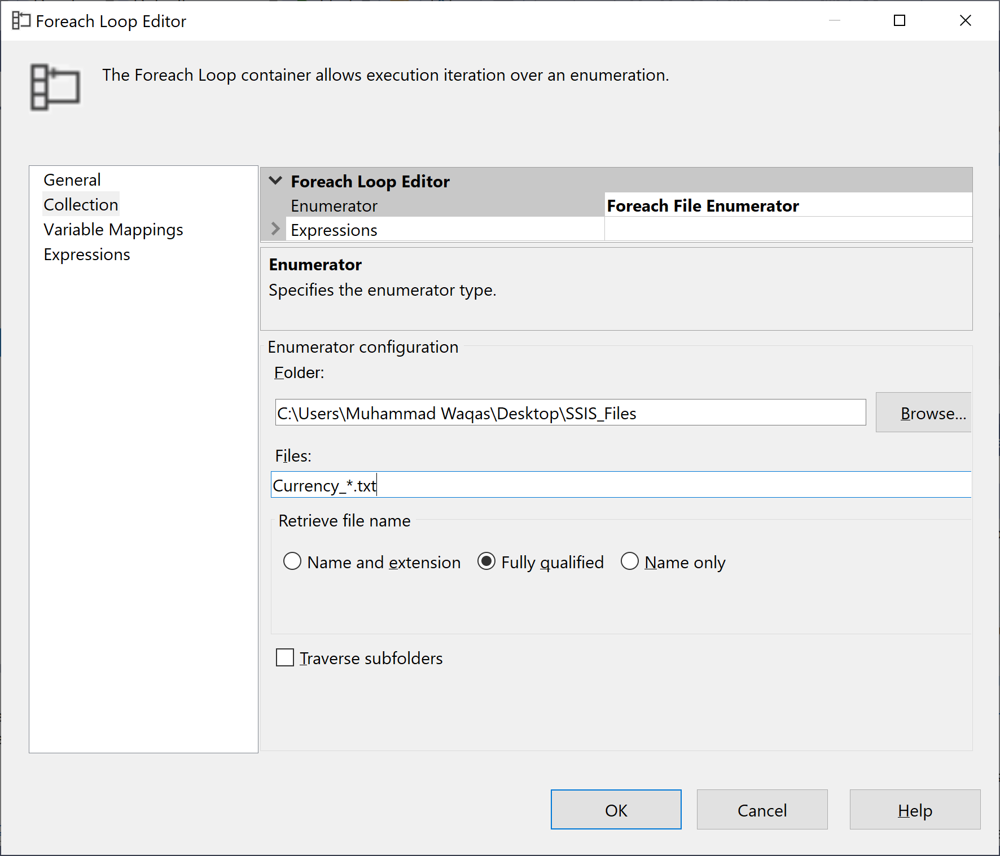
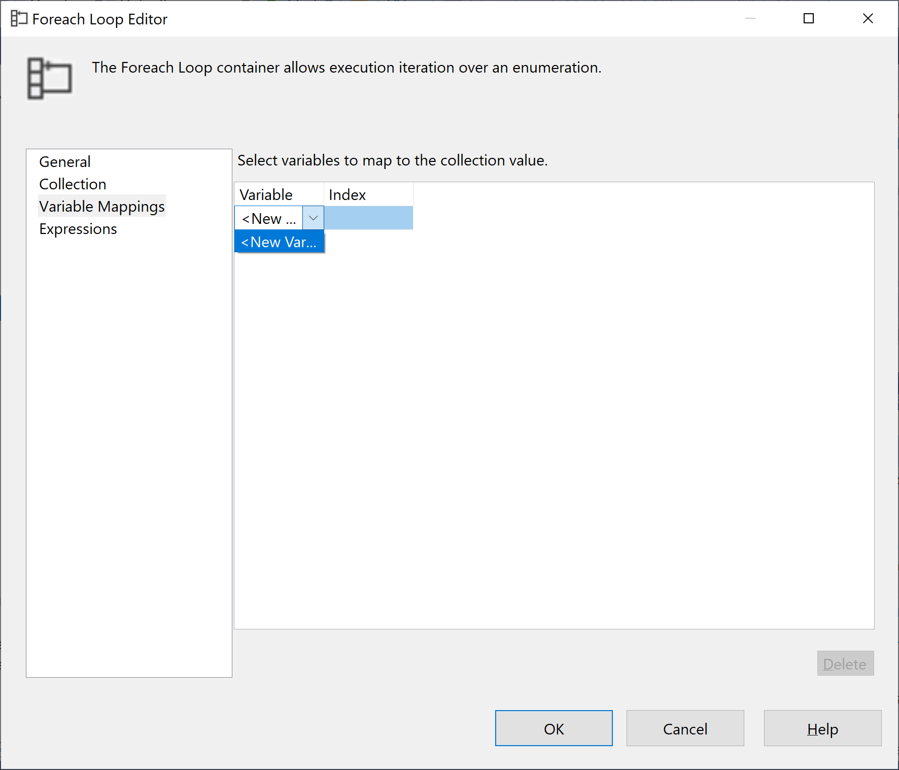
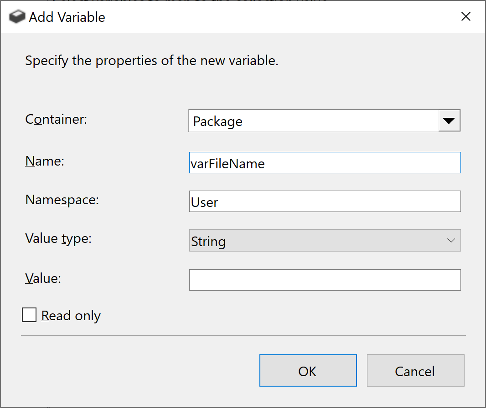
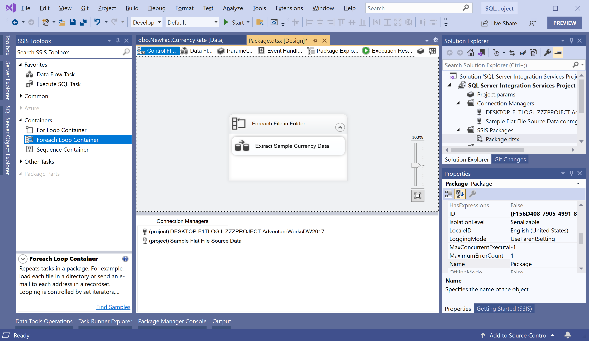

# Foreach Loop Container

The Foreach Loop container enables a package to repeat the control flow for each member of a specified enumerator.

 - The Foreach Loop container that you add must connect to each flat file in the folder. 
 - Because all the files in the folder have the same format, the Foreach Loop container can use the same Flat File connection manager to connect to each of these files.

Currently, the Flat File connection manager connects to only one specific flat file. To iteratively connect to each flat file in the folder, you have to configure both the Foreach Loop container and the Flat File connection manager as follows:

 - **Foreach Loop container:** You map the enumerated value of the container to a user-defined package variable. The container then uses this variable to dynamically modify the `ConnectionString` property of the Flat File connection manager and iteratively connect to each flat file in the folder.
 - **Flat File connection manager:** You modify the connection manager that was created in Lesson 1 by using a user-defined variable to populate the connection manager's `ConnectionString` property.

In the **SSIS Toolbox**, expand **Containers**, and then drag a **Foreach Loop Container** onto the design surface of the **Control Flow** tab.

Right-click on the new **Foreach Loop Container** and select **Edit**.

In the **Foreach Loop Editor** dialog, on the **General** page, enter **Foreach File in Folder** in the **Name** field. 

Click on the **OK** button. Now right-click the Foreach Loop container, select **Properties**, and in the **Properties** window verify that the **LocaleID** property is set to **English (United States)**.

## Configure the Enumerator for the Foreach Loop Container

To configure the enumerator, double-click on the **Foreach File in Folder**. It will open the **Foreach Loop Editor** dialog and go to the **Collection** page.

On the **Collection** page, select **Foreach File Enumerator**.

In the **Enumerator configuration** group, select the **Browse** button and locate the folder on your machine that contains the Currency_*.txt files included with the sample data.

In the **Files** box, enter Currency_*.txt.

Now go to the **Variable Mappings** page, and click on the empty cell in the **Variable** column.

Select **<New Variable...>** and it will open the **Add Variable** dialog.

In the **Add Variable** dialog box, enter `varFileName` in the **Name** field and click the **OK** button.

Select the **OK** button again to exit the **Foreach Loop Editor** dialog.

## Add the Data Flow Task to the Loop

To add the data flow task to the loop, drag the **Extract Sample Currency Data** data flow task onto the **Foreach File in Folder** Foreach Loop container.

