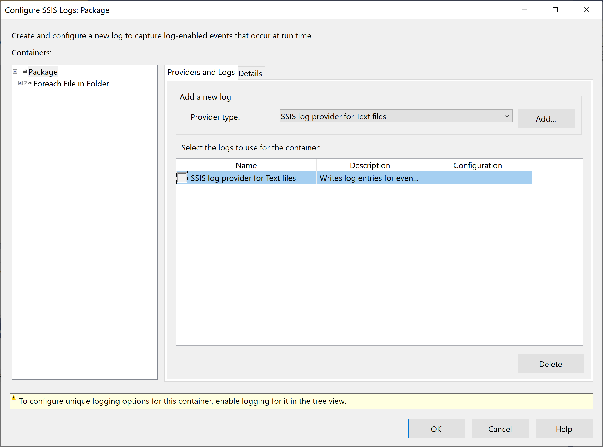
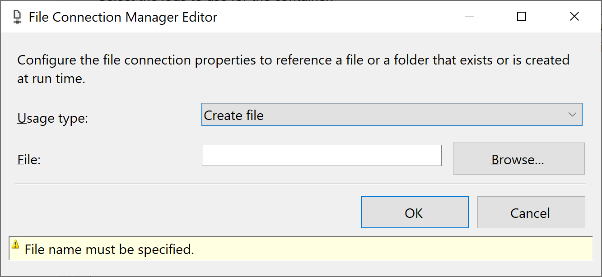
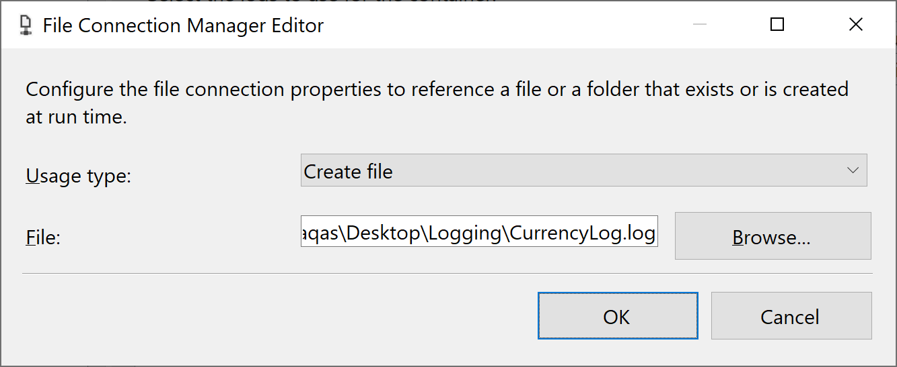
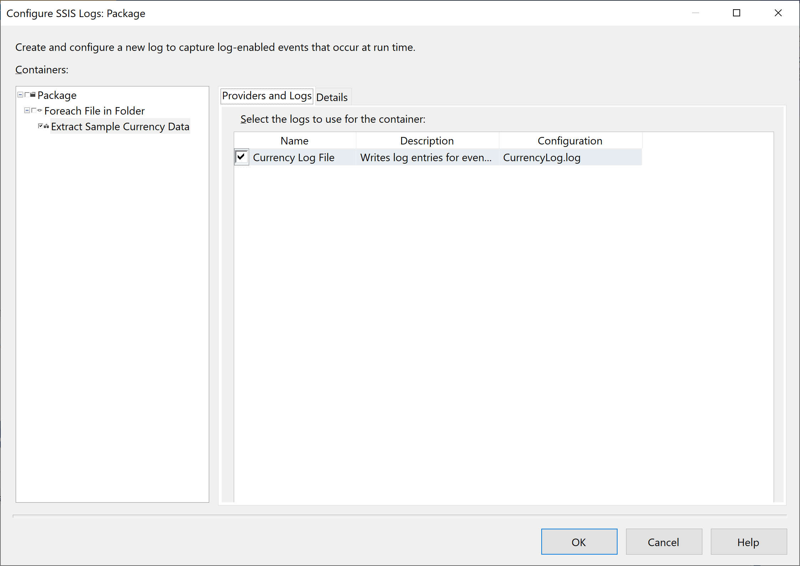
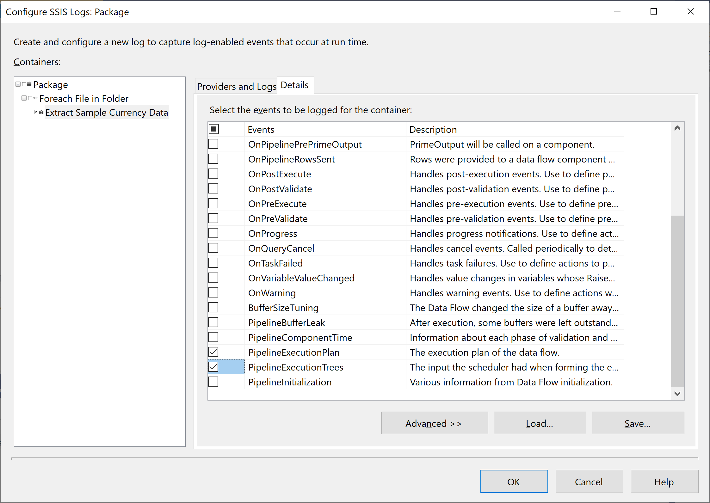
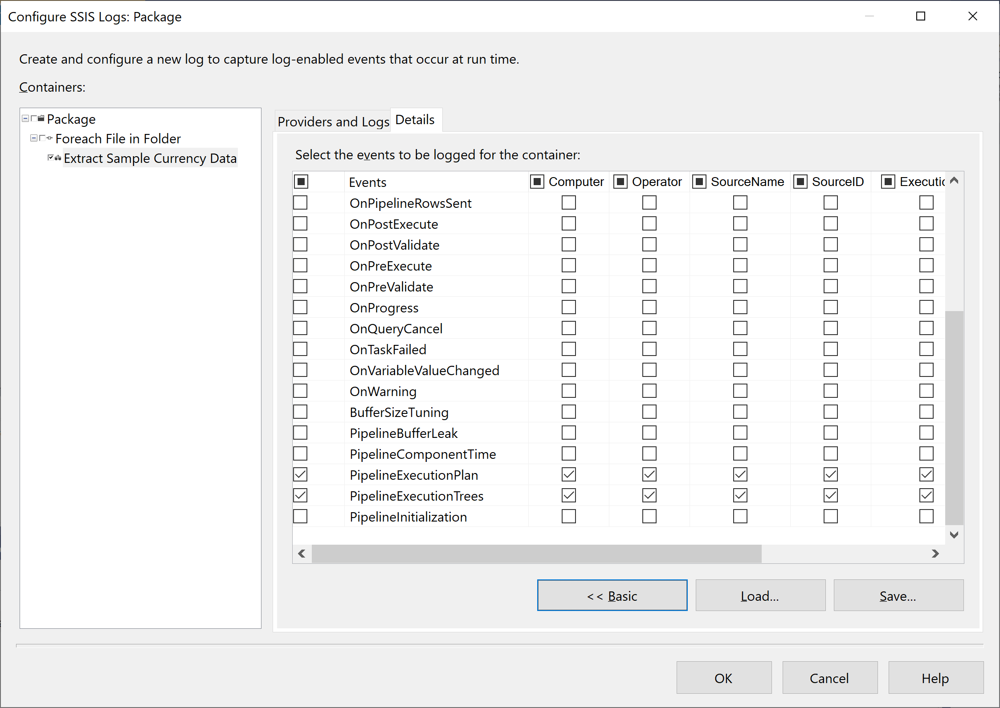

# Logging

Microsoft Integration Services includes logging features that let you troubleshoot and monitor package execution by providing a trace of task and container events. 

 - The logging features are flexible, and you can enable logging at the package level or on individual tasks or containers within the package. 
 - You can also select which events you want to log in to and create multiple logs against a single package.

## Log Providers

Log providers create the logs, and each log provider can write logging information to different formats and destination types. Integration Services provides the following log providers:

 - Text file
 - SQL Server Profiler
 - Windows Event Log
 - SQL Server
 - XML file

## Add Logging to the Package

In Visual Studio 2019, go to the **Data Flow** tab and then select **Extensions -> SSIS** menu and select **Logging**. 

In the **Configure SSIS Logs** dialog, select **Package** in the **Containers** pane, and in the **Providers and Logs** tab, select **SSIS log provider for Text files** in the **Provider type** box and then select **Add**.

Integration Services adds a new Text File log provider to the package, with the default name **SSIS log provider for text files**. 

You can now configure the new log provider. 

 - In the **Name** column, enter **Currency Log File**.
 - You can also modify the **Description** as you want.
 - In the **Configuration** column, select `<New Connection>` to specify where Integration Services writes log information.

In the **File Connection Manager Editor dialog** box, select **Create file** for **Usage type**. 

Select the **Browse** button, and it will open the **Select File** dialog. By default, it opens the project folder, but you can save log information to any location. 

In the **Select File** dialog, enter `CurrencyLog.log` in the **File name** field and select the **Open** button.

Select **OK** to close the **File Connection Manager Editor** dialog.

In the **Containers** pane, expand all nodes of the package container hierarchy, and then clear all checkboxes, including the **Extract Sample Currency Data** check box. Now select the check box for Extract Sample Currency Data to get only the events for this node. Now go to the **Details** tab.

On the **Details** tab, select the **PipelineExecutionPlan** and **PipelineExecutionTrees** events in the **Events** column.

Select **Advanced** to review the details that the log provider writes to the log for each event. By default, all information categories are automatically selected for the events you specify.

On the **Provider and Logs** tab, in the **Name** column, you can optionally deselect it to turn off logging, without having to delete and re-create a log provider.

Select the **OK** button.

## Test Package

Right-click on the **Control Flow** area, and it gives you a list of options.

Select **Log Events** option. To test the package, go to the **Debug** menu, select **Start Debugging**.

After it is executed successfully, open the CurrencyLog.log file. you can see that the first line lists the information fields specified in the Details tab of the Configure SSIS Logs dialog box. You can also see that Integration Services logged the two events that you selected, **PipelineExecutionPlan** and **PipelineExecutionTrees**, for each iteration of the Foreach Loop.
