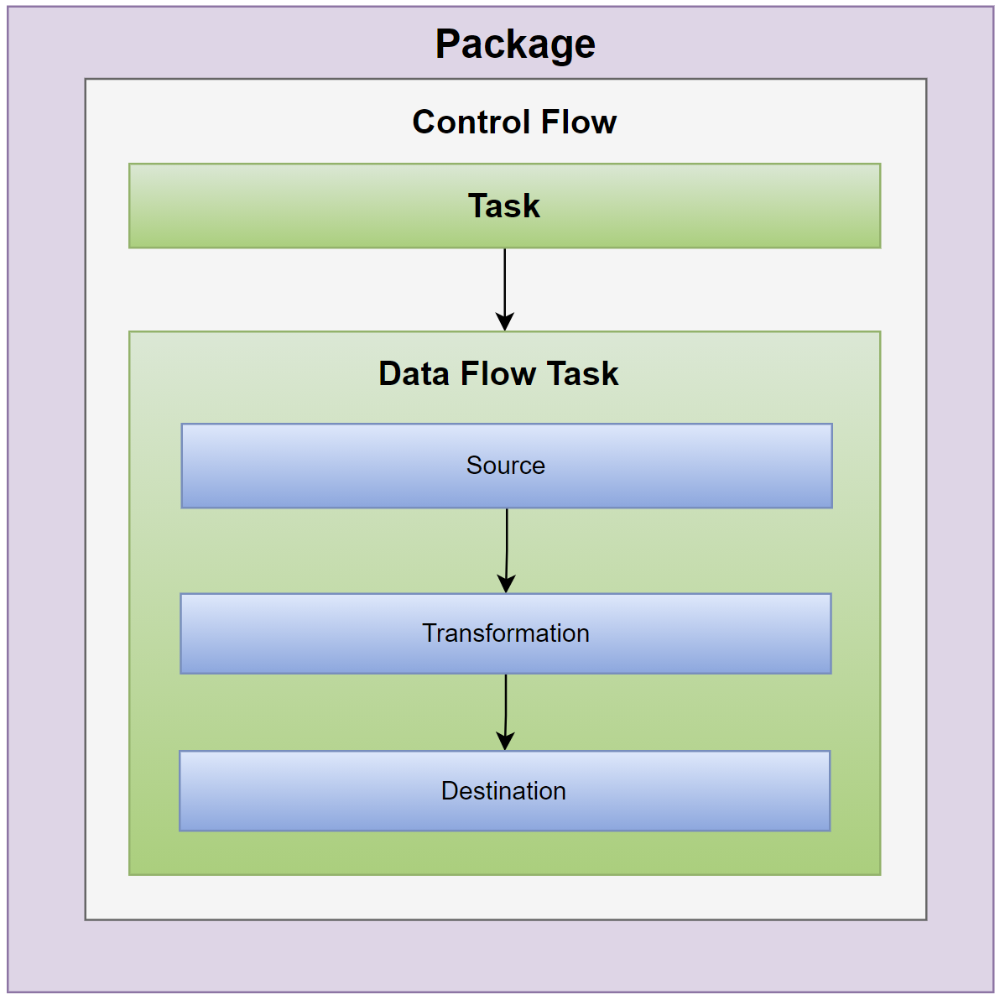

# Packages

A package is an organized collection of connections, control flow elements, data flow elements, event handlers, variables, parameters, and configurations, that you assemble using either the graphical design tools that SQL Server Integration Services provides or build programmatically. 

 - The completed package is saved to SQL Server, the SSIS Package Store, or the file system, or you can deploy it to the SSIS server. 
 - The package is the unit of work that is retrieved, executed, and saved.

## How it works?

When you first create a package, it is an empty object that does nothing. To add functionality to a package, you can add a control flow and one or more data flows to the package.

The following diagram shows a simple package that contains a control flow with a Data Flow task.

 - You can also add advanced features such as logging and variables to extend package functionality.
 - The completed package can then be configured by setting package-level properties that implement security, restarting packages from checkpoints, or incorporating transactions in package workflow. 

## Contents of a Package

### Tasks and Containers (Control flow)

A control flow consists of one or more tasks and containers that execute when the package runs. 

 - To control order or define the conditions for running the next task or container in the package control flow, you use precedence constraints to connect the tasks and containers in a package. 
 - A subset of tasks and containers can also be grouped and run repeatedly as a unit within the package control flow. 
 - 
### Data Sources and Destinations (Data Flow) 

A data flow consists of the sources and destinations that extract and load data, the transformations that modify and extend data, and the paths that link sources, transformations, and destinations. 

 - Before you can add a data flow to a package, the package control flow must include a Data Flow task. 
 - The Data Flow task is the executable within the SSIS package that creates, orders, and runs the data flow. 
 - A separate instance of the data flow engine is opened for each Data Flow task in a package. 

### Connection Managers (Connections)

A package typically includes at least one connection manager. 

 - A connection manager is a link between a package and a data source that defines the connection string for accessing the data that the tasks, transformations, and event handlers in the package use. 
 - Integration Services includes connection types for data sources such as text and XML files, relational databases, and Analysis Services databases and projects.

## Extend Package Functionality

Packages can include additional objects that provide advanced features or extend existing functionality.

### Event Handlers

An event handler is a workflow that runs in response to the events raised by a package, task, or container. 

 - For example, you can use an event handler to check disk space when a pre-execution event occurs or if an error occurs and send an e-mail message that reports the available space. 
 - An event handler is constructed like a package, with a control flow and optional data flows. 
 - Event handlers can be added to individual tasks or containers in the package. 
 
### Configurations

A configuration is a set of property-value pairs that define the package's properties and its tasks, containers, variables, connections, and event handlers when the package runs. 

 - Using configurations makes it possible to update properties without modifying the package. 
 - When the package is run, the configuration information is loaded, updating the values of properties. For example, a configuration can update the connection string of the connection.

### Logging and Log Providers

A log is a collection of information about the package that is collected when the package runs. 

 - A log can provide the start and finish time for a package run. 
 - A log provider defines the destination type and the format that the package and its containers and tasks can use to log run-time information. 
 - The logs are associated with a package, but the package's tasks and containers can log information to any package log.

### Variables

Integration Services supports system variables and user-defined variables. 

 - The system variables provide useful information about package objects at run time, and user-defined variables support custom scenarios in packages. 
 - Both types of variables can be used in expressions, scripts, and configurations.

## Parameters

Integration Services parameters allow you to assign values to properties within packages at the time of package execution. 

 - You can create project parameters at the project level and package parameters at the package level. 
 - Project parameters are used to supply any external input the project receives to one or more packages in the project. 
 - Package parameters allow you to modify package execution without having to edit and redeploy the package.
