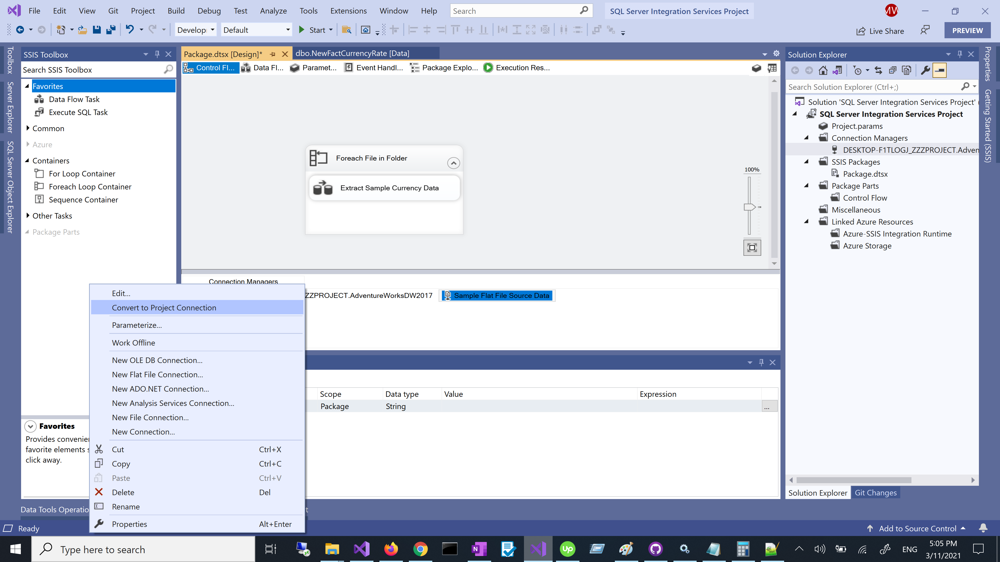
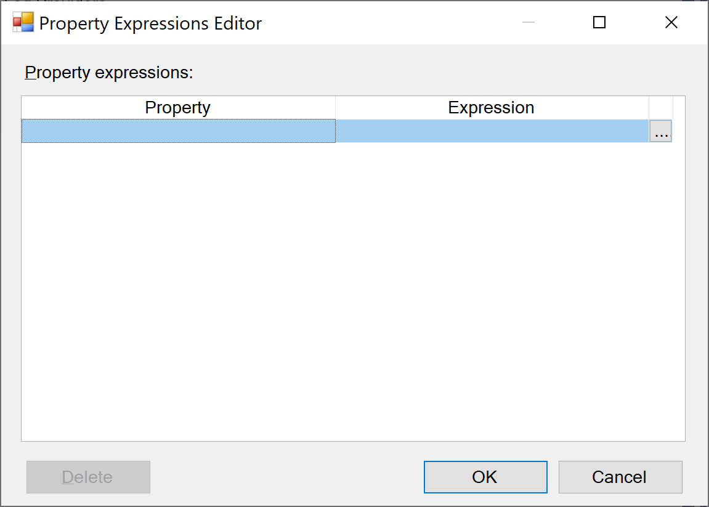
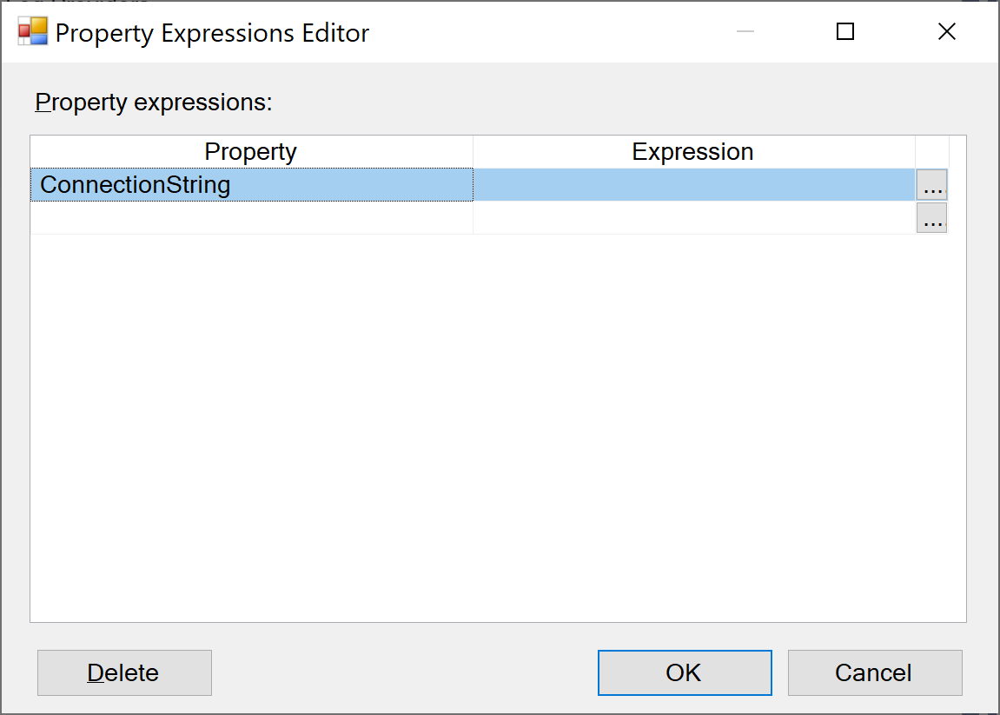
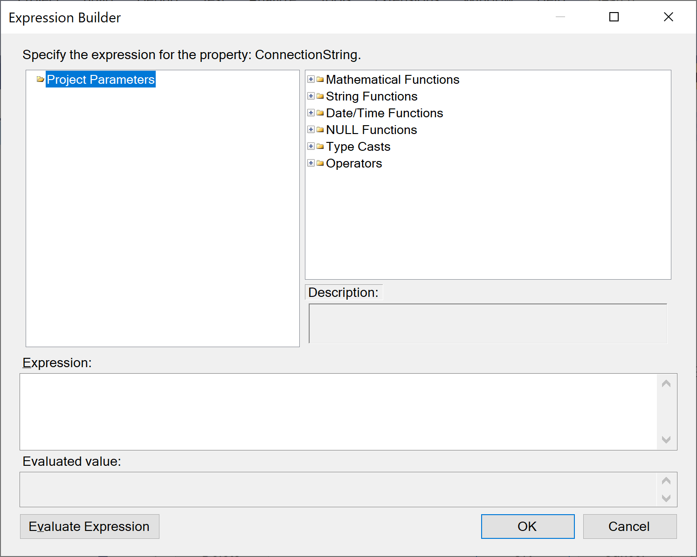
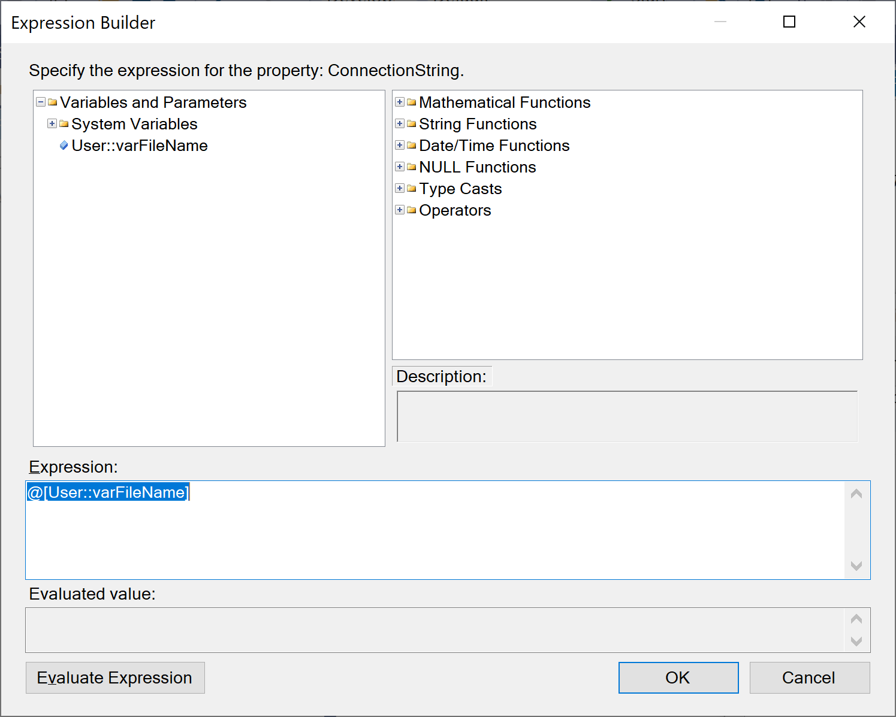
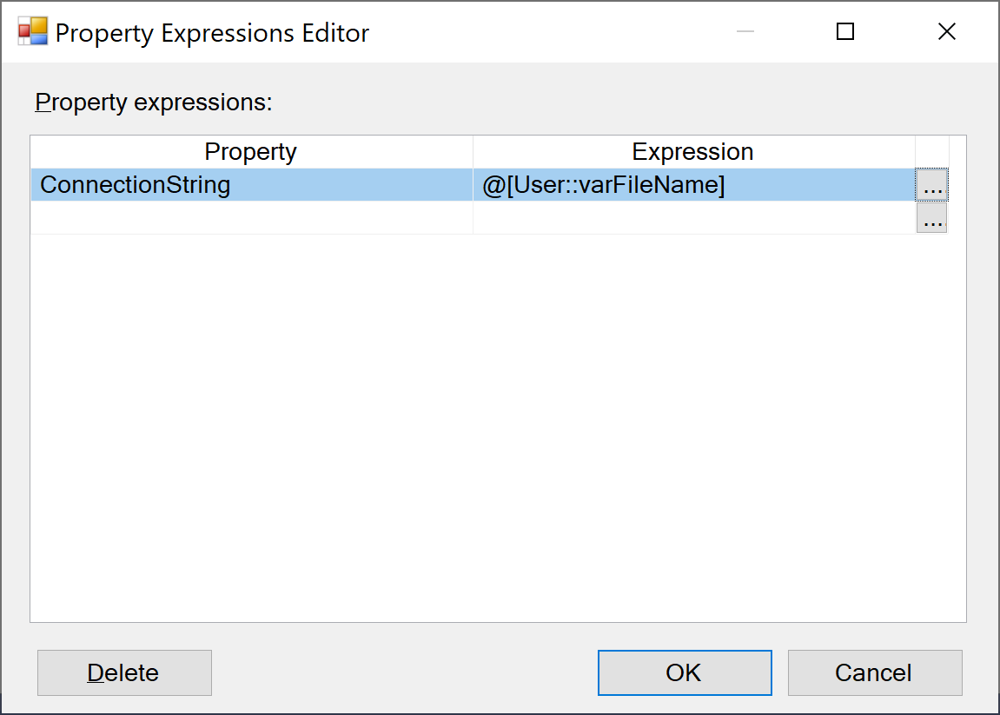
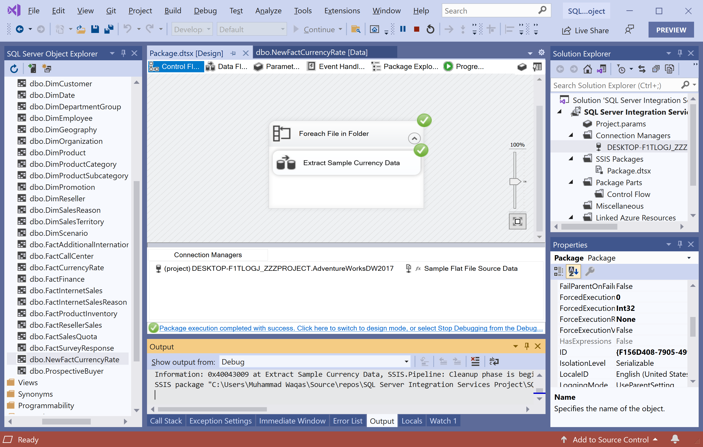

# Update Flat File Connection Manager

That Flat File connection manager is configured to statically load a single file. To enable the Flat File connection manager to iteratively load files, you change the `ConnectionString` property of the connection manager to use the user-defined variable `User::varFileName`, which contains the path of the file to be loaded at run time.

 - By modifying the connection manager to use the value of the user-defined variable to change the `ConnectionString` property, the connection manager connects to different flat files. 
 - At run time, each iteration of the **Foreach Loop** container updates the `User::varFileName` variable. 
 - Updating the variable, in turn, causes the connection manager to connect to a different flat file, and the data flow task to process a different set of data.

## Configure the Flat File to use a Variable

To configure the Flat File connection manager to use a variable, open the **Package Explorer**

In the **Connection Managers** pane, right-click **Sample Flat File Source Data**, and select **Properties**.

In the **Properties** window make sure the **PackagePath** starts with `\Package.Connections`. If not, in the **Connection Managers** pane, right-click **Sample Flat File Source Data**, and select **Convert to Package Connection**.

In the **Properties** window, for **Expressions**, select the empty cell, and then select the `...` button which will open the following dialog.

In the **Property Expressions Editor** dialog, in the **Property** column, select **ConnectionString** from the dropdown list.

In the **Expression** column, select the ellipsis button `(...)` to open the **Expression Builder** dialog box.

In the Expression Builder dialog, expand the **Variables and Parameters** node.

Drag the variable `User::varFileName` into the Expression box and click **OK** button to close the **Expression Builder** dialog.

Select **OK** again to close the **Property Expressions Editor** dialog.

## Test Package

To test the package, go to the **Debug** menu, select **Start Debugging**.

You can see the Package executed successfully. You can verify the status of each loop in the **Output** window, or by selecting the **Progress** tab. For example, you can see that 1,097 rows were added to the destination table from the file `Currency_VEB.txt`.

 