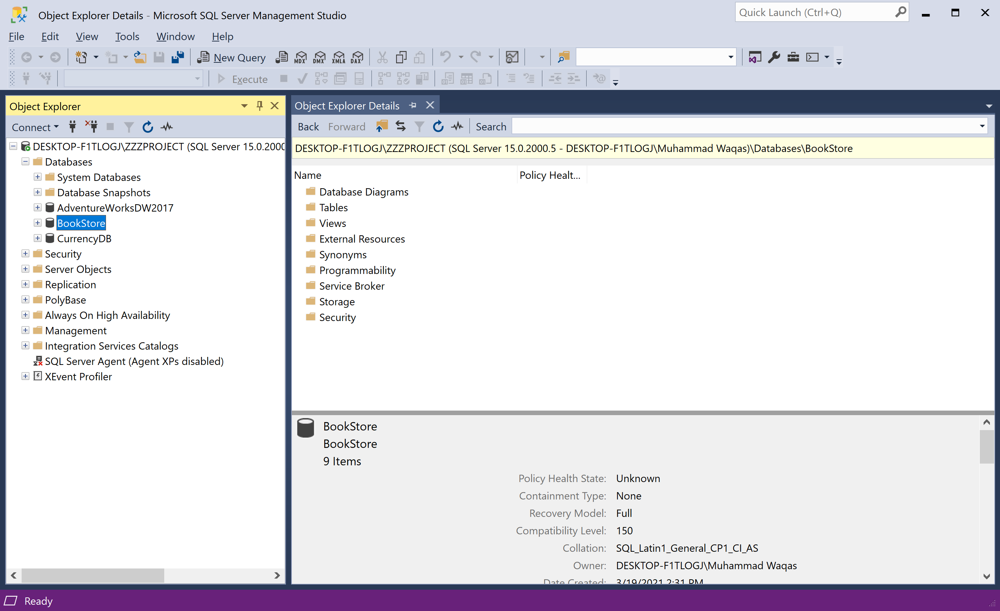
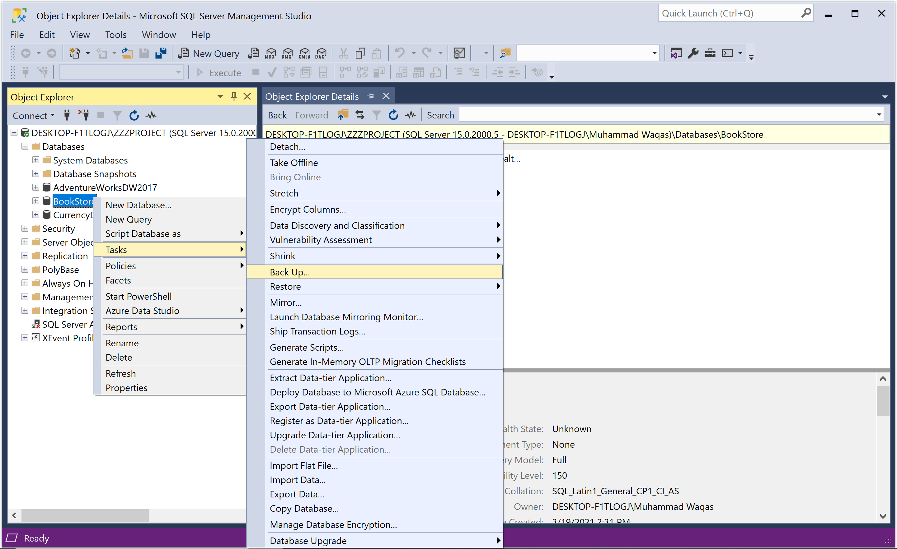
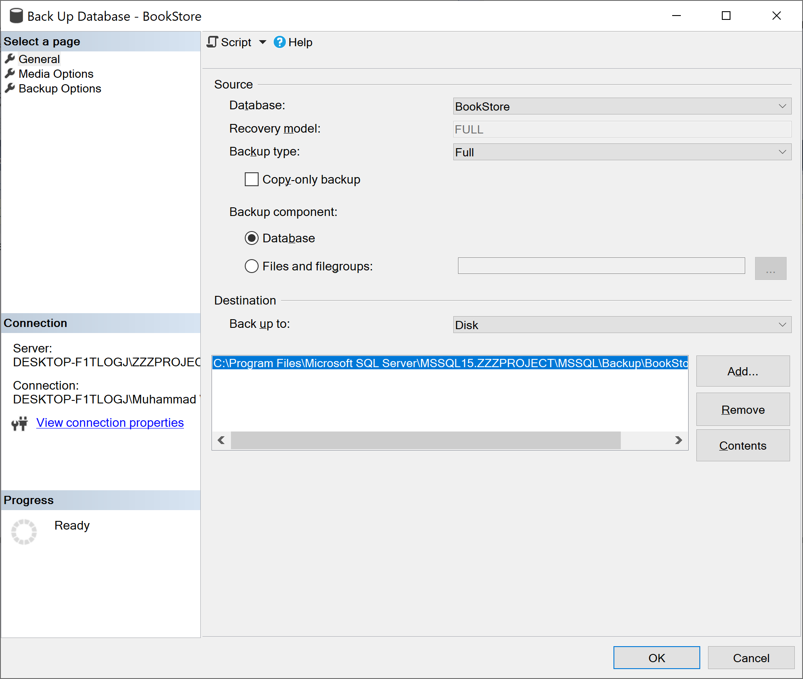
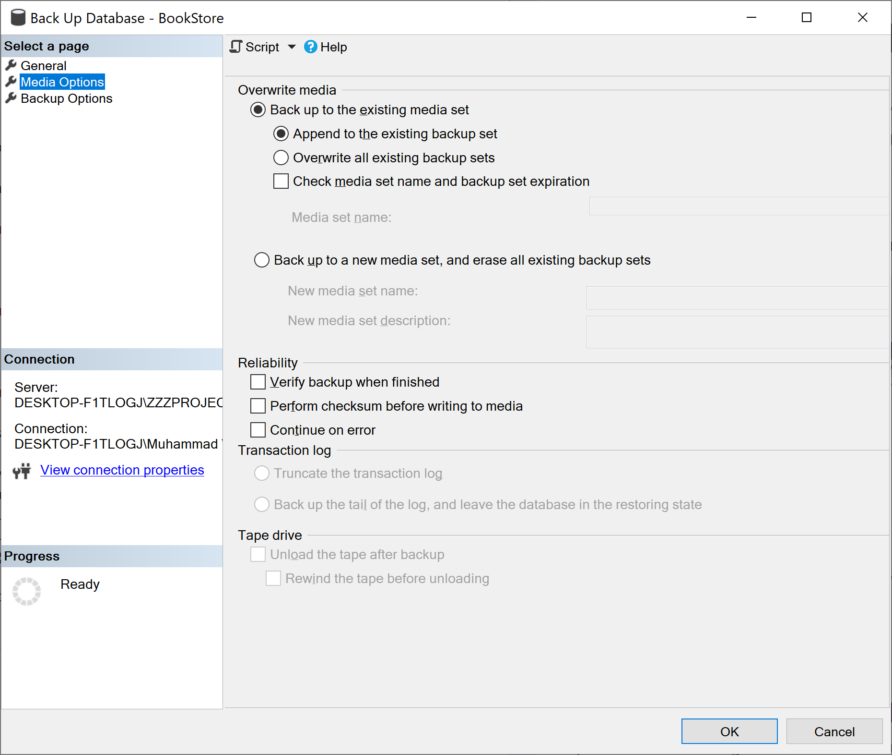
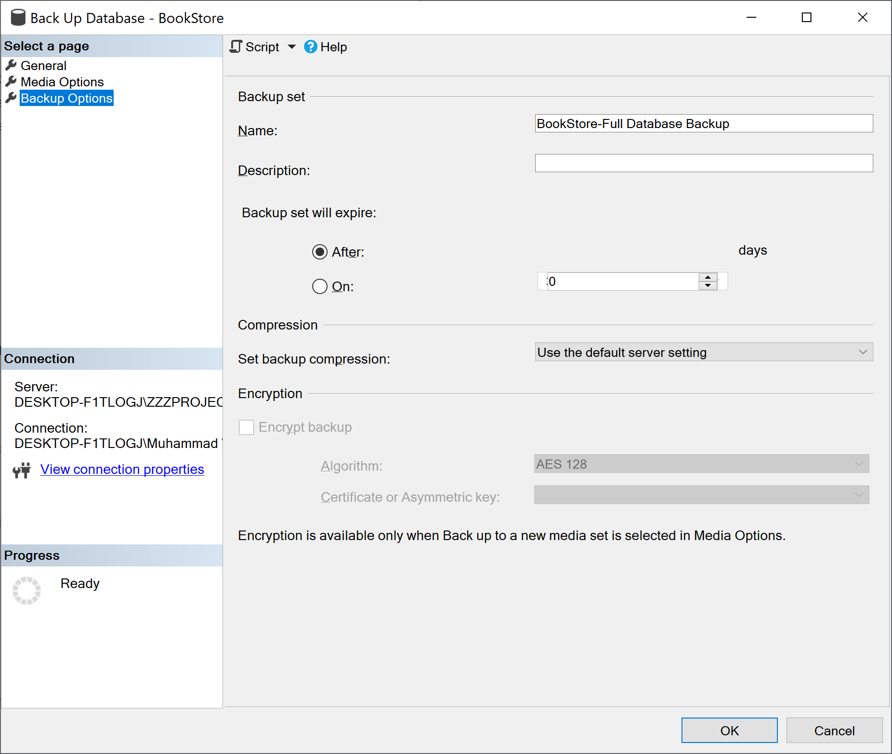
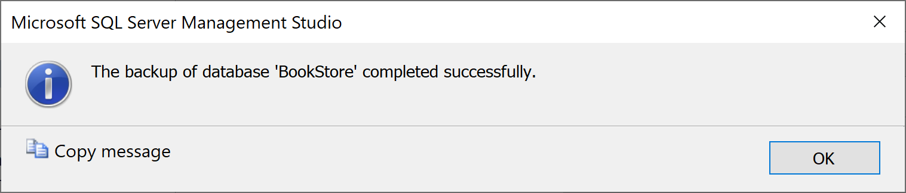

# Create Database Backup

It is sometimes useful to copy a database from one computer to another, whether for testing, checking consistency, developing software, running reports, creating a mirror database, or, possibly, to make the database available to remote-branch operations.

After connecting to the Microsoft SQL Server Database Engine's appropriate instance, in Object Explorer, expand the server tree.



Expand **Databases**, right-click the database that you wish to backup, and select **Tasks > Back Up...**

 Back Up...">

It will open the **Back Up Database** dialog.



The database that you selected appears in the drop-down list, select **Full** in the **Backup type** drop-down list, and under **Backup component**, select **Database**.

 - In the **Destination** section, review the default location for the backup file.
 - To back up to a different device, change the selection using the **Back up to** drop-down list. 
 - To stripe the backup set across multiple files for increased backup speed, click **Add** to add additional backup objects and/or destinations.
 - To remove a backup destination, select it and click the **Remove** button. 
 - To view the contents of an existing backup destination, select it and click **Contents**.

You can review the other available settings under the **Media Options** page.



You can also review the other available settings under the **Backup Options** page.



Click **OK** to initiate the backup.



When the backup completes successfully, click **OK** to close the SQL Server Management Studio dialog box.

## Using Transact-SQL

You can also create a full database backup by executing the `BACKUP DATABASE` statement to create the full database backup by specifying:

 - The name of the database to back up.
 - The backup device where the full database backup is written.

The following example backs up the complete `BookStore` database to disk by using `FORMAT` to create a new media set.

```csharp
USE BookStore;
GO
BACKUP DATABASE BookStore
TO DISK = 'D:\BookStore.bak'
   WITH FORMAT,
      MEDIANAME = 'SQLServerBackups',
      NAME = 'Full Backup of BookStore';
GO
```
