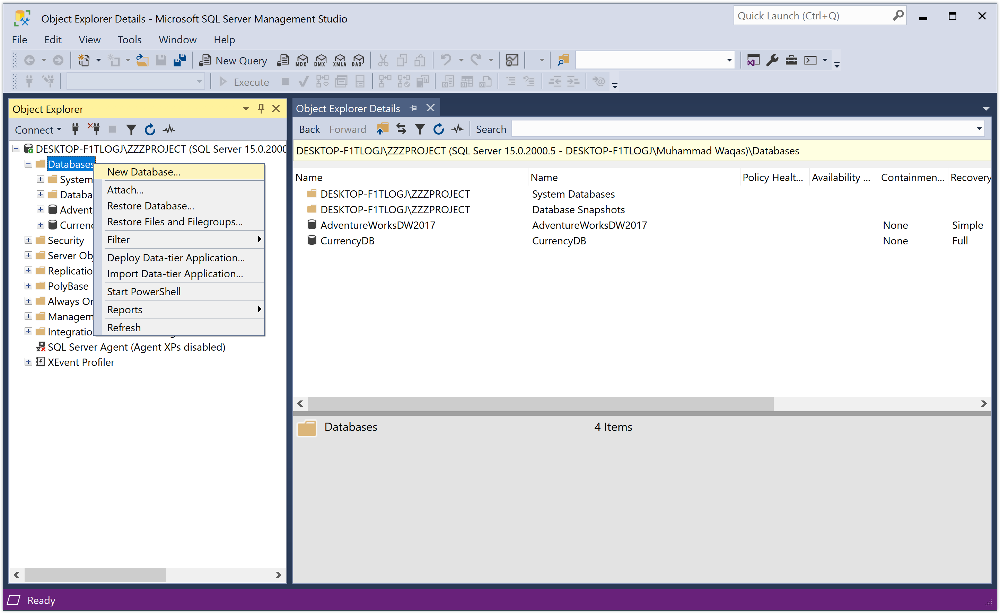
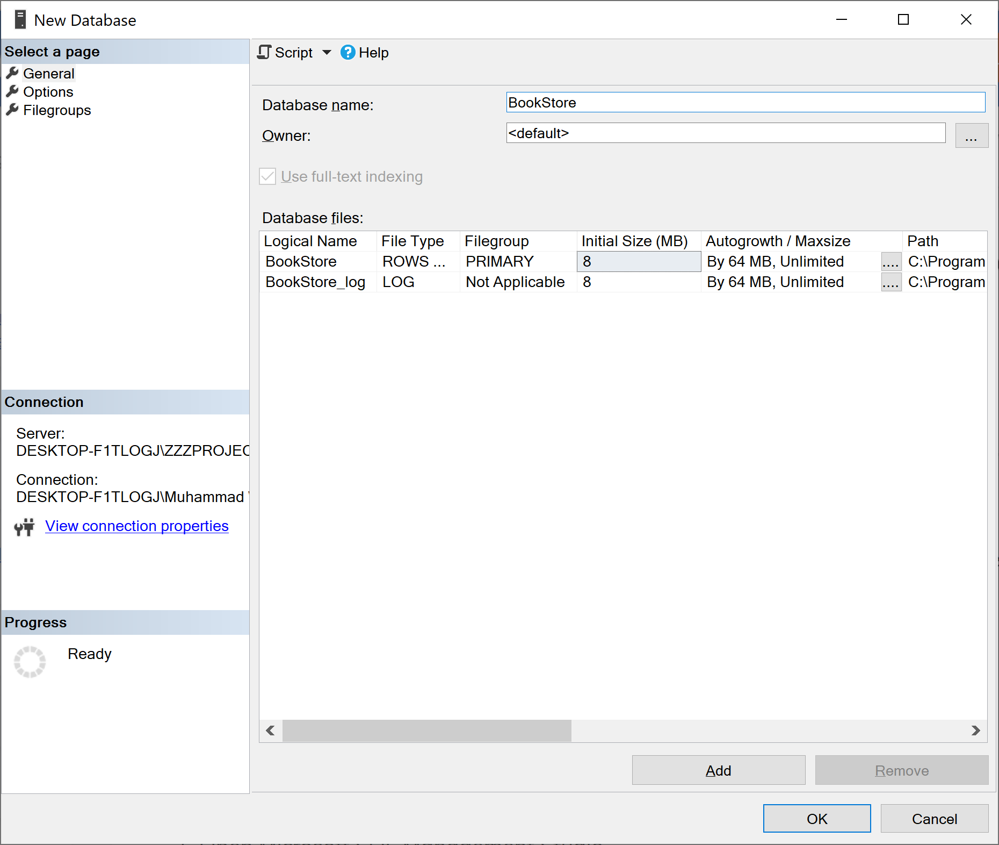
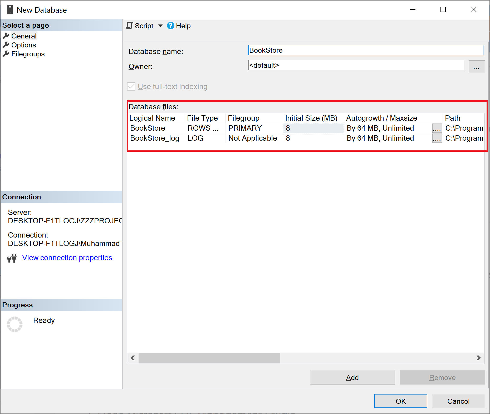
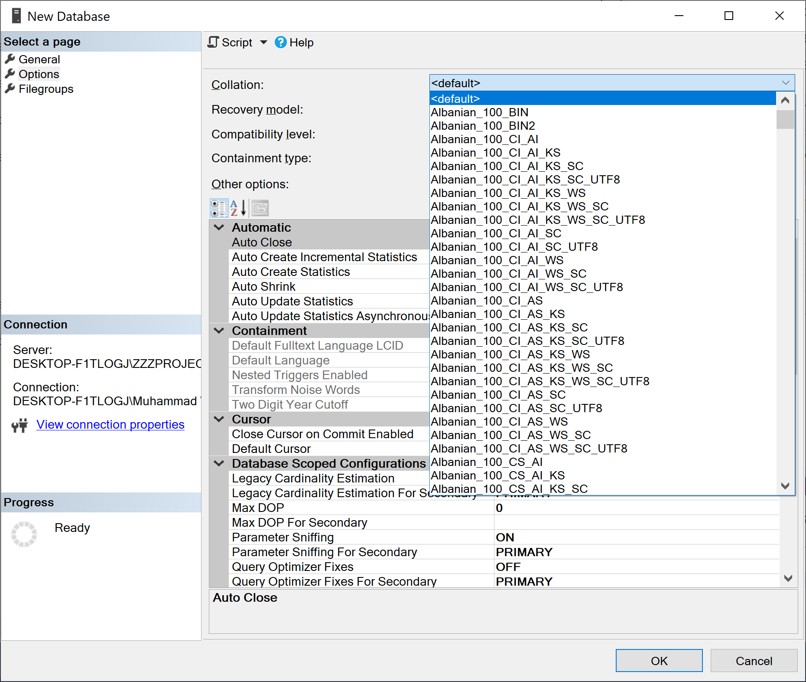
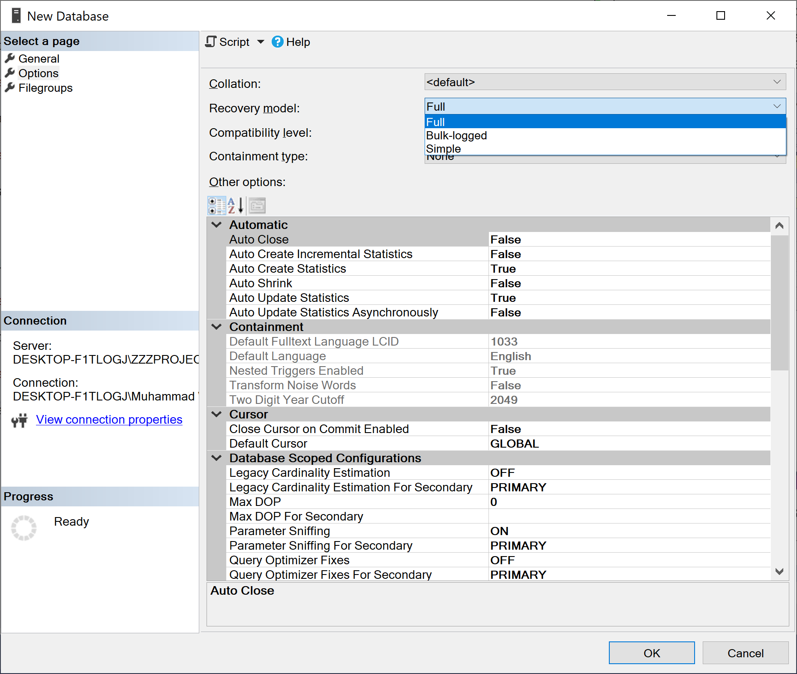
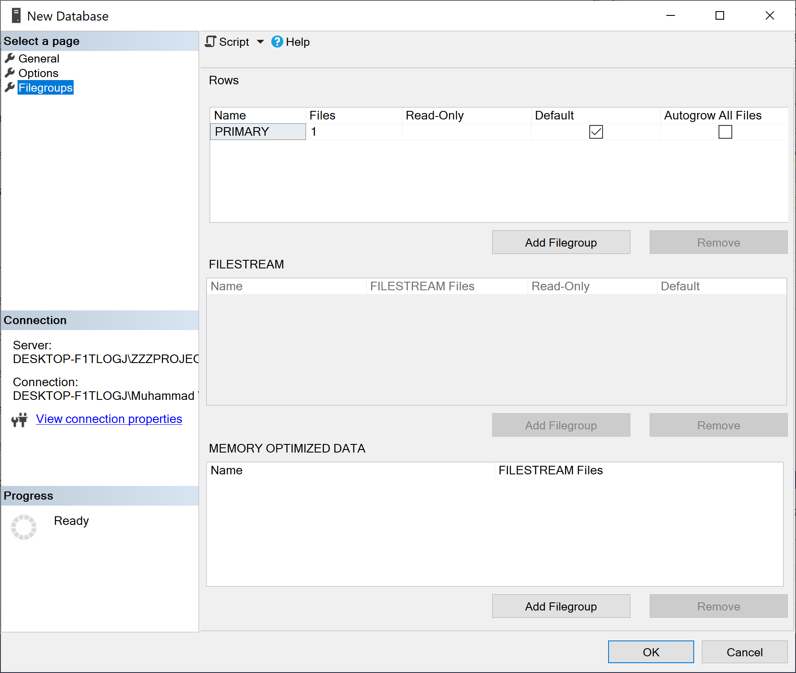

# Create Database

The database is a collection of objects such as table, view, stored procedure, function, trigger, etc. In **Object Explorer**, connect to an instance of the SQL Server Database Engine and then expand that instance.



Right-click **Databases**, and then click **New Database...**



On the **New Database** dialog, enter a database name. To create the database by accepting all default values, click the **OK** button. Otherwise, continue with the following optional steps.

To change the owner name, click **(...)** to select another owner.

To change the default values of the primary data and transaction log files, in the **Database files** grid, click the appropriate cell and enter the new value.



To change the collation of the database, select the **Options** page and then select a collation from the list.



To change the recovery model, select a recovery model from the list on the **Options** page.



To add a new filegroup, click the **Filegroups** page. Click **Add Filegroups** and then enter the values for the filegroup.



Once you are done with all the settings, click the **OK** button, and it will create the database.


## Using Transact-SQL

You can also create a database using Transact-SQL (T-SQL) by connecting to the **Database Engine**, and then from the Standard bar, click **New Query**. Copy and paste the following example into the query window and click **Execute**. 

```csharp
USE [master]
GO

CREATE DATABASE [BookStore]
 CONTAINMENT = NONE
 ON  PRIMARY 
( NAME = N'BookStore', 
	FILENAME = N'C:\Program Files\Microsoft SQL Server\MSSQL15.ZZZPROJECT\MSSQL\DATA\BookStore.mdf' , 
	SIZE = 8192KB , 
	MAXSIZE = UNLIMITED, 
	FILEGROWTH = 65536KB )

 LOG ON 
( NAME = N'BookStore_log', 
	FILENAME = N'C:\Program Files\Microsoft SQL Server\MSSQL15.ZZZPROJECT\MSSQL\DATA\BookStore_log.ldf' , 
	SIZE = 8192KB , 
	MAXSIZE = 2048GB , 
	FILEGROWTH = 65536KB )
 WITH CATALOG_COLLATION = DATABASE_DEFAULT
GO
```

## Recommendations

 - The master database should be backed up whenever a user database is created, modified, or dropped.
 - When you create a database, make the data files as large as possible based on the maximum amount of data you expect in the database.
